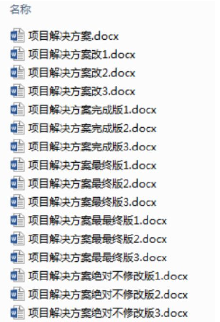
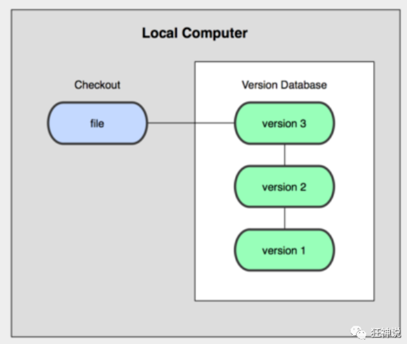
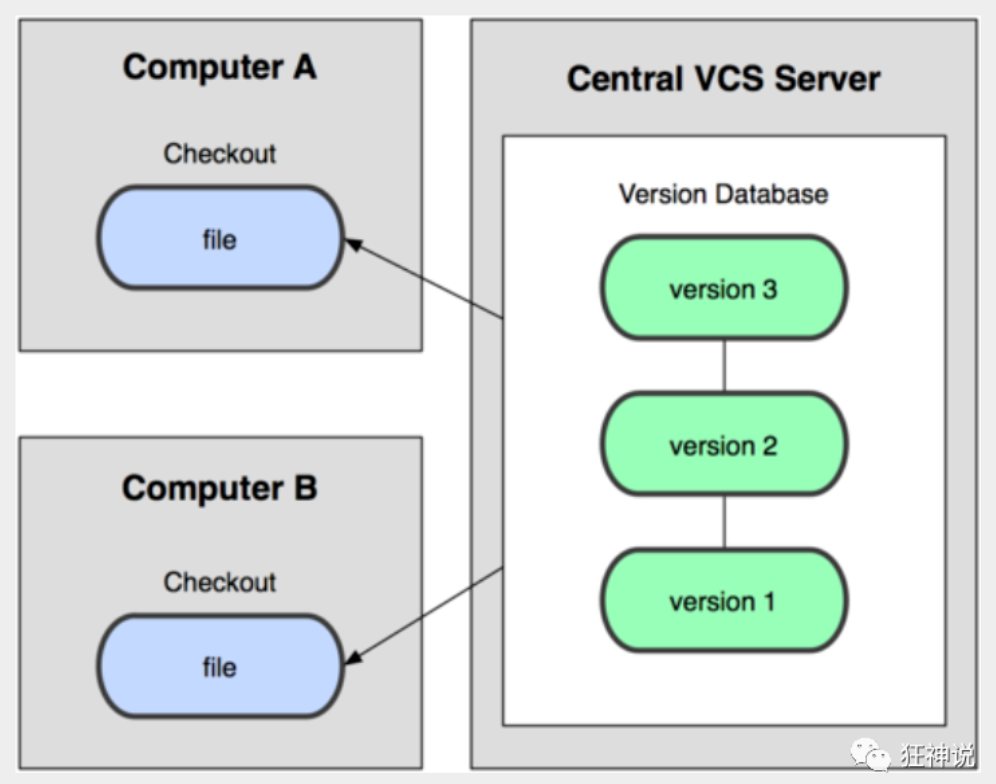
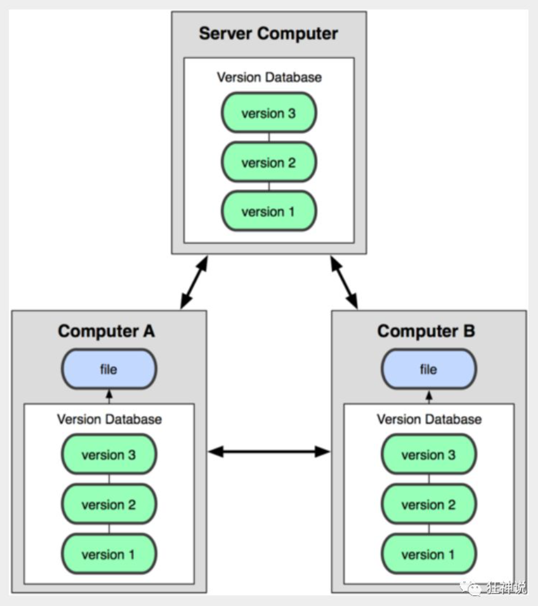

# 版本控制

## 什么是版本控制

版本控制（Revision control）是一种在开发的过程中用于管理文件、目录或工程等内容的修改历史，方便查看更改历史记录，备份以便恢复以前的版本的软件工程技术。

- 实现跨区域多人协同开发
- 追踪和记载一个或者多个文件的历史记录
- 组织和保护源代码和文档
- 统计工作量
- 并行开发、提高开发效率
- 跟踪记录整个软件的开发过程
- 减轻开发人员的负担，节省时间，同时降低人为错误

没有进行版本控制或者版本控制本身缺乏正确的流程管理，在软件开发过程中将会引入很多问题，如软件代码的一致性、软件内容的冗余、软件过程的事物性、软件开发过程中的并发性、软件源代码的安全性，以及软件的整合等问题。

多人开发就必须要使用版本控制

## 常见的版本控制工具

主流的版本控制器有如下这些：

- **Git**
- **SVN**（Subversion）
- **CVS**（Concurrent Versions System）
- **VSS**（Micorosoft Visual SourceSafe）
- **TFS**（Team Foundation Server）
- Visual Studio Online

版本控制产品非常的多（Perforce、Rational ClearCase、RCS（GNU Revision Control System）、Serena Dimention、SVK、BitKeeper、Monotone、Bazaar、Mercurial、SourceGear Vault），现在影响力最大且使用最广泛的是 Git 与SVN；

## 版本控制分类

### 本地版本控制

记录文件每次的更新，可以对每个版本做一个快照，或是记录补丁文件，适合个人用，如RCS。

### 集中版本控制  SVN

所有的版本数据都保存在服务器上，协同开发者从服务器上同步更新或上传自己的修改

所有的版本数据都存在服务器上，用户的本地只有自己以前所同步的版本，如果不连网的话，用户就看不到历史版本，也无法切换版本验证问题，或在不同分支工作。

由于所有数据都保存在单一的服务器上，有很大的风险这个服务器会损坏，这样就会丢失所有的数据，当然可以定期备份。

代表产品：SVN、CVS、VSS；

### 分布式版本控制 Git

所有版本信息仓库全部同步到本地的每个用户，这样就可以在本地查看所有版本历史，可以离线在本地提交，只需在连网时 push 到相应的服务器或其他用户那里。

由于每个用户那里保存的都是所有的版本数据，只要有一个用户的设备没有问题就可以恢复所有的数据，但这增加了本地存储空间的占用。

不会因为服务器损坏或者网络问题，造成不能工作的情况。

