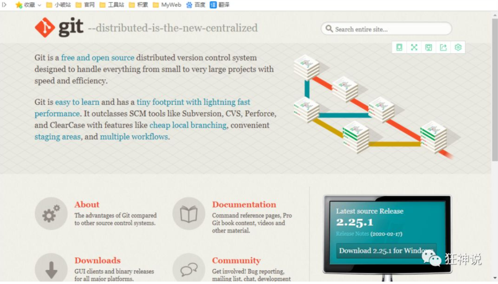
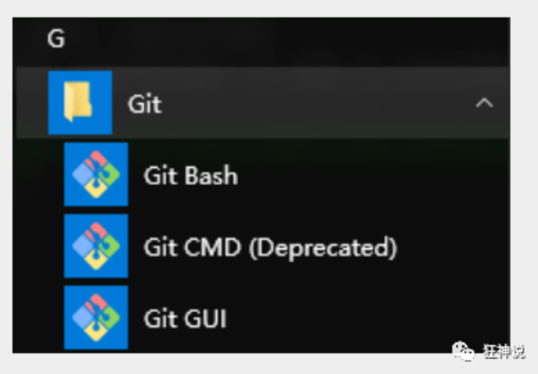
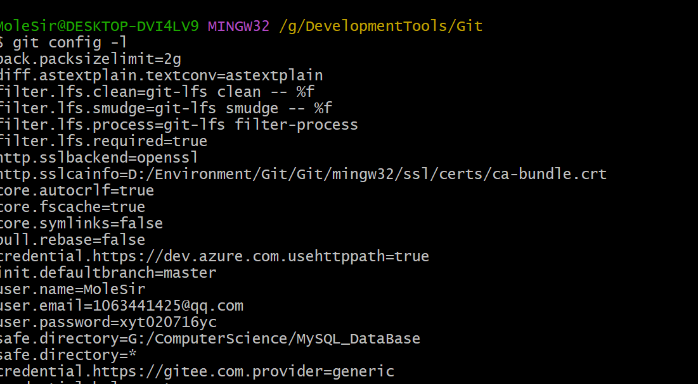

# Git环境配置

## 软件下载

打开  [git官网](https://git-scm.com)，下载git对应操作系统的版本。

官网下载太慢，可以使用 [淘宝镜像下载](http://npm.taobao.org/mirrors/git-for-windows/)



下载对应的版本即可安装

安装：无脑下一步即可！安装完毕就可以使用了


## 启动Git

安装成功后在开始菜单中会有Git项，菜单下有3个程序：任意文件夹下右键也可以看到对应的程序！



**Git Bash：**Unix与Linux风格的命令行，使用最多，推荐最多

**Git CMD：**Windows风格的命令行

**Git GUI**：图形界面的Git，不建议初学者使用，尽量先熟悉常用命令


## 常用的Linux命令

- cd : 改变目录。
- cd . . 回退到上一个目录，直接cd进入默认目录
- pwd : 显示当前所在的目录路径。
- ls(ll):  都是列出当前目录中的所有文件，只不过ll(两个ll)列出的内容更为详细。
- touch : 新建一个文件 如 touch index.js 就会在当前目录下新建一个index.js文件。
- rm:  删除一个文件, rm index.js 就会把index.js文件删除。
- mkdir:  新建一个目录,就是新建一个文件夹。
- rm -r :  删除一个文件夹, rm -r src 删除src目录
- mv 移动文件, mv index.html src index.html 是我们要移动的文件, src 是目标文件夹,当然, 这样写,必须保证文件和目标文件夹在同一目录下。
- reset 重新初始化终端/清屏。
- clear 清屏。
- history 查看命令历史。
- help 帮助。
- exit 退出。
- #表示注释


## Git配置

所有的配置文件，其实都保存在本地；

查看配置 `git config -l`



查看不同级别的配置文件：

```shell
# 查看系统configgit config --system --list　　
# 查看当前用户（global）配置git config --global  --list
```

### **Git相关的配置文件：**

- Git\etc\gitconfig  ：Git 安装目录下的 gitconfig   --system 系统级
- C:\Users\Administrator\ .gitconfig   只适用于当前登录用户的配置  --global 全局

### 设置用户名与邮箱

安装Git后首先要做的事情是设置用户名称和e-mail地址。

每次Git提交都会使用该信息。它被永远的嵌入到提交中：

```shell
git config --global user.name "kuangshen"  #名称
git config --global user.email 24736743@qq.com   #邮箱
```

只需要做一次这个设置，使用了 `--global`  选项，Git 将总是会使用该信息来处理在系统中所做的一切操作。

如果希望在一个特定的项目中使用不同的名称或 e-mail 地址，可以在该项目中运行该命令而不要 `--global` 选项。总之 `--global` 为全局配置，不加为某个项目的特定配置。

