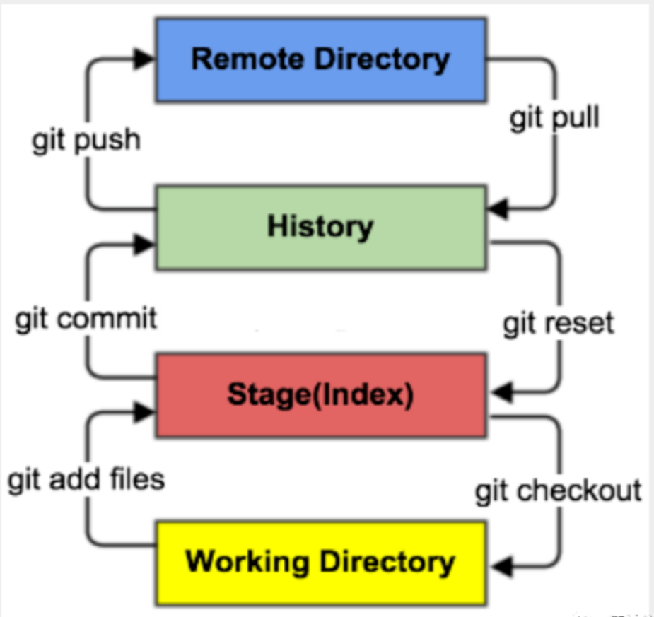
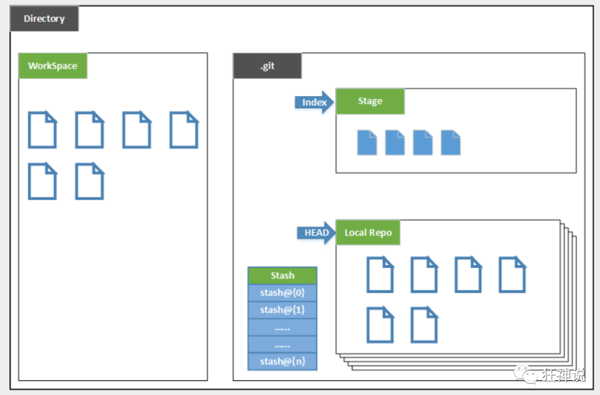
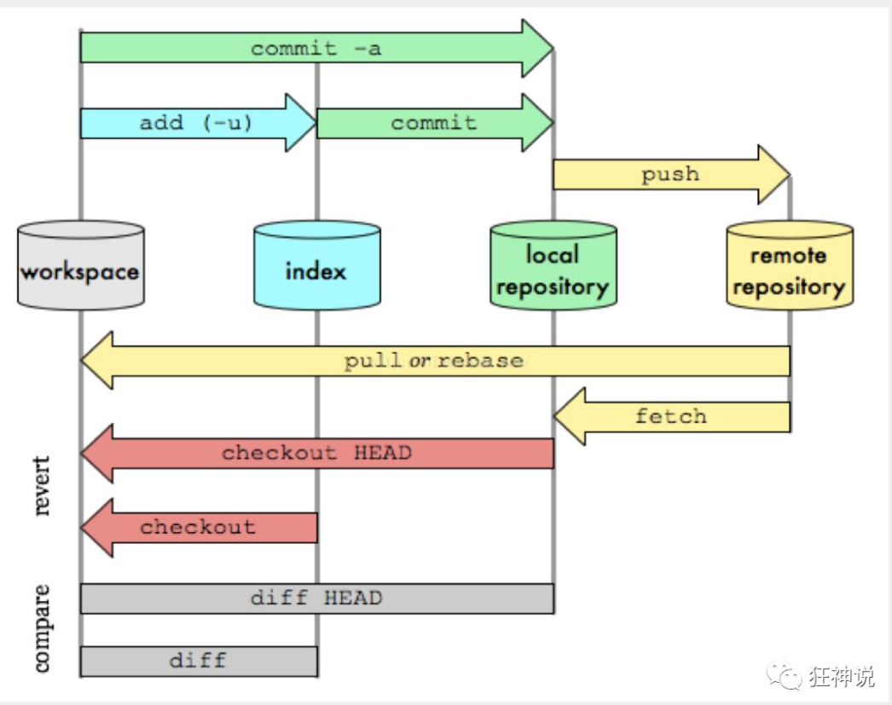

# Git基本理论

## 工作区域

Git本地有三个工作区域：==工作目录（Working Directory）==、==暂存区(Stage/Index)==、==资源库(Repository或Git Directory)==。如果在加上远程的 ==git仓库(Remote Directory)==  就可以分为四个工作区域。

文件在这四个区域之间的转换关系如下：

- **Workspace：工作区**，磁盘中，存放项目代码的地方；
- **Index / Stage：暂存区**，用于临时存放改动，事实上它只是一个文件，保存即将提交到文件列表信息；
- **Repository：仓库区（或本地仓库）**，就是安全存放数据的位置，这里面有提交到所有版本的数据。其中HEAD 指向最新放入仓库的版本；
- **Remote：远程仓库**，托管代码的服务器，可以简单的认为是项目中的一台电脑用于远程数据交换（比如在github与gittee上的代码）。

本地的三个区域确切的说应该是git仓库中HEAD指向的版本：

- Directory：使用Git管理的一个目录，也就是一个仓库，包含工作空间和 Git 的管理空间；
- WorkSpace：需要通过 Git 进行版本控制的目录和文件，这些目录和文件组成了工作空间；
- .git：存放Git管理信息的目录，初始化仓库的时候自动创建；
- Index/Stage：暂存区，或者叫待提交更新区，在提交进入 repo 之前，可以把所有的更新放在暂存区；
- Local Repo：本地仓库，一个存放在本地的版本库；HEAD 会只是当前的开发分支（branch）；
- Stash：隐藏，是一个工作状态保存栈，用于保存/恢复WorkSpace中的临时状态。

## 工作流程

git的工作流程一般是这样的：

１、在工作目录中添加、修改文件（比如说，新建了一个文件 test.c）；

２、将需要进行版本管理的文件放入暂存区域（使用 git add 命令）；

３、将暂存区域的文件提交到 git 仓库（使用 git commit）。

因此，git管理的文件有三种状态：**已修改（modified）,已暂存（staged）,已提交(committed)**

