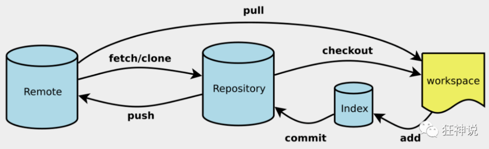
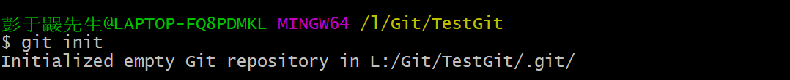
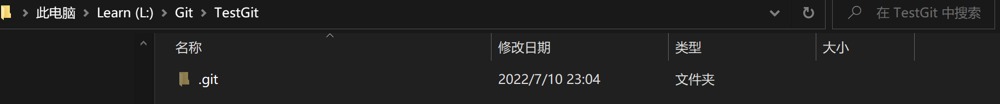

# Git项目搭建

## 创建工作目录与常用指令

工作目录（WorkSpace)就是希望 Git 管理的文件夹，可以是项目的目录，也可以是一个空目录，建议不要有中文；

日常使用只要记住下图6个命令：




## 本地仓库搭建

创建本地仓库的方法有两种：一种是创建全新的仓库，另一种是克隆远程仓库。

在本地搭建一个仓库：

需要用 GIT 管理的项目的根目录执行（在工作目录下右键点击git，在命令行中输入`git init`）：

```
# 在当前目录新建一个Git代码库$ git init
```



执行后可以看到，仅仅在项目目录多出了一个.git目录，关于版本等的所有信息都在这个目录里面。




## 克隆远程仓库

另一种方式是克隆远程目录，由于是将远程服务器上的仓库完全镜像一份至本地

```shell
# 克隆一个项目和它的整个代码历史(版本信息)
$ git clone [url]  # https://gitee.com/kuangstudy/openclass.git
```


