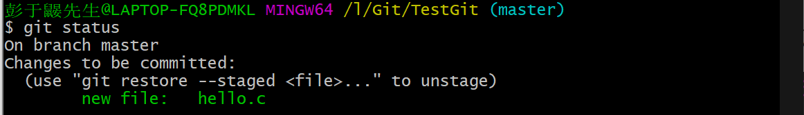
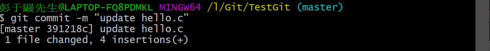

# Git 本地文件操作

## 文件的四种状态

版本控制就是对文件的版本控制，要对文件进行修改、提交等操作；

首先要知道文件当前在什么状态，不然可能会提交了现在还不想提交的文件，或者要提交的文件没提交上：

- ==Untracked:  未跟踪==

  此文件在文件夹中，但并没有加入到 git 库, 不参与版本控制（比如新建了一个文件）

  其可以通过 `git add` 命令将状态变为 ==Staged==；

- ==Staged: 暂存状态==

  此状态的文件：

  - 可以执行  `git commit` 将修改同步到本地版本库，这时库中的文件和本地文件又变为一致，文件为 ==Unmodify== 状态；
  - 也可以对这些文件执行 `git reset HEAD filename` 取消暂存，文件状态为 ==Modified==；

  可以理解为对文件的修改作一个临时的保存，如果认为没有问题了，就 `commit` 到本地版本库。如果后续发现还有问题，就 `reset`，把这个文件的修改撤回；

- ==Unmodify: 文件已经入库==

  未修改，即版本库中的文件内容与文件夹中完全一致；

  这种类型的文件有两种去处：

  - 如果它被修改, 而变为 ==Modified==；
  - 如果使用==git rm== 移出版本库, 则成为 ==Untracked== 文件；

- ==Modified: 文件已修改==

  对被添加到本地版本后的文件再进行修改，只是修改，并没有进行其他的操作；

  这个文件也有两个去处：

  - 通过 `git add` 可进入暂存 ==Staged== 状态；
  - 使用 `git checkout` 则丢弃修改过，返回到 ==Unmodify==状态。`git checkout` 从本地版本库中取出文件，覆盖当前修改；

> 看不明白，就看后面的测试，再返回来理解


## 查看文件状态

上面说文件有4种状态，通过如下命令可以查看到文件的状态：

````shell
#查看指定文件状态
git status [filename]

#查看所有文件状态
git status

# git add .                  添加所有文件到暂存区
# git commit -m "消息内容"    提交暂存区中的内容到本地仓库 -m 提交信息
````


## 测试

### 创建git仓库

在某个目录下右键git，命令行中输入 `git init`来创建本地的仓库，此时这个目录中会创建出一个隐藏的 .git 文件夹；


### 添加新文件

在仓库中新建一个文件 hello.c：


此时改变了工作目录，在命令行中输入 `git status` 查看：


可以看到，其中有一个 ==Untracked==  文件：hello.c；

### 执行 git add .

命令行中执行 `git add .` 将新添加的 hello.c 放入暂存区：


此时再使用 `git status` 来查看当前状态：



可以看到，现在 hello.c 不再是 ==Untracked== 状态，而是 ==Staged==  暂存状态，git 还提示这个文件可以被 `git commit`；

### 执行 git commit 

此时 hello.c 处于暂时存区，还不在本地的仓库中，可以使用 `git commit` 提交到本地仓库：

 

此时再查看状态：


可以看到，没有东西可以被提交了，说明刚才的文件保存到了本地仓库中；

### 修改新文件

现在去修改工作目录下的 hello.c ，再次查看状态：


此时的 hello.c 成为了 **modified** 状态；

### 放弃更改

如果决定放弃这次的修改，执行 `git checkout` 命令，使用本地版本库中的 hello.c 覆盖对文件的修改：


此时我们的文件 hello.c 的更改就被版本库中的覆盖了，并且状态回到 **Unmodify**：


### 保存更改

如果想要保存我们的更改到本地版本库中，再次使用 `git add` 命令将其添加到暂存区：


此时的状态就跟新建一个文件并加入暂存区一样了：


那么如果想要跟新版本库也是使用 git commit 命令：



版本库更新，状态回到 **Unmodify**：


## 忽略文件

有时不想把某些文件纳入版本控制中，比如数据库文件，临时文件，设计文件等

在主目录下建立".gitignore"文件，此文件有如下规则：

1. 文件中的空行或以井号（#）开始的行将会被忽略。
2. 可以使用Linux通配符。例如：星号（*）代表任意多个字符，问号（？）代表一个字符，方括号（[abc]）代表可选字符范围，大括号（{string1,string2,...}）代表可选的字符串等。
3. 如果名称的最前面有一个感叹号（!），表示例外规则，将不被忽略。
4. 如果名称的最前面是一个路径分隔符（/），表示要忽略的文件在此目录下，而子目录中的文件不忽略。
5. 如果名称的最后面是一个路径分隔符（/），表示要忽略的是此目录下该名称的子目录，而非文件（默认文件或目录都忽略）。

以下为 .gitgnore 文件的一些语法：

````shell
#为注释
*.txt        #忽略所有 .txt结尾的文件,这样的话上传就不会被选中！
!lib.txt     #但lib.txt除外
/temp        #仅忽略项目根目录下的TODO文件,不包括其它目录temp
build/       #忽略build/目录下的所有文件
doc/*.txt    #会忽略 doc/notes.txt 但不包括 doc/server/arch.txt
````

