# Git 远程仓库

流行的 git 远程仓库有 github 与 gitee；

github 是有墙的，比较慢，在国内一般使用 gitee ，公司中有时候会搭建自己的 gitlab 服务器；

下面以 gitee 为例


## 绑定 SSH 公钥

> SSH 为 Secure Shell 的缩写，由 IETF 的网络小组（Network Working Group）所制定；
>
> SSH 为建立在应用层基础上的安全协议。SSH 是较可靠，专为==远程登录会话==和其他网络服务提供安全性的协议。利用 SSH 协议可以有效防止远程管理过程中的信息泄露问题。
>
> 简单来说就是保证我们主机与服务器之间的通信过程中，信息不会泄露。
>
> 实现的机制简单来说就是，通信双方，每人都有一把公钥、一把私钥（钥匙用来加密或解密），并且每个人的一对公钥与私钥可以互相解锁；
>
> 公钥是可以二者共享的，私钥只有自己保存；
>
> 主机会把自己生成的公钥发送给服务器，同理，服务器也需要把自己生成的公钥发送给主机；
>
> 当主机向服务器发送数据，就会用服务器的公钥对数据加密。服务器收到以后用自己的私钥解密；
>
> 这个过程中，由于私钥只有服务器自己有，即使传输的数据被泄露，也不能翻译出内容；

根据 SSH 加密的知识，为了在主机与服务器之间安全交换数据，主机需要生成一对密钥与公钥，密钥自己保存，公钥发送给服务器；

### 生成本机 SSH 公钥

在命令行中输入 `ssh-kygen -t ras  `，之后按提示选择目录，默认就按entry，之后输入密码，创建本机SSH-公钥；这里使用的是 wsl

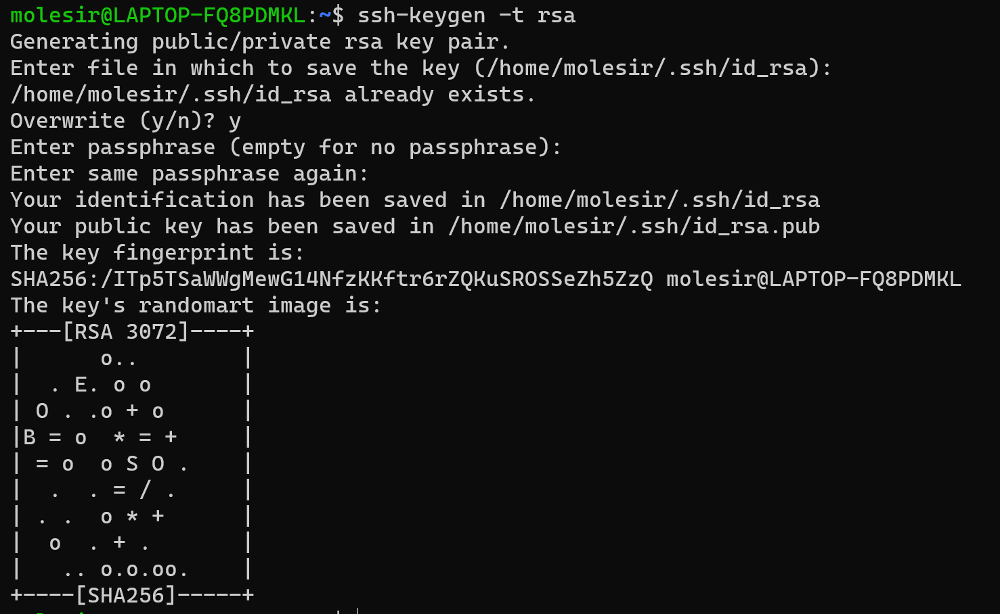

可以看到，系统提示已经生成了一个公钥，并且保存在 /home/molesir/.ssh/id_rsa.pub中，打开这个文件：

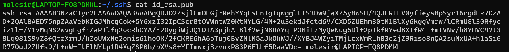

这就是生成的 ssh 公钥；

### 注册公钥

即，把生成的公钥发送给服务器；

在 github 或 gitee 中添加 ssh 公钥：

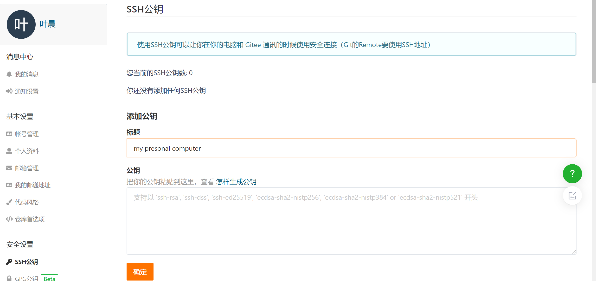

标题不重要，可以自己写，重要的是将刚刚生成的公钥复制到 github 或 gitee 生成公钥界面的公钥处：

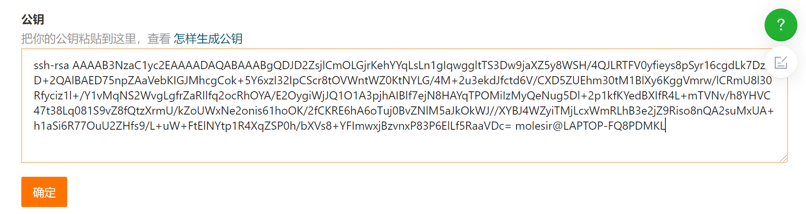

之后点击确定，输出密码，完成：


> 有了这个公钥，就相当于本机与 gitee 服务器建立了一个联系。

添加 SSH 不是必要的，github 与 gitee 都支持使用不同的协议来传输数据：

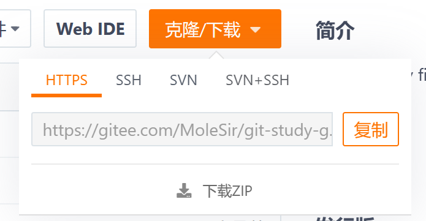

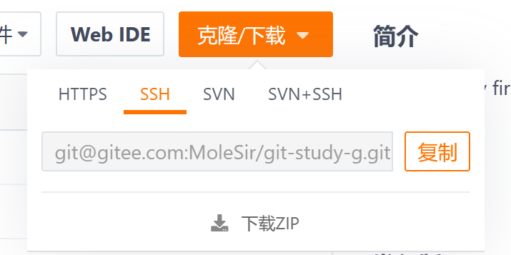

由图，可以使用 https 协议或 ssh 协议。如果用的是 ssh 协议，那么就要设置 ssh 公钥。如果使用 https 协议，只要账号密码即可；


## 创建远程仓库

在 github 或 gitee 中新建仓库：

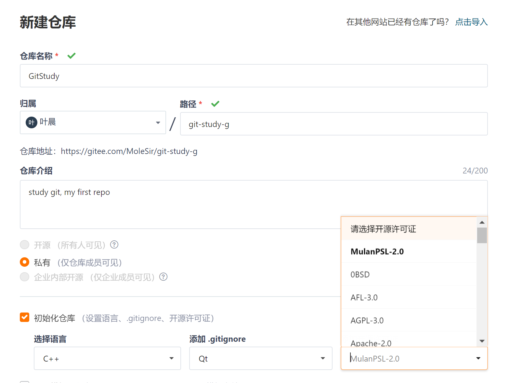


## 连接远程仓库

### 使用 `git clone` 命令

使用 `git clone` 可以把服务器上的一个项目复制到本地；

点击 github 或 gitee 上的 克隆/下载，复制 url，到本地新建一个文件夹，右键进入 git （windows的命令行也可以）命令行，输入 `git clone` 后把刚刚复制的 url 粘贴，回车：

````bash
git clone https://gitee.com/MoleSir/git-study-g.git
````

完成后：

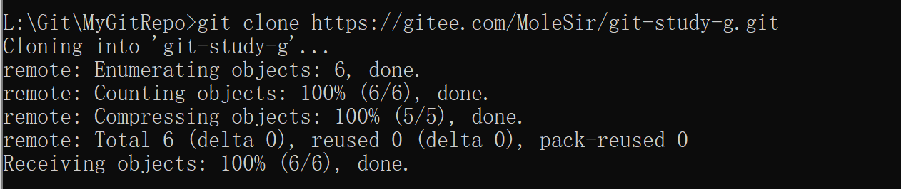

可以看到这个目录下有了新文件：git-study-g，就是刚刚在 gitee 上新建的仓库；

### 使用 `git remote add` 命令

在本地一个已有的仓库，执行：

````bash
git remote add (remote_repo_name) (url)
````

将某个远程仓库（地址为 url）添加到这个本地仓库的远程仓库中，并且命名为 remote_repo_name；

例如：


这里把 https://github.com/MoleSir/STM32.git 这个远程仓库的网址保存到本地这个仓库中，命名为 origin；

> 命名的意义就是，可以用这个名称代替这一串 url

这个命令可以多次执行，把多个远程仓库地址保存在本地，其不同的名称；


## 查看远程仓库

使用 `git remote -v` 查看当前本地仓库有哪些远程仓库：
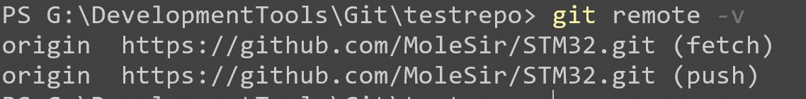


## push 推送操作

`git push` 将文件从本地上传到远程仓库。执行命令：

````bash
git push remoteRep branch
````

将本地仓库目前所在分支的内容（本地版本库中的内容）上传到远程仓库 remoteRep 中的 branch 分支上。 

在 git-study-g 中新建文件 hello.c，跟之前的流程相似，分别输入：`git add hello.c` 与 `git commit -m "new hello.c"`，完成 hello.c 进入本地仓库，此时输入 `git status`：

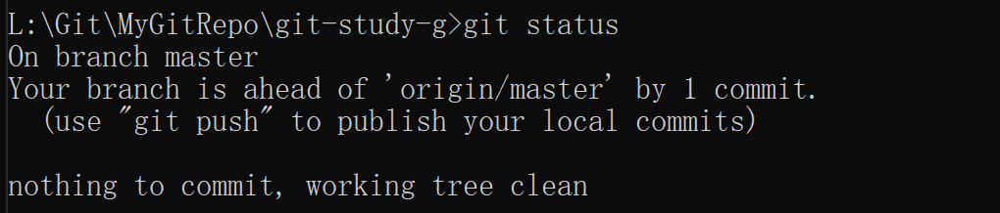

git 提示可以使用 git push 提交到远程仓库中。使用 `git push`：

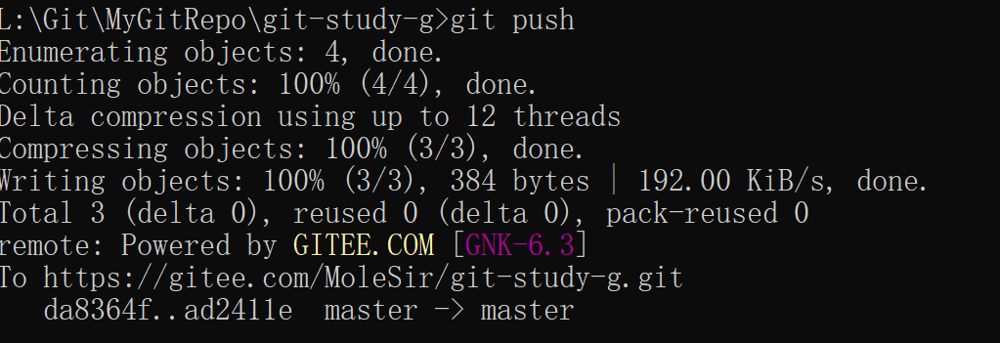

现在回到 gitee 仓库，可以发现出现了 hello.c 的文件：

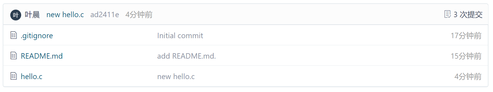


## fetch 拉取操作

`git fetch` 从远程分支拉取代码。

`git fetch` 常结合 `git merge` 一起用，`git fetch + git merge == git pull`。

以下为通常的操作流程：

````bash
git fetch remoteRep branch1:branch2
````

这段指令会在本地仓库创建 branch2 分支，并且将远程仓库 remoteRep的 branch1 分支复制到 branch2 分支。但本地不会自动切换到 branch2 分支。

确定文件没错之后，用 `git merge` 合并 branch2 的内容。

最后把 branch2 分支删除。


## pull 拉取操作

`git pull` 也可以将远程仓库的内容复制到本地，相比 `git fetch` 更加直接，执行命令：

````bash
git pull remoteRep branch
````

将远程仓库 remoteRep 的 branch 分支的内容直接覆盖本地仓库当前所在的分支。


## token

token 翻译过来就是令牌，可以理解为一种密码，这个由密码远程仓库 github 或 gitee 账号生成；

在使用 https 协议的情况下，推送到仓库的时，会要求输入远程仓库的账号和密码；

gitee 的话就直接输入用户账号密码即可，github 需要输入用户名与 token。gitee 也支持 token，那可以不需要，而 github 必须使用 token；

