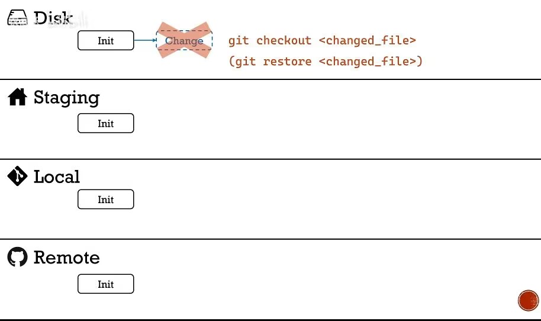
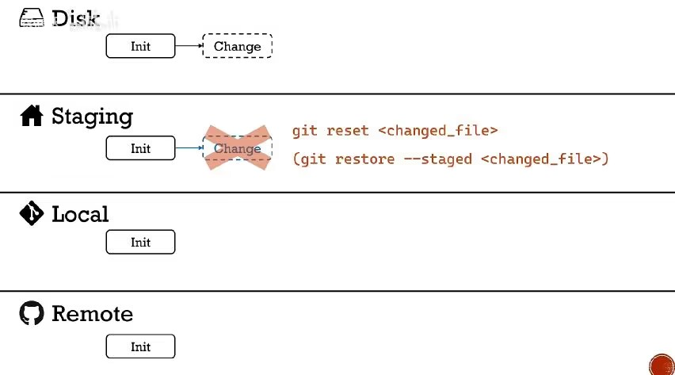
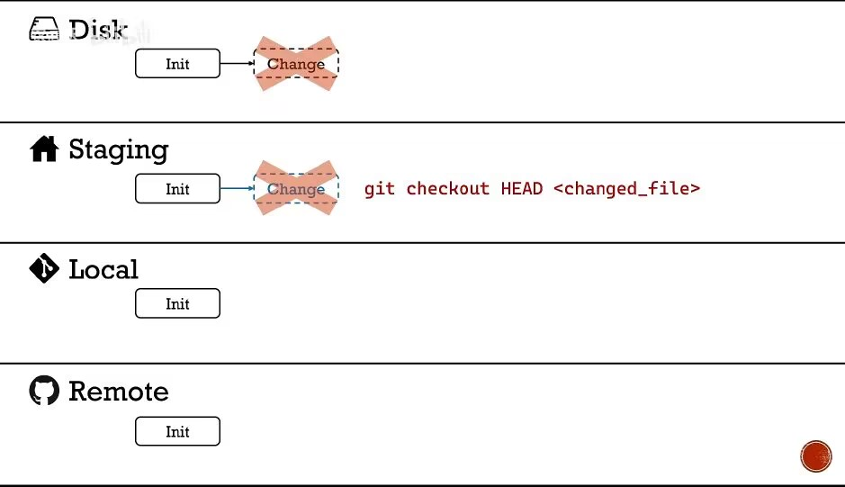
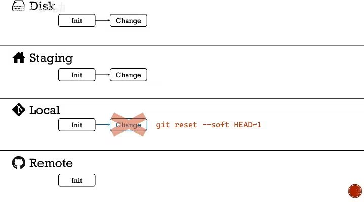
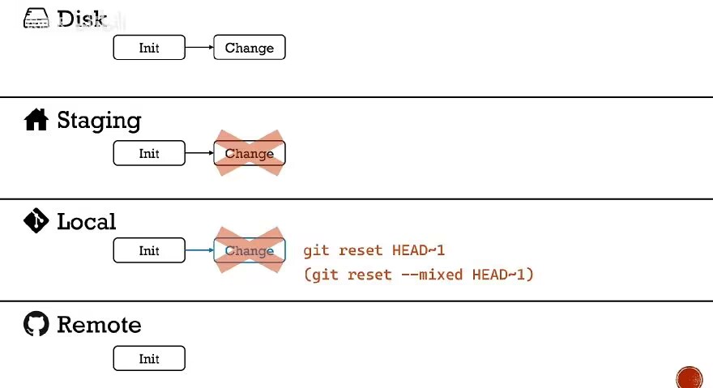
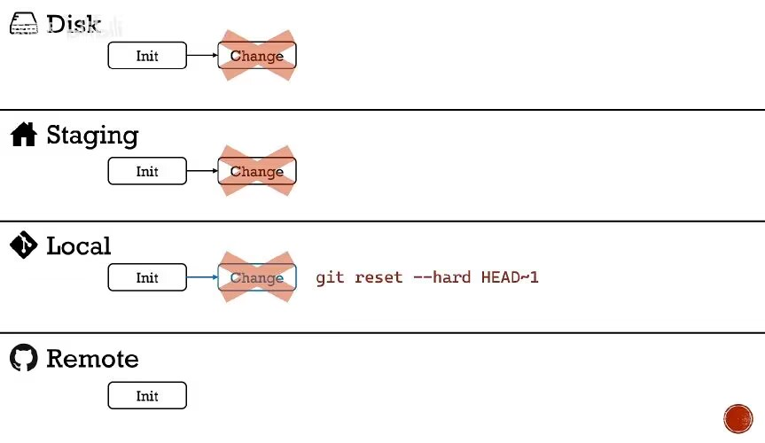

# Git 撤销操作

## 撤销本地磁盘的修改

当完成了一次 commit 后（如下 `init`），直接在磁盘上的文件进行修改，这些修改还没有被 `add` 与 `commit`，就要把这些修改撤销了：



使用：

````bash
git checkout <changed_file>
````

对指定的 `changed_file` 撤回磁盘上的修改；

或者使用 `git restore`；


## 撤销暂存区的修改

### 保存磁盘修改

当某个修改被 `git add`，但现在又不想要了。即：撤回 `git add` ，但不修改本地的磁盘文件；



使用：

```bash
git reset <change_file>
git restore --stage <change_file>
```

撤回对 <change_file> 文件的 `git add` 操作，但不会改变其磁盘内容；

### 不保存磁盘修改

如果不仅想撤回 `git add`，连磁盘上修改的也不想要了



使用：

````bash
git chekout HEAD <chenged_file>
````


## 撤销本地 git 的修改

### 仅撤销 `git commit`

当完成了一次 `commit`，但现在不想要了，



使用：

````bash
git reset --soft HEAD~1
````

`HEAD` 表示最近的一次 `commit`，那么 `HEAD~1` 就表示回退到上一次 `commit`。

或者 `HEAD~1` 的位置直接使用 `git commit` 的标识来代替。使用 `git log` 就可以看到每次 `commit` 有一串字符串唯一标识（还显示提交时候的批注）：

````bash
> git log
commit d37cac40138e7b918d4c09a589e52a45cf623da0 (HEAD -> master)
Author: MoleSir <1063441425@qq.com>
Date:   Wed Nov 16 10:40:07 2022 +0800

    v3.

commit 0b9b1c0db8057f977f3fb9860141f8516d67668b
Author: MoleSir <1063441425@qq.com>
Date:   Wed Nov 16 09:32:40 2022 +0800

    version0, 1, 2.
    
````

可以这样使用：

```bash
git reset --soft 0b9b1c0db8057f977f3fb9860141f8516d67668b
```

> 这个操作会丢失指定 `commit` 版本之后所有的提交。

### 撤销 `commit` 与 `add`

不仅想撤回 `commit` ，连暂存区的修改也不要，只保存磁盘修改：
											

使用：

````bash
git reset HEAD~1
git reset --mixed HEAD~1
````

两个都可以，默认 `--mixed` 选项；

也跟 `--soft` 一样，会丢失指定版本之后的所有 `add` 与 `commit`；

### 撤销所有修改

连磁盘上的都不要：



使用：

```bash
git reset --hard HEAD~1
```

同理，此操作会撤回指定版本之前所有的 `add` 与 `commit`，甚至连磁盘修改都会撤回到指定版本的样子。要小心使用；