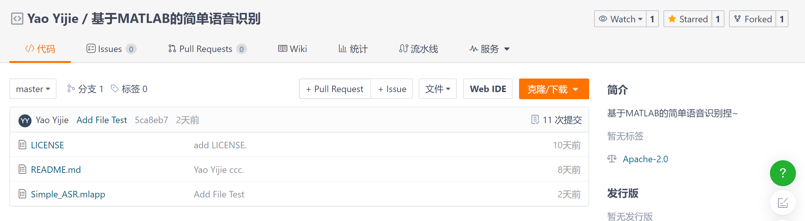
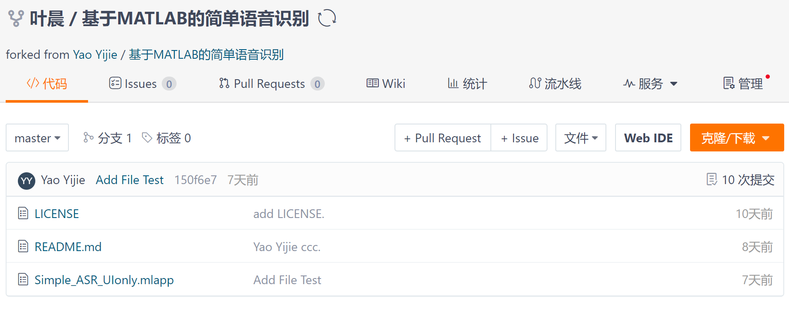
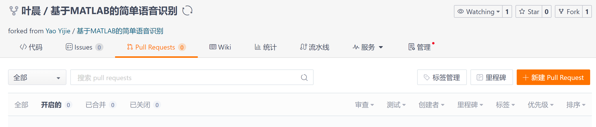
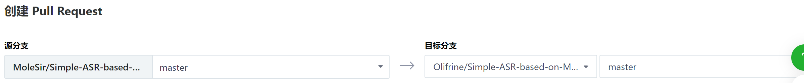

# Git 协作开发

在 Github 或 Gitee 上发现好的开源项目，可以一起同作者开发，使用下面这套流程；


## Fork 仓库

发现一个想合作开发的仓库



点击 Forked 按钮，就会在自己的远程仓库中复制一份一模一样的仓库：




## clone 仓库到本地

注意，是 clone 那个 Forked 到自己远程仓库的那个仓库，不是原作者的：

````bash
git clone https://gitee.com/MoleSir/Simple-ASR-based-on-MATLAB.git
````


## 在本地仓库修改

clone 好代码后，就可以在本地仓库进行自己的修改了，流程与自己开发一样；

新建一个分支，修改代码，提交，合并分支；

完成后，`git push` 到自己的那个远程仓库。


## 提交 Pull Request

修改提交到自己的远程仓库后，为了让原作者看到修改后的代码，需要提交一个 Pull Request：



点击 新疆 Pull Request 就可以选择把自己仓库的某个分支推送到原作者仓库的某个分支了：



之后原作者会看到这个 Pull Request，可以观察比对代码的修改情况，然后选择同意合并或者拒接。


## 更新本地版本

如果修改代码过程中，原作者又进行了一次提交，那么这个时候，自己本机上的代码就不是最新的了，需要把原作者的更新下载下来；

这涉及到一些概念，就是本地的 git 仓库会保存一些 url 执向远程仓库，比如如果使用 `git clone` 某个远程仓库，那么默认的 `origin` 就是这个远程仓库的 url，执行 `git push` 的时候其实是要指定远程仓库地址与分支的，但由于 git 已经直到 origin 是 clone 下来的仓库 url，所以才可以直接写：

````bash
git push origin master
````

完整的展开应该是：

````bash
git push https://gitee.com/Olifrine/Simple-ASR-based-on-MATLAB.git master
````

可以用 `git remote -v` 查看，本地版本保存了多少远程仓库：

````bash
$ git remote -v
origin  https://gitee.com/Olifrine/Simple-ASR-based-on-MATLAB.git (fetch)
origin  https://gitee.com/Olifrine/Simple-ASR-based-on-MATLAB.git (push)
````

### 添加原作者的远程仓库

所以，如果现在要更新本地的仓库，肯定是从原作者那里更新，需要添加原作仓库的 url：

````bash
git remote add upstream https://gitee.com/Olifrine/Simple-ASR-based-on-MATLAB.git
````

现在，upstream 这个名称就代表了原作的仓库，查看：

````bash
$ git remote -v
origin  https://gitee.com/MoleSir/Simple-ASR-based-on-MATLAB.git (fetch)
origin  https://gitee.com/MoleSir/Simple-ASR-based-on-MATLAB.git (push)
upstream        https://gitee.com/Olifrine/Simple-ASR-based-on-MATLAB.git (fetch)
upstream        https://gitee.com/Olifrine/Simple-ASR-based-on-MATLAB.git (push)
````

### 拉取最新代码

执行：

````bash
git pull upstream master
````

将原作者远程仓库的 master 分支直接覆盖本地仓库目前所在的分支；

或者使用 `git fetch + git merge` 也可以。