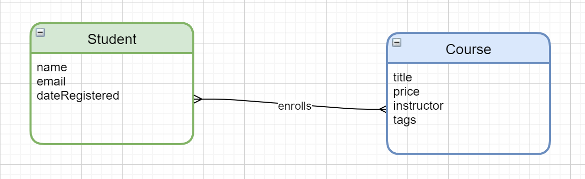
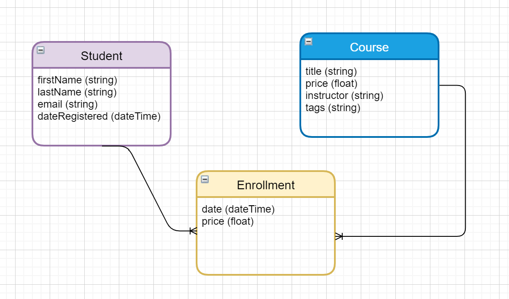
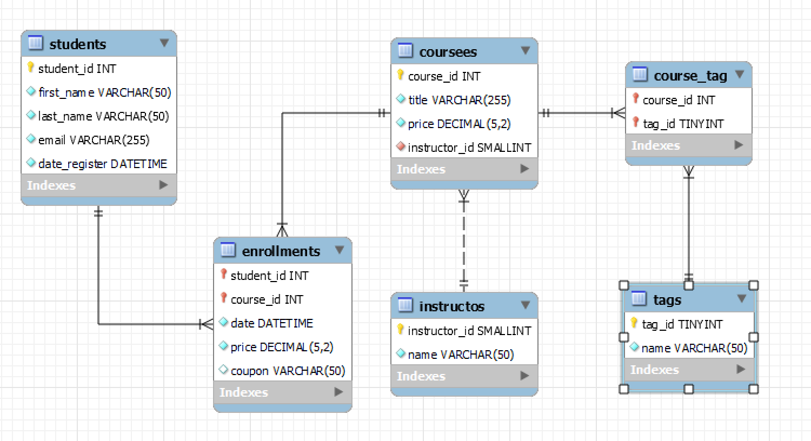

# 设计数据库

## 数据建模

数据建模分为四个步骤：

- 理解分析事务需求；非常重要，虽然比较耗时；

- 构建业务的**概念模型**（Conceptual Model）;

    业务中的实体、事务或概念以及它们之间的关系；

- 构建**逻辑模式**（Logical Model）；

    生成数据模型或数据结构用来存储数据，独立于数据技术的抽象数据模型；

- 构建**实体模式**（Physical Model）；

    以特定的数据库管理系统（比如 MySQL）构建一个实体模式；

以一个具体的例子学习三种模式：

建立一个销售在线课程的网站，用户可以注册或登记一个或多个课程；

### 概念模型

首先创建概念模型，表示事务中的实体、事物以及它们之间的关系；

通常使用：实体关系图 或者 UML 图（标准建模语言图）来表示概念模式；

可以使用 draw.io 来绘制；



### 逻辑模型

逻辑模型独立与具体数据库实现，是一个抽象的数据模型，能清晰显示实体以及关系架构，但是比概念模型更多细节；

- 细分概念模式的属性，给出属性类型；

- 确定不同实体之间的具体关系：一对一、一对多、多对多等；

    如果有必要，令关系成为一个实体类，用来存放数据；比如学生订阅课程的日期，这个日期不应该放在学生里面，因为一个学生可以定很多课；更不能放在课程中，一个课程会被多个学生订阅；所以应该单独用一个实体表示订阅关系；



### 实体模式

根据逻辑模式，在某个数据库管理系统中实现；

使用 MySQL 创建模型，添加表格与属性；

#### 主键

需要给建立的表都设置一个**主键**；

> 主键是唯一标识给定表里每条记录的列，每行必须有互相不重复的主键；选择主键要合适，一般使用多一行 id 来专门标识主键；

#### 外键

建立两个表的关系时，涉及到**外键**；

> 外键是在一张表中引用了另一张表的主键列；

在给两个表格增加关系时，关系的一端成为父表或主键表，另一端成为子表或外键表；

在我们的例子中，学生与注册之间的关系是一对多，学生表是父表，注册是子表，因为没有学生不可以注册；同理对课程与注册也是同样的；增加两个一对多关系后，课程出现两个外键，一个指向学生的主键，一个是课程的主键，可以使用复合主键，把两个外键一起作为注册表格的主键，使用学生 id 与课程 id 唯一标识一个注册过程；

#### 标准化

根据**标准化**继续完善设计；

> 标准化（Normalization）是审查我们的设计，并确保它遵循一些操作防止数据重复的预定义规则的这一过程；

其中有七条范式，最重要的就三条：

- 第一条：<u>要求一行中的每个单元格都应该有单一值，并且不能出现重复列</u>（Each cell should have a single value and we cannot have repeated columns）；

    比如一个课程有多个标签，并且数量不确定，如果把 `tags` 单独作为课程的一个属性是不好的；应该把标签作为一个实体，与课程形成多对多的关系；

    PS：MySQL 不支持直接的多对多关系，所以需要使用链接表作为桥梁，使用两次一对多实现（学生与课程的关系就是这样实现的）；

- 第二条：<u>要求每张表都应该有一个单一的目的，一个表只能代表一种类型</u>（Every table should describe one entity and every column in that table should describe that entity）；

    不属于对象的属性不要加入；

    比如订单表中不应该出现顾客的名称这个属性，应该记录的是顾客的 id，然后在顾客表中记录 id 与顾客名称的映射；这样修改顾客名称的花费最小；

    比如我们的课程表中出现了讲师名称，一个导师多个课，如果导师改名，会需要修改很多地方，应该使用导师 id；并且再次新建一个表格保存导师 id 与导师名字的对应关系；

- 第三条：<u>表中的列不应该派生自其他列</u>（A column in a table should not be derived from other columns）

    否则如果修改了一列，就必须更新其他由这个列派生的列；比如客户表中有用户姓、用户名，那么就不要有客户的姓名；

完成以上三个模型后，使用菜单栏的 `Database`  -> `Forwrad Engineering`，通过实体模式让 MySQL 帮助我们生成一个数据库；



## 更新数据库

### 数据库同步模型

在创建完后，还想对数据库修改，并且更新；

在实体模型中修改，改完后点击 `Database` --> `Synchronize Model...` 来更新数据库；

### 逆向工程

可以对一个不是由实体模型得到的数据库进行逆向工程，得到实体模型：

`Database` --> `Reverse Engineering` --> 选择连接 --> 选择需要逆向工程的数据库；即可生成了数据库对应的实体模型；


## 创建数据库

### 创建数据库

创建数据库，基本语法：

````mysql
CREATE DATABASE 数据库名称;
````

创建不存在的数据库，重复执行不会报错：

````mysql
CREATE DATABASE IF NOT EXISTS 数据库名称；
````

### 删除数据库

删除数据库，基本语法：

````mysql
DROP DATABASE 数据库名称
````

删除已经存在是数据库，重复执行不会报错；

````mysql
DROP DATABASE IF EXISTS 数据库名称
````

### 创建表格

语法：

````mysql
USE 数据库名称;
CREATE TABLE 表格名称
(
    列1 类型 (属性),
    列2 类型 (属性),
    ....
);
````

其中属性可加可不加，主要有：

- `PRIMARY KEY`：设置为主键；
- `AUTO INCREAMENT` ：自动增长赋值，一般与主键配合；
- `NOT NULL`：设置该列不能为 `NULL`（主键默认不能为空）；
- `DEFAULT 值`：设置默认值；
- `UNIQUE`：设置该列的值不可重复；

例如：

````mysql
CREATE TABLE customers
(	
	customers_id INT PRIMARY KEY AUTO_INCREMENT,
    first_name   VARCHAR(50) NOT NULL,
    last_name    VARCHAR(50) NOT NULL,
    points       INT NOT NULL DEFAULT 0,
    email        VARCHAR(255) NOT NULL UNIQUE
);
````

### 删除表格

基本语法：

````mysql
DROP TABLE 表格名
````

删除已经存在的表格，可以重复执行

````mysql
DROP TABLE IF EXISTS 表名
````

通常为了可以重复创建表格操作，通常与删除表格一起使用：

````mysql
DROP TABLE IF EXISTS customers;
CREATE TABLE IF NOT EXISTS customers
(	
	customers_id INT PRIMARY KEY AUTO_INCREMENT,
    first_name   VARCHAR(50) NOT NULL,
    last_name    VARCHAR(50) NOT NULL,
    points       INT NOT NULL DEFAULT 0,
    email        VARCHAR(255) NOT NULL UNIQUE
);
````

### 修改表格

基本语法：

````mysql
USE 数据库名称;
ALTER TABLE 表格名称
	ADD (COLUMN) 新列名 类型 (属性) (位置),
	ADD (COLUMB)... 				   ,
	MODIFY (COLUMN)	需要修改的列名 新类型 （新属性)
	DROP (COLUMN) 删除的列名,
	...;
````

在 `ALTER TABLE 表格名称` 后跟上若干子语句，可以是：

- `ADD (COLUMN)` ：`（）` 表示 `COLUMN` 可以不加，`ADD` 后写上要增加的列名称，之后是列的类型，最后是该列的属性；跟创建一个列的属性相同；
- `MODIFY (COLUMN)` ：后跟上需要修改的列名称，后加需要改成的类型，最后是新的属性，都是一个格式；
- `DROP (COLUMN)`：后跟上需要删除的列名称；

举例：

````mysql
USE sql_store2;
ALTER TABLE customers
	ADD COLUMN last_name VARCHAR(50) NOT NULL AFTER first_name,
    ADD city      		 VARCHAR(50) NOT NULL,
    MODIFY COLUMN first_name VARCHAR(55) DEFAULT ' ',
    DROP points;
````

### 创建关系

创建表格之间的关系：

PS：这里学得不是很明白，哪天看懂了再来补充；

例如：

````mysql
DROP TABLE IF EXISTS orders;
CREATE TABLE orders
(
	order_id 	INT PRIMARY KEY,
    customer_id INT NOT NULL,
    FOREIGN KEY fk_orders_customers (customer_id)
		REFERENCES customers (customer_id)
        ON UPDATE CASCADE 
        ON DELETE NO ACTION
);
````

### 修改主键

设置某列为主键：

````mysql
ALTER TABLE 表格名称
	ADD PRIMARY KEY (列名)
````

删除表格的主键：

```mysql
ALTER TABLE orders
    DROP PRIMARY KEY;
```

### 字符集和排序规则

字符集是每个字符映射到数字的表；

MySQL 中 CHAR(10) 是十个字符，不是 10 个字节，所以必要时更改 MySQL 中的字符集，可以节省空间；

显示字符集

````
SHOW CHARSET;
````

在创建数据库时设置字符集：

````
CREATE DATABASE db_name
	CHARACTER SET 字符集;
````

对已经创建的修改

````mysql
ALTER DATABASE db_name
	CHARACTER SET 字符集;
````

### 存储引擎

MySQL 有几个不同的存储引擎，这些引擎决定了数据如何被存储，以及哪些功能可供我们使用

显示存储引擎

````mysql
SHOW ENGINES;
````

修改表格的存储引擎

````mysql
ALTER TABLE customers
ENGINE = InnoDB;
````

### 
