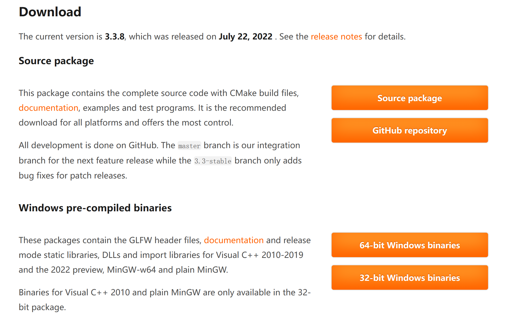
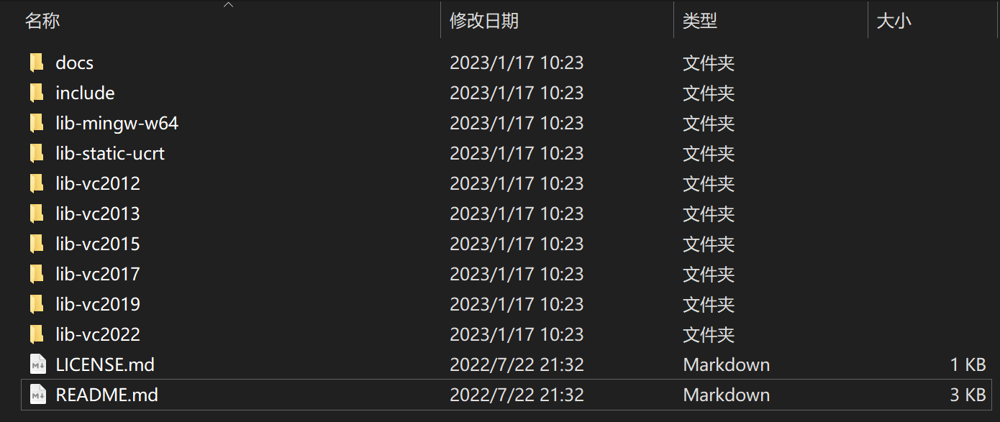
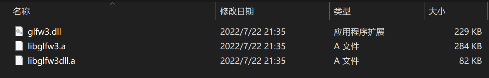
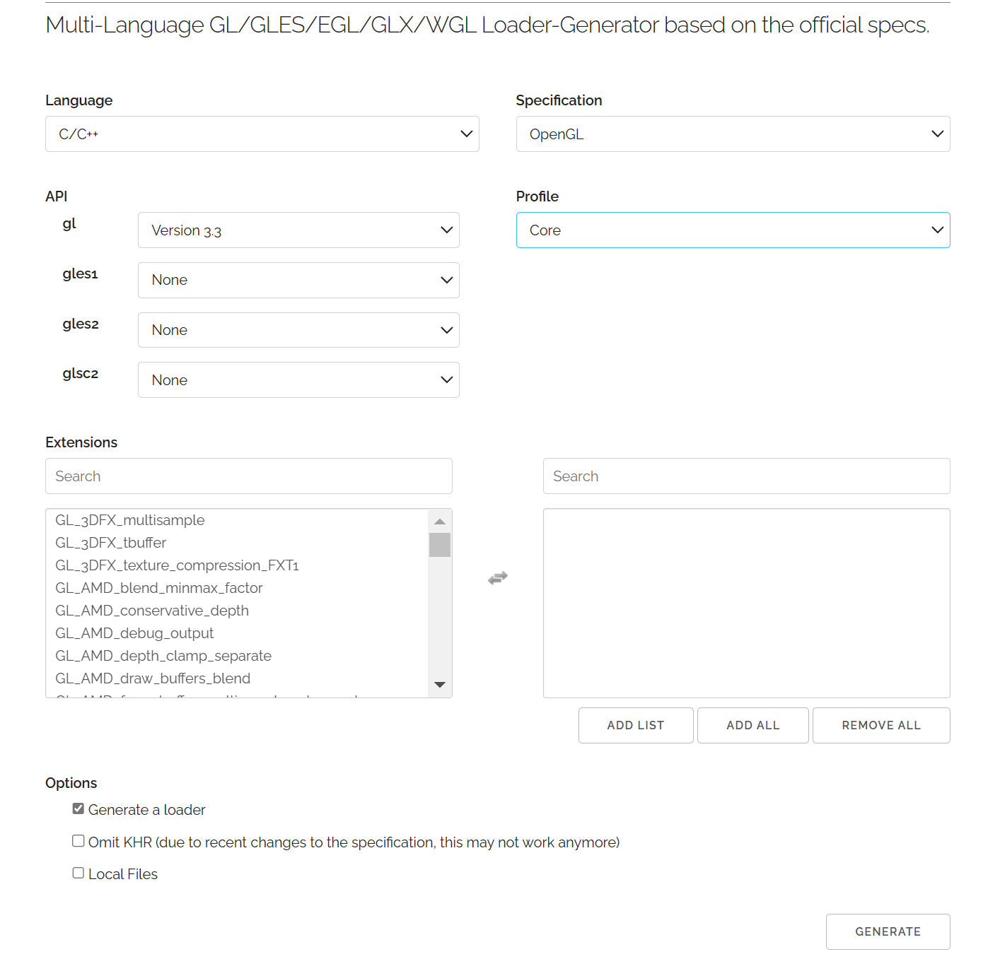

# 配置环境

没有跟原教程一样的设置，使用的 vscode。

## GLFW

GLFW是一个专门针对 OpenGL 的C语言库，它提供了一些渲染物体所需的最低限度的接口。它允许用户创建OpenGL上下文、定义窗口参数以及处理用户输入。

glfw下载地址为：https://www.glfw.org/download.html：



直接下载 Window 下编译好的库文件，根据编译器的位数选择 64 还是 32 位。

下载得到 .zip 压缩包，之后解压可以得到：



其中 include 是头文件目录，可以直接拷贝到项目中使用，其他的都是编译好的库文件，对 vscode 的配置选择 lib-mingw-w64 文件夹下的：



其中两个 .a 文件作为静态链接库使用，glfw3.dll 是动态链接库，在项目中需要放置在输出 .exe 文件相同的文件目录下使用即可，编译过程中不需要管。


## GLAD

因为 OpenGL 只是一个标准/规范，具体的实现是由驱动开发商针对特定显卡实现的。由于 OpenGL 驱动版本众多，它大多数函数的位置都无法在编译时确定下来，需要在运行时查询。所以任务就落在了开发者身上，开发者需要在运行时获取函数地址并将其保存在一个函数指针中供以后使用。取得地址的方法因平台而异，在 Windows 上会是类似这样：

````c++
// 定义函数原型
typedef void (*GL_GENBUFFERS) (GLsizei, GLuint*);
// 找到正确的函数并赋值给函数指针
GL_GENBUFFERS glGenBuffers  = (GL_GENBUFFERS)wglGetProcAddress("glGenBuffers");
// 现在函数可以被正常调用了
GLuint buffer;
glGenBuffers(1, &buffer);
````

代码非常复杂，而且很繁琐，需要对每个可能使用的函数都要重复这个过程。幸运的是，有些库能简化此过程，其中**GLAD**是目前最新，也是最流行的库。

glad生成静态库的地址为：https://glad.dav1d.de/，配置结果如下图所示（严格选择），然后点击GENERATE：



> 版本根据 GLFW 选择

其将生成一个压缩包，将其解压：得到 include 与 src 目录，其中 include 是头文件直接复制到项目中使用，src 中包含一个 glad.c 文件。

可以将其制作为静态链接库使用：

```sh
gcc ./src/glad.c -c -I ./include/ // 生成 .o文件
ar -rc libglad.a glad.o           // 生成我们所需要的 .a文件
```

得到的 libglad.a 与 GLFW 中的两个静态库一起使用。

