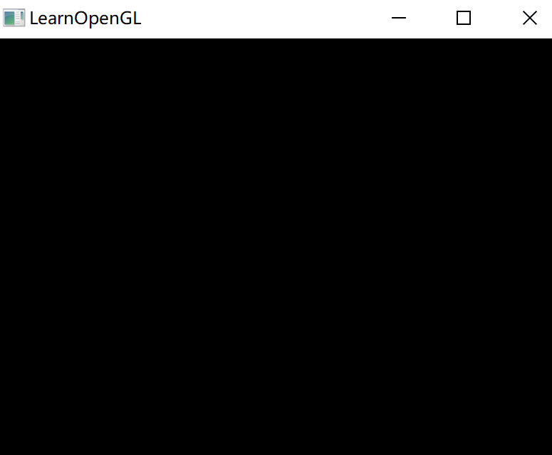

# 创建窗口

在配置好的工程新建 .cpp 文件：

````c++
#include <glad/glad.h>
#include <GLFW/glfw3.h>

int main()
{
    glfwInit();
    glfwWindowHint(GLFW_CONTEXT_VERSION_MAJOR, 3);
    glfwWindowHint(GLFW_CONTEXT_VERSION_MINOR, 3);
    glfwWindowHint(GLFW_OPENGL_PROFILE, GLFW_OPENGL_CORE_PROFILE);
    
    return 0;
}
````

1. 调用 `glfwInit()` 函数初始化 GLFW；
2. 之后利用 `glfwWindowHint` 函数对窗口进行配置，第一个参数就是需要配置的属性，第二个是配置的值；
   - ` glfwWindowHint(GLFW_CONTEXT_VERSION_MAJOR, 3);` 指定 OpenGL 主版本是 3；
   - ` glfwWindowHint(GLFW_CONTEXT_VERSION_MINOR, 3);` 指定 OpenGL 副版本是 3，所以 OpenGL 版本是 3.3；
   - `glfwWindowHint(GLFW_OPENGL_PROFILE, GLFW_OPENGL_CORE_PROFILE);` 指定 OpenGL 工作在核心模式；

接下来创建一个窗口对象，这个窗口对象存放了所有和窗口相关的数据，而且会被 GLFW 的其他函数频繁地用到。

````c
GLFWwindow* window = glfwCreateWindow(800, 600, "LearnOpenGL", NULL, NULL);
if (window == NULL)
{
    std::cout << "Failed to create GLFW window" << std::endl;
    glfwTerminate();
    return -1;
}
glfwMakeContextCurrent(window);
````

`glfwCreateWindow` 创建一个 `GLFWwindow` 对象，并且返回其指针：

- 前两个参数表示窗口的宽、高；
- 第三个参数表示窗口的标题；
- 最后两个参数暂时忽略。

创建完窗口通知 GLFW 将窗口的上下文设置为当前线程的主上下文：`glfwMakeContextCurrent(window);`


## GLAD

GLAD 用来管理 OpenGL 的函数指针，所以在调用任何 OpenGL 的函数之前需要初始化GLAD：

```c++
if (!gladLoadGLLoader((GLADloadproc)glfwGetProcAddress))
{
    std::cout << "Failed to initialize GLAD" << std::endl;
    return -1;
}
```

调用 `gladLoadGLLoadr` 函数来获取加载系统相关的 OpenGL 函数指针，其通过参数 `glfwGetProcAddress` 返回，根据编译的系统定义了正确的函数。


## 视口

在开始渲染之前还有一件重要的事情要做，必须告诉 OpenGL 渲染窗口的尺寸大小，即视口(Viewport)，这样 OpenGL 才只能知道怎样根据窗口大小显示数据和坐标。（渲染窗口的哪些部分）

可以通过调用 `glViewport` 函数来设置窗口的维度(Dimension)：

````c++
glViewport(0, 0, 800, 600);
````

前两个参数控制窗口左下角的位置。第三个和第四个参数控制渲染窗口的宽度和高度（像素）。

实际上也可以将视口的维度设置为比 GLFW  窗口的维度小，这样所有的 OpenGL 渲染将会在一个更小的窗口中显示，所以可以将一些其它元素显示在OpenGL视口之外，不会被显示。

> OpenGL 幕后使用 `glViewport` 中定义的位置和宽高进行2D坐标的转换，将OpenGL 中的位置坐标转换为屏幕坐标。
>
> 例如，OpenGL中的坐标 `(-0.5, 0.5)` 可能（最终）被映射为屏幕中的坐标`(200,450)` 。注意，处理过的OpenGL坐标范围只为 -1 到 1，因此事实上将(-1到1)范围内的坐标映射到(0, 800)和(0, 600)。

然而，当用户改变窗口的大小的时候，视口也应该被调整。

为了自动修改，可以对窗口注册一个回调函数(Callback Function)，它会在每次窗口大小被调整的时候被调用。这个回调函数的原型如下：

````c++
void framebuffer_size_callback(GLFWwindow* window, int width, int height)
{
    glViewport(0, 0, width, height);
}
````

函数接收一个 GLFW 窗口对象，两个整数表示窗口的新维度。每当窗口改变大小，GLFW 会调用这个函数并填充相应的参数。

> 这个函数本身是用户定义的，但函数类型是规范好的，参数与返回值类型必须如此。

还需要注册这个函数，告诉 GLFW 希望每当窗口调整大小的时候调用这个函数：

````c++
glfwSetFramebufferSizeCallback(window, framebuffer_size_callback);
````

函数的第一个参数指定配置回调函数的对象（不同窗口对象可以有不同回调函数），第二个参数即为回调函数。

> 回调函数，用户只需要定义之后注册号，调用过程由 OpenGL 完成，其会自动传入当前窗口大小作为参数，这也就为什么需要固定回调函数类型的原因。


## 准备引擎

不希望只绘制一个图像之后应用程序就立即退出并关闭窗口，而是希望程序用户主动关闭之前不断绘制图像并能够接受用户输入。

因此，需要在程序中添加一个 `while` 循环，可以把它称之为渲染循环(Render Loop)，它能在 GLFW 退出前一直保持运行。下面几行的代码就实现了一个简单的渲染循环：

````c++
while(!glfwWindowShouldClose(window))
{
    glfwSwapBuffers(window);
    glfwPollEvents();    
}
````

- `glfwWindowShouldClose` 函数在每次循环的开始前检查一次 GLFW 是否被要求退出，如果是的话该函数返回`true`然后渲染循环便结束，之后为就可以关闭应用程序了；
- `glfwPollEvents` 函数检查有没有触发什么事件（比如键盘输入、鼠标移动等）、更新窗口状态，并调用对应的回调函数（可以通过回调方法手动设置）。
- `glfwSwapBuffers` 函数会交换颜色缓冲（它是一个储存着GLFW窗口每一个像素颜色值的大缓冲），它在这一迭代中被用来绘制，并且将会作为输出显示在屏幕上。


## 释放资源

当渲染循环结束后需要正确释放/删除之前的分配的所有资源：

````c++
glfwTerminate();
````

目前，程序编译后输出就是一个黑色窗口：




## 输入

使用 GLFW 的 `glfwGetKey` 函数，它需要一个窗口以及一个按键作为输入。这个函数将会返回这个按键是否正在被按下。

配合这个函数，实现对指定键盘输入的处理：

````c++
void processInput(GLFWwindow *window)
{
    if(glfwGetKey(window, GLFW_KEY_ESCAPE) == GLFW_PRESS)
        glfwSetWindowShouldClose(window, true);
}
````

检查用户是否按下了返回键(Esc)，如果没有按下，`glfwGetKey` 将会返回`GLFW_RELEASE`。如果用户的确按下了返回键，通过 `glfwSetwindowShouldClose` 把 `WindowShouldClose` 属性设置为 `true`的来关闭GLFW。

下一次while循环的条件检测将会失败，程序将会关闭。

把这函数加入每次渲染过程：

````c++
while (!glfwWindowShouldClose(window))
{
    processInput(window);

    glfwSwapBuffers(window);
    glfwPollEvents();
}
````

这就有了一个非常简单的方式来检测特定的键是否被按下，并在每一帧做出处理。


## 渲染

把所有的渲染(Rendering)操作放到渲染循环中：

````c++
// 渲染循环
while(!glfwWindowShouldClose(window))
{
    // 输入
    processInput(window);

    // 渲染指令
    ...

    // 检查并调用事件，交换缓冲
    glfwPollEvents();
    glfwSwapBuffers(window);
}
````

使用一个自定义的颜色清空屏幕，每次循环先清屏：

````c++
glClearColor(0.2f, 0.3f, 0.3f, 1.0f);
glClear(GL_COLOR_BUFFER_BIT);
````

1. 首先调用 `glClearColor` 来色湖之清空屏幕所用的颜色；

2. 之后调用 `glClear`，这个函数可以清空屏幕的颜色缓冲，它接受一个缓冲位(Buffer Bit)来指定要清空的缓冲，可能的缓冲位有：

   - `GL_COLOR_BUFFER_BIT`；
   - `GL_DEPTH_BUFFER_BIT`；
   - `GL_STENCIL_BUFFER_BIT`；

   由于现在只关心颜色值，所以只清空颜色缓冲。

> 这个就是很典型的状态设置，`glClearColor` 函数是一个状态设置函数，而`glClear` 函数则是一个状态使用的函数，它使用了当前的状态来获取应该清除为的颜色。

