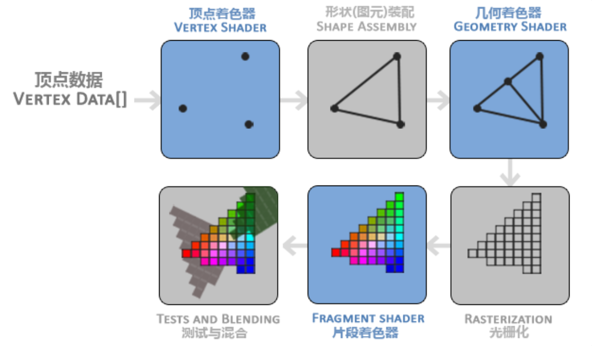
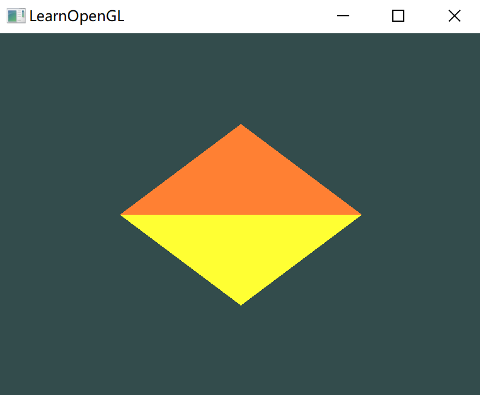

# 三角形

## 关键词

记下三个单词：

- 顶点数组对象：Vertex Array Object，VAO
- 顶点缓冲对象：Vertex Buffer Object，VBO
- 元素缓冲对象：Element Buffer Object，EBO 或 索引缓冲对象 Index Buffer Object，IBO


## 图形渲染管线

在 OpenGL 中，任何事物都在 3D 空间中，而屏幕和窗口却是 2D 像素数组，这导致OpenGL 的大部分工作都是关于把 3D 坐标转变为适应屏幕的 2D 像素。

3D 坐标转为 2D 坐标的处理过程是由 OpenGL 的图形渲染管线（Graphics Pipeline，大多译为管线，实际上指的是一堆原始图形数据途经一个输送管道，期间经过各种变化处理最终出现在屏幕的过程）管理的。

图形渲染管线可以被划分为两个主要部分：

- 第一部分把 3D 坐标转换为 2D 坐标；
- 第二部分是把 2D 坐标转变为实际的有颜色的像素。

图形渲染管线接受一组 3D 坐标，然后把它们转变为屏幕上的有色2D像素输出。

图形渲染管线可以被划分为几个阶段，每个阶段将会把前一个阶段的输出作为输入。所有这些阶段都是高度专门化的（它们都有一个特定的函数），并且很容易并行执行。

由于具有并行执行的特性，当今大多数显卡都有成千上万的小处理核心，它们在 GPU 上为每一个（渲染管线）阶段运行各自的小程序，从而在图形渲染管线中快速处理数据。这些小程序叫做着色器(Shader)。

着色器可以由开发者配置，允许用自己写的着色器来代替默认的。因为它们运行在GPU上，所以节省了宝贵的CPU时间。

下面是一个图形渲染管线的每个阶段的抽象展示，蓝色部分代表的是可以注入自定义的着色器的部分：



- 以数组形式传递 3 个 3D 坐标作为图形渲染管线的==输入==，来表示一个三角形，这个数组较为顶点数据(Vertex Data)；

  定点数据是一系列顶点的集合，一个顶点(Vertex)是一个 3D 坐标的数据的集合，假设每个顶点由 3D 位置和颜色值组成；

- 图形渲染管线的第一个部分是==顶点着色器==(Vertex Shader)，它把一个单独的顶点作为输入。顶点着色器主要的目的是把 3D 坐标转为另一种 3D 坐标，同时顶点着色器可以对顶点属性进行一些基本处理。

- ==图元装配==(Primitive Assembly)阶段将顶点着色器输出的所有顶点作为输入（如果是GL_POINTS，那么就是一个顶点），并所有的点装配成指定图元的形状。例子中，生成了三角形；

  而由于输入的只有点，OpenGL 还需要知道如何组织这些点，比如组合成三角形、正方形等，给出这些提示的就是图元；

- 图元装配阶段的输出会传递给==几何着色器==(Geometry Shader)。几何着色器把图元形式的一系列顶点的集合作为输入，它可以通过产生新顶点构造出新的（或是其它的）图元来生成其他形状。例子中，它生成了另一个三角形。

- 几何着色器的输出会被传入==光栅化阶段==(Rasterization Stage)，这里它会把图元映射为最终屏幕上相应的像素，生成供片段着色器(Fragment Shader)使用的片段(Fragment)。在片段着色器运行之前会执行裁切(Clipping)。裁切会丢弃超出视图以外的所有像素，用来提升执行效率。

- ==片段着色器==的主要目的是计算一个像素的最终颜色，这也是所有OpenGL高级效果产生的地方。通常，片段着色器包含3D场景的数据（比如光照、阴影、光的颜色等等），这些数据可以被用来计算最终像素的颜色。

- 最终的对象将会被传到称为 Alpha 测试和混合(Blending)阶段。检测片段的对应的深度（和模板(Stencil)）值，用它们来判断这个像素是其它物体的前面还是后面，决定是否应该丢弃。

  这个阶段也会检查alpha值（alpha值定义了一个物体的透明度）并对物体进行混合(Blend)。所以，即使在片段着色器中计算出来了一个像素输出的颜色，在渲染多个三角形的时候最后的像素颜色也可能完全不同。

图形渲染管线非常复杂，它包含很多可配置的部分。对于大多数场合，只需要配置顶点和片段着色器就行。

在现代OpenGL中，必须定义至少一个==顶点着色器==和一个==片段着色器==（因为GPU中没有默认的顶点/片段着色器）。


## 顶点输入

开始绘制图形之前，需要先给 OpenGL 输入一些顶点数据。

在 OpenGL 中指定的所有坐标都是 3D 坐标，并且其使用的坐标范围是 (-1.0, 1.0)，叫做标准化设备坐标(Normalized Device Coordinates)，此范围内的坐标最终显示在屏幕上（在这个范围以外的坐标则不会显示）。

指定三个顶点：

````c++
float vertices[] = {
    -0.5f, -0.5f, 0.0f,
     0.5f, -0.5f, 0.0f,
     0.0f,  0.5f, 0.0f
};
````

三个坐标的 z 都是 0，也就是说三个点都处于 x0y 平面，深度为 0，看起来像 2D 图形；

> 标准化设备坐标(Normalized Device Coordinates, NDC)
>
> 顶点着色器中处理后的顶点，就应该是标准化设备坐标，x、y和z值在-1.0到1.0上。任何落在范围外的坐标都会被丢弃/裁剪，不会显示在屏幕上。
>
> 
>
> y轴正方向为向上，(0, 0)坐标是这个图像的中心，而不是左上角，就向数学试卷上的坐标一样；

定义顶点数据以后，把它作为第一个处理阶段：顶点着色器。它会在 GPU 上创建内存用于储存顶点数据，还要配置 OpenGL 如何解释这些内存，并且指定其如何发送给显卡。顶点着色器接着会处理在内存中指定数量的顶点。

通过顶点缓冲对象(Vertex Buffer Objects, VBO)管理这个内存，它会在GPU内存（通常被称为显存）中储存大量顶点。

使用这些缓冲对象的好处是我们可以一次性的发送一大批数据到显卡上，而不是每个顶点发送一次。

顶点缓冲对象是 OpenGL 对象，有一个独一无二的ID，可以使用 `glGenBuffers` 函数和一个缓冲ID生成一个VBO对象：

````c++
unsigned int VBO;
glGenBuffers(1, &VBO);
````

创建好之后就可以把这个缓冲绑定到 `GL_ARRAY_BUFFER` 上：

````c++
glBindBuffer(GL_ARRAY_BUFFER, VBO);
````

从这一刻起，任何（在 `GL_ARRAY_BUFFER` 目标上的）缓冲调用都会用来配置当前绑定的缓冲(VBO)。

调用 `glBufferData` 函数，它会把之前定义的顶点数据复制到缓冲的内存中：

````c++
glBufferData(GL_ARRAY_BUFFER, sizeof(vertices), vertices, GL_STATIC_DRAW);
````

`glBufferData` 是一个专门用来把用户定义的数据复制到当前绑定缓冲的函数。

- 第一个参数是目标缓冲的类型：例子中，顶点缓冲对象当前绑定到GL_ARRAY_BUFFER 目标上；

- 第二个参数指定传输数据的大小(以字节为单位)；用一个简单的`sizeof`计算出顶点数据大小就行；

- 第三个参数是实际数据；

- 第四个参数指定了希望显卡如何管理给定的数据。它有三种形式：

  - `GL_STATIC_DRAW` ：数据不会或几乎不会改变。
  - `GL_DYNAMIC_DRAW`：数据会被改变很多。
  - `GL_STREAM_DRAW` ：数据每次绘制时都会改变。

  三角形的位置数据不会改变，每次渲染调用时都保持原样，所以它的使用类型最好是 `GL_STATIC_DRAW`；

现在已经把顶点数据储存在显卡的内存中，用 VBO 这个顶点缓冲对象管理。之后会创建一个顶点着色器和片段着色器来真正处理这些数据。


## 顶点着色器

现代 OpenGL 至少需要设置一个顶点和一个片段着色器。设置的方法是用着色器语言GLSL(OpenGL Shading Language)编写，之后编译，这样才可以在程序中使用，例如：

```glsl
#version 330 core
layout (location = 0) in vec3 aPos
    
void main()
{
    gl_Position = vec4(aPos.x, aPox,y, aPox.z, 1.0);
}
```

- 每个着色器都起始于一个版本声明，指定 OpenGL 版本与模式；

- 使用`in`关键字，声明所有的输入顶点属性(Input Vertex Attribute)。现在只关心位置(Position)数据，所以只需要一个顶点属性；

  GLSL 语言中有一直数据类型为向量，可以包含 1 到 4 个 `float` 分量，包含的数据可以从类型名的后缀看出。例子中的 `vec3` 就是一个包含 3 个 `float` 分量的类型，并且创建了一个对象 `aPos`。其中还有 `layout (location = 0)` 则是设定了输入变量的位置值；

  > 用 `int vec3 aPos` 表示声明一个输入，类型为 vec3 的变量 aPos

- 设置好输入后，在 `main` 中设置输出，把位置数据赋值给预定义的`gl_Position` 变量，其是 `vec4` 类型的，所以赋值的时候用了 `vec4` 类型的构造函数，将输入的前三个传入，并且最后一个参数恒为 1.0；

这个顶点着色器对输入数据完全不处理就直接输出。

### 编译着色器

将顶点着色器的源代码硬编码在代码文件顶部的C风格字符串中：

````c++
    const char* vertexShaderSource = 
        "#version 330 core\n"
        "layout (location = 0) in vec3 aPos;\n"
        "void main()\n"
        "{\n"
        "   gl__Position = vec4(aPos.x, aPos.y, aPox.z, 1.0);\n"
        "}\0";
````

为了能够让 OpenGL 使用，在运行时动态编译它的源代码。

使用 `glCreateShader` 创建一个着色器对象，还是用 ID 来引用：

````c++
unsigned int vertexShader;
vertexShader = glCreateShader(GL_VERTEX_SHADER);
````

把需要创建的着色器类型以参数形式提供给 `glCreateShader`。由于正在创建一个顶点着色器，传递的参数是 `GL_VERTEX_SHADER`。

下一步使用 `glShaderSource` 把这个着色器源码附加到着色器对象上，然后编译它：

````c++
glShaderSource(vertexShader, 1, &vertexShaderSource, NULL);
glCompileShader(vertexShader);
````

- 参数一：着色器对象引用；
- 参数二：传入源码的数量（字符串数量）；
- 参数三：源码；
- 参数四：暂时为 NULL；


## 片段着色器

片段着色器所做的是计算像素最后的颜色输出。这里写一个让输出一直为橘黄色的：

> 在计算机图形中颜色被表示为有 4 个元素的数组：红色、绿色、蓝色和alpha(透明度)分量，通常缩写为RGBA，每个分量的强度设置在0.0到1.0之间。

````glsl
#version 330 core
out vec4 FragColor;

void main()
{
    FragColor = vec4(1.0f, 0.5f, 0.2f, 1.0f);
} 
````

片段着色器只需要一个输出变量，这个变量是一个4分量向量，它表示的是最终的输出颜色。

使用`out`关键字声明一个 `vec4` 类型的输出。在 `main` 中保持其输出就是 `vec4(1.0f, 0.5f, 0.2f, 1.0f);`

编译片段着色器的过程与顶点类似，只是用 `GL_FRAGMENT_SHADER` 作为类型

````c++
unsigned int fragmentShader;
fragmentShader = glCreateShader(GL_FRAGMENT_SHADER);
glShaderSource(fragmentShader, 1, &fragmentShaderSource, NULL);
glCompileShader(fragmentShader);
````


## 着色器程序

着色器程序对象(Shader Program Object)是多个着色器合并之后并最终链接完成的版本。要使用着色器，必须把它们链接(Link)为一个着色器程序对象，然后在渲染对象的时候激活这个着色器程序。

当链接着色器至一个程序的时候，它会把每个着色器的输出链接到下个着色器的输入。当输出和输入不匹配的时候，得到一个连接错误。

创建一个程序对象：

````c++
unsigned int shaderProgram;
shaderProgram = glCreateProgram();
````

需要把之前编译的着色器附加到程序对象上，然后用 `glLinkProgram` 链接它们：

```c++
glAttachShader(shaderProgram, vertexShader);
glAttachShader(shaderProgram, fragmentShader);
glLinkProgram(shaderProgram);
```

最后，调用 `glUseProgram` 函数，以激活这个程序对象：

````c++
glUseProgram(shaderProgram);
````

把着色器对象链接到程序对象以后，记得删除着色器对象：

```c++
glDeleteShader(vertexShader);
glDeleteShader(fragmentShader);
```


## 链接顶点属性

顶点着色器允许指定任何以顶点属性为形式的输入。

灵活性高，但意味着必须手动指定输入数据的哪一个部分对应顶点着色器的哪一个顶点属性。必须在渲染前指定 OpenGL 该如何解释顶点数据。

顶点缓冲数据会被解析为下面这样子：


- 位置数据被储存为 32 位（4 字节）浮点值。
- 每个位置包含 3 个这样的值。
- 在这 3 个值之间没有空隙（或其他值）。这几个值在数组中紧密排列(Tightly Packed)。
- 数据中第一个值在缓冲开始的位置。

有了这些信息，就可以使用 `glVertexAttribPointer` 函数告诉 OpenGL 该如何解析顶点数据（应用到逐个顶点属性上）:

````c++
glVertexAttribPointer(0, 3, GL_FLOAT, GL_FALSE, 3 * sizeof(float), (void*)0);
````

`glVertexAttribPointer` 函数参数很多：

- 参数一：要配置的顶点属性。在顶点着色器中使用了 `layout(location = 0)` 定义了 `position` 顶点属性的序号。指定后，在一个顶点的若干属性中，位置值位于 0 号，所以参数传入 0 号说明设置的是位置值；
- 参数二：顶点属性的大小，一个顶点位置值类型是 `vec3`，所以写 3；
- 参数三：数据的类型，`GL_FLOAT` 表示浮点类型；
- 参数四：表示是否希望数据被标准化。如果写 `GL_TRUE`，所有数据都被映射到 0（对 signed 数据是 -1）到 1 之间；
- 参数五：表示连续的顶点属性组之间的间隔。由于每个顶点三个 `float`，所以每个顶点大小为 `3 * sizeof(float)`，由于数组直接没有间隙，所以步长设置为 `3 * sizeof(float)`；
- 参数六：表示数据起始位置在缓冲中的偏移，这样数组一开始就是数据，所以写 0。

这个函数前缀是 `Vertex`，说明是关于顶点的；

调用时，首先根据参数 1，去顶点着色器（着色器源文件中定义）找对应属性，这里就根据参数 0 找到 0 号对象为 aPos，对应了位置属性；

而位置属性数据的来源是 `GL_ARRAY_BUFFER`，得到配置 `GL_ARRAY_BUFFER` 时传入的顶点缓冲对象 VBO；

最后找到 VBO 中的数据起始地址；

之后的各自配置都是对这段内存来操作；

> 每个顶点属性从一个 VBO 管理的内存中获得它的数据，而具体是从哪个 VBO（程序中可以有多个VBO）获取则是通过在调用 `glVertexAttribPointer` 时绑定到 `GL_ARRAY_BUFFER` 的 VBO 决定的（使用 `glBindBuffer(GL_ARRAY_BUFFER, VBO);` 绑定）。
>
> 由于在调用 `glVertexAttribPointer` 之前绑定的是先前定义的 VBO 对象，顶点属性`0`现在会链接到它的顶点数据。

现在定义了 OpenGL 该如何解释顶点数据，就应该使用 `glEnableVertexAttribArray`，以顶点属性位置值作为参数，启用顶点属性，顶点属性默认是禁用的。

````c++
glEnableVertexAttribArray(0);
````

> 参数 0 跟 `glVertexAttribPointer` 第一个参数意义是一样的！

自此，所有东西都已经设置好了：使用一个顶点缓冲对象将顶点数据初始化至缓冲中，建立了一个顶点和一个片段着色器，并告诉了 OpenGL 如何把顶点数据链接到顶点着色器的顶点属性上。

在OpenGL中绘制一个物体，代码会像是这样：

````c++
// 0. 复制顶点数组到缓冲中供OpenGL使用
glBindBuffer(GL_ARRAY_BUFFER, VBO);
glBufferData(GL_ARRAY_BUFFER, sizeof(vertices), vertices, GL_STATIC_DRAW);
// 1. 设置顶点属性指针
glVertexAttribPointer(0, 3, GL_FLOAT, GL_FALSE, 3 * sizeof(float), (void*)0);
glEnableVertexAttribArray(0);
// 2. 当我们渲染一个物体时要使用着色器程序
glUseProgram(shaderProgram);
// 3. 绘制物体
someOpenGLFunctionThatDrawsOurTriangle();
````


## 顶点数组对象

顶点数组对象(Vertex Array Object, VAO)可以像顶点缓冲对象那样被绑定，任何随后的顶点属性调用都会储存在这个VAO中。

这样的好处就是，当配置顶点属性指针时，只需要将那些调用执行一次，之后再绘制物体的时候只需要绑定相应的 VAO 就行了，设置的所有状态都将存储在VAO中。

> OpenGL 的核心模式要求使用 VAO，所以它知道该如何处理顶点输入，如果绑定 VAO 失败，OpenGL 会拒绝绘制任何东西。

一个顶点数组对象会储存以下这些内容：

- `glEnableVertexAttribArray` 和 `glDisableVertexAttribArray` 的调用；
- 通过 `glVertexAttribPointer` 设置的顶点属性配置，；
- 通过 `glVertexAttribPointer` 调用与顶点属性关联的顶点缓冲对象。


就是说 `glVertexAttribPointer` 函数会对配置如何解释一个 VBO 缓冲内存，那么 VAO 就会保存住这个配置。并且如图，一个 VAO 可以有很多个属性配置。

比如 VAO1 的第一个 `attribute pointer 0`  就解释了 VBO1 的内存应该这解释：0 地址偏移开始就是数据，每隔 `stride` 的距离是一个新的属性；

而 VAO2 就比较复杂，其中 `attribute pointer 0` 解释对 VBO2 的内存，`sizeof(pos[0])` 的偏移才是数据，并且每个顶点数据为 `sizeof(col)`，每隔 `strides` 才是下一关顶点数据。对 `attribute pointer 1` 描述的也是类型，这样一个 VBO 的内存可以随用户排序，只要给其充分的属性描述即可。

创建 VAO：

````c++
unsigned int VAO;
glGenVertexArrays(1, &AVO);
````

> 类型创建 VBO，使用的函数都是前缀为 `Gen` 的

使用 `glBindVertexArray` 绑定 VAO。

从绑定之后起，应该绑定和配置对应的 VBO 和属性指针，之后解绑 VAO 供之后使用。

打算绘制一个物体的时候，只要在绘制物体前简单地把 VAO 绑定到希望使用的设定上就行了：

````c++
// ..:: 初始化代码（只运行一次 (除非你的物体频繁改变)） :: ..
// 1. 绑定VAO
glBindVertexArray(VAO);
// 2. 把顶点数组复制到缓冲中供OpenGL使用
glBindBuffer(GL_ARRAY_BUFFER, VBO);
glBufferData(GL_ARRAY_BUFFER, sizeof(vertices), vertices, GL_STATIC_DRAW);
// 3. 设置顶点属性指针
glVertexAttribPointer(0, 3, GL_FLOAT, GL_FALSE, 3 * sizeof(float), (void*)0);
glEnableVertexAttribArray(0);

[...]

// ..:: 绘制代码（渲染循环中） :: ..
// 4. 绘制物体
glUseProgram(shaderProgram);
glBindVertexArray(VAO);
someOpenGLFunctionThatDrawsOurTriangle();
````


## 绘制三角形

OpenGL 提供了 `glDrawArrays` 函数，使用当前激活的着色器，之前定义的顶点属性配置，和 VBO 的顶点数据（通过VAO间接绑定）来绘制图元：

````c++
glUseProgram(shaderProgram);
glBindVertexArray(VAO);
glDrawArrays(GL_TRIANGLES, 0, 3);
````

- 参数一：绘制的 OpenGL 图元的类型；
- 参数二：顶点数组的起始索引。从 VBO 的内存，根据 VAO 中 `atrr ptr` 的解释，内存解释为一个个顶点的数据，这个参数就是表示从哪个下标的顶点开始；
- 参数三：绘制几个顶点，同上指定从指定下标开始的顶点要绘制几个点；


## 元素缓冲对象

元素缓冲对象(Element Buffer Object，EBO)，也叫索引缓冲对象(Index Buffer Object，IBO)。

举个例子：绘制两个三角形来组成一个矩形（OpenGL主要处理三角形）。这会生成下面的顶点的集合：

````c
float vertices[] = {
    // 第一个三角形
    0.5f, 0.5f, 0.0f,   // 右上角
    0.5f, -0.5f, 0.0f,  // 右下角
    -0.5f, 0.5f, 0.0f,  // 左上角
    // 第二个三角形
    0.5f, -0.5f, 0.0f,  // 右下角
    -0.5f, -0.5f, 0.0f, // 左下角
    -0.5f, 0.5f, 0.0f   // 左上角
};
````

有几个顶点叠加了，造成内存的浪费。这是因为如果要用绘制三角形的函数，那么只能指定连续的三个点。

更好的解决方案是只储存不同的顶点，并设定绘制这些顶点的顺序。这样只要四个点即可。

元素缓冲区对象的工作方式正是如此，EBO是一个缓冲区，就像一个顶点缓冲区对象一样，它存储 OpenGL 用来决定要绘制哪些顶点的索引：

```c++
float vertices[] = {
    0.5f, 0.5f, 0.0f,   // 右上角
    0.5f, -0.5f, 0.0f,  // 右下角
    -0.5f, -0.5f, 0.0f, // 左下角
    -0.5f, 0.5f, 0.0f   // 左上角
};

unsigned int indices[] = {
    // 此例的索引(0,1,2,3)就是顶点数组vertices的下标，
    // 这样可以由下标代表顶点组合成矩形

    0, 1, 3, // 第一个三角形
    1, 2, 3  // 第二个三角形
};
```

创建元素缓冲对象与创建顶点缓冲区对象一样：

````cpp
unsigned int EBO;
glGenBuffers(1, &EBO);
````

然后用 `glBufferData` 把索引复制到缓冲里，不同的是这次绑定的类型为 `GL_ELEMENT_ARRAY_BUFFER`：

````c++
glBindBuffer(GL_ELEMENT_ARRAY_BUFFER, EBO);
glBufferData(GL_ELEMENT_ARRAY_BUFFER, sizeof(indices), indices, GL_STATIC_DRAW);
````

 对创建着色器都过程都相同，只是绘制时，将 `glDrawArrays` 修改为 `glDrawElements`，此时就按照索引缓冲对象中的索引进行绘制：

```
glBindBuffer(GL_ELEMENT_ARRAY_BUFFER, EBO);
glDrawElements(GL_TRIANGLES, 6, GL_UNSIGNED_INT, 0);
```

- 参数一：绘制模式，为三角形；
- 参数二：总点数；
- 参数三：索引类型；
- 参数四：偏移，表示第一个顶点在 EBO 中的偏移量。

跟从 `GL_BUFFER_ARRAY` 中获得绘制顶点的数据缓冲对象一样，元素缓冲对象也是缓冲对象，所以会从 `GL_ELEMENT_ARRAY_BUFFER` 中获得 EBO 所在的缓冲取出索引；

不过不需要对器缓冲内存进行解释，因为在设置规定了元素缓冲对象就只能是某种整形数组，只要知道每个元素的大小即可，这个参数在 `glDrawElement` 中被设置了。


## 练习

1. 添加更多顶点到数据中，使用glDrawArrays，尝试绘制两个彼此相连的三角形；

   

2. 创建相同的两个三角形，但对它们的数据使用不同的 VAO 和 VBO；

   

   当调用 `glBindBuffer` 或 `glBindVertexArray` 绑定一个 VBO 或 VAO 到系统中，之后的关于顶点缓冲或属性指针的操作都会被设置到绑定的对象上，执行的各类操作也是到这些对象中寻找。

   而给二者传入参数 0，就可以解绑，然后再绑定到其他的对象，对这些对象进行设置。

   这就非常方便，只要提取把两对 VBO 与 VAO 配置好，之后绘制的时候只要调用绑定函数切换对象即可；

   再次说明了 OpenGL 状态机的特性！

3. 创建两个着色器程序，第二个程序使用一个不同的片段着色器，输出黄色；再次绘制这两个三角形，让其中一个输出为黄色；

   

   同上，在渲染循环之前创建好两个着色器程序，在循环中使用 `glUseProgram` 选择当前使用哪一个，如果参数是 0 就都不使用。

   再次说明了 OpenGL 状态机的特性！

