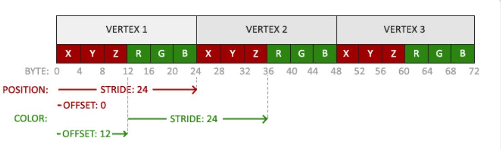
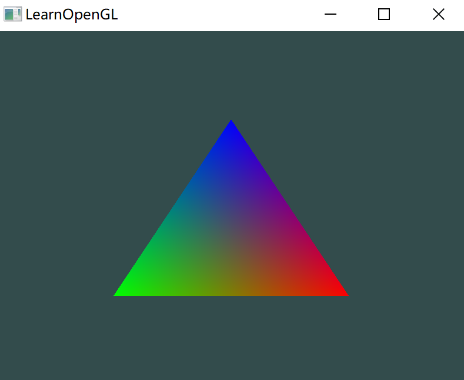
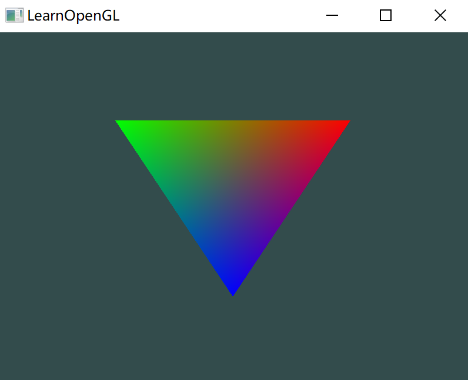
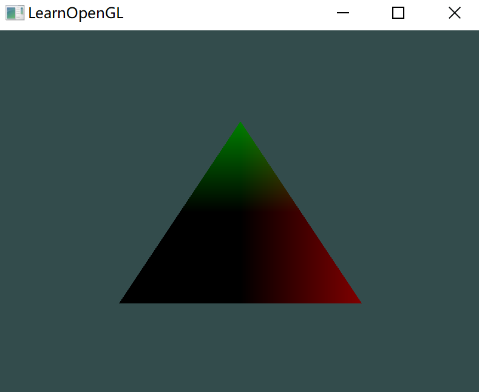

# 着色器

着色器(Shader)是运行在GPU上的小程序。这些小程序为图形渲染管线的某个特定部分而运行。

色器只是一种把输入转化为输出的程序。其非常独立，之间不能相互通信，唯一的沟通只有通过输入和输出。


## GLSL

着色器是使用一种叫 GLSL 的类 C 语言写成的，为图形计算量身定制，其包含一些针对向量和矩阵操作的有用特性。

着色器的结构：

- 声明版本；
- 输入和输出变量；
- uniform；
- main函数。

每个着色器的入口点都是 main 函数，在其中处理所有的输入变量，并将结果输出到输出变量中。

一个典型的着色器有下面的结构：

````glsl
#version version_number
in type in_variable_name1;
in type in_variable_name2;
    
out type out_variable_name;

uniform type uniform_name;

int main()
{
    // 处理输入并进行一些图形操作
    ...
    // 输出处理的结果输出变量
    out_variable_name = weird_stuff_we_processed;
}
````

特别地，谈论到顶点着色器时，每个输入变量也叫顶点属性(Vertex Attribute)。

能声明的顶点属性是有上限的，它一般由硬件来决定。OpenGL 确保至少有 16 个包含 4 分量的顶点属性可用。可以查询 `GL_MAX_VERTEX_ATTRIBS` 来获取具体的上限：

```c++
int nrAttributes;
glGetIntegerv(GL_MAX_VERTEX_ATTRIBS, &nrAttributes);
std::cout << "Maximum nr of vertex attributes supported: " << nrAttributes << std::endl;
```


## 数据类型

GLSL 包含 C 等其它语言大部分的默认基础数据类型：`int`、`float`、`double`、`uint` 和 `bool`。

GLSL也有两种容器类型：向量(Vector)和矩阵(Matrix)。

### 向量

GLSL 中的向量是一个可以包含有 2、3 或者 4 个分量的容器（像是 2、3、4 个元素的数组），分量的类型可以是前面默认基础类型的任意一个。

它们可以是下面的形式（`n`代表分量的数量）：

| 类型    | 含义                              |
| :------ | :-------------------------------- |
| `vecn`  | 包含`n`个 float 分量的默认向量    |
| `bvecn` | 包含`n`个 bool 分量的向量         |
| `ivecn` | 包含`n`个 int 分量的向量          |
| `uvecn` | 包含`n`个 unsigned int 分量的向量 |
| `dvecn` | 包含`n`个 double 分量的向量       |

一个向量的分量可以通过`vec.x`这种方式获取，`x`是指这个向量的第一个分量。

分别使用`.x`、`.y`、`.z`和`.w`来获取它们的第1、2、3、4个分量。

向量类型可以重组(Swizzling)，允许这样的语法：

````glsl
vec2 someVec;
vec4 differentVec = someVec.xyxx;
vec3 anotherVec = differentVec.zyw;
vec4 otherVec = someVec.xxxx + anotherVec.yxzy;
````

可以使用上面4个字母任意组合来创建一个和原来向量一样长的（同类型）新向量，只要原来向量有那些分量即可；

但不可以从一个容量小的向量获取大的分量，比如对 `vec2` 取 `.z`。

也可以把一个向量作为一个参数传给不同的向量构造函数，以减少需求参数的数量：

```glsl
vec2 vect = vec2(0.5, 0.7);
vec4 result = vec4(vect, 0.0, 0.0);
vec4 otherResult = vec4(result.xyz, 1.0);
```

### 矩阵

之后再介绍


## 输入与输出

GLSL 定义了 `in` 和 `out` 关键字专门来声明着色器的输入输出。

只要一个输出变量与下一个着色器阶段的输入匹配，它就会传递下去。但在顶点和片段着色器中会有点不同。

顶点着色器从顶点数据中直接接收输入。为了定义顶点数据该如何管理，使用 `location` 这一元数据指定输入变量，可以在 CPU 上配置顶点属性。顶点着色器需要为它的输入提供一个额外的`layout`标识，这样才能把它链接到顶点数据。

> 因为要调用 `glVertexAttribPointer` 需要告知 OpenGL 这次配置的是顶点的哪个属性，所以需要在顶点着色器中使用 `layout` 关键字设置某个属性的位置。

另一个例外是片段着色器，它需要一个`vec4`颜色输出变量。如果在片段着色器没有定义输出颜色，OpenGL 会把渲染为黑色（或白色）。

所以，如果需要从一个着色器向另一个着色器发送数据，必须在发送方着色器中声明一个输出，在接收方着色器中声明一个类似的输入。当类型和名字都一样的时候，OpenGL 就会把两个变量链接到一起，就能发送数据（在链接程序对象时完成的）。

举个例子，让顶点着色器为片段着色器决定颜色：

**顶点着色器**：

````glsl
#version 330 core
layout (location = 0) in vec3 aPos;

out vec4 vertexColor;

void main()
{
	gl_Position = vec4(aPos, 1.0);
	vertexColor = vec4(0.5, 0.0, 0.0, 0.0);
}
````

**片段着色器**：

````glsl
#version 330 core
out vec4 FragColor;

in vec4 vertexColor;

void main()
{
    FragColor = vertexColor;
}
````

顶点着色器输出是什么颜色，最后的图形就是什么颜色。


## Uniform

Uniform 是一种从 CPU 中的应用向 GPU 中的着色器发送数据的方式，但 unifor m和顶点属性有些不同：

- 首先，uniform 是全局的(Global)。uniform 变量在每个着色器程序对象中都是独一无二的，而且它可以被着色器程序的任意着色器在任意阶段访问；
- 无论把 uniform 值设置成什么，uniform 会一直保存它们的数据，直到它们被重置或更新；

> uniform 关键字跟 in 与 out 类似，都是对某个变量的修饰，只不过 in、out 表示这个变量是此着色器的输入或输出，而由 uniform 修饰的变量在整个着色程序都是通用的；

可以在一个着色器中添加 `uniform` 关键字来声明一个 GLSL 的 uniform：

````glsl
#version 330 core
out vec4 FragColor;

uniform vec4 ourColor;

void main()
{
    FragColor = ourColor;
}
````

在片段着色器中声明了一个uniform `vec4`的ourColor，并把片段着色器的输出颜色设置为uniform值的内容。

因为 uniform 是全局变量，可以在任何着色器中定义它们，而无需通过顶点着色器作为中介。顶点着色器中不需要这个 uniform，所以不用在那里定义它。

这个 uniform 现在还是空的，还没有给它添加任何数据。

为了设置值，首先需要找到着色器中 uniform 属性的索引/位置值。当得到uniform的索引/位置值后，就可以更新它的值了。

下面让其值随时间改变：

````c++
float timeValue = glfwGetTime();
float greenValue = (sin(timeVale) / 2.0f) + 0.5f;
int vertexColorLocation = glGetUniformLocation(shaderProgram, "ourColor");
glUseProgram(shaderProgram);
glUniform4f(vertexColorLocation, 0.0f, greenValue, 0.0f, 1.0f);
````

- 通过 `glfwGetTime()` 获取运行的秒数；
- 使用sin函数让颜色在 0.0 到 1.0 之间改变，最后将结果储存到 `greenValue` 里；
- 用 `glGetUniformLocation` 查询 uniform ourColor 的位置值，如果返回 -1 表示没有找到；
- 通过 `glUniform4f` 函数设置 uniform 值。注意，查询 uniform 地址不要求之前使用过着色器程序，但是更新一个uniform之前必须先使用程序（调用 `glUseProgram`)。

> OpenGL 是一个C库，不支持类型重载，在函数参数不同的时候就要为其定义新的函数；
>
> `glUniform` 是一个典型例子。这个函数有一个特定的后缀，标识设定的uniform的类型。可能的后缀有：
>
> | 后缀 | 含义                                 |
> | :--- | :----------------------------------- |
> | `f`  | 函数需要一个float作为它的值          |
> | `i`  | 函数需要一个int作为它的值            |
> | `ui` | 函数需要一个unsigned int作为它的值   |
> | `3f` | 函数需要3个float作为它的值           |
> | `fv` | 函数需要一个float向量/数组作为它的值 |
>
> 配置一个 OpenGL 的选项时就可以简单地根据这些规则选择适合数据类型的重载函数。例子中使用了 `4f`，因为 uniform 类型是 `vec4`

在渲染循环中进行颜色渲染，在每次循环计算新颜色值：

```c++
while(!glfwWindowShouldClose(window))
{
    // 输入
    processInput(window);

    // 渲染
    // 清除颜色缓冲
    glClearColor(0.2f, 0.3f, 0.3f, 1.0f);
    glClear(GL_COLOR_BUFFER_BIT);

    // 记得激活着色器
    glUseProgram(shaderProgram);

    // 更新uniform颜色
    float timeValue = glfwGetTime();
    float greenValue = sin(timeValue) / 2.0f + 0.5f;
    int vertexColorLocation = glGetUniformLocation(shaderProgram, "ourColor");
    glUniform4f(vertexColorLocation, 0.0f, greenValue, 0.0f, 1.0f);

    // 绘制三角形
    glBindVertexArray(VAO);
    glDrawArrays(GL_TRIANGLES, 0, 3);

    // 交换缓冲并查询IO事件
    glfwSwapBuffers(window);
    glfwPollEvents();
}
```


## 更多属性

之前的顶点数据只包含了坐标，现在增加颜色信息：

````c++
float vertices[] = {
    // 位置              // 颜色
     0.5f, -0.5f, 0.0f,  1.0f, 0.0f, 0.0f,   // 右下
    -0.5f, -0.5f, 0.0f,  0.0f, 1.0f, 0.0f,   // 左下
     0.0f,  0.5f, 0.0f,  0.0f, 0.0f, 1.0f    // 顶部
};
````

由于现在有更多的数据要发送到顶点着色器，要去调整一下顶点着色器，使它能够接收颜色值作为一个顶点属性输入。

用`layout`标识符来把 aColor 属性的位置值设置为1：

````glsl
#version 330 core
layout (location = 0) in vec3 aPos;
layout (location = 1) in vec3 aColor;

out vec3 ourColor;

void main()
{
    gl_Position = vec4(aPos, 1.0);
    ourColor = aColor;
}
````

再对片段着色器：

````glsl
#version 330 core
out vec4 FragColor;
int vec3 ourColor;

void main()
{
    FragColor = vec4(ourColor, 1.0);
}
````

那么此时一个顶点数据就包含了 6 个 `float`：



并且有两个输入，所以需要设置两次 VBO 内存，配置两个顶点属性指针：

````cpp
// 位置属性
glVertexAttribPointer(0, 3, GL_FLOAT, GL_FALSE, 6 * sizeof(float), (void*)0);
glEnableVertexAttribArray(0);
// 颜色属性
glVertexAttribPointer(1, 3, GL_FLOAT, GL_FALSE, 6 * sizeof(float), (void*)(3 * sizeof(float)));
glEnableVertexAttribArray(1);
````

意思就是：

- 对顶点着色器 0 号属性，每个顶点占 3 个 `GL_FLOAT` 类型数据，顶点数据之间的间隔为 `6 * sizeof(float)`，0 号数据从内存 0 偏移开始；

  知道这样，OpenGL 得到一段数据内存后，对 0 个顶点数据，就从内存的 0 偏移开始，往后数 3 个 `float` 读取作为第一个顶点属性。对第二个，就在 0 偏移上增加 `6 * sizeof(float)`，作为 1 号顶点的起始数据，往后读取 3 个 `float`，以此类推；

  所以对照 GLSL 描述，得到的三个 `float` 就可以作为 0 号属性输入： `aPos` 的 3 个分量赋值给 `gl_Position`！

- 对顶点着色器 1 号属性，每个顶点占 3 个 `GL_FLOAT` 类型数据，顶点数据之间的间隔为 `6 * sizeof(float)`，0 号数据从内存 `(3 * sizeof(float))` 偏移开始；

  读取过程跟 0 号属性类型；

输出的结果：



虽然只提供了三种颜色，但最后的结果却是类似调色板的效果。

这是在片段着色器中进行的所谓片段插值(Fragment Interpolation)的结果。当渲染一个三角形时，光栅化(Rasterization)阶段通常会造成比原指定顶点更多的片段。光栅会根据每个片段在三角形形状上所处相对位置决定这些片段的位置。

基于这些位置，它会插值(Interpolate)所有片段着色器的输入变量。

比如说，有一个线段，上面的端点是绿色的，下面的端点是蓝色的。如果一个片段着色器在线段的70%的位置运行，它的颜色输入属性就会是一个绿色和蓝色的线性结合；更精确地说就是30%蓝 + 70%绿。

这正是在这个三角形中发生了什么。有3个顶点，3个颜色，从这个三角形的像素来看它可能包含50000左右的片段，片段着色器为这些像素进行插值颜色：红首先变成到紫再变为蓝色。片段插值会被应用到片段着色器的所有输入属性上。


## 着色器类

写一个类从硬盘读取着色器，然后编译并链接它们，并对它们进行错误检测；

头文件：

```c++
#ifndef SHADER_H
#define SHADER_H

#include <glad/glad.h>; // 包含glad来获取所有的必须OpenGL头文件

#include <string>
#include <fstream>
#include <sstream>
#include <iostream>


class Shader
{
public:
    // 程序ID
    unsigned int ID;

    // 构造器读取并构建着色器
    Shader(const char* vertexPath, const char* fragmentPath);
    // 使用/激活程序
    void use();
    // uniform工具函数
    void setBool(const std::string &name, bool value) const;  
    void setInt(const std::string &name, int value) const;   
    void setFloat(const std::string &name, float value) const;
};

#endif
```


## 练习

1. 修改顶点着色器让三角形上下颠倒；

   

   将输入的 y 坐标取反即可：

   ```glsl
       gl_Position = vec4(aPos.x, -1.0 * aPos.y, aPos.z, 1.0);
   ```

2. 使用 uniform 定义一个水平偏移量，在顶点着色器中使用这个偏移量把三角形移动到屏幕右侧；

   ```
   #version 330 core
   
   layout (location = 0) in vec3 aPos;
   layout (location = 1) in vec3 aColor;
   
   out vec3 ourColor;
   
   uniform float bias;
   
   void main()
   {
       gl_Position = vec4(aPos.x + bias, aPos.y, aPos.z, 1.0);
       ourColor = aColor;
   }
   ```

   在循环中，不断修改 bias 即可；

3. 使用`out`关键字把顶点位置输出到片段着色器，并将片段的颜色设置为与顶点位置相等（来看看连顶点位置值都在三角形中被插值的结果）。做完这些后，尝试回答下面的问题：为什么在三角形的左下角是黑的?

   

   左下角 x，y 坐标负数，相当于 0，颜色 0，0，0 表示黑色；