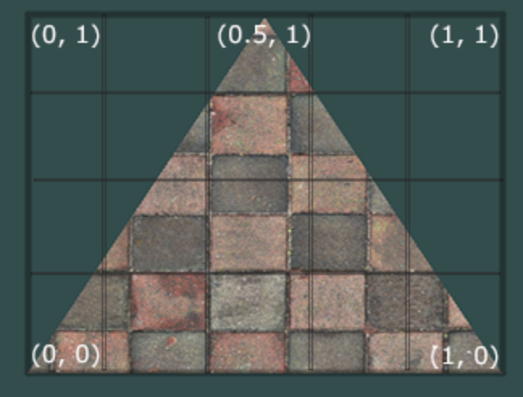
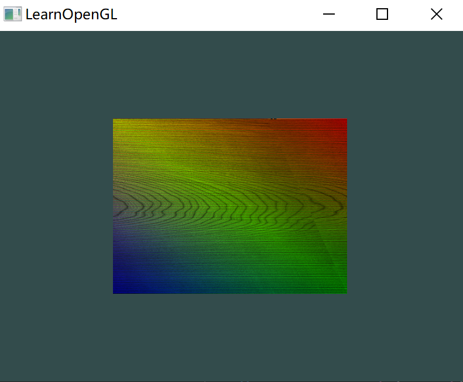

# 纹理

纹理是一个2D图片（甚至也有1D和3D的纹理），它可以用来添加物体的细节；

> 除了图像以外，纹理也可以被用来储存大量的数据

例如这样的效果：


为了能够把纹理映射(Map)到三角形上，需要指定三角形的每个顶点各自对应纹理的哪个部分。

这样每个顶点就会关联着一个纹理坐标(Texture Coordinate)，用来标明该从纹理图像的哪个部分采样。之后在图形的其它片段上进行片段插值(Fragment Interpolation)。

纹理坐标在 x 和 y 轴上，范围为 0 到 1 之间（2D纹理图像）。使用纹理坐标获取纹理颜色叫做采样(Sampling)。纹理坐标起始于(0, 0)，也就是纹理图片的左下角，终始于(1, 1)，即纹理图片的右上角。

下面的图片把纹理坐标映射到三角形上的：



为三角形指定了3个纹理坐标点：

- 希望三角形的左下角对应纹理的左下角，因此把三角形左下角顶点的纹理坐标设置为(0, 0)；
- 上顶点对应于图片的上中位置，所以把它的纹理坐标设置为(0.5, 1.0)；
- 同理右下方的顶点设置为(1, 0)。

> 意思是原来纹理是一张完整的长方形图片，在其中选择三个点连起来形成图案，其他部分纹理去掉，就剩下了这个带纹理的三角形。

只要给顶点着色器传递这三个纹理坐标就行了，接下来它们会被传片段着色器中，它会为每个片段进行纹理坐标的插值。

````c
float texCoords[] = {
    0.0f, 0.0f, // 左下角
    1.0f, 0.0f, // 右下角
    0.5f, 1.0f // 上中
};
````

对纹理采样的解释非常宽松，它可以采用几种不同的插值方式，需要告诉OpenGL该怎样对纹理采样。


## 纹理环绕方式

纹理坐标的范围通常是从(0, 0)到(1, 1)，如果超过这个范围，OpenGL 默认会重复这个纹理图像，但还有其他选择：

| 环绕方式           | 描述                                                         |
| :----------------- | :----------------------------------------------------------- |
| GL_REPEAT          | 对纹理的默认行为。重复纹理图像。                             |
| GL_MIRRORED_REPEAT | 和GL_REPEAT一样，但每次重复图片是镜像放置的。                |
| GL_CLAMP_TO_EDGE   | 纹理坐标会被约束在0到1之间，超出的部分会重复纹理坐标的边缘，产生一种边缘被拉伸的效果。 |
| GL_CLAMP_TO_BORDER | 超出的坐标为用户指定的边缘颜色。                             |

以下为这种环绕方式的例子：


选项的设置方式是通过函数 `glTexParameter*` 对单独的一个坐标轴设置（2D 纹理有两个轴：`s`、`t`，3D 就有三个，多一个 `r`）：

````c++
glTexParamteri(GL_TEXTURE_2D, GL_TEXTURE_WRAP_S, GL_MIRRORED_REPEAT);
glTexParamteri(GL_TEXTURE_2D, GL_TEXTURE_WRAP_T, GL_MIRRORED_REPEAT);
````

- 参数一：指定设置纹理的类型，使用 2D 传入 `GL_TEXTURE_2D`；
- 参数二：指定对某个轴设置哪个参数，这里输入 `GL_TEXTURE_WRAP_S`，表示对 `S` 轴设置 `WARP` ，`WARP` 表示 Wrapping：设置环绕方式；
- 参数三：传入设置的环绕方式；

如果选择了 `GL_CLAMP_TO_BORDER` 方式，还需要指定超出返回的颜色：

````c++
float borderColor[] = { 1.0f, 1.0f, 0.0f, 1.0f };
glTexParameterfv(GL_TEXTURE_2D, GL_TEXTURE_BORDER_COLOR, borderColor);
````

这里使用的是 `glTexParameter` 的 `fv` 后缀版本，表示参数是 `float vec` 类型，之前哪个是 `i` 整形。

并且传入的第二个参数是：`GL_TEXTURE_BORDER_COLOR` 表示设置的是超出范围的颜色。


## 纹理过滤

纹理坐标不依赖于分辨率(Resolution)，它可以是任意浮点值。

所以 OpenGL 需要知道怎样将纹理像素(Texture Pixel，也叫Texel)映射到纹理坐标。OpenGL 也有对于纹理过滤(Texture Filtering)的选项。

> 就是说原纹理的分辨率是固定的，但如果要把纹理缩小，那么其实际显示的分辨率就小于原图，那么可能多个原图的像素需要合成为一个像素；

纹理过滤有很多个选项，只讨论最重要的两种：`GL_NEAREST` 和 `GL_LINEAR`。

> Texture Pixel也叫Texel，一张`.jpg`格式图片是由无数像素点组成的，这个点就是纹理像素；
>
> 不要和纹理坐标搞混，纹理坐标是给模型顶点设置的那个数组，OpenGL 以这个顶点的纹理坐标数据去查找纹理图像上的像素，然后进行采样提取纹理像素的颜色。

### `GL_NEAREST`

GL_NEAREST（也叫邻近过滤，Nearest Neighbor Filtering）是OpenGL默认的纹理过滤方式。

选择中心点最接近纹理坐标的那个像素：


### `GL_LINEAR`

GL_LINEAR（也叫线性过滤，(Bi)linear Filtering）它会基于纹理坐标附近的纹理像素，计算出一个插值，近似出这些纹理像素之间的颜色。

一个纹理像素的中心距离纹理坐标越近，那么这个纹理像素的颜色对最终的样本颜色的贡献越大：


### 差别

显然，`GL)NEAREST` 过滤的图片更加颗粒，而 `GL_LINEAR` 会更平滑：


当进行放大(Magnify)和缩小(Minify)操作的时候可以设置纹理过滤的选项，比如你可以在纹理被缩小的时候使用邻近过滤，被放大时使用线性过滤。

使用的还是 `glTexParamter` 函数，带后缀 `i`：

````c++
glTexParameteri(GL_TEXTURE_2D, GL_TEXTURE_MIN_FILTER, GL_NEAREST);
glTexParameteri(GL_TEXTURE_2D, GL_TEXTURE_MAG_FILTER, GL_LINEAR);
````


## 多级渐远纹理

如果一张高分辨率的图片需要缩很小，那么就会使得很多点才计算一个像素，使得产生不真实的感觉。

OpenGL 使用一种叫做多级渐远纹理(Mipmap)的概念来解决这个问题，就是一系列的纹理图像，后一个纹理图像是前一个的二分之一。

多级渐远纹理背后的理念很简单：距观察者的距离超过一定的阈值，OpenGL 会使用不同的多级渐远纹理，即最适合物体的距离的那个。


使用 `glGenerateMipmaps` 函数对一个纹理创造一系列多级渐远纹理。

在渲染中切换多级渐远纹理级别(Level)时，OpenGL 在两个不同级别的多级渐远纹理层之间会产生不真实的生硬边界。就像普通的纹理过滤一样，切换多级渐远纹理级别时可以在两个不同多级渐远纹理级别之间使用NEAREST和LINEAR过滤。

| 过滤方式                  | 描述                                                         |
| :------------------------ | :----------------------------------------------------------- |
| GL_NEAREST_MIPMAP_NEAREST | 使用最邻近的多级渐远纹理来匹配像素大小，并使用邻近插值进行纹理采样 |
| GL_LINEAR_MIPMAP_NEAREST  | 使用最邻近的多级渐远纹理级别，并使用线性插值进行采样         |
| GL_NEAREST_MIPMAP_LINEAR  | 在两个最匹配像素大小的多级渐远纹理之间进行线性插值，使用邻近插值进行采样 |
| GL_LINEAR_MIPMAP_LINEAR   | 在两个邻近的多级渐远纹理之间使用线性插值，并使用线性插值进行采样 |

可以使用 `glTexParameteri` 将过滤方式设置为前面四种提到的方法之一：

````c++
glTexParameteri(GL_TEXTURE_2D, GL_TEXTURE_MIN_FILTER, GL_LINEAR_MIPMAP_LINEAR);
glTexParameteri(GL_TEXTURE_2D, GL_TEXTURE_MAG_FILTER, GL_LINEAR);
````

一个常见的错误是，将放大过滤的选项设置为多级渐远纹理过滤选项之一。

这样没有任何效果，因为多级渐远纹理主要是使用在纹理被缩小的情况下的：纹理放大不会使用多级渐远纹理，为放大过滤设置多级渐远纹理的选项会产生一个GL_INVALID_ENUM错误代码。


## 加载与创建纹理

不同的图片格式有不同存储数据的方式，要读取它们比较麻烦，`stb_image.h` 库可以解决这个问题。

在[这里]([nothings/stb: stb single-file public domain libraries for C/C++ (github.com)](https://github.com/nothings/stb))下载头文件，在某个 .cpp 文件中增加：

````c++
#define STB_IMAGE_IMPLEMENTATION
#include "stb_image.h"
````

就可以使用了。

加载一个图片，使用库中的 `stbi_load` 函数：

```c++
int width, height, nrChannels;
unsigned char* data = stbi_load("xxx.xxx", &width, &height, &nrChannels, 0);
```

接收一个图片路径，之后三个 `int*` 作为传出参数，将图片的宽度、高度和通道数量设置号，最后返回图片数据。


## 生成纹理

创建纹理跟使用 ID 引用：

````c++
unsigned int texture;
glGenTextures(1, &texture);
````

跟创建 VBO 等差不多，`glGen` 函数换了一个。

类似的，使用纹理也需要绑定，并且绑定某个纹理后，之后任何对纹理的命令都是针对当前的绑定的纹理。

````c++
glBindTexture(GL_TEXTURE_2D, texture);
````

绑定好后，给这个纹理传入数据：

````c++
glTexImage2D(GL_TEXTURE_2D, 0, GL_RGB, width, hright, 0, GL_RGB, GL_UNSIGNED_BYTE, data);
glGenerateMipmap(GL_TEXTURE_2D);
````

- 参数一：指定了纹理目标(Target)。设置为 `GL_TEXTURE_2D` 意味着会生成与当前绑定的纹理对象在同一个目标上的纹理（任何绑定到GL_TEXTURE_1D和GL_TEXTURE_3D的纹理不会受到影响）；
- 参数二：指定多级渐远纹理的级别，填0，表示要创建基本级别；
- 参数三：表示生成的纹理被保存的格式。这里是 `RGB` 格式；
- 参数四、五：表示最终纹理的宽度与高度；
- 参数六：总是 0（历史遗留）；
- 参数七、八：定义图片数据的格式与数据类型，选择 `RGB`，数据是 `unsigned byte` 类型；
- 参数九：图像数据首地址；

当调用 `glTexImage2D` 时，当前绑定的纹理对象就会被附加上纹理图像。

然而，目前只有基本级别(Base-level)的纹理图像被加载了，如果要使用多级渐远纹理，需要手动设置所有不同的图像（不断递增第二个参数）。

或者，直接在生成纹理之后调用 `glGenerateMipmap`，为当前绑定的纹理自动生成所有需要的多级渐远纹理。

最后释放图像的内存：

````c++
stbi_image_free(data);
````

生成一个纹理的整体流程：

````c++
unsigned int texture;
glGenTextures(1, &texture);
glBindTexture(GL_TEXTURE_2D, texture);
// 为当前绑定的纹理对象设置环绕、过滤方式
glTexParameteri(GL_TEXTURE_2D, GL_TEXTURE_WRAP_S, GL_REPEAT);   
glTexParameteri(GL_TEXTURE_2D, GL_TEXTURE_WRAP_T, GL_REPEAT);
glTexParameteri(GL_TEXTURE_2D, GL_TEXTURE_MIN_FILTER, GL_LINEAR);
glTexParameteri(GL_TEXTURE_2D, GL_TEXTURE_MAG_FILTER, GL_LINEAR);
// 加载并生成纹理
int width, height, nrChannels;
unsigned char *data = stbi_load("container.jpg", &width, &height, &nrChannels, 0);
if (data)
{
    glTexImage2D(GL_TEXTURE_2D, 0, GL_RGB, width, height, 0, GL_RGB, GL_UNSIGNED_BYTE, data);
    glGenerateMipmap(GL_TEXTURE_2D);
}
else
{
    std::cout << "Failed to load texture" << std::endl;
}
stbi_image_free(data);
````


## 使用纹理

有了纹理之后，一个顶点的数据需要再增加：

````c++
float vertices[] = {
//     ---- 位置 ----       ---- 颜色 ----     - 纹理坐标 -
     0.5f,  0.5f, 0.0f,   1.0f, 0.0f, 0.0f,   1.0f, 1.0f,   // 右上
     0.5f, -0.5f, 0.0f,   0.0f, 1.0f, 0.0f,   1.0f, 0.0f,   // 右下
    -0.5f, -0.5f, 0.0f,   0.0f, 0.0f, 1.0f,   0.0f, 0.0f,   // 左下
    -0.5f,  0.5f, 0.0f,   1.0f, 1.0f, 0.0f,   0.0f, 1.0f    // 左上
};
````

显然，就需要修改属性指针：


````c++
glVertexAttribPointer(2, 2, GL_FLOAT, GL_FALSE, 8 * sizeof(float), (void*)(6 * sizoef(float)));
glEnableVertexAttribArray(2);
````

就不再解释了。

同样对顶点着色器，也需要修改：

````glsl
#version 330 core
layout (location = 0) in vec3 aPos;
layout (location = 1) in vec3 aColor;
layout (location = 2) in vec2 aTexCoord;

out vec3 ourColor;
out vec2 TexCoord;

void main()
{
	gl_Position = vec4(aPos, 1.0);
	ourColor =aColor;
	TexCoord = aTexCoord;
}
````

那么片段着色器应该将 `TexCoord` 作为输入。

而片段着色器还需要知道纹理的数据，GLSL有一个供纹理对象使用的内建数据类型，叫做采样器(Sampler)，它以纹理类型作为后缀，比如`sampler1D`、`sampler3D`。这里使用 `sampler2D`，声明一个 `uniform` 类型：

````glsl
#version 330 core
out vec4 FragColor;

in vec3 ourColor;
in vec2 TexCoord;

uniform sampler2D ourTexture;

void main()
{
    FragColor = texture(ourTexture, TexCoord);
}
````

在程序中将纹理数据传入到 `ourTexture` 变量中；

对 `FragColor` 的赋值，采样 `texture` 函数：

- 参数一：表示纹理采样器；
- 参数二：对应的纹理坐标。

最后在使用渲染循环中，绑定纹理对象，OpenGL 会自动将纹理赋值给 `smapler2D` 的变量 `outTexture`：

````c++
glBindTexture(GL_TEXTURE_2D, texture);
glBindVertexArray(VAO);
glDrawElements(GL_TRIANGLES, 6, GL_UNSIGNED_INT, 0);
````

最后输出：


还可以把得到的纹理颜色与顶点颜色混合，来获得更有趣的效果。只需把纹理颜色与顶点颜色在片段着色器中相乘来混合二者的颜色：

````glsl
FragColor = texture(ourTexture, TexCoord) * vec4(ourColor, 1.0);
````




## 纹理单元

在例子中，并没有给 `ourTexture` 这个 `uniform` 变量使用 `glUniform` 赋值，OpenGL 自动完成了传递数据过程。那么如果一个着色器有多个 `smapler2D` 怎么办，OpenGL 如何选择传递？

可以使用函数 `glUniformli` 给某个纹理分采样器分配一个位置，可以通过位置值给指定的纹理采样器赋值，这个位置就称为一个纹理单元。

传递过程中，默认的纹理单元是 0，所以只有一个文件采样器的时候就不需要指定。

纹理单元的主要目的是在着色器中可以使用多于一个的纹理。

通过把指定纹理单元赋值给指定采样器，可以一次绑定多个纹理：

````c++
glActiveTexture(GL_TEXTURE0);
glBindTexture(GL_TEXTURE_2D, texture);
````

- 首先调用 `glActiveTexture` 激活了指定纹理单元的纹理采样器；
- 再调用 `glBindTexture` 绑定，那么 `texture` 这个纹理的纹理单元就是 `GL_TEXTURE0`，而此纹理单元是默认激活的；

> OpenGL 至少有 16 个纹理单元，可以激活从 `GL_TEXTURE0` 到`GL_TEXTRUE15`。
>
> 它们都是按顺序定义的，也可以通过 `GL_TEXTURE0 + 8` 的方式获得`GL_TEXTURE8`，这在需要循环一些纹理单元的时候会很有用。

所以可以在片段着色器定义两个采样器：

````glsl
#version 330 core
...

uniform sampler2D texture1;
uniform sampler2D texture2;

void main()
{
    FragColor = mix(texture(texture1, TexCoord), texture(texture2, TexCoord), 0.2);
}
````

最终输出颜色现在是两个纹理的结合。

GLSL 内建的 `mix` 函数需要接受两个值作为参数，并对它们根据第三个参数进行线性插值。

- 如果第三个值是`0.0`，它会返回第一个输入；
- 如果是`1.0`，会返回第二个输入值；
- `0.2`会返回`80%`的第一个输入颜色和`20%`的第二个输入颜色，即返回两个纹理的混合色。

需要再创建一个纹理对象使用。

为了使用两个纹理，需要改变渲染流程，先绑定两个纹理到对应的纹理单元，然后定义哪个uniform采样器对应哪个纹理单元：

````c++
glActiveTexture(GL_TEXTURE0);
glBindTexture(GL_TEXTURE_2D, texture1);
glActiveTexture(GL_TEXTURE1);
glBindTexture(GL_TEXTURE_2D, texture2);

glBindVertexArray(VAO);
glDrawElements(GL_TRIANGLES, 6, GL_UNSIGNED_INT, 0);
````

还要通过使用 `glUniform1i` 设置每个采样器的方式告诉 OpenGL 每个着色器采样器属于哪个纹理单元。

只需要设置一次即可，所以这个会放在渲染循环的前面：

```c++
ourShader.use(); // 不要忘记在设置uniform变量之前激活着色器程序！
glUniform1i(glGetUniformLocation(ourShader.ID, "texture1"), 0); // 手动设置
ourShader.setInt("texture2", 1); // 或者使用着色器类设置
```

> 从这里可以看出，`uniform sampler2D texture1;` 本质上定义了一个整形，指向若干个纹理中的一个；

最后输出：


纹理被上下颠倒了，因为 OpenGL 要求 y 轴 0.0 坐标再图片底部，但图片的 y 坐标在顶部。所以两个纹理都被上下颠倒。

`stb_image.h`能够在图像加载时翻转y轴，只需要在加载任何图像前加入以下语句即可：

````c++
stbi_set_flip_vertically_on_load(true);
````

修改后得到：


## 练习

- 修改片段着色器，**仅**让笑脸图案朝另一个方向看；

  

  > 这里用其他图案，注意方形图案就可以了；

  修改片段着色器，让 texture2 的纹理坐标 x 取反：

  ````glsl
  void main()
  {
      vec2 turnTexCoord = vec2(-1.0 * ourTexCoord.x, ourTexCoord.y);
      FragColor = mix(texture(texture1, ourTexCoord), texture(texture2, turnTexCoord), 0.5);
  }

- 尝试用不同的纹理环绕方式，设定一个从`0.0f`到`2.0f`范围内的（而不是原来的`0.0f`到`1.0f`）纹理坐标。试试看能不能在箱子的角落放置4个笑脸。记得一定要试试其它的环绕方式。

  四个盒子：

  

  这里还是不用笑脸：

  

  可以看到，纹理 2 在纹理 1 的四个角；

  实现也很容易，对纹理 1 使用的是 `GL_CLAMP_TO_BORDER` 环绕，当坐标设置到 (0, 1) 之外，就可以使得显示的图像缩小；

  对纹理 2 采样的是重复环绕，坐标设置到 (0,0) 到 (2, 2)就可以实现四个图像的效果；

  那么现在两个纹理的坐标其实不一样了，所以需要修改顶点数据：

  ````c++
  float vertices[] = {
  //     ---- 位置 ----       ---- 颜色 ----     - 纹理 1 坐标 -    - 纹理 2 坐标 -
       0.5f,  0.5f, 0.0f,   1.0f, 0.0f, 0.0f,   1.5f, 1.5f,      2.0f, 2.0f,   // 右上
       0.5f, -0.5f, 0.0f,   0.0f, 1.0f, 0.0f,   1.5f, -0.5f,     2.0f, 0.0f,   // 右下
      -0.5f, -0.5f, 0.0f,   0.0f, 0.0f, 1.0f,   -0.5f, -0.5f,    0.0f, 0.0f,   // 左下
      -0.5f,  0.5f, 0.0f,   1.0f, 1.0f, 0.0f,   -0.5f, 1.5f,     0.0f, 2.0f    // 左上
  };
  ````

  同时要改变顶点着色器、增加一个属性指针等，将对应的坐标设置到对应的纹理上即可：

  ````glsl
  #version 330 core
  
  in vec3 ourColor;
  in vec2 ourTex1Coord;
  in vec2 ourTex2Coord;
  
  out vec4 FragColor;
  
  uniform sampler2D texture1;
  uniform sampler2D texture2;
  
  uniform sampler2D ourTexture;
  
  void main()
  {
      FragColor = mix(texture(texture1, ourTex1Coord), texture(texture2, ourTex2Coord), 0.3);
  }

- 尝试在矩形上只显示纹理图像的中间一部分，修改纹理坐标，达到能看见单个的像素的效果。尝试使用GL_NEAREST的纹理过滤方式让像素显示得更清晰：

  

  

  两种过滤方式效果差别明显；

- 使用一个uniform变量作为mix函数的第三个参数来改变两个纹理可见度，使用上和下键来改变箱子或笑脸的可见度：

  

  

  这个比较容易，注意设置 `uniform` 变量的时候类型要匹配；
