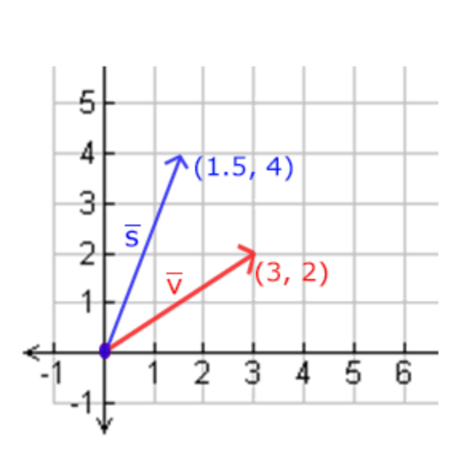
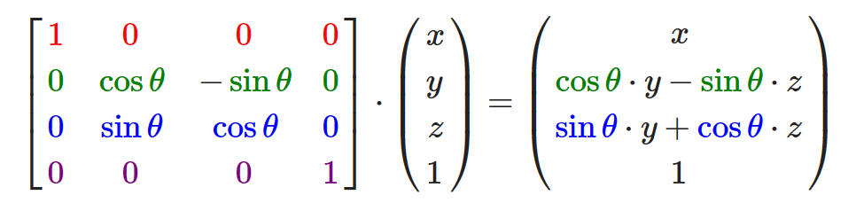

# 变换

学习一些最基础的数学背景知识。简单介绍，这里写的很简略。

## 向量

向量（矢量）最基本的定义就是一个方向。或者更正式的说，向量有一个方向(Direction)和大小(Magnitude，也叫做强度或长度)。如图：


由于向量表示的是方向，起始于何处并不会改变它的值。所以 $\overline w $ 与 $\overline v$ 是同一个向量。

向量可以使用如下数学表达式：
$$
\overline v = 
\begin{pmatrix}
	
x  \\ y \\z

\end{pmatrix}
$$
由于向量是一个方向，为了让其更为直观，通常设定这个方向的原点为(0, 0, 0)，然后指向一个方向，对应一个点，使其变为位置向量(Position Vector)。


## 向量与标量运算

标量(Scalar)只是一个数字（或者说是仅有一个分量的向量）。

当把一个向量加/减/乘/除一个标量，可以简单的把向量的每个分量分别进行该运算。对于加法来说会像这样：
$$
\begin{pmatrix}
	
1\\2\\3 

\end{pmatrix} + x = 
\begin{pmatrix}
1 + x\\
2 + x\\
3 + x\\
\end{pmatrix}
$$
其中的运算符号可以是 $-$、$\cdot$  或者 ÷。

> 注意，数学上是没有向量与标量相加这个运算的，但是很多线性代数的库都对它有支持


## 向量取反

对一个向量取反(Negate)会将其方向逆转。在一个向量的每个分量前加负号就可以实现取反：
$$
-\overline v = -\begin{pmatrix}
	
v_x\\v_y\\v_z  

\end{pmatrix}

= 
\begin{pmatrix}
	
-v_x\\-v_y\\-v_z 

\end{pmatrix}
$$


## 向量加减

向量的加法可以被定义为是分量的(Component-wise)相加，即将一个向量中的每一个分量加上另一个向量的对应分量：
$$
\overline v =
\begin{pmatrix}	
1\\2\\3 
\end{pmatrix},~~
\overline k =
\begin{pmatrix}	
4\\5\\6 
\end{pmatrix} \to
\overline v + \overline k =
\begin{pmatrix}	
 1 + 4 \\2 + 5\\3 + 6 
\end{pmatrix}
= \begin{pmatrix}	
5\\7\\9 
\end{pmatrix}
$$
向量`v = (4, 2)`和`k = (1, 2)`可以直观地表示为：


就像普通数字的加减一样，向量的减法等于加上第二个向量的相反向量：
$$
\overline v =
\begin{pmatrix}	
1\\2\\3 
\end{pmatrix},~~
\overline k =
\begin{pmatrix}	
4\\5\\6 
\end{pmatrix} \to
\overline v - \overline k =
\begin{pmatrix}	
 1 - 4 \\2 - 5\\3 - 6 
\end{pmatrix}
= \begin{pmatrix}	
-3\\-3\\-3 
\end{pmatrix}
$$
两个向量的相减会得到这两个向量指向位置的差。这在我们想要获取两点的差会非常有用：


## 长度

使用勾股定理(Pythagoras Theorem)来获取向量的长度(Length)/大小(Magnitude)：


不止对二维平面，对 n 维度空间也是成立的，向量的长度等于各个维度分量平方和开根号。

有一个特殊类型的向量叫做单位向量(Unit Vector)，它的长度是 1。

对某个向量可以利用下面的公式计算单位向量：
$$
\frac{\overline v}{|v|}
$$
这种方法叫做一个向量的标准化(Normalizing)。


## 向量相乘

向量有两种乘法：

- 点乘：$\overline v \cdot \overline k$；
- 叉乘：$\overline v \times \overline k$。

### 点成

两个向量的点乘等于它们的数乘结果乘以两个向量之间夹角的余弦值：
$$
\overline v \cdot \overline k = |\overline v| \cdot |\overline k | \cdot \text{cos}\theta
$$
其中 $\theta$ 是两向量的夹角；

点乘有一个方便的计算方式：将两个向量的各个分量相乘后相加：
$$
\begin{pmatrix}	
0.6\\-0.8\\0 
\end{pmatrix} \cdot
\begin{pmatrix}	
0\\1\\0 
\end{pmatrix}
 = (0.6 * 0) + (-0.8 + 1) + (0 * 0) = -0.8
$$

### 叉程

叉乘只在3D空间中有定义，它需要两个不平行向量作为输入，生成一个正交于两个输入向量的第三个向量。如果输入的两个向量也是正交的，那么叉乘之后将会产生3个互相正交的向量：


## 矩阵

矩阵就是一个矩形的数字、符号或表达式数组。矩阵中每一项叫做矩阵的元素(Element)。下面是一个2×3矩阵的例子：
$$
\begin{bmatrix}
	
1 & 2 & 3\\
4 & 5 & 5

\end{bmatrix}
$$
矩阵可以通过(i, j)进行索引，i是行，j是列。


## 矩阵的加减

矩阵与标量之间的加减定义如下：


标量值要加到矩阵的每一个元素上。矩阵与标量的减法也相似：


矩阵与矩阵之间的加减就是两个矩阵对应元素的加减运算，只不过在相同索引下的元素才能进行运算。对应位置的元素进行运算：


## 矩阵的数乘

和矩阵与标量的加减一样，矩阵与标量之间的乘法也是矩阵的每一个元素分别乘以该标量：


## 矩阵相乘

两个矩形相乘还有一些限制：

- 只有当左侧矩阵的列数与右侧矩阵的行数相等，两个矩阵才能相乘；
- 矩阵相乘不遵守交换律(Commutative)，也就是说 $A \cdot B \ne B \cdot A$。

例如两个 2 × 2 矩阵：


略过啦~


## 矩阵与向量相乘

向量可以认为一遍是一维度的矩阵。


## 缩放

对一个向量进行缩放(Scaling)就是对向量的长度进行缩放，而保持它的方向不变。

进行 2 维或 3 维操作，可以分别定义一个有 2 或 3 个缩放变量的向量，每个变量缩放一个轴(x、y或z)。

比如对 $\overline v = (3, 2)$，把 x 轴缩放 0.5，y 缩放 2 倍：



OpenGL通常是在 3D 空间进行操作的，对于 2D 的情况把z轴缩放1倍，这样z轴的值就不变了。

上例的缩放操作是不均匀(Non-uniform)缩放，因为每个轴的缩放因子(Scaling Factor)都不一样。如果每个轴的缩放因子都一样那么就叫均匀缩放(Uniform Scale)。

下面构造一个变换矩阵来提供缩放功能：


## 位移

位移(Translation)是在原始向量的基础上加上另一个向量从而获得一个在不同位置的新向量的过程，从而在位移向量基础上**移动**了原始向量。

和缩放矩阵一样，在4×4矩阵上有几个特别的位置用来执行特定的操作，对于位移来说它们是第四列最上面的3个值：


## 旋转

在3D空间中旋转需要定义一个角**和**一个旋转轴(Rotation Axis)。物体会沿着给定的旋转轴旋转特定角度。

> 当2D向量在3D空间中旋转时，把旋转轴设为z轴（尝试想象这种情况）

沿x轴旋转：



沿y轴旋转：


沿z轴旋转：


利用旋转矩阵我们可以把任意位置向量沿一个单位旋转轴进行旋转。也可以将多个矩阵复合，比如先沿着x轴旋转再沿着y轴旋转。

除了利用三个轴旋转的复合，还可以使用对任意轴的方式：


公式中的 $(R_x, R_y, R_z) $ 代表任意旋转轴。


## 矩阵的组合

根据矩阵之间的乘法，可以把多个变换组合到一个矩阵中。

假设有一个顶点(x, y, z)，希望将其缩放2倍，然后位移(1, 2, 3)个单位。这需要使用到缩放矩阵与位移矩阵：


将二者相乘，最后得到一个矩阵。

由于矩阵相乘没有交换律，所以矩形相乘的顺序很重要。要先缩放再位移的话，看必须先写位移矩阵，再写缩放矩阵。因为右边的先跟原矩形结合。

最后用一个矩形计算：


## GLM

OpenGL没有自带任何的矩阵和向量知识，所以必须定义自己的数学类和函数。

GLM是Open**GL** **M**athematics的缩写，它是一个**只有头文件的**库。其大多数的功能都可以从这三个头文件找到：

````c++
#include <glm/glm.hpp>
#include <glm/gtc/matrix_transform.hpp>
#include <glm/gtc/type_ptr.hpp>
````

将(1, 0, 0)位移(1, 1, 0) 个单位：

````c++
glm::vec4 vec(1.0f, 0.0f, 0.0f, 1.0f);
glm::mat4 trans = glm::mat4(1.0f);
// 位移 1, 1, 0
trans = glm::translate(trans, glm::vec3(1.0f, 1.0f, 0.0f));
vec = trans * vec;
std::cout << vec.x << vec.y << vec.z << std::endl;
````

1. 建立一个 `vec` 向量；
2. 定义一个 `mat4` 类型的矩阵 `trans`，默认为 4 * 4 单位矩阵；
3. 创建变换矩阵，将单位矩阵和一个位移向量传递给 `glm::translate` 函数；
4. 最后用变换矩阵 * 向量；

最后输出 210，即 (1,0,0) 移动 (1,1,0) 后的结果。

旋转和缩放之前教程中的那个箱子。先把箱子逆时针旋转90度。然后缩放0.5倍，使它变成原来的一半大：

```c++
glm::mat4 trans = glm::mat4(1.0f);
trans = glm::rotate(trans, glm::radians(90.0f), glm::vec3(0.0, 0.0, 1.0));
trans = glm::scale(trans, glm::vec3(0.5, 0.5, 0.5));
```

使用 `glm::rotate` 获得变换矩阵：

- 参数一：矩阵；
- 参数二：旋转的角度，使用 `glm::radians` 将角度转为弧度；
- 参数三：旋转轴向量；

之后再使用 `glm::scale` 获得缩放的变换矩阵。

> `glm::translate`：移动；
>
> `glm::rotate`：旋转；
>
> `glm::scale`：缩放；

接下来需要把旋转矩阵传递给着色器。可以在着色器定义一个 `mat4` 类型，用 `uniform` 修饰：

```glsl
#version 330 core
layout (location = 0) in vec3 aPos;
layout (location = 1) in vec2 aTexCoord;

out vec2 TexCoord;

uniform mat4 transform;

void main()
{
    gl_Position = transform * vec4(aPso, 1.0f);
    TexCoord = vec2(aTexCoord.x, 1.0 - aTexCoord,y);
}
```

> GLSL 也有 `mat2` 和 `mat3` 类型，从而允许了像向量一样的混合运算。
>
> 前面提到的所有数学运算在矩阵类型里都可以使用。

在程序中，首先查询uniform变量的地址，再用 `Matrix3fv` 后缀的 `glUniform` 函数把矩阵数据发送给着色器：

````c++
unsigned int transformLoc = glGetUniformLocation(ourShader.ID, "transform");
glUniformMatrix4fv(transformLoc, 1, GL_FALSE, glm::value_ptr(trans));
````

`glUniformMatrix4fv` 参数：

- 参数一：查找到的变量位置；
- 参数二：要传递几个矩阵，这里是 1 个；
- 参数三：是否需要对矩形进行转置，这里不需要；
- 参数四：传入矩阵的地址，由 `glm::value_ptr` 获取。

最后输出：


现在让箱子随着时间旋转，只要让旋转角度随着时间变换：

```c++
glm::mat4 trans;
trans = glm::translate(trans, glm::vec3(0.5f, -0.5f, 0.0f));
trans = glm::rotate(trans, (float)glfwGetTime(), glm::vec3(0.0f, 0.0f, 1.0f));
```

还可以让这个旋转的箱子移动，需要在每次循环中增加一个位移：

````c++
glm::mat4 trans = glm::mat4(1.0f);
trans = glm::translate(trans, glm::vec3(distance, distance, distance));
trans = glm::rotate(trans, (float)glfwGetTime(), glm::vec3(0.0, 0.0, 1.0));
distance += 0.0001;
````

因为是先旋转再位移，按照矩形的顺序，定义变换矩阵的时候应该先位移再旋转。


## 练习

- 使用应用在箱子上的最后一个变换，尝试将其改变为先旋转，后位移。看看发生了什么，试着想想为什么会发生这样的事情；

  ````c++
  glm::mat4 trans = glm::mat4(1.0f);
  trans = glm::rotate(trans, (float)glfwGetTime(), glm::vec3(0.0, 0.0, 1.0));
  trans = glm::translate(trans, glm::vec3(distance, distance, distance));
  distance += 0.00001;
  ````

  箱子没有变旋转边直线运动，而是做类似螺线的运动。

  这是因为先求旋转再位移，相当于对箱子先位移再旋转，会把位移的路径也旋转，并且每次旋转角度不一样，所以走的就不是直线。

- 尝试再次调用glDrawElements画出第二个箱子，**只**使用变换将其摆放在不同的位置。让这个箱子被摆放在窗口的左上角，并且会不断的缩放（而不是旋转）。（`sin`函数在这里会很有用，不过注意使用`sin`函数时应用负值会导致物体被翻转）

  ````c++
  glm::mat4 trans = glm::mat4(1.0f);
  trans = glm::translate(trans, glm::vec3(-0.5f, 0.5f, 0));
  float s = abs(sin(glfwGetTime()));
  trans = glm::scale(trans, glm::vec3(s, s, s));
  ````

  