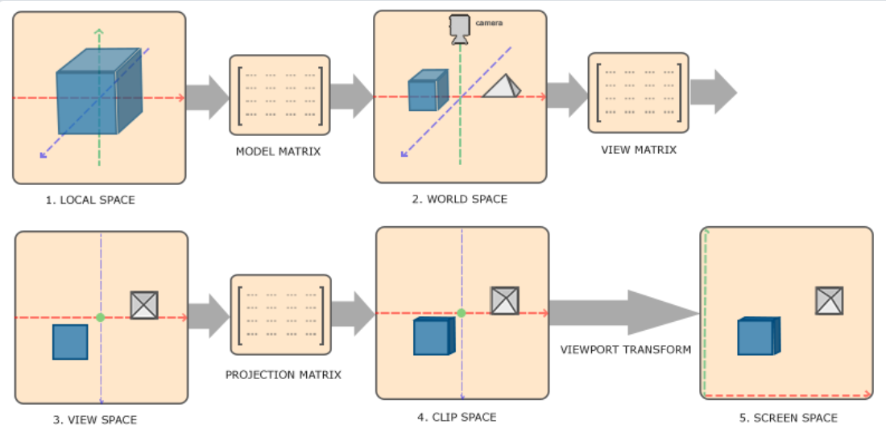
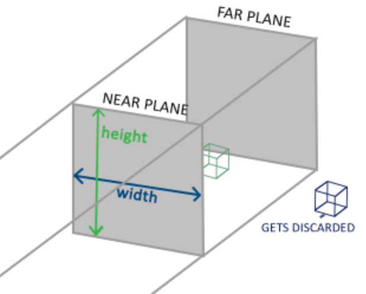
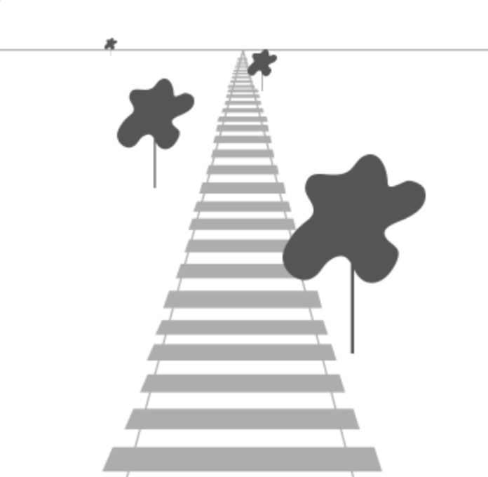
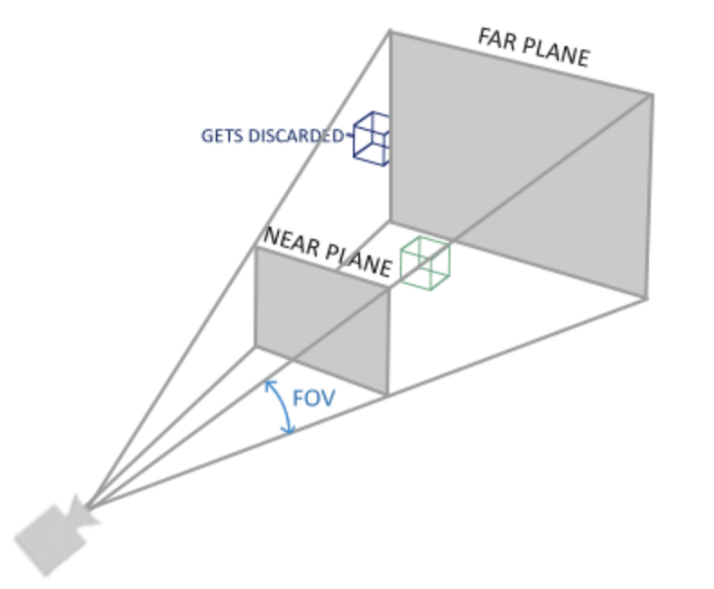
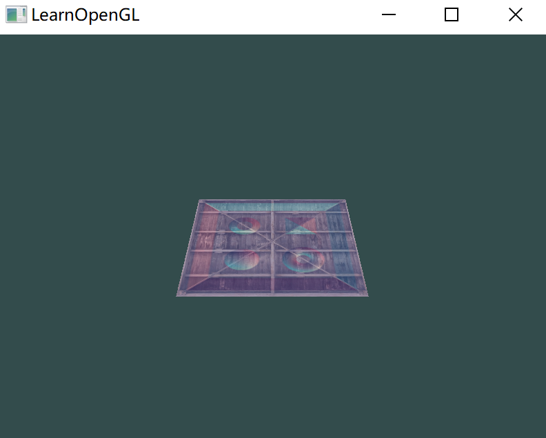
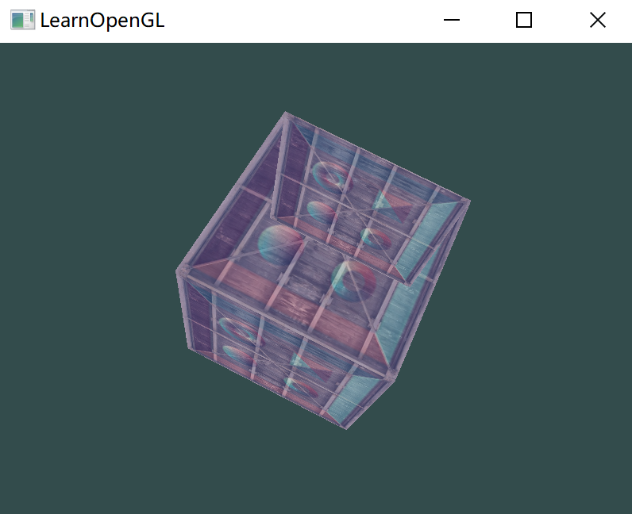
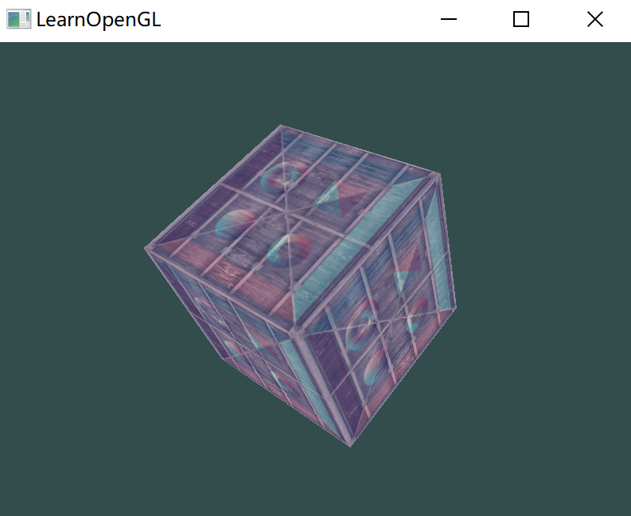
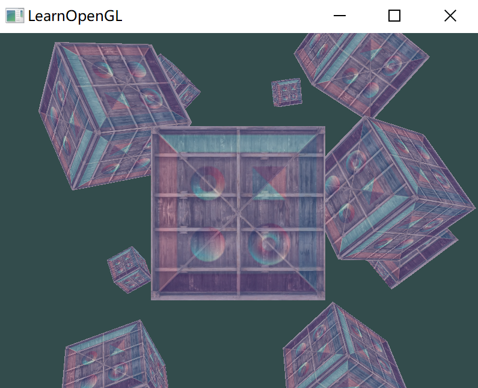

# 坐标系统

## OpenGL 的坐标系统

OpenGL希望在每次顶点着色器运行后，可见的所有顶点都为标准化设备坐标(Normalized Device Coordinate, NDC)。也就是说，每个顶点的**x**，**y**，**z**坐标都应该在**-1.0**到**1.0**之间，超出这个坐标范围的顶点都将不可见。

用户通常会设定一个坐标的范围，之后再在顶点着色器中将这些坐标变换为标准化设备坐标。然后将这些标准化设备坐标传入光栅器(Rasterizer)，将它们变换为屏幕上的二维坐标或像素。

物体的顶点在最终转化为屏幕坐标之前还会被变换到多个坐标系统(Coordinate System)。

将物体的坐标变换到几个过渡坐标系(Intermediate Coordinate System)的优点在于：在这些特定的坐标系统中，一些操作或运算更加方便和容易，这一点很快就会变得很明显。比较重要的总共有5个不同的坐标系统：

- 局部空间(Local Space，或者称为物体空间(Object Space))
- 世界空间(World Space)
- 观察空间(View Space，或者称为视觉空间(Eye Space))
- 裁剪空间(Clip Space)
- 屏幕空间(Screen Space)

这就是一个顶点在最终被转化为片段之前需要经历的所有不同状态。

### 概述

为了将坐标从一个坐标系变换到另一个坐标系，需要用到几个变换矩阵，最重要的几个分别是模型(Model)、观察(View)、投影(Projection)三个矩阵。

顶点坐标起始于局部空间(Local Space)，在这里它称为局部坐标(Local Coordinate)，它在之后会变为世界坐标(World Coordinate)，观察坐标(View Coordinate)，裁剪坐标(Clip Coordinate)，并最后以屏幕坐标(Screen Coordinate)的形式结束。



1. 局部坐标是对象相对于局部原点的坐标，也是物体起始的坐标；

2. 下一步是将局部坐标变换为世界空间坐标，世界空间坐标是处于一个更大的空间范围的；

   这些坐标相对于世界的全局原点，它们会和其它物体一起相对于世界的原点进行摆放；

3. 接下来将世界坐标变换为观察空间坐标，使得每个坐标都是从摄像机或者说观察者的角度进行观察的；

4. 坐标到达观察空间之后，需要将其投影到裁剪坐标。裁剪坐标会被处理至-1.0到1.0的范围内，并判断哪些顶点将会出现在屏幕上；

5. 最后，将裁剪坐标变换为屏幕坐标，使用一个叫做视口变换(Viewport Transform)的过程。视口变换将位于-1.0到1.0范围的坐标变换到由glViewport函数所定义的坐标范围内。最后变换出来的坐标将会送到光栅器，将其转化为片段。

之所以将顶点变换到各个不同的空间的原因是有些操作在特定的坐标系统中才有意义且更方便；

### 局部空间

局部空间是指物体所在的坐标空间，即对象最开始所在的地方。

比如在一个建模软件（比如说Blender）中创建了一个立方体，其原点有可能位于(0, 0, 0)，即便它有可能最后在程序中处于完全不同的位置。甚至有可能所有模型都以(0, 0, 0)为初始位置，然而它们会最终出现在世界的不同位置。

所以，模型的所有顶点都是在**局部**空间中：它们相对于物体来说都是局部的。

那个箱子的顶点是被设定在-0.5到0.5的坐标范围中，(0, 0)是它的原点。这些都是局部坐标。

> 相当于单个物体的空间坐标，这样很容易描述单个物体是什么形状

### 世界空间

对单独的模型使用局部坐标描述后，希望在一个更大的坐标中规定他们各自的位置。

世界空间中的坐标正如其名：是指顶点相对于（游戏）世界的坐标。物体的坐标将会从局部变换到世界空间，该变换由模型矩阵(Model Matrix)实现。

模型矩阵是一种变换矩阵，它能通过对物体进行位移、缩放、旋转来将它置于它本应该在的位置或朝向。

可以将它想像为变换一个房子，先将它缩小（它在局部空间中太大了），并将其位移至郊区的一个小镇，然后在y轴上往左旋转一点以搭配附近的房子。也可以把上一节将箱子到处摆放在场景中用的那个矩阵大致看作一个模型矩阵；将箱子的局部坐标变换到场景/世界中的不同位置。

### 观察空间

规定好这个 “世界” 的模样后，还有一个问题，就是不同的位置看这个世界是不一样的；

观察空间称为 OpenGL 的摄像机(Camera)。

观察空间是将世界空间坐标转化为用户视野前方的坐标而产生的结果。因此观察空间就是从摄像机的视角所观察到的空间。而这通常是由一系列的位移和旋转的组合来完成，平移/旋转场景从而使得特定的对象被变换到摄像机的前方。

这些组合在一起的变换通常存储在一个观察矩阵(View Matrix)里，它被用来将世界坐标变换到观察空间。

### 裁剪空间

在一个顶点着色器运行的最后，OpenGL 期望所有的坐标都能落在一个特定的范围内，且任何在这个范围之外的点都应该被裁剪掉(Clipped)。被裁剪掉的坐标就会被忽略，所以剩下的坐标就将变为屏幕上可见的片段。这也就是裁剪空间(Clip Space)名字的由来。

因为将所有可见的坐标都指定在-1.0到1.0的范围内不是很直观，用户可以指定自己的坐标集(Coordinate Set)并将它变换回标准化设备坐标系。

为了将顶点坐标从观察变换到裁剪空间，需要定义一个投影矩阵(Projection Matrix)，它指定了一个范围的坐标，比如在每个维度上的 -1000 到 1000。投影矩阵接着会将在这个指定的范围内的坐标变换为标准化设备坐标的范围(-1.0, 1.0)。所有在范围外的坐标不会被映射到在-1.0到1.0的范围之间，所以会被裁剪掉。

由投影矩阵创建的**观察箱**(Viewing Box)被称为平截头体(Frustum)，每个出现在平截头体范围内的坐标都会最终出现在用户的屏幕上。

将特定范围内的坐标转化到标准化设备坐标系的过程被称之为投影(Projection)，因为使用投影矩阵能将3D坐标投影(Project)到很容易映射到2D的标准化设备坐标系中。

一旦所有顶点被变换到裁剪空间，最终的操作——透视除法(Perspective Division)将会执行，在这个过程中将位置向量的x，y，z分量分别除以向量的齐次w分量；透视除法是将4D裁剪空间坐标变换为3D标准化设备坐标的过程。这一步会在每一个顶点着色器运行的最后被自动执行。

在这一阶段之后，最终的坐标将会被映射到屏幕空间中（使用glViewport中的设定），并被变换成片段。

将观察坐标变换为裁剪坐标的投影矩阵可以为两种不同的形式，每种形式都定义了不同的平截头体。我们可以选择创建一个正射投影矩阵(Orthographic Projection Matrix)或一个透视投影矩阵(Perspective Projection Matrix)。

#### 正射投影

正射投影矩阵定义了一个类似立方体的平截头箱，它定义了一个裁剪空间，在这空间之外的顶点都会被裁剪掉。

创建一个正射投影矩阵需要指定可见平截头体的宽、高和长度。在使用正射投影矩阵变换至裁剪空间之后处于这个平截头体内的所有坐标将不会被裁剪掉。它的平截头体看起来像一个容器：



要创建一个正射投影矩阵，可以使用GLM的内置函数`glm::ortho`：

```c++
glm::ortho(0.0f, 800.0f, 0.0f, 600.0f, 0.1f, 100.0f);
```

- 参数一、二：指定了平截头体的左右坐标；
- 参数三、四：指定了平截头体的底部和顶部；
- 参数五、六：指定了近平面和远平面

这个投影矩阵会将处于这些x，y，z值范围内的坐标变换为标准化设备坐标。

#### 透视投影

越远的东西看起来更小，这个效果称之为透视(Perspective)。



由于透视，这两条线在很远的地方看起来会相交。这是透视投影想要模仿的效果，它是使用透视投影矩阵来完成的。

这个投影矩阵将给定的平截头体范围映射到裁剪空间，除此之外还修改了每个顶点坐标的w值，从而使得离观察者越远的顶点坐标w分量越大。

对每个顶点，`x`、`y`、`z` 都应该小于 `w` ，否则会被裁剪掉，最后将透视法应用在裁剪空间上：
$$
out = \begin{pmatrix}	
x/w \\
y/w \\
z/w 
\end{pmatrix}
$$
 顶点坐标的每个分量都会除以它的w分量，距离观察者越远顶点坐标就会越小。这是也是w分量非常重要的另一个原因，进行透视投影。

在GLM中可以这样创建一个透视投影矩阵：

````c++
glm::mat4 proj = glm::perspective(glm::radians(45.0f), (float)width / (float)height, 0.1f, 100.0f);
````

`glm::perspective` 创建了一个定义了可视空间的大**平截头体**，可以被看作一个不均匀形状的箱子，在这个箱子内部的每个坐标都会被映射到裁剪空间上的一个点。



- 参数一：表示 `fov`，视野。如果要定义应该真实的观察效果，值通常为 45.0f；
- 参数二：宽高比，由视口的宽/高得到；
- 参数三、四：设置平截头体的近、远平面。通常为 0.1f，远为 100.0f；

当使用正射投影时，每一个顶点坐标都会直接映射到裁剪空间中而不经过任何精细的透视除法（它仍然会进行透视除法，只是w分量没有被改变（它保持为1），因此没有起作用）。

### 组合

上述的每一个步骤都创建了一个变换矩阵：模型矩阵、观察矩阵和投影矩阵。一个顶点坐标将会根据以下过程被变换到裁剪坐标：
$$
V_{clip} = M_{projection} \cdot M_{view} \cdot M_{model} \cdot V_{local}
$$
矩阵的运算顺序是相反的，需要从右向左看矩阵。最后的顶点应该被赋值到顶点着色器的 `gl_Position` 中，OpenGL 将自动进行透视除法和裁剪。用户只要提供矩形。

> 顶点着色器的输出要求所有的顶点都在裁剪空间内，这就是刚才使用变换矩阵所做的。
>
> OpenGL然后对**裁剪坐标**执行**透视除法**从而将它们变换到**标准化设备坐标**。OpenGL会使用glViewPort内部的参数来将标准化设备坐标映射到**屏幕坐标**，每个坐标都关联了一个屏幕上的点。这个过程称为视口变换。


## 进入 3D

在开始进行 3D 绘图时，首先创建一个模型矩阵。

这个模型矩阵包含了位移、缩放与旋转操作，它们会被应用到所有物体的顶点上，以**变换**它们到全局的世界空间。

例如：将平面其绕着x轴旋转，使它看起来像放在地上一样。这个模型矩阵看起来是这样的：

````c++
glm::mat4 model = glm::mat4(1.0f);
model = glm::roate(model, glm::radians(-55.0f), glm::vec3(1.0f, 0.0f, 0.0f));
````

通过将顶点坐标乘以这个模型矩阵，将该顶点坐标变换到世界坐标。平面看起来就是在地板上，代表全局世界里的平面。

> 描述单个物体的时候，x 轴是屏幕左右的，z 完全向屏幕内外，绕 x 旋转一定角度， y、z 就可以看出立体感；

接下需要一个观察矩阵。想要在场景里面稍微往后移动，以使得物体变成可见的（当在世界空间时，观察位于原点(0,0,0)）。

而如果要想移动摄像机，就相当于把整个世界按相反的方向移动。

这正是观察矩阵所做的，以相反于摄像机移动的方向移动整个场景。想要往后移动，并且 OpenGL 是一个右手坐标系(Right-handed System)，所以需要摄像机沿着 z 轴的正方向移动，就可以通过将场景沿着z轴负方向平移来实现：

````c++
glm::mat4 view = glm::mat4(1.0f);
view = glm::translate(view, glm::vec3(0.0f, 0.0f, -3.0f));
````

最后需要一个投影矩阵。使用透视投影：

````c++
glm::mat4 projection = glm::mat4(1.0f);
projection = glm::perspective(glm::radians(45.0f), screenWidth / screenHeight, 0.1f, 100.0f);
````

最后使用 `uniform` 将变换矩阵传入顶点着色器：

```glsl
#version 330 core
layout (location = 0) in vec3 aPos;
...
uniform mat4 model;
uniform mat4 view;
uniform mat4 projection;

void main()
{
    // 注意乘法要从右向左读
    gl_Position = projection * view * model * vec4(aPos, 1.0);
    ...
}
```

最后在程序中传入：

````c++
int modelLoc = glGetUniformLocation(ourShader.ID, "model"));
glUniformMatrix4fv(modelLoc, 1, GL_FALSE, glm::value_ptr(model));
... // 观察矩阵和投影矩阵与之类似
````

最终的物体应该会：

- 稍微向后倾斜至地板方向。
- 离我们有一些距离。
- 有透视效果（顶点越远，变得越小）。




## 更加 3D

渲染一个立方体，一个面需要 6 点，4 个面需要 36 个点：

````c++
float vertices[] = {
    -0.5f, -0.5f, -0.5f,  0.0f, 0.0f,
     0.5f, -0.5f, -0.5f,  1.0f, 0.0f,
     0.5f,  0.5f, -0.5f,  1.0f, 1.0f,
     0.5f,  0.5f, -0.5f,  1.0f, 1.0f,
    -0.5f,  0.5f, -0.5f,  0.0f, 1.0f,
    -0.5f, -0.5f, -0.5f,  0.0f, 0.0f,

    -0.5f, -0.5f,  0.5f,  0.0f, 0.0f,
     0.5f, -0.5f,  0.5f,  1.0f, 0.0f,
     0.5f,  0.5f,  0.5f,  1.0f, 1.0f,
     0.5f,  0.5f,  0.5f,  1.0f, 1.0f,
    -0.5f,  0.5f,  0.5f,  0.0f, 1.0f,
    -0.5f, -0.5f,  0.5f,  0.0f, 0.0f,

    -0.5f,  0.5f,  0.5f,  1.0f, 0.0f,
    -0.5f,  0.5f, -0.5f,  1.0f, 1.0f,
    -0.5f, -0.5f, -0.5f,  0.0f, 1.0f,
    -0.5f, -0.5f, -0.5f,  0.0f, 1.0f,
    -0.5f, -0.5f,  0.5f,  0.0f, 0.0f,
    -0.5f,  0.5f,  0.5f,  1.0f, 0.0f,

     0.5f,  0.5f,  0.5f,  1.0f, 0.0f,
     0.5f,  0.5f, -0.5f,  1.0f, 1.0f,
     0.5f, -0.5f, -0.5f,  0.0f, 1.0f,
     0.5f, -0.5f, -0.5f,  0.0f, 1.0f,
     0.5f, -0.5f,  0.5f,  0.0f, 0.0f,
     0.5f,  0.5f,  0.5f,  1.0f, 0.0f,

    -0.5f, -0.5f, -0.5f,  0.0f, 1.0f,
     0.5f, -0.5f, -0.5f,  1.0f, 1.0f,
     0.5f, -0.5f,  0.5f,  1.0f, 0.0f,
     0.5f, -0.5f,  0.5f,  1.0f, 0.0f,
    -0.5f, -0.5f,  0.5f,  0.0f, 0.0f,
    -0.5f, -0.5f, -0.5f,  0.0f, 1.0f,

    -0.5f,  0.5f, -0.5f,  0.0f, 1.0f,
     0.5f,  0.5f, -0.5f,  1.0f, 1.0f,
     0.5f,  0.5f,  0.5f,  1.0f, 0.0f,
     0.5f,  0.5f,  0.5f,  1.0f, 0.0f,
    -0.5f,  0.5f,  0.5f,  0.0f, 0.0f,
    -0.5f,  0.5f, -0.5f,  0.0f, 1.0f
};
````

模型矩阵，让立方体随着时间旋转：

````c++
model = glm::rotate(model, (float)glfwGetTime() * glm::radians(50.0f), glm::vec3(0.5f, 1.0f, 0.0f));
````

使用glDrawArrays来绘制立方体：

````c++
glDrawArrays(GL_TRIANGLES, 0, 36);
````

最后的效果：



会比较奇怪，因为立方体的某些本应被遮挡住的面被绘制在了这个立方体其他面之上。

OpenGL 是一个三角形一个三角形地来绘制立方体，所以即便之前那里有东西它也会覆盖之前的像素。

OpenGL存储深度信息在一个叫做Z缓冲(Z-buffer)的缓冲中，它允许OpenGL决定何时覆盖一个像素而何时不覆盖。


## Z 缓冲

OpenGL存储它的所有深度信息于一个Z缓冲(Z-buffer)中，也被称为深度缓冲(Depth Buffer)。

GLFW 自动生成一个缓冲（就像它也有一个颜色缓冲来存储输出图像的颜色）。深度值存储在每个片段里面（作为片段的**z**值），当片段想要输出它的颜色时，OpenGL 会将它的深度值和 z 缓冲进行比较，如果当前的片段在其它片段之后，它将会被丢弃，否则将会覆盖。这个过程称为深度测试(Depth Testing)，它是由OpenGL 自动完成的。

启用深度测试（默认是关闭的）：

````cpp
glEnable(GL_DEPTH_TEST);
````

> `glEnable` 和 `glDisable` 函数可以启用或禁用某个 OpenGL 功能。这个功能会一直保持启用/禁用状态，直到另一个调用来禁用/启用它。

使用了深度测试，需要每次渲染迭代之前清除深度缓冲（否则前一帧的深度信息仍然保存在缓冲中）。

通过 `glClear` 函数中指定DEPTH_BUFFER_BIT位来清除深度缓冲：

````c++
glClear(GL_COLOR_BUFFER_BIT | GL_DEPTH_BUFFER_BIT);
````




## 更多立方体

在屏幕上显示10个立方体。每个立方体看起来都是一样的，区别在于它们在世界的位置及旋转角度不同。

立方体的图形布局已经定义好了（局部空间），所以当渲染更多物体的时候不需要改变缓冲数组和属性数组，需要做的只是改变每个对象的模型矩阵来将立方体变换到世界坐标系中。

每个立方体定义一个位移向量来指定它在世界空间的位置：

```c++
glm::vec3 cubePositions[] = {
  glm::vec3( 0.0f,  0.0f,  0.0f), 
  glm::vec3( 2.0f,  5.0f, -15.0f), 
  glm::vec3(-1.5f, -2.2f, -2.5f),  
  glm::vec3(-3.8f, -2.0f, -12.3f),  
  glm::vec3( 2.4f, -0.4f, -3.5f),  
  glm::vec3(-1.7f,  3.0f, -7.5f),  
  glm::vec3( 1.3f, -2.0f, -2.5f),  
  glm::vec3( 1.5f,  2.0f, -2.5f), 
  glm::vec3( 1.5f,  0.2f, -1.5f), 
  glm::vec3(-1.3f,  1.0f, -1.5f)  
};
```

在游戏循环中，调用 `glDrawArrays` 10次，渲染之前每次传入一个不同的模型矩阵到顶点着色器中：

````c++
glBindVertexArray(VAO);
for(unsigned int i = 0; i < 10; i++)
{
  glm::mat4 model;
  model = glm::translate(model, cubePositions[i]);
  float angle = 20.0f * i; 
  model = glm::rotate(model, glm::radians(angle), glm::vec3(1.0f, 0.3f, 0.5f));
  ourShader.setMat4("model", model);

  glDrawArrays(GL_TRIANGLES, 0, 36);
}
````

最后得到的效果：




## 练习

- 对GLM的`projection`函数中的`FoV`和`aspect-ratio`参数进行实验。看能否搞懂它们是如何影响透视平截头体的。

  `Fov` 越大，物体近大远小就更加明显，显得不太自然；

  `aspect-ratio` 如果大于屏幕宽高比，会使得物体被左右压扁，如果小于则上下压扁；

- 将观察矩阵在各个方向上进行位移，来看看场景是如何改变的。注意把观察矩阵当成摄像机对象。

  与摄像机反方向移动；

- 使用模型矩阵只让是3倍数的箱子旋转（以及第1个箱子），而让剩下的箱子保持静止。

  ````c++
  if (i % 3 == 0)
      model = glm::rotate(model, (float)glfwGetTime() * glm::radians(50.0f), glm::vec3(1.0f, 0.3f, 0.5f));
  else
      model = glm::rotate(model, glm::radians(angle), glm::vec3(1.0f, 0.3f, 0.5f));
  ````

  

  