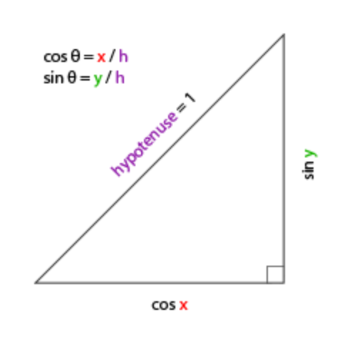

# 摄像机

OpenGL 本身没有**摄像机**(Camera)的概念，但可以通过把场景中的所有物体往相反方向移动的方式来模拟出摄像机，产生一种观察者在移动的感觉，而不是场景在移动。


## 摄像机/观察空间

讨论摄像机/观察空间(Camera/View Space)的时，是在讨论以摄像机的视角作为场景原点时场景中所有的顶点坐标：观察矩阵把所有的世界坐标变换为相对于摄像机位置与方向的观察坐标。

要定义一个摄像机，需要它在世界空间中的位置、观察的方向、一个指向它右侧的向量以及一个指向它上方的向量。


### 摄像机位置

摄像机位置简单来说就是世界空间中一个指向摄像机位置的向量，例如：

````c++
glm::vec3 cameraPos = glm::vec3(0.0f, 0.0f, 3.0f);
````

### 摄像机方向

下一个需要的向量是摄像机的方向，这里指的是摄像机指向哪个方向。

用场景原点向量减去摄像机位置向量的结果就是摄像机的指向向量。

````c++
glm::vec3 cameraTarget = glm::vec3(0.0f, 0.0f, 0.0f);
glm::vec3 cameraDirection = glm::normalize(cameraPos - cameraTarget);
````

> 摄像机方向向量与摄像机空间的 z 轴方向相反
>
> 摄像机方向 = 摄像机指向的位置 - 摄像机位置

### 右轴

右向量(Right Vector)，代表摄像机空间的 x 轴的正方向。

获取右向量的方法：

1. 先定义一个**上向量**(Up Vector)。
2. 接下来把上向量和第二步得到的方向向量进行叉乘。

两个向量叉乘的结果会同时垂直于两向量，因此会得到指向 x 轴正方向的那个向量（如果交换两个向量叉乘的顺序就会得到相反的指向x轴负方向的向量）：

````c++
glm::vec3 up = glm::vec3(0.0f, 1.0f, 0.0f); 
glm::vec3 cameraRight = glm::normalize(glm::cross(up, cameraDirection));
````

### 上轴

把右向量和方向向量进行叉乘得到上轴：

````c++
glm::vec3 cameraUp = glm::cross(cameraDirection, cameraRight);
````

> 对右手坐标系，y 轴 = z 轴叉乘 x 轴，由于方向向量是 -z 轴，所以 y 轴 = x 轴 叉乘 方向向量


## Look At

如果 3 个相互垂直（或非线性）的轴定义了一个坐标空间，可以用这 3 个轴外加一个平移向量来创建一个矩阵，用这个矩阵乘以任何向量来将其变换到那个坐标空间。

这正是**LookAt**矩阵所做的，现在已经有了 3 个互相垂直的轴和一个定义摄像机空间的位置坐标，创建 LookAt 矩阵：

其中 R 是右向量，U 是上向量，D 是方向向量 P 是摄像机位置向量。位置向量是相反的，因为最终希望把世界平移到与自身移动的相反方向。

LookAt矩阵作为观察矩阵可以很高效地把所有世界坐标变换到刚刚定义的观察空间。

GLM 提供了这些支持。只是定义一个摄像机位置，一个目标
和一个表示世界空间中的上向量的向量（计算右向量使用的那个上向量）。接着GLM就会创建一个LookAt矩阵：

````c++
glm::mat4 view = glm::mat4(1.0f);
view = glm::lookAt(glm::vec3(0.0f, 0.0f, 3.0f), 
           glm::vec3(0.0f, 0.0f, 0.0f), 
           glm::vec3(0.0f, 1.0f, 0.0f));
````

- 参数一：摄像机位置；
- 参数二：目标位置；
- 参数三：上向量；

在渲染循环中每次给定一个新的 `view` 变换矩阵，让摄像机的位置绕世界 y 轴旋转，摄像机保持指向 0,0,0：

````c++
float radius = 10.0f;
float camX = sin(glfwGetTime()) * radius;
float camZ = cos(glfwGetTime()) * radius;
glm::mat4 view;
view = glm::lookAt(glm::vec3(camX, 0.0, camZ), glm::vec3(0.0, 0.0, 0.0), glm::vec3(0.0, 1.0, 0.0)); 
````

可以得到旋转的效果；


## 自由移动

自己移动摄像机，先定义一些变量：

````c++
glm::vec3 cameraPos   = glm::vec3(0.0f, 0.0f,  3.0f);
glm::vec3 cameraFront = glm::vec3(0.0f, 0.0f, -1.0f);
glm::vec3 cameraUp    = glm::vec3(0.0f, 1.0f,  0.0f);
````

定义 `LookAt`：

````c++
view = glm::lookAt(cameraPos, cameraPos + cameraFront, cameraUp);
````

让按下某些按键的时候就改变 `cameraPos` （摄像机位置）：

````c++
void processInput(GLFWwindow *window)
{
    ...
    float cameraSpeed = 0.05f; // adjust accordingly
    if (glfwGetKey(window, GLFW_KEY_W) == GLFW_PRESS)
        cameraPos += cameraSpeed * cameraFront;
    if (glfwGetKey(window, GLFW_KEY_S) == GLFW_PRESS)
        cameraPos -= cameraSpeed * cameraFront;
    if (glfwGetKey(window, GLFW_KEY_A) == GLFW_PRESS)
        cameraPos -= glm::normalize(glm::cross(cameraFront, cameraUp)) * cameraSpeed;
    if (glfwGetKey(window, GLFW_KEY_D) == GLFW_PRESS)
        cameraPos += glm::normalize(glm::cross(cameraFront, cameraUp)) * cameraSpeed;
}
````

按下 **WASD** 键的任意一个，摄像机的位置都会相应更新。

- 希望向前或向后移动，就把位置向量加上或减去方向向量；
- 希望向左右移动，使用叉乘来创建一个**右向量**(Right Vector)，并沿着它相应移动。

> `cameraPos` 是摄像机位置，`cameraFront` 表示摄像机看向的方向，`cameraUp` 表示计算上方向。
>
> 摄像机方向 = 摄像机指向的位置 - 摄像机位置，所以设指向的位置 = 方向 + 位置，即为 `cameraPos + cameraFront`；

### 移动速度

目前移动速度是个常量。理论上没什么问题，但是实际情况下根据处理器的能力不同，有些人可能会比其他人每秒绘制更多帧，也就是以更高的频率调用processInput函数。

结果就是，根据配置的不同，有些人可能移动很快，而有些人会移动很慢。

图形程序和游戏通常会跟踪一个时间差(Deltatime)变量，它储存了渲染上一帧所用的时间。把所有速度都去乘以 deltaTime 值。如果 deltaTime 很大，就意味着上一帧的渲染花费了更多时间，所以这一帧的速度需要变得更高来平衡渲染所花去的时间。

使用这种方法时，无论电脑快还是慢，摄像机的速度都会相应平衡，这样每个用户的体验就都一样了：

```c++
float deltaTime = 0.0f; // 当前帧与上一帧的时间差
float lastFrame = 0.0f; // 上一帧的时间
```

每一帧计算：

````c++
float currentFrame = glfwGetTime();
deltaTime = currentFrame - lastFrame;
lastFrame = currentFrame;
````

在计算速度的时候可以将其考虑进去：

````c++
void processInput(GLFWwindow *window)
{
  float cameraSpeed = 2.5f * deltaTime;
  ...
}
````


## 视角移动

加入鼠标，转动视角。

需要根据鼠标的输入改变 `cameraFront` 向量。需要很多三角知识：

> `cameraFront` 表示摄像机视角方向

### 欧拉角

欧拉角(Euler Angle)是可以表示 3D 空间中任何旋转的 3 个值，由莱昂哈德·欧拉(Leonhard Euler)在18世纪提出。一共有3种欧拉角：俯仰角(Pitch)、偏航角(Yaw)和滚转角(Roll)：


- 俯仰角：描述如何往上或往下看的角；
- 偏航角，表示往左和往右看的程度；
- 滚转角：代表如何**翻滚**摄像机，通常在太空飞船的摄像机中使用。

每个欧拉角都有一个值来表示，把三个角结合起来就能够计算3D空间中任何的旋转向量。

对于摄像机系统来说，只关心俯仰角和偏航角。给定一个俯仰角和偏航角，可以把它们转换为一个代表新的方向向量的 3D 向量。

假设直角三角形斜边为 1，就可以用角度表示边的长度：



对俯角，在摄像机系统中，y 表示高度，所以摄像机方向与 xOz 平面夹角是俯角：


所以此时摄像机视角方向向量对三个轴的分量为：

````c++
direction.y = sin(glm::radians(pitch)); // 注意我们先把角度转为弧度
````

而对偏航角，是在 xOz 平面上的：


x分量取决于`cos(yaw)`的值，z值同样取决于偏航角的正弦值。并且 xOz 平面上的斜边角边还取决与俯角，得到：

````c++
direction.x = cos(glm::radians(pitch)) * cos(glm::radians(yaw)); // 译注：direction代表摄像机的前轴(Front)，这个前轴是和本文第一幅图片的第二个摄像机的方向向量是相反的
direction.y = sin(glm::radians(pitch));
direction.z = cos(glm::radians(pitch)) * sin(glm::radians(yaw));
````

> 其实就相当于球坐标系的两个角度；

### 鼠标输入

偏航角和俯仰角是通过鼠标（或手柄）移动获得的，水平的移动影响偏航角，竖直的移动影响俯仰角。

储存上一帧鼠标的位置，在当前帧中当前计算鼠标位置与上一帧的位置相差多少。如果水平/竖直差别越大那么俯仰角或偏航角就改变越大，也就是摄像机需要移动更多的距离。

> 鼠标水平移动影响偏航角，竖直移动影响俯仰角

首先让 GLFW 隐藏光标，并捕捉(Capture)它：

```c++
glfwSetInputMode(window, GLFW_CURSOR, GLFW_CURSOR_DISABLED);
```

在调用这个函数之后，无论怎么去移动鼠标，光标都不会显示，也不会离开窗口。

为了计算俯仰角和偏航角，我们需要让GLFW监听鼠标移动事件。和键盘输入相似）用一个回调函数来完成：

````c++
void mouse_callback(GLFWwindow* window, double xpos, double ypos);
````

再注册回调函数：

````c++
glfwSetCursorPosCallback(window, mouse_callback);
````

获取方向向量的步骤：

1. 计算鼠标距上一帧的偏移量。
2. 把偏移量添加到摄像机的俯仰角和偏航角中。
3. 对偏航角和俯仰角进行最大和最小值的限制。
4. 计算方向向量。

第一步是计算鼠标自上一帧的偏移量。必须先在程序中储存上一帧的鼠标位置，初始值设置为屏幕的中心（屏幕的尺寸是800x600）：

````c++
float lastX = 400, lastY = 300;
````

然后在鼠标的回调函数中计算当前帧和上一帧鼠标位置的偏移量：

````c++
float xoffset = xpos - lastX;
float yoffset = lastY - ypos; // 注意这里是相反的，因为y坐标是从底部往顶部依次增大的
lastX = xpos;
lastY = ypos;

float sensitivity = 0.05f;
xoffset *= sensitivity;
yoffset *= sensitivity;
````

把偏移量乘以了sensitivity（灵敏度）值，使得鼠标灵敏度可以调整。

接下来我们把偏移量加到全局变量 `pitch` 和 `yaw` 上：

````c++
yaw   += xoffset;
pitch += yoffset;
````

第三步，给摄像机添加一些限制。

对于俯仰角，要让用户不能看向高于89度的地方，同样也不允许小于-89度。这样能够保证用户只能看到天空或脚下，但是不能超越这个限制：

````c++
if(pitch > 89.0f)
  pitch =  89.0f;
if(pitch < -89.0f)
  pitch = -89.0f;
````

偏航角设置限制。

最后一步，通过俯仰角和偏航角来计算以得到真正的方向向量：

````c++
glm::vec3 front;
front.x = cos(glm::radians(pitch)) * cos(glm::radians(yaw));
front.y = sin(glm::radians(pitch));
front.z = cos(glm::radians(pitch)) * sin(glm::radians(yaw));
cameraFront = glm::normalize(front);
````

这样运行程序，窗口第一次获取焦点的时候摄像机会突然跳一下，这是因为鼠标移动进窗口的那一刻，鼠标回调函数就会被调用，这时候的xpos和ypos会等于鼠标刚刚进入屏幕的那个位置。

可以简单的使用一个`bool`变量检验是否是第一次获取鼠标输入：

```c++
if(firstMouse) // 这个bool变量初始时是设定为true的
{
    lastX = xpos;
    lastY = ypos;
    firstMouse = false;
}
```

最后的代码应该是这样的：

````c++
void mouse_callback(GLFWwindow* window, double xpos, double ypos)
{
    if(firstMouse)
    {
        lastX = xpos;
        lastY = ypos;
        firstMouse = false;
    }

    float xoffset = xpos - lastX;
    float yoffset = lastY - ypos; 
    lastX = xpos;
    lastY = ypos;

    float sensitivity = 0.05;
    xoffset *= sensitivity;
    yoffset *= sensitivity;

    yaw   += xoffset;
    pitch += yoffset;

    if(pitch > 89.0f)
        pitch = 89.0f;
    if(pitch < -89.0f)
        pitch = -89.0f;

    glm::vec3 front;
    front.x = cos(glm::radians(yaw)) * cos(glm::radians(pitch));
    front.y = sin(glm::radians(pitch));
    front.z = sin(glm::radians(yaw)) * cos(glm::radians(pitch));
    cameraFront = glm::
````


## 缩放

**视野**(Field of View)或**fov**定义了可以看到场景中多大的范围。

当视野变小时，场景投影出来的空间就会减小，产生放大(Zoom In)了的感觉。

使用鼠标的滚轮来放大。与鼠标移动、键盘输入一样，需要一个鼠标滚轮的回调函数：

````c++
void scroll_callback(GLFWwindow* window, double xoffset, double yoffset)
{
  if(fov >= 1.0f && fov <= 45.0f)
    fov -= yoffset;
  if(fov <= 1.0f)
    fov = 1.0f;
  if(fov >= 45.0f)
    fov = 45.0f;
}
````

当滚动鼠标滚轮的时候，`yoffset` 值代表竖直滚动的大小。

scroll_callback 函数被调用后，改变全局变量fov变量的内容。把缩放级别(Zoom Level)限制在`1.0f`到`45.0f`。

````c++
projection = glm::perspective(glm::radians(fov), 800.0f / 600.0f, 0.1f, 100.0f);
````

最后注册

````c++
glfwSetScrollCallback(window, scroll_callback);
````


## 摄像机类

封装摄像机


## 练习

- 看看你是否能够修改摄像机类，使得其能够变成一个**真正的**FPS摄像机（也就是说不能够随意飞行）；你只能够呆在xz平面上；

  ```c++
  Position.y = 0.0f;
  ```

  在 `processMouseMovement` 加一行，保证摄像机保持在 y = 0 的位置。否则按下 W 会随着方向运动，导致摄像机起飞；

- 试着创建你自己的LookAt函数，其中你需要手动创建一个我们在一开始讨论的观察矩阵。用你的函数实现来替换GLM的LookAt函数，看看它是否还能一样地工作；

  ````c++
  // 自定义 LookAt
  glm::mat4 myLookAt(glm::vec3 position, glm::vec3 target, glm::vec3 worldUp)
  {
      glm::vec3 zaxis = glm::normalize(position - target);
      glm::vec3 xaxis = glm::normalize(glm::cross(glm::normalize(worldUp), zaxis));
      glm::vec3 yaxis = glm::cross(zaxis, xaxis);
  
      glm::mat4 translation = glm::mat4(1.0f);
      translation[3][0] = -position.x; // Third column, first row
      translation[3][1] = -position.y;
      translation[3][2] = -position.z;
      glm::mat4 rotation = glm::mat4(1.0f);
      rotation[0][0] = xaxis.x; // First column, first row
      rotation[1][0] = xaxis.y;
      rotation[2][0] = xaxis.z;
      rotation[0][1] = yaxis.x; // First column, second row
      rotation[1][1] = yaxis.y;
      rotation[2][1] = yaxis.z;
      rotation[0][2] = zaxis.x;
      rotation[1][2] = zaxis.y;
      rotation[2][2] = zaxis.z; 
  
      return rotation * translation;
  }
  ````

  