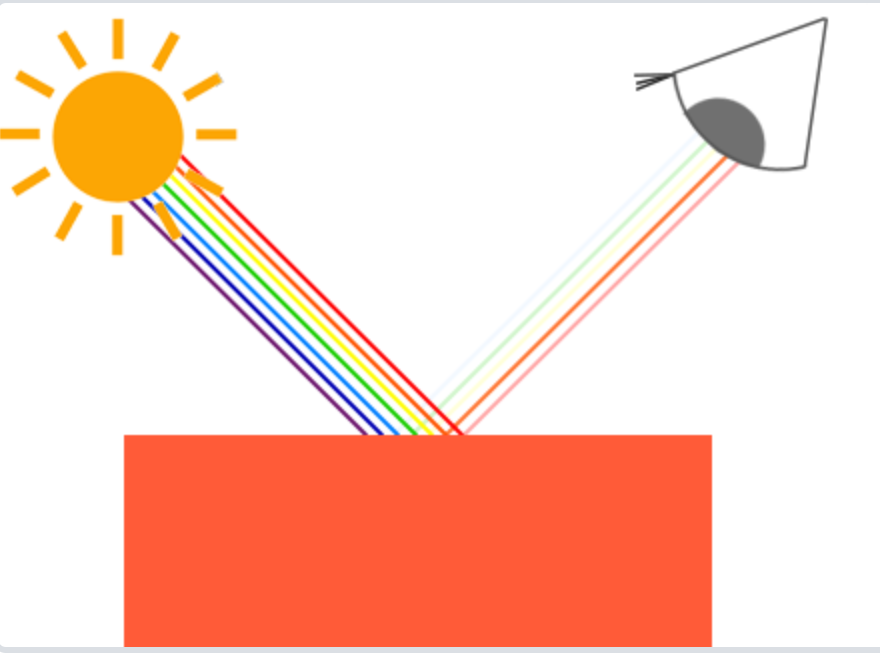
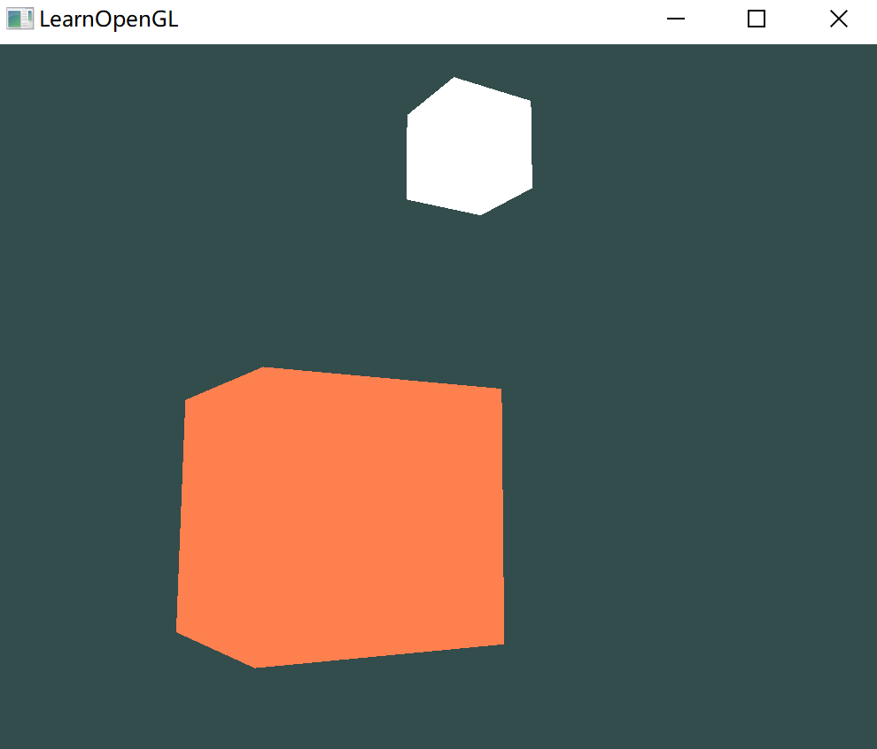

# 颜色

## 颜色理论知识

颜色可以数字化的由红色(Red)、绿色(Green)和蓝色(Blue)三个分量组成，它们通常被缩写为RGB。仅仅用这三个值就可以组合出任意一种颜色。

现实生活中看到某一物体的颜色并不是这个物体真正拥有的颜色，而是它所反射的(Reflected)颜色。那些不能被物体所吸收(Absorb)的颜色（被拒绝的颜色）就是人能够感知到的物体的颜色：



白色的阳光实际上是所有可见颜色的集合，物体吸收了其中的大部分颜色，它仅反射了代表物体颜色的部分。

颜色反射的定律被直接地运用在图形领域。在 OpenGL 中创建一个光源，给光源一个颜色。把光源的颜色与物体的颜色值相乘，所得到的就是这个物体所反射的颜色：

````c++
glm::vec3 lightColor(1.0f, 1.0f, 1.0f);
glm::vec3 toyColor(1.0f, 0.5f, 0.31f);
glm::vec3 result = lightColor * toyColor; // = (1.0f, 0.5f, 0.31f);
````

- 光源颜色为 `(1.0f, 1.0f, 1.0f)` 表示白色；
- 玩具颜色为 `(1.0f, 0.5f, 0.31f)` ；
- 将二者相乘输出还是玩具颜色（因为白光是所有颜色的组合）；

如果使用其他光源：

````c++
glm::vec3 lightColor(0.0f, 1.0f, 0.0f);
glm::vec3 toyColor(1.0f, 0.5f, 0.31f);
glm::vec3 result = lightColor * toyColor; // = (0.0f, 0.5f, 0.0f);
````

比如绿色光源，没有红色和蓝色的光让玩具来吸收或反射。所以这个玩具只有绿色通道的分量可以起作用，它吸收了一半，反射了一半。


## 创建光照场景

使用颜色来模拟现实世界中的光照效果，创造出一些有趣的视觉效果。

需要一个物理作为投光对象，还要一个物体代替光源在 3D 场景中的位置。

目前还不需要纹理，所以着色器很简单：

````glsl
#version 330 core
layout (location = 0) in vec3 aPos;

uniform mat4 model;
uniform mat4 view;
uniform mat4 projection;

void main()
{
    gl_Position = projection * view * model * vec4(aPos, 1.0);
}
````

还要创建一个表示灯（光源）的立方体：

```c++
unsigned int lightVAO;
glGenVertexArrays(1, &lightVAO);
glBindVertexArray(lightVAO);
// 只需要绑定VBO不用再次设置VBO的数据，因为箱子的VBO数据中已经包含了正确的立方体顶点数据
glBindBuffer(GL_ARRAY_BUFFER, VBO);
// 设置灯立方体的顶点属性（对我们的灯来说仅仅只有位置数据）
glVertexAttribPointer(0, 3, GL_FLOAT, GL_FALSE, 3 * sizeof(float), (void*)0);
glEnableVertexAttribArray(0);
```

再定义一个片段着色器：

```glsl
#version 330 core
out vec4 FragColor;

uniform vec3 objectColor;
uniform vec3 lightColor;

void main()
{
    FragColor = vec4(lightColor * objectColor, 1.0);
}
```

将光源的颜色和物体（反射的）颜色相乘；

在程序中给两个颜色赋值：

```c++
// 在此之前不要忘记首先 use 对应的着色器程序（来设定uniform）
lightingShader.use();
lightingShader.setVec3("objectColor", 1.0f, 0.5f, 0.31f);
lightingShader.setVec3("lightColor",  1.0f, 1.0f, 1.0f);
```

而灯的颜色应该一直保持，所以灯需要自己的一套着色器，其片段着色器很简单，就是输出白色：

```glsl
#version 330 core
out vec4 FragColor;

void main()
{
    FragColor = vec4(1.0); // 将向量的四个分量全部设置为1.0
}
```

声明一个全局`vec3`变量来表示光源在场景的世界空间坐标中的位置：

````c++
glm::vec3 lightPos(1.2f, 1.0f, 2.0f);
````

然后把灯位移到这里，然后将其缩小，让它不那么明显：

````c++
model = glm::mat4();
model = glm::translate(model, lightPos);
model = glm::scale(model, glm::vec3(0.2f));
````

最后大概有这样的效果：

