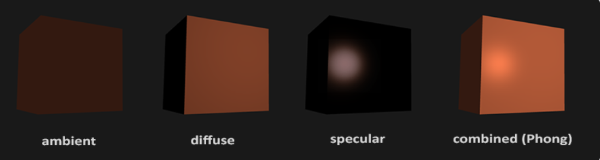
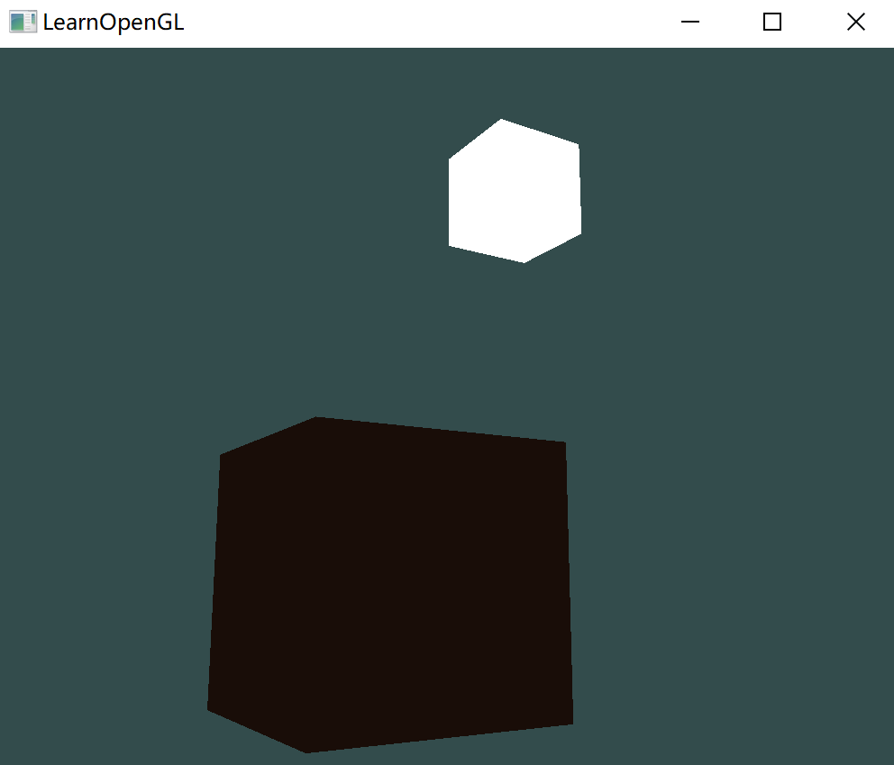
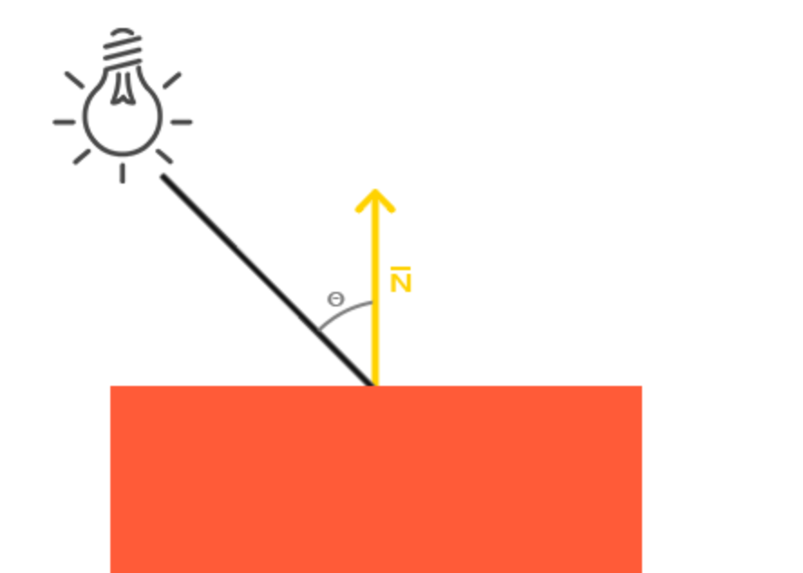
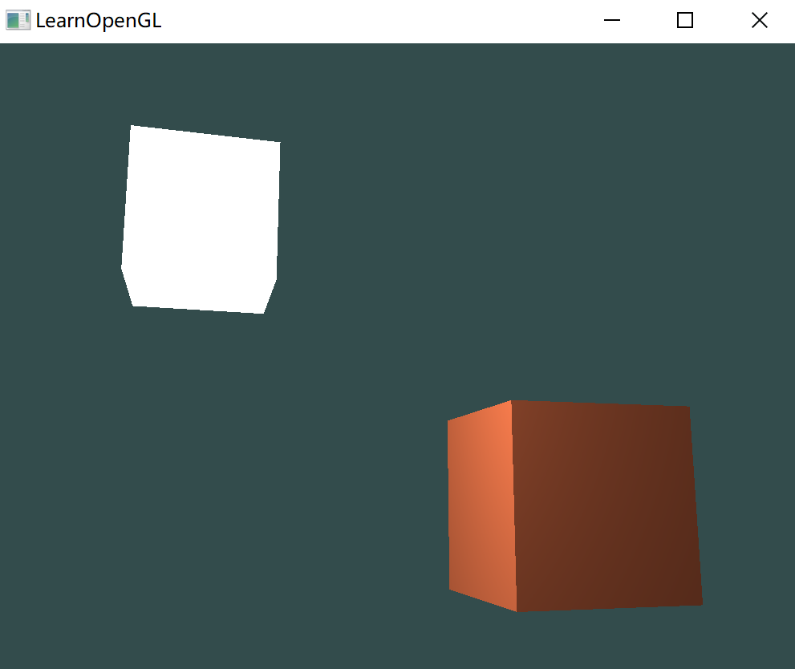
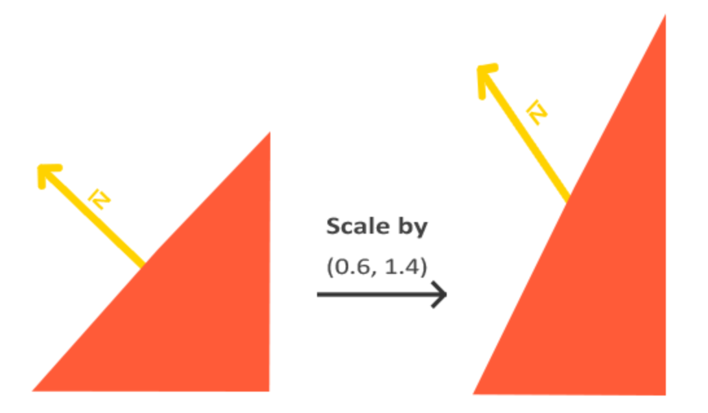
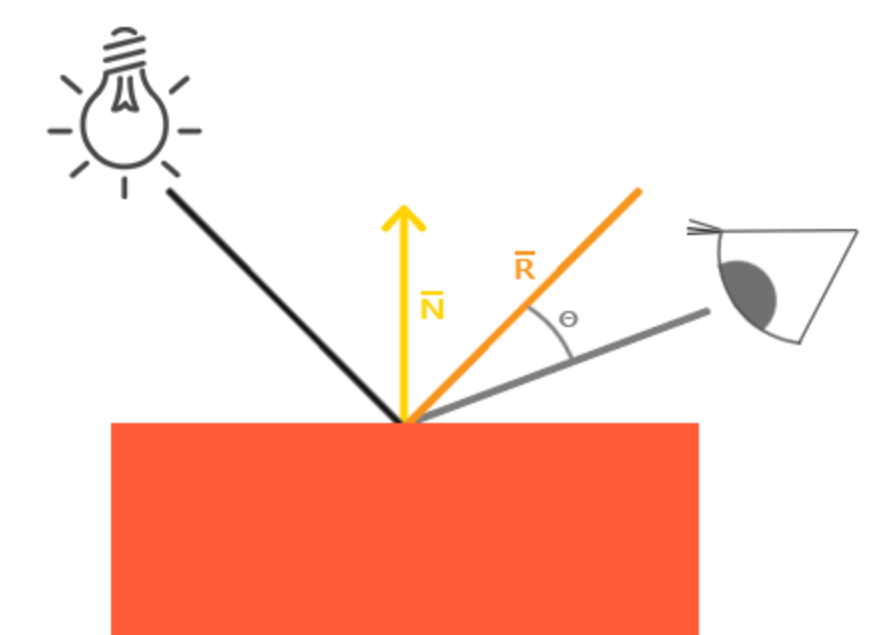
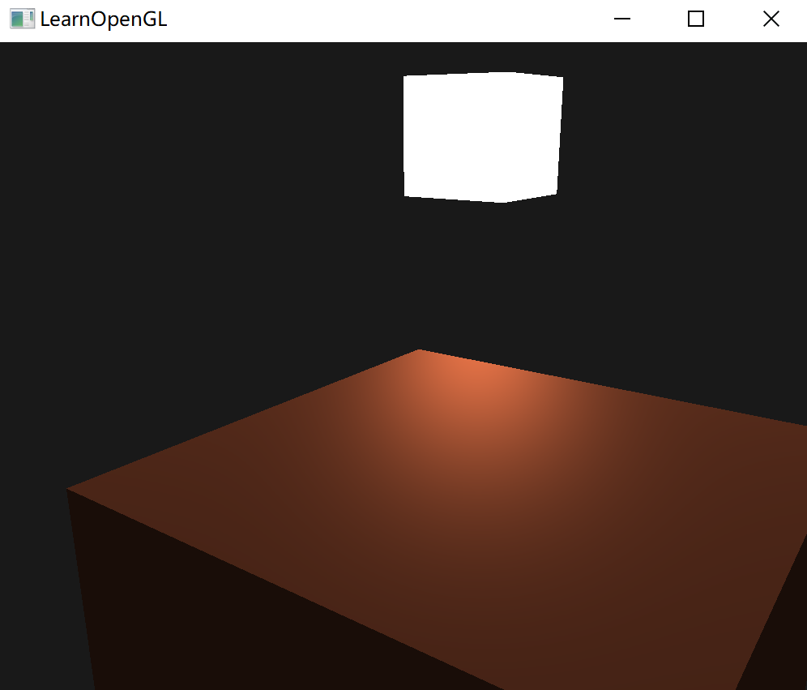
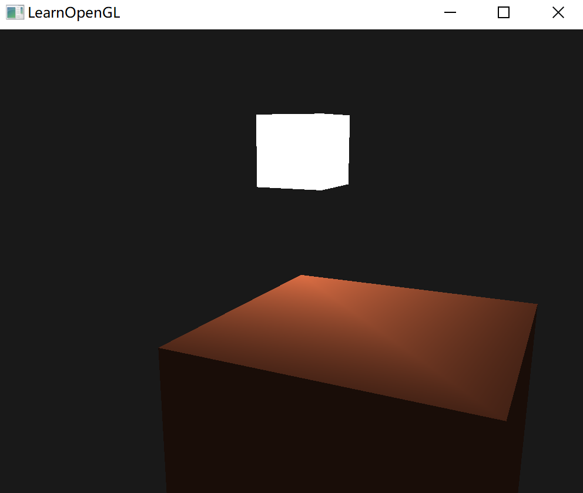

# 基础光照

现实世界的光照极其复杂的，受到诸多因素的影响，计算机无法模拟。

因此 OpenGL 的光照使用的是简化的模型，对现实的情况进行近似。这些光照模型都是基于对光的物理特性的理解。

其中一个模型被称为冯氏光照模型(Phong Lighting Model)。冯氏光照模型的主要结构由3个分量组成：环境(Ambient)、漫反射(Diffuse)和镜面(Specular)光照。下面这张图展示了这些光照分量看起来的样子：



- 环境光照(Ambient Lighting)：即使在黑暗的情况下，世界上通常也仍然有一些光亮（月亮、远处的光），所以物体几乎永远不会是完全黑暗的。为了模拟这个，使用一个环境光照常量，它永远会给物体一些颜色。
- 漫反射光照(Diffuse Lighting)：模拟光源对物体的方向性影响(Directional Impact)。它是冯氏光照模型中视觉上最显著的分量。物体的某一部分越是正对着光源，它就会越亮。
- 镜面光照(Specular Lighting)：模拟有光泽物体上面出现的亮点。镜面光照的颜色相比于物体的颜色会更倾向于光的颜色。


## 环境光照

使用一个简化的全局照明模型，即环境光照。

使用一个很小的常量（光照）颜色，添加到物体片段的最终颜色中，这样子的话即便场景中没有直接的光源也能看起来存在有一些发散的光。

把环境光照添加到场景里非常简单，用光的颜色乘以一个很小的常量环境因子，再乘以物体的颜色，然后将最终结果作为片段的颜色：

````c++
void main()
{
    float ambientStrength = 0.1;
    vec3 ambient = ambientStrength * lightColor;

    vec3 result = ambient * objectColor;
    FragColor = vec4(result, 1.0);
}
````

最后的效果：




## 漫反射光照

漫反射光照使物体上与光线方向越接近的片段能从光源处获得更多的亮度。如下图：



图左上方有一个光源，它所发出的光线落在物体的一个片段上。需要测量光线是以什么角度接触到这个片段的。如果光线垂直于物体表面，这束光对物体的影响会最大化（更亮）。

使用一个叫做法向量(Normal Vector)。这两个向量之间的角度很容易就能够通过点乘计算出来：

两个单位向量夹角越小，点乘的结果越接近 1，而二者垂直输出 0。这就正好使用此情景：$\theta$ 越大，光对片段颜色的影响就应该越小.

### 法向量

将发现数据加入顶点数组：

```c++
    -0.5f, -0.5f, -0.5f,  0.0f,  0.0f, -1.0f,
     0.5f, -0.5f, -0.5f,  0.0f,  0.0f, -1.0f, 
     0.5f,  0.5f, -0.5f,  0.0f,  0.0f, -1.0f, 
     0.5f,  0.5f, -0.5f,  0.0f,  0.0f, -1.0f, 
    -0.5f,  0.5f, -0.5f,  0.0f,  0.0f, -1.0f, 
    -0.5f, -0.5f, -0.5f,  0.0f,  0.0f, -1.0f, 

    -0.5f, -0.5f,  0.5f,  0.0f,  0.0f, 1.0f,
     0.5f, -0.5f,  0.5f,  0.0f,  0.0f, 1.0f,
     0.5f,  0.5f,  0.5f,  0.0f,  0.0f, 1.0f,
     0.5f,  0.5f,  0.5f,  0.0f,  0.0f, 1.0f,
    -0.5f,  0.5f,  0.5f,  0.0f,  0.0f, 1.0f,
    -0.5f, -0.5f,  0.5f,  0.0f,  0.0f, 1.0f,

    -0.5f,  0.5f,  0.5f, -1.0f,  0.0f,  0.0f,
    -0.5f,  0.5f, -0.5f, -1.0f,  0.0f,  0.0f,
    -0.5f, -0.5f, -0.5f, -1.0f,  0.0f,  0.0f,
    -0.5f, -0.5f, -0.5f, -1.0f,  0.0f,  0.0f,
    -0.5f, -0.5f,  0.5f, -1.0f,  0.0f,  0.0f,
    -0.5f,  0.5f,  0.5f, -1.0f,  0.0f,  0.0f,

     0.5f,  0.5f,  0.5f,  1.0f,  0.0f,  0.0f,
     0.5f,  0.5f, -0.5f,  1.0f,  0.0f,  0.0f,
     0.5f, -0.5f, -0.5f,  1.0f,  0.0f,  0.0f,
     0.5f, -0.5f, -0.5f,  1.0f,  0.0f,  0.0f,
     0.5f, -0.5f,  0.5f,  1.0f,  0.0f,  0.0f,
     0.5f,  0.5f,  0.5f,  1.0f,  0.0f,  0.0f,

    -0.5f, -0.5f, -0.5f,  0.0f, -1.0f,  0.0f,
     0.5f, -0.5f, -0.5f,  0.0f, -1.0f,  0.0f,
     0.5f, -0.5f,  0.5f,  0.0f, -1.0f,  0.0f,
     0.5f, -0.5f,  0.5f,  0.0f, -1.0f,  0.0f,
    -0.5f, -0.5f,  0.5f,  0.0f, -1.0f,  0.0f,
    -0.5f, -0.5f, -0.5f,  0.0f, -1.0f,  0.0f,

    -0.5f,  0.5f, -0.5f,  0.0f,  1.0f,  0.0f,
     0.5f,  0.5f, -0.5f,  0.0f,  1.0f,  0.0f,
     0.5f,  0.5f,  0.5f,  0.0f,  1.0f,  0.0f,
     0.5f,  0.5f,  0.5f,  0.0f,  1.0f,  0.0f,
    -0.5f,  0.5f,  0.5f,  0.0f,  1.0f,  0.0f,
    -0.5f,  0.5f, -0.5f,  0.0f,  1.0f,  0.0f
```

修改顶点着色器：

```
#version 330 core
layout (location = 0) in vec3 aPos;
layout (location = 1) in vec3 aNormal;
...
```

所以就要增加属性指针。但对 `lightVAO` 不需要，但由于二者都使用同一个内存数据，所以对 `lightVAO` 需要修改顶点数据的大小：

```c++
glVertexAttribPointer(0, 3, GL_FLOAT, GL_FALSE, 6 * sizeof(float), (void*)0);
glEnableVertexAttribArray(0);
```

所有光照的计算都是在片段着色器里进行，所以需要将法向量由顶点着色器传递到片段着色器：

```glsl
out vec3 Normal;

void main()
{
    gl_Position = projection * view * model * vec4(aPos, 1.0);
    Normal = aNormal;
}
```

再片段着色器增加输入：

```c++
in vec3 Normal;
```

### 计算漫反射光照

需要光源位置变量：

````glsl
uniform vec3 lightPos;
````

在程序中赋值：

```c++
unsigned int lightPosPosLoc = glGetUniformLocation(objectShader.id(), "lightPos");
glUniform3fv(lightPosPosLoc, 1, glm::value_ptr(lightPos));
```

最后还需要得到顶点的在世界坐标的位置，把顶点局部乘以模型矩阵变换到世界空间坐标：

```glsl
out vec3 FragPos;  
out vec3 Normal;

void main()
{
    gl_Position = projection * view * model * vec4(aPos, 1.0);
    FragPos = vec3(model * vec4(aPos, 1.0));
    Normal = aNormal;
}
```

在片段着色器中添加相应的输入变量。

```glsl
in vec3 FragPos;
```

现在，就可以在片段着色器中得到：光源世界坐标，顶点的世界坐标、法向量。可以在其中增加光照计算：

1. 计算光源和片段位置之间的方向向量（向量相减）；

   ```glsl
   vec3 norm = normalize(Normal);
   vec3 lightDir = normalize(lightPos - FragPos);
   ```

2. 对norm和lightDir向量进行点乘，结果值再乘以光的颜色，得到漫反射分量。两个向量之间的角度越大，漫反射分量就会越小：

   ```glsl
   float diff = max(dot(norm, lightDir), 0.0);
   vec3 diffuse = diff * lightColor;
   ```

   使用 max 函数返回两个参数之间较大的参数，从而保证漫反射分量不会变成负数数，至少也是 0.0；

3. 环境光分量和漫反射分量相加，乘物体的颜色：

   ```glsl
   vec3 result = (ambient + diffuse) * objectColor;
   FragColor = vec4(result, 1.0);
   ```

最后得到这样的效果：



### 法向量的处理

上述的程序将法向量传递到片段着色器，但没有改为世界坐标。但是不是简单地把它乘以一个模型矩阵就能搞定的。

首先，法向量只是方向，所以平移对其无效，只能对其实施缩放和旋转。

并且，如果模型矩阵执行了不等比缩放，会导致法向量不再垂直：



解决不等比缩放，需要使用一个为法向量专门定制的模型矩阵，称之法线矩阵(Normal Matrix)。

其被定义为：「模型矩阵左上角3x3部分的逆矩阵的转置矩阵」。在顶点着色器中，可以使用 `inverse` 和 `transpose` 函数生成这个法线矩阵，之后还要把被处理过的矩阵强制转换为 3×3 矩阵，来保证它失去了位移属性以及能够乘以`vec3`的法向量。

```glsl
Normal = mat3(transpose(inverse(model))) * aNormal;
```

如果模型没有缩放，就不需要使用一个法线矩阵，而是仅以模型矩阵乘以法线就可以：

```c++
Normal = mat3(model) * aNormal;
```


## 镜面反射光照

和漫反射光照一样，镜面光照也决定于光的方向向量和物体的法向量，但是它也决定于观察方向。

镜面光照决定于表面的反射特性。如果物体表面是一面镜子，那么镜面光照最强的地方就是看到表面上反射光的地方：



根据法向量翻折入射光的方向来计算反射向量 $\overline R$。

然后计算反射向量与观察方向的角度差，它们之间夹角越小，镜面光的作用就越大。

观察向量是计算镜面光照时需要的一个额外变量，可以使用观察者的世界空间位置和片段的位置来计算它。之后计算出镜面光照强度，用它乘以光源的颜色，并将它与环境光照和漫反射光照部分加和。

1. 把摄像机的位置向量传给着色器：

   ```
   uniform vec3 viewPos;
   ```

   在程序中传入摄像机的位置。

2. 定义一个镜面强度(Specular Intensity)变量，给镜面高光一个中等亮度颜色，让它不要产生过度的影响。

   ```glsl
   float specularStrength = 0.5;
   ```

3. 计算视线方向向量，和对应的沿着法线轴的反射向量：

   ```glsl
   vec3 viewDir = normalize(viewPos - FragPos);
   vec3 reflectDir = reflect(-lightDir, norm);
   ```

   > 对`lightDir`向量进行了取反。`reflect`函数要求第一个向量是**从**光源指向片段位置的向量，但是`lightDir`当前正好相反，是从片段**指向**光源（由先计算`lightDir`向量时，减法的顺序决定）

4. 计算镜面分量：

   ````glsl
   float spec = pow(max(dot(viewDir, reflectDir), 0.0), 32);
   vec3 specular = specularStrength * spec * lightColor;
   ````

5. 把它加到环境光分量和漫反射分量里，再用结果乘以物体的颜色：

   ```glsl
   vec3 result = (ambient + diffuse + specular) * objectColor;
   FragColor = vec4(result, 1.0);

最后得到这样的效果：




## 练习

- 目前，我们的光源是静止的，你可以尝试使用sin或cos函数让光源在场景中来回移动。观察光照随时间的改变能让你更容易理解冯氏光照模型

  每次循环计算光源位置：

  ```c++
  // 光源位置
  double t = glfwGetTime();
  float posX = 3.0 * sin(t);
  float posZ = 3.0 * cos(t);
  glm::vec3 lightPos = glm::vec3(posX, 1.0f, posZ);
  ```

- 尝试使用不同的环境光、漫反射和镜面强度，观察它们怎么是影响光照效果的。同样，尝试实验一下镜面光照的反光度因子。尝试理解为什么某一个值能够有着某一种视觉输出。

  ~~

- 在观察空间（而不是世界空间）中计算冯氏光照

  只要把坐标全部缓存观察空间即可，计算公式不变，对顶点着色器：

  ```glsl
  // 传入 片段着色器 的是观察空间坐标
  fragPos = vec3(view * model * vec4(inPos, 1.0));
  normal = mat3(view * model) * inNormal;
  
  gl_Position = projection * view * model * vec4(inPos, 1.0);
  ```

  输出都多乘一个 `view` 变为观察空间。

  对片段着色器：

  ```glsl
      // 转为观察空间
      vec3 viewlightPos = vec3(view * vec4(lightPos, 1.0));
      vec3 norm = normalize(normal);
      vec3 lightDir = normalize(viewlightPos - fragPos); 
  
      float diff = max(dot(norm, lightDir), 0.0);
      vec3 diffuse = diff * lightColor;
  
      // 观察空间 viewPos 为原点
      float specularStrength = 0.5;
      vec3 viewDir = normalize(-fragPos);
      vec3 reflectDir = reflect(-lightDir, norm);
  ```

  把传入的 `lightPos` 转为观察空间，此时就不需要传入 `viewPos`，因为观察空间以观察者为原点。

- 尝试实现一个Gouraud着色（而不是冯氏着色）。如果你做对了话，立方体的光照应该会[看起来有些奇怪](https://learnopengl-cn.github.io/img/02/02/basic_lighting_exercise3.png)，尝试推理为什么它会看起来这么奇怪

  把计算过去拷贝到顶点着色器：

  ````glsl
  #version 330 core
  
  layout (location = 0) in vec3 inPos;
  layout (location = 1) in vec3 inNormal;
  
  uniform mat4 model;
  uniform mat4 view;
  uniform mat4 projection;
  
  uniform vec3 lightColor;
  uniform vec3 lightPos;
  uniform vec3 viewPos;
  uniform vec3 objectColor;
  
  out vec3 result;
  
  void main()
  {
      vec3 fragPos = vec3(model * vec4(inPos, 1.0));
      vec3 normal = mat3(model) * inNormal;
  
      float ambientStrength = 0.1;
      vec3 ambient = ambientStrength * lightColor;
  
      vec3 norm = normalize(normal);
      vec3 lightDir = normalize(lightPos - fragPos); 
  
      float diff = max(dot(norm, lightDir), 0.0);
      vec3 diffuse = diff * lightColor;
  
      float specularStrength = 0.5;
      vec3 viewDir = normalize(viewPos - fragPos);
      vec3 reflectDir = reflect(-lightDir, norm);
  
      float spec = pow(max(dot(viewDir, reflectDir), 0.0), 32);
      vec3 specular = specularStrength * spec * lightColor;   
  
      result = (ambient + diffuse + specular) * objectColor;
  
      gl_Position = projection * view * model * vec4(inPos, 1.0);
  }
  ````

  ````glsl
  #version 330 core
  
  in vec3 result;
  
  out vec4 outColor;
  
  uniform vec3 objectColor;
  uniform vec3 lightColor;
  uniform vec3 lightPos;
  uniform vec3 viewPos;
  
  void main()
  {
      outColor = vec4(result, 1.0);
  }
  ````

  最后的效果：

  

  没有原来的平滑。

