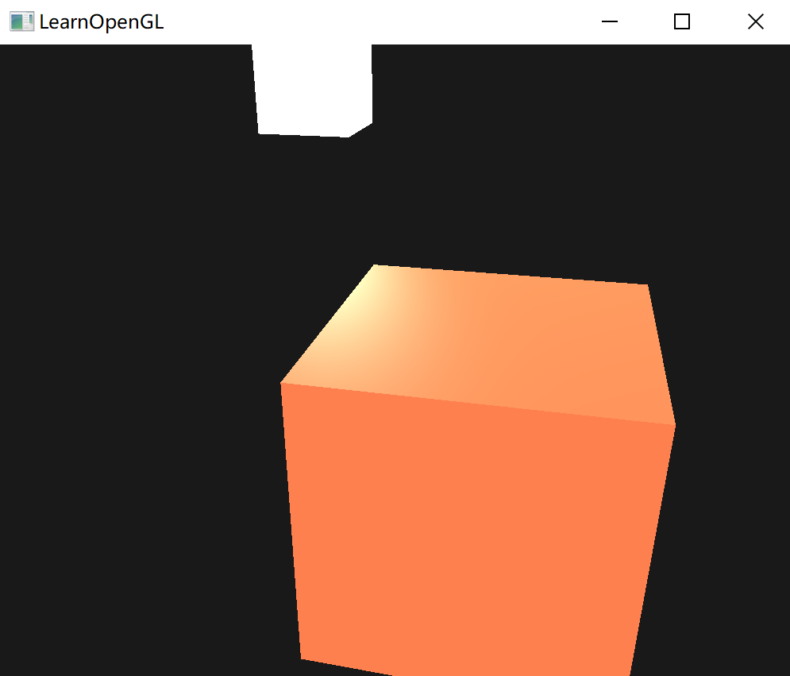
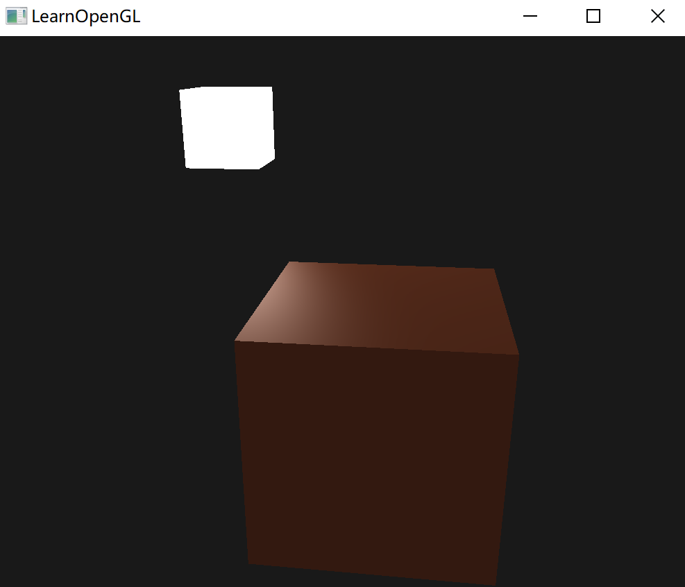

# 材料

想要在 OpenGL 中模拟多种类型的物体，必须针对每种表面定义不同的材质(Material)属性。

当描述一个表面时，分别为三个光照分量定义一个材质颜色(Material Color)：环境光照(Ambient Lighting)、漫反射光照(Diffuse Lighting)和镜面光照(Specular Lighting)。

再添加一个反光度(Shininess)分量，结合上述的三个颜色，就有了全部所需的材质属性：

````glsl
#version 330 core
struct Material {
    vec3 ambient;
    vec3 diffuse;
    vec3 specular;
    float shininess;
}; 

uniform Material material;
````

在片段着色器中，创建一个结构体(Struct)来储存物体的材质属性。然后以结构体作为类型声明一个uniform变量。

- ambient：定义在环境光照下表面反射的颜色，通常与表面的颜色相同；
- diffuse：定义在漫反射光照下表面的颜色。漫反射颜色（和环境光照一样）也被设置为期望的物体颜色；
- specular：设置表面上镜面高光的颜色（或者甚至可能反映一个特定表面的颜色）；
- shininess：影响镜面高光的散射/半径。

有这4个元素定义一个物体的材质，就能够模拟很多现实世界中的材质。


## 设置材料

使用结构体中的字段计算：

````glsl
void main()
{
    // 环境光
    vec3 ambient = lightColor * material.ambient;
    
    // 漫反射
    vec3 norm = normlize(Normal);
    vec3 lightDir = normlize(lightPos - FragPos);
    float diff = max(dot(norm, lightDir), 0.0);
    vec3 diffuse = lightColor * (diff * material.diffuse);
    
    // 镜面光
    vec3 viewDir = normlize(viewPos - FragPos);
    vec3 reflectDir = normlize(-lightDir, norm);
    float spec = pow(max(dot(viewDir, reflectDir), 0.0), materal.shininess);
    vec3 sepcular = lightColor * (spec * material.specular);
    
    vec3 result = ambient + diffuse + specular;
    FragColor = vec4(result, 1.0);
}
````

物体的每个材质属性都乘上了它们各自对应的光照分量。

在程序中设置结构体的值：

```c++
lightingShader.setVec3("material.ambient",  1.0f, 0.5f, 0.31f);
lightingShader.setVec3("material.diffuse",  1.0f, 0.5f, 0.31f);
lightingShader.setVec3("material.specular", 0.5f, 0.5f, 0.5f);
lightingShader.setFloat("material.shininess", 32.0f);
```

得到这样的结果：




## 光的属性

得到的物体太亮了，对三个光照分量分别使用一个向量作为强度因子：

````
vec3 ambient  = vec3(1.0) * material.ambient;
vec3 diffuse  = vec3(1.0) * (diff * material.diffuse);
vec3 specular = vec3(1.0) * (spec * material.specular);
````

这样，物体的每个材质属性对每一个光照分量都返回了最大的强度，并且调度可以被修改，比如小一点的环境光

```glsl
vec3 ambient = vec3(0.1) * material.ambient;
```

同样，使用一个结构体封装三个光照的强度：

```glsl
struct Light {
    vec3 position;

    vec3 ambient;
    vec3 diffuse;
    vec3 specular;
};

uniform Light light;
```

- 环境光照通常被设置为一个比较低的强度；
- 光源的漫反射分量通常被设置为希望光所具有的那个颜色，通常是一个比较明亮的白色。
- 镜面光分量通常会保持为 `vec3(1.0)`，以最大强度发光。
- 将光源的位置向量加入了结构体。

在片段着色器中使用：

```glsl
vec3 ambient  = light.ambient * material.ambient;
vec3 diffuse  = light.diffuse * (diff * material.diffuse);
vec3 specular = light.specular * (spec * material.specular);
```

在程序中赋值：

```c++
lightingShader.setVec3("light.ambient",  0.2f, 0.2f, 0.2f);
lightingShader.setVec3("light.diffuse",  0.5f, 0.5f, 0.5f); // 将光照调暗了一些以搭配场景
lightingShader.setVec3("light.specular", 1.0f, 1.0f, 1.0f); 
```

最后得到：




## 不同的光源颜色

可以利用sin和glfwGetTime函数改变光源的环境光和漫反射颜色，从而很容易地让光源的颜色随着时间变化：

````c++
glm::vec3 lightColor;
lightColor.x = sin(glfwGetTime() * 2.0f);
lightColor.y = sin(glfwGetTime() * 0.7f);
lightColor.z = sin(glfwGetTime() * 1.3f);

glm::vec3 diffuseColor = lightColor   * glm::vec3(0.5f); // 降低影响
glm::vec3 ambientColor = diffuseColor * glm::vec3(0.2f); // 很低的影响

lightingShader.setVec3("light.ambient", ambientColor);
lightingShader.setVec3("light.diffuse", diffuseColor);
````


## 练习

- 你能做到这件事吗，改变光照颜色导致改变光源立方体的颜色？

  在光源的片段着色器更改颜色即可：

  ```glsl
  #version 330 core
  out vec4 outColor;
  
  uniform vec3 lightColor;
  
  void main()
  {
      outColor = vec4(lightColor, 1.0);
  }

- 你能像教程一开始那样，通过定义相应的材质来模拟现实世界的物体吗？注意[材质表格](http://devernay.free.fr/cours/opengl/materials.html)中的环境光值与漫反射值不一样，它们没有考虑光照的强度。要想正确地设置它们的值，你需要将所有的光照强度都设置为`vec3(1.0)`，这样才能得到一致的输出