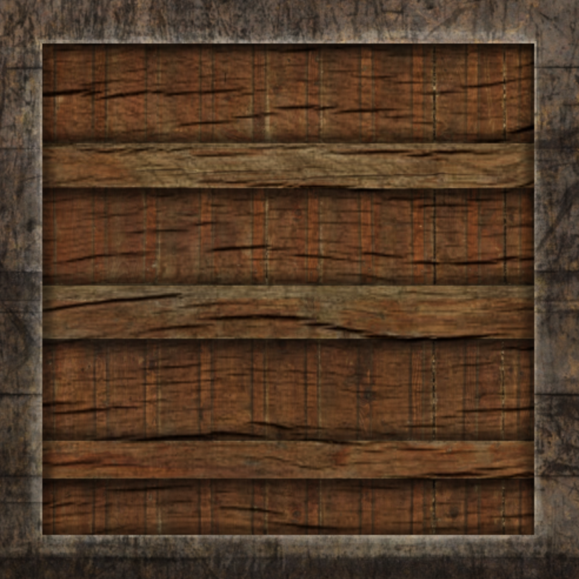
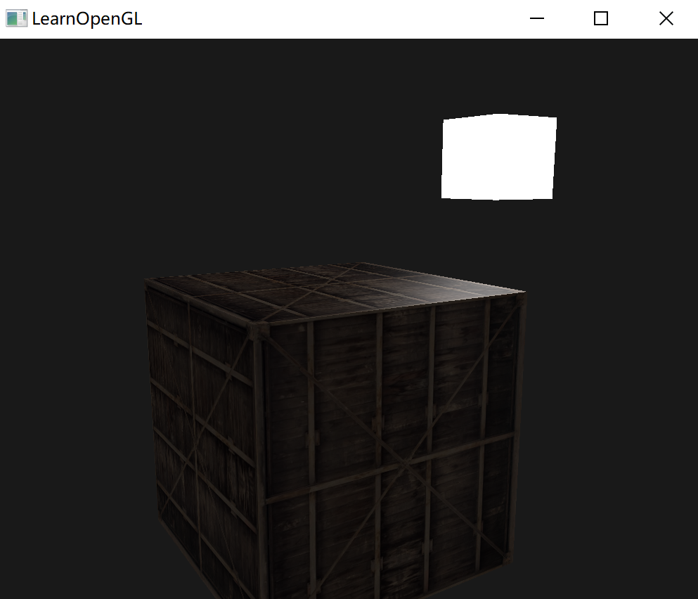
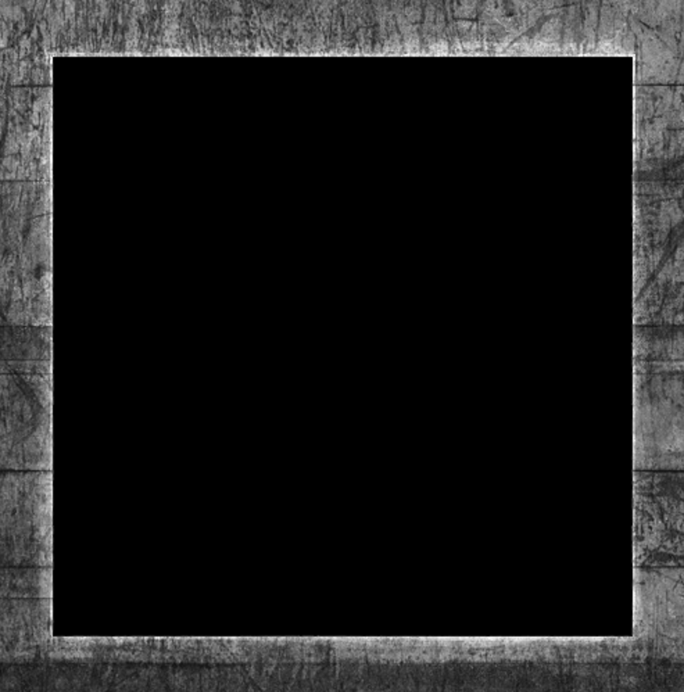
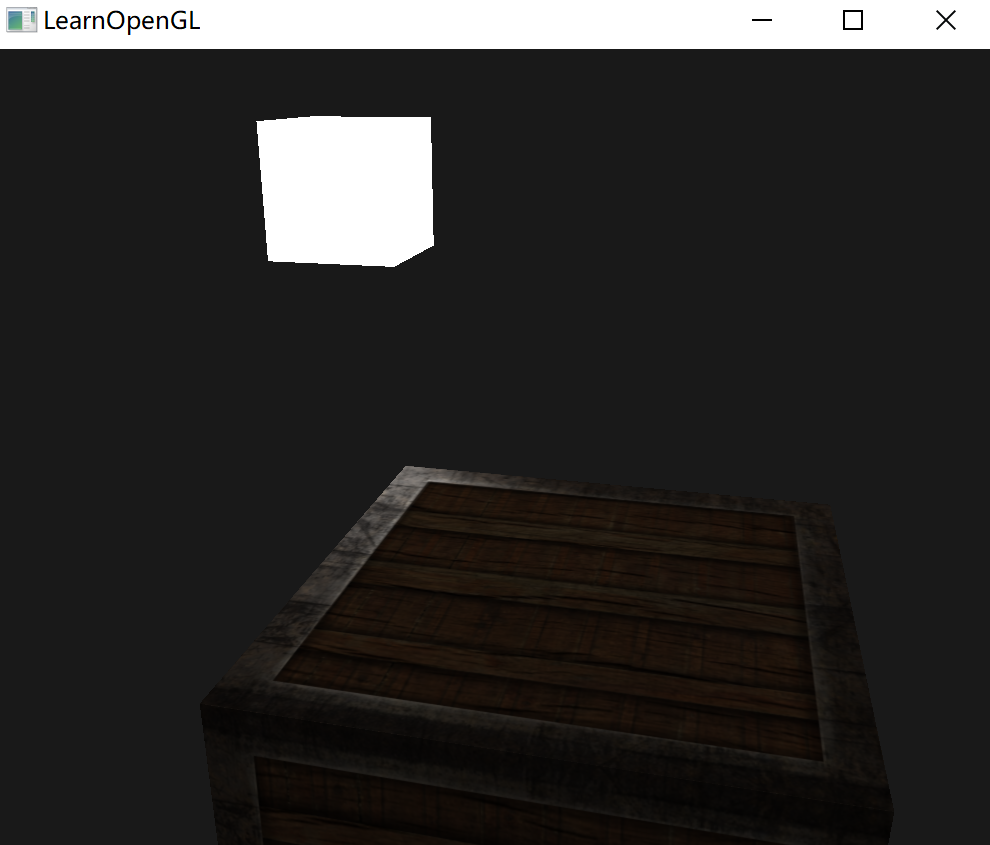
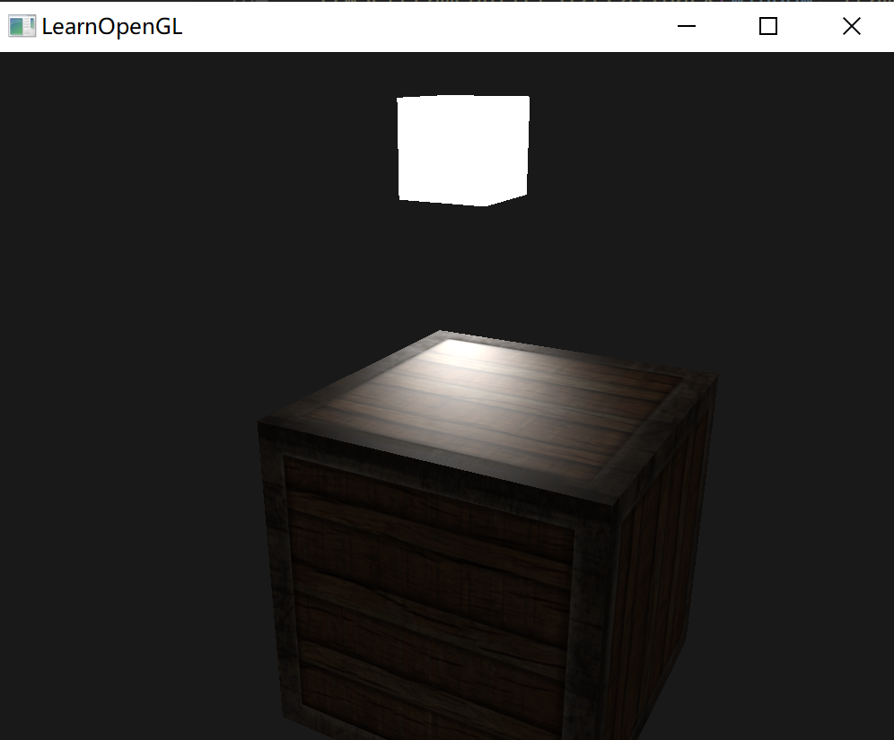
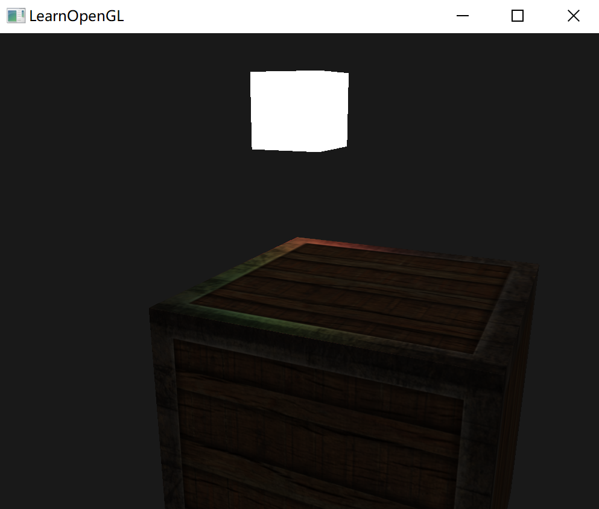
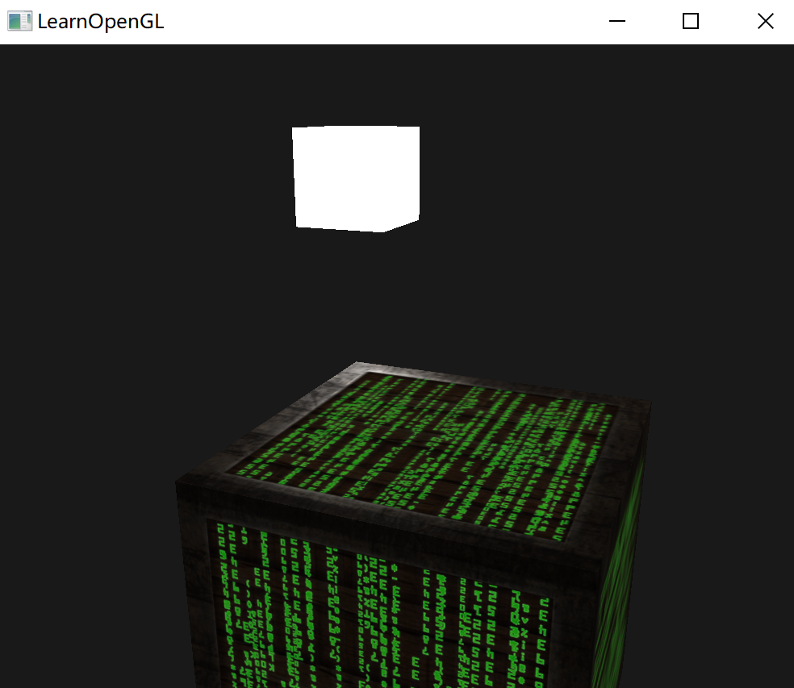

# 光照贴图

现实世界中的物体通常由多种材质所组成。这样的物体在不同的部件上都有不同的材质属性。

所以需要拓展之前的系统，引入**漫反射**和**镜面光**贴图(Map)。


## 漫反射贴图

通过某种方式对物体的每个片段单独设置漫反射颜色。

可以使用纹理，就是一张覆盖物体的图像，能够逐片段索引其独立的颜色值。

在光照场景中，它通常叫做一个漫反射贴图(Diffuse Map)，表现了物体所有的漫反射颜色的纹理图像。



在着色器中使用漫反射贴图的方法和纹理完全一样。

但这次会将纹理储存为 Material 结构体中的一个 `sampler2D`。将之前定义的`vec3` 漫反射颜色向量替换为漫反射贴图。

并且移除了环境光材质颜色向量，因为环境光颜色在几乎所有情况下都等于漫反射颜色：

````c++
struct Material {
    sampler2D diffuse;
    vec3      specular;
    float     shininess;
}; 
...
in vec2 TexCoords;
````

此时计算环境光照与漫反射时，就使用 `diffuse`：

```glsl
vec3 diffuse = light.diffuse * diff * vec3(texture(material.diffuse, TexCoords));

vec3 ambient = light.ambient * vec3(texture(material.diffuse, TexCoords));
```

用 `texture` 函数得到颜色。在程序中传入纹理，最后的效果：




## 镜面光贴图

一个物体有多个材料，之间的反射程度不同，比如金属的反射肯定比木头明显。

要指定这个可以使用镜面光贴图(Specular Map)，本质上也是一个纹理贴图，比如：



镜面高光的强度可以通过图像每个像素的亮度来获取，越黑就说明这个位置越不反射。把某个位置的颜色提取，乘上物体的反射分量。

那么此时在片段着色器中，描述反射的部分不再是简单的一个值，而是一张纹理：

```glsl
struct Material {
    sampler2D diffuse;
    sampler2D specular;
    float     shininess;
};
```

使用的时候，也是先生成一个纹理对象。在程序中赋值：

```c++
lightingShader.setInt("material.specular", 1);
...
glActiveTexture(GL_TEXTURE1);
glBindTexture(GL_TEXTURE_2D, specularMap);
```

最后采样镜面光贴图，来获取片段所对应的镜面光强度：

````
vec3 ambient  = light.ambient  * vec3(texture(material.diffuse, TexCoords));
vec3 diffuse  = light.diffuse  * diff * vec3(texture(material.diffuse, TexCoords));  
vec3 specular = light.specular * spec * vec3(texture(material.specular, TexCoords));
FragColor = vec4(ambient + diffuse + specular, 1.0);
````



通过使用镜面光贴图可以对物体设置大量的细节，比如物体的哪些部分需要有**闪闪发光**的属性，甚至可以设置它们对应的强度。


## 练习

- 调整光源的环境光、漫反射和镜面光向量，看看它们如何影响箱子的视觉输出。

  ~

- 尝试在片段着色器中反转镜面光贴图的颜色值，让木头显示镜面高光而钢制边缘不反光（由于钢制边缘中有一些裂缝，边缘仍会显示一些镜面高光，虽然强度会小很多）；

  把片段着色器，用 1 减去得到的镜面贴图值：

  ````glsl
  vec3 specular = light.specular * spec * (1.0 - vec3(texture(material.specular, texCoords)));   
  ````

  

- 使用漫反射贴图创建一个彩色而不是黑白的镜面光贴图，看看结果看起来并不是那么真实了：

  修改后的效果：

  

- 添加一个叫做放射光贴图(Emission Map)的东西，它是一个储存了每个片段的发光值(Emission Value)的贴图。发光值是一个包含（假设）光源的物体发光(Emit)时可能显现的颜色，这样的话物体就能够忽略光照条件进行发光(Glow)。游戏中某个物体在发光的时候，你通常看到的就是放射光贴图（比如 [机器人的眼](https://learnopengl-cn.github.io/img/02/04/shaders_enemy.jpg)，或是[箱子上的灯带](https://learnopengl-cn.github.io/img/02/04/emissive.png)）。将[这个](https://learnopengl-cn.github.io/img/02/04/matrix.jpg)纹理（作者为 creativesam）作为放射光贴图添加到箱子上，产生这些字母都在发光的效果：[参考解答](https://learnopengl.com/code_viewer_gh.php?code=src/2.lighting/4.3.lighting_maps_exercise4/lighting_maps_exercise4.cpp)，[最终效果](https://learnopengl-cn.github.io/img/02/04/lighting_maps_exercise4.png)

  在程序中增加一张纹理：

  ```
  unsigned int texture3 = loadTexture("./resources/textures/matrix.jpg");
  ```

  在片段着色器中将器赋值：

  ```glsl
      vec3 result = ambient + diffuse + specular + vec3(texture(latterTexture, texCoords));
  ```

  
