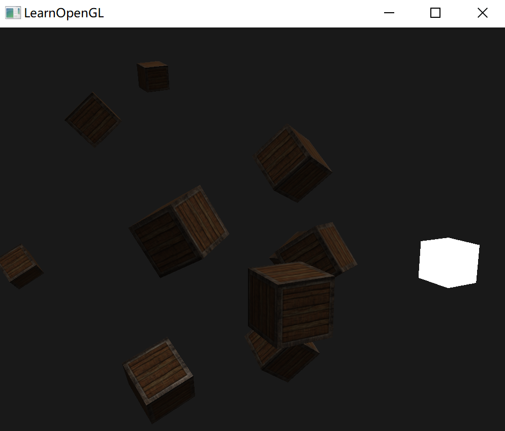

# 投光物

目前使用的光照都来自于空间中的一个点。现实世界中，有很多种类的光照，每种的表现都不同。

将光**投射**(Cast)到物体的光源叫做投光物(Light Caster)。


## 平行光

当一个光源处于很远的地方时，来自光源的每条光线就会近似于互相平行。不论物体和/或者观察者的位置，看起来好像所有的光都来自于同一个方向。

使用一个假设光源处于**无限**远处的模型时，它就被称为定向光，因为它的所有光线都有着相同的方向，它与光源的位置是没有关系的。


此时光源位置不再重要，需要关注的是光线的方向，在着色器中将光属性中的位置改为方向：

```glsl
struct Light {
    // vec3 position; // 使用定向光就不再需要了
    vec3 direction;

    vec3 ambient;
    vec3 diffuse;
    vec3 specular;
};
...
void main()
{
  vec3 lightDir = normalize(-light.direction);
  ...
}
```

之后计算 `normalize(-light.direction)` 作为光的方向即可。

最后的效果：




## 点光源

给定位置有一个光源，它会从它的光源位置开始朝着所有方向散射光线。

然而，此前光源模拟的是永远不会衰减的光线。在大部分的3D模拟中，希望模拟的光源仅照亮光源附近的区域而不是整个场景。

### 衰减

随着光线传播距离的增长逐渐削减光的强度通常叫做衰减(Attenuation)。按照以下公式：


d 代表了片段距光源的距离，还有三个衰减因子：常数项 $K_c$、一次项 $K_l$ 和二次项 $K_q$：

- 常数项通常保持为1.0，它的主要作用是保证分母永远不会比1小；
- 一次项会与距离值相乘，以线性的方式减少强度。
- 二次项会与距离的平方相乘，让光源以二次递减的方式减少强度。二次项在距离比较小的时候影响会比一次项小很多，但当距离值比较大的时候它就会比一次项更大了。


### 选择衰减因子

在大多数情况下，这都是经验的问题，以及适量的调整。

下面这个表格显示了模拟一个（大概）真实的，覆盖特定半径（距离）的光源时，这些项可能取的一些值。第一列指定的是在给定的三项时光所能覆盖的距离。这些值是大多数光源很好的起始点，

| 距离 | 常数项 | 一次项 | 二次项   |
| :--- | :----- | :----- | :------- |
| 7    | 1.0    | 0.7    | 1.8      |
| 13   | 1.0    | 0.35   | 0.44     |
| 20   | 1.0    | 0.22   | 0.20     |
| 32   | 1.0    | 0.14   | 0.07     |
| 50   | 1.0    | 0.09   | 0.032    |
| 65   | 1.0    | 0.07   | 0.017    |
| 100  | 1.0    | 0.045  | 0.0075   |
| 160  | 1.0    | 0.027  | 0.0028   |
| 200  | 1.0    | 0.022  | 0.0019   |
| 325  | 1.0    | 0.014  | 0.0007   |
| 600  | 1.0    | 0.007  | 0.0002   |
| 3250 | 1.0    | 0.0014 | 0.000007 |

常数项 $K_c$ 在所有的情况下都是1.0。一次项 $K_l$ 为了覆盖更远的距离通常都很小，二次项 $K_q$ 甚至更小。

### 实现衰减

在片段着色器中需要这三个因子：

储存在之前定义的Light结构体中：

```glsl
struct Light {
    vec3 position;  

    vec3 ambient;
    vec3 diffuse;
    vec3 specular;

    float constant;
    float linear;
    float quadratic;
};
```

在程序中设置：

```c++
lightingShader.setFloat("light.constant",  1.0f);
lightingShader.setFloat("light.linear",    0.09f);
lightingShader.setFloat("light.quadratic", 0.032f);
```

在片段着色器中完成：

1. 距光源的距离：

   ```glsl
   float distance    = length(light.position - FragPos);

2. 带入公式计算：

   ````glsl
   float attenuation = 1.0 / (light.constant + light.linear * distance + 
                   light.quadratic * (distance * distance));

3. 将这个因子乘上所有的光照分量：

   ```glsl
   ambient  *= attenuation; 
   diffuse  *= attenuation;
   specular *= attenuation;
   ```

最后的效果：


距离最近的箱子是最亮的。后排的箱子一点都没有照亮。


## 聚光

聚光是位于环境中某个位置的光源，它只朝一个特定方向而不是所有方向照射光线。

只有在聚光方向的特定半径内的物体才会被照亮，其它的物体都会保持黑暗。比图路灯或手电筒。

OpenGL 中聚光是用一个世界空间位置、一个方向和一个切光角(Cutoff Angle)来表示的。

切光角指定了聚光的半径（圆锥的半径）。对于每个片段，我们会计算片段是否位于聚光的切光方向之间（也就是在锥形内），如下图：


- `LightDir`：从片段指向光源的向量。
- `SpotDir`：聚光所指向的方向。
- `Phi`： $\phi$：指定了聚光半径的切光角。落在这个角度之外的物体都不会被这个聚光所照亮；
- `Theta`：$\theta$ ：LightDir 向量和 SpotDir 向量之间的夹角。

### 手电筒

在片段着色器增加，分别表示：光源位置、光的方向、聚光夹角余弦值：

```glsl
struct Light {
    vec3  position;
    vec3  direction;
    float cutOff;
    ...
};
```

将合适的值传到着色器中：

```c++
lightingShader.setVec3("light.position",  camera.Position);
lightingShader.setVec3("light.direction", camera.Front);
lightingShader.setFloat("light.cutOff",   glm::cos(glm::radians(12.5f)));
```

在片段着色器中，判断这个点是否在光的范围内：

```glsl
float theta = dot(lightDir, normalize(-light.direction));

if(theta > light.cutOff) 
{       
  // 执行光照计算
}
else  // 否则，使用环境光，让场景在聚光之外时不至于完全黑暗
  color = vec4(light.ambient * vec3(texture(material.diffuse, TexCoords)), 1.0);
```

1. 计算光照方向与目前到光源位置方向的夹角余弦；
2. 判断余弦是否大于 `cutOff`；
3. 如果超过范围就只使用环境光。

最后的效果：


但这个光的边缘很生硬，只要离开边缘就是黑的，实际上不应该是这样的。

为了创建一种看起来边缘平滑的聚光，需要模拟聚光有一个内圆锥(Inner Cone)和一个外圆锥(Outer Cone)。

将内圆锥设置为上一部分中的那个圆锥，再加一个外圆锥，来让光从内圆锥逐渐减暗，直到外圆锥的边界。

为了创建一个外圆锥，只需要再定义一个余弦值来代表聚光方向向量和外圆锥向量（等于它的半径）的夹角。

- 如果片段在内圆锥之内，它的强度就是1.0；
- 如果在外圆锥之外强度值就是0.0；
- 如果一个片段处于内外圆锥之间，将会给它计算出一个0.0到1.0之间的强度值。

用这个公式来计算这个值：


$\epsilon $ 表示内外圆锥的余弦值差。以下为一些实际的值：

| θ     | θ（角度） | ϕ（内光切） | ϕ（角度） | γ（外光切） | γ（角度） | ϵ                       | I                             |
| :---- | :-------- | :---------- | :-------- | :---------- | :-------- | :---------------------- | :---------------------------- |
| 0.87  | 30        | 0.91        | 25        | 0.82        | 35        | 0.91 - 0.82 = 0.09      | 0.87 - 0.82 / 0.09 = 0.56     |
| 0.9   | 26        | 0.91        | 25        | 0.82        | 35        | 0.91 - 0.82 = 0.09      | 0.9 - 0.82 / 0.09 = 0.89      |
| 0.97  | 14        | 0.91        | 25        | 0.82        | 35        | 0.91 - 0.82 = 0.09      | 0.97 - 0.82 / 0.09 = 1.67     |
| 0.83  | 34        | 0.91        | 25        | 0.82        | 35        | 0.91 - 0.82 = 0.09      | 0.83 - 0.82 / 0.09 = 0.11     |
| 0.64  | 50        | 0.91        | 25        | 0.82        | 35        | 0.91 - 0.82 = 0.09      | 0.64 - 0.82 / 0.09 = -2.0     |
| 0.966 | 15        | 0.9978      | 12.5      | 0.953       | 17.5      | 0.9978 - 0.953 = 0.0448 | 0.966 - 0.953 / 0.0448 = 0.29 |

在片段着色加上一个参数，

````glsl
struct Light {
    vec3  position;
    vec3  direction;
    float cutOff;
    float outerCutOff;
    ...
};
````

再计算：

```glsl
float theta     = dot(lightDir, normalize(-light.direction));
float epsilon   = light.cutOff - light.outerCutOff;
float intensity = clamp((theta - light.outerCutOff) / epsilon, 0.0, 1.0);    
...
// 将不对环境光做出影响，让它总是能有一点光
diffuse  *= intensity;
specular *= intensity;
...
```

使用了clamp函数，它把第一个参数约束(Clamp)在了0.0到1.0之间。这保证强度值不会在[0, 1]区间之外。


## 练习

- 尝试实验一下上面的所有光照类型和它们的片段着色器。试着对一些向量进行取反，并使用 < 来代替 >。试着解释不同视觉效果产生的原因。

  ~