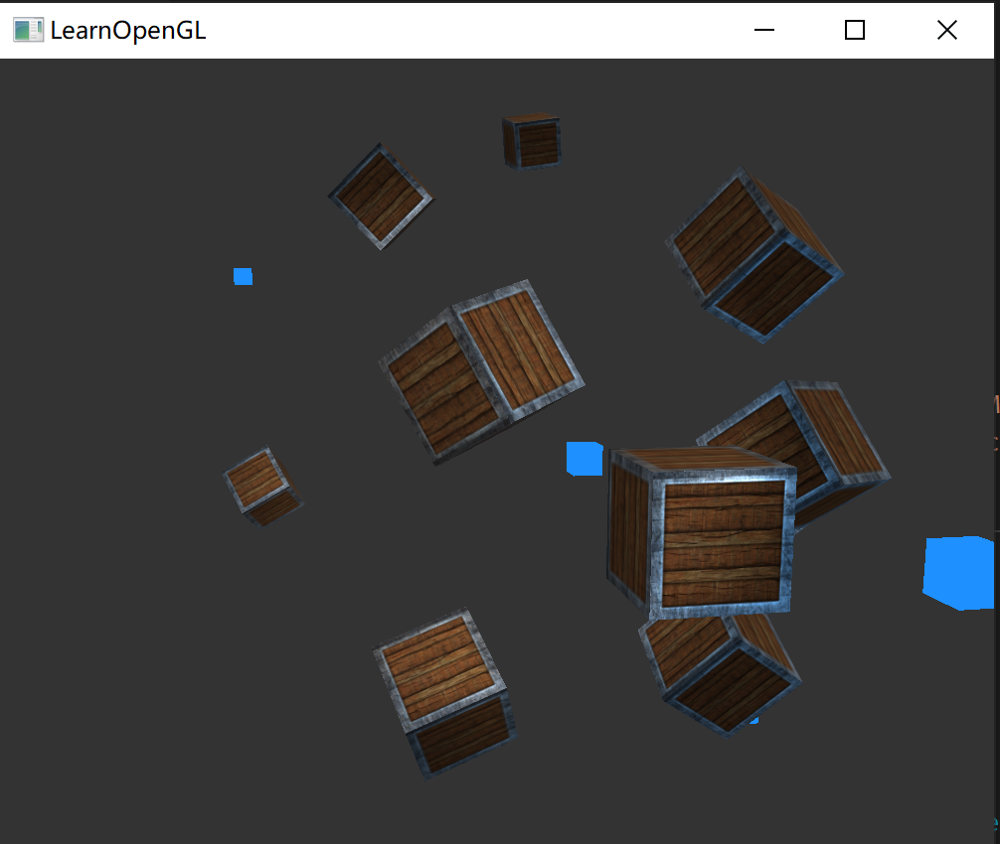

# 多光源

为了在场景中使用多个光源，希望将光照计算封装到 GLSL 函数中。每一种光源都需要一种不同的计算方法，如果只在 main 函数中进行所有的这些计算，代码很快就会变得难以理解。

每个光照类型都创建一个不同的函数：定向光、点光源和聚光。

当场景中使用多个光源时，通常使用以下方法：

- 需要有一个单独的颜色向量代表片段的输出颜色。
- 对于每一个光源，它对片段的贡献颜色将会加到片段的输出颜色向量上。所以场景中的每个光源都会计算它们各自对片段的影响，
- 并结合为一个最终的输出颜色。大体的结构会像是这样：

```glsl
out vec4 fragColor;

void main()
{
	// 定义一个颜色输出
    vec3 output;
    // 将定向光的贡献加到输出中
    output += someFunctionToCalculateDirectionalLight();
    // 对所有的点光源
    for (int i = 0; i < pointLightCnt; ++i)
    	output += someFunctionToCalculatePointLight();
    // 加上其他光，比如聚光
    output += someFunctionToCalculateSpotLight();
    
    fragColor = vec4(output, 1.0);
}
```


## 定向光

定义一个函数来计算定向光对相应片段的贡献：它接受一些参数并计算一个定向光照颜色：

首先，定义一个定向光源最少所需要的变量。将这些变量储存在一个叫做 DirLight的结构体中，并将它定义为一个 uniform：

```glsl
struct DirLight
{
    vec3 direction;
    vec3 ambient;
    vec3 diffuse;
    vec3 specular;
};
uniform DirLight dirLight;
```

接下将 dirLight 传入一个有着以下原型的函数：

```glsl
vec3 CalcDirLight(DirLight light, vec3 normal, vec3 viewDir);
```

这个函数需要一个DirLight结构体和其它两个向量来进行计算：

````glsl
vec3 CalcDirLight(DirLight light, vec3 normal, vec3 viewDir)
{
    vec2 ligthDir = normlize(-light.direction);
    // 漫反射
    float diff = max(dot(normal, ligthDir), 0.0);
    // 镜面反射
    vec3 reflectDir = reflect(-lightDir, normal);
    float spec = pow(max(dot(viewDir, reflectDir), 0.0), material.shininess);
    // 合并结果
    vec3 ambient = light.ambient * vec3(texture(material.diffuse, texCoords));
    vec3 diffuse = ligth.diffuse * diff * vec3(texture(material.diffuse, texCoords));
    vec3 specular = light.specular * spec * vec3(texture(material.specalur, texCoords));
    
    return (ambient + diffuse + specular);
}
````


## 点光源

保存点光源数据的结构体：

````glsl
struct PointLight
{
	vec3 position;
	
	float constant;
    float linear;
    float quadratic;
    
    vec3 ambient;
    vec3 diffuse;
    vec3 specular;
};
#define NR_POINT_LIGHTS 4
uniform PointLight pointLights[NR_POINT_LIGHTS];
````

计算点光源的函数：

```glsl
vec3 CalcPointLight(PointLight light, vec3 normal, vec3 fragPos, vec3 viewDir)
{
    vec3 lightDir = normalize(light.position - fragPos);
    // 漫反射
    float diff = max(dot(normal, ligthDir), 0.0);
    // 镜面反射
    vec3 reflectDir = reflect(-lightDir, normal);
    float spec = pow(max( dot(viewDir, reflectDir), 0.0 ), material.shininess);
    // 衰减
    float distance = length(light.position - fragPos);
    float attenuation = 1.0 / (light.constant + light.liner * light.quadratic * distance * distance);
    // 合并结果
    vec3 texColor;
    vec3 ambient = light.ambient * texColor;
    vec3 diffuse = light.diffuse * diff * texColor;
    vec3 specular = light.specular * spec * texColor;
   	
    return (ambient + diffuse + specular) * attenuation;
}
```


## 手电筒光源

封装一下啦~

````glsl
vec3 calcSpotLight(SpotLight light, vec3 normal, vec3 viewDir, vec3 fragPos)
{
    // 漫反射
    vec3 lightDir = normalize(light.position - fragPos);
    float diffScale = max(dot(lightDir, normal), 0.0);
    // 反射系数
    vec3 reflectDir = reflect(-lightDir, normal);
    float specScale = pow(max(dot(reflectDir, viewDir), 0.0), material.shininess);

    vec3 color = vec3(texture(material.diffuse, texCoords));
    // 环境光分量
    vec3 ambient = light.ambient * color;
    // 漫反射分量
    vec3 diffuse = light.diffuse * diffScale * color;
    // 反射光分量
    vec3 specular = light.specular * specScale * vec3(texture(material.specular, texCoords));

    // 范围衰减
    float theta = dot(lightDir, normalize(-light.direction));
    float epsilon = light.cutOff - light.outCutOff;
    float intensity = clamp((theta - light.outCutOff) / epsilon, 0.0, 1.0);
    diffuse *= intensity;
    specular *= intensity;

    return ambient + diffuse + specular;
}
````


## 混合

在片段着色器中把三个光合并起来，也比较简单。

在 GLSL 中定义数组与 C 相同！


## 练习

调整光源属性，实现下面的几个场景：


### desert

给光源的片段着色器增加一个 `uniform`：

````glsl
#version 330 core
out vec4 outColor;

uniform vec3 lightColor;

void main()
{
    outColor = vec4(lightColor, 1.0);
}
````

在程序中定义点光源颜色数组：

```c++
glm::vec3 lightColors[] = {
    glm::vec3(1.0f, 0.9f, 0.0f),
    glm::vec3(0.44f, 0.17f, 0.075),
    glm::vec3(1.0f, 0.0f, 0.1f),
};
```

然后在程序中设置光源的颜色，并且绘制之前设置 `lightColor` 的值；


### factory

也差不多，换个颜色，比 desert 更简单：



### horror


### biochemical


