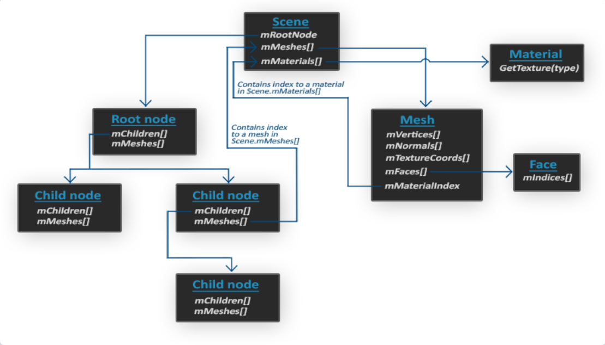

# Assimp

将各种复杂模型导入到程序。

模型通常都由3D艺术家在[Blender](http://www.blender.org/)、[3DS Max](http://www.autodesk.nl/products/3ds-max/overview)或者[Maya](http://www.autodesk.com/products/autodesk-maya/overview)这样的工具中精心制作。通过这个工具，艺术家可以不用关心实现的细节，但图形开发者，工作就是解析这些导出的模型文件以及提取所有有用的信息，将它们储存为OpenGL能够理解的格式。

## 模型加载库

一个非常流行的模型导入库是[Assimp](http://assimp.org/)，它是**Open Asset Import Library**（开放的资产导入库）的缩写。

Assimp 能够导入很多种不同的模型文件格式（并也能够导出部分的格式），它会将所有的模型数据加载至Assimp的通用数据结构中。当 Assimp 加载完模型之后，就能够从Assimp的数据结构中提取所有数据。

由于 Assimp 的数据结构保持不变，不论导入的是什么种类的文件格式，它都能够将这些不同的文件格式中抽象出来，用同一种方式访问。

当使用 Assimp 导入一个模型的时候，它通常会将整个模型加载进一个**场景**(Scene)对象，它会包含导入的模型/场景中的所有数据。Assimp 会将场景载入为一系列的节点(Node)，每个节点包含了场景对象中所储存数据的索引，每个节点都可以有任意数量的子节点。Assimp数据结构的（简化）模型如下：

- 和材质和网格(Mesh)一样，所有的场景/模型数据都包含在 Scene 对象中。Scene 对象也包含了场景根节点的引用。
- 场景的Root node（根节点）可能包含子节点（和其它的节点一样），它会有一系列指向场景对象中mMeshes数组中储存的网格数据的索引。Scene下的mMeshes数组储存了真正的Mesh对象，节点中的mMeshes数组保存的只是场景中网格数组的索引。
- 一个Mesh对象本身包含了渲染所需要的所有相关数据，像是顶点位置、法向量、纹理坐标、面(Face)和物体的材质。
- 一个网格包含了多个面。Face代表的是物体的渲染图元(Primitive)（三角形、方形、点）。一个面包含了组成图元的顶点的索引。由于顶点和索引是分开的，使用一个索引缓冲来渲染是非常简单的（见[你好，三角形](https://learnopengl-cn.github.io/01 Getting started/04 Hello Triangle/)）。
- 最后，一个网格也包含了一个Material对象，它包含了一些函数能让我们获取物体的材质属性，比如说颜色和纹理贴图（比如漫反射和镜面光贴图）。