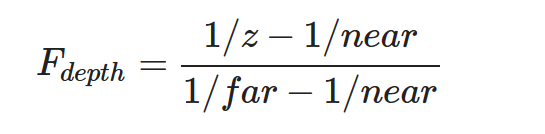

# 深度测试

运用了深度缓冲(Depth Buffer)可以防止被阻挡的面渲染到其它面的前面。

深度缓冲就像颜色缓冲(Color Buffer)（储存所有的片段颜色：视觉输出）一样，在每个片段中储存了信息，并且（通常）和颜色缓冲有着一样的宽度和高度。深度缓冲是由窗口系统自动创建的，它会以16、24或32位float的形式储存它的深度值。在大部分的系统中，深度缓冲的精度都是24位的。

当深度测试(Depth Testing)被启用的时候，OpenGL会将一个片段的深度值与深度缓冲的内容进行对比。OpenGL会执行一个深度测试，如果这个测试通过了的话，深度缓冲将会更新为新的深度值。如果深度测试失败了，片段将会被丢弃。

深度缓冲是在片段着色器运行之后（以及模板测试(Stencil Testing)运行之后）在屏幕空间中运行的。

屏幕空间坐标与通过OpenGL的glViewport所定义的视口密切相关，并且可以直接使用GLSL内建变量gl_FragCoord从片段着色器中直接访问。gl_FragCoord的x和y分量代表了片段的屏幕空间坐标（其中(0, 0)位于左下角）。gl_FragCoord中也包含了一个z分量，它包含了片段真正的深度值。z值就是需要与深度缓冲内容所对比的那个值。

深度测试默认是禁用的，所以如果要启用深度测试的话，用GL_DEPTH_TEST选项来启用它：

````c++
glEnable(GL_DEPTH_TEST)
````

当它启用的时候，

- 如果一个片段通过了深度测试的话，OpenGL会在深度缓冲中储存该片段的z值；
- 如果没有通过深度缓冲，则会丢弃该片段。

如果启用了深度缓冲，还应该在每个渲染迭代之前使用GL_DEPTH_BUFFER_BIT来清除深度缓冲，否则仍使用上一次渲染迭代中的写入的深度值：

```c++
glClear(GL_COLOR_BUFFER_BIT | GL_DEPTH_BUFFER_BIT);
```

某些情况下会需要对所有片段都执行深度测试并丢弃相应的片段，但**不**希望更新深度缓冲。即使用一个只读的(Read-only)深度缓冲，使用如下设置：

```c++
glDepthMask(GL_FALSE);
```

只在深度测试被启用的时候才有效果。


## 深度测试函数

OpenGL允许用户修改深度测试中使用的比较运算符。

这可以控制 OpenGL 什么时候该通过或丢弃一个片段，什么时候去更新深度缓冲。可以调用 `glDepthFunc` 函数来设置比较运算符（或者说深度函数(Depth Function)）：

```c++
glDepthFunc(GL_LESS);
```

还有这些比较运算符：

| 函数        | 描述                                         |
| :---------- | :------------------------------------------- |
| GL_ALWAYS   | 永远通过深度测试                             |
| GL_NEVER    | 永远不通过深度测试                           |
| GL_LESS     | 在片段深度值小于缓冲的深度值时通过测试       |
| GL_EQUAL    | 在片段深度值等于缓冲区的深度值时通过测试     |
| GL_LEQUAL   | 在片段深度值小于等于缓冲区的深度值时通过测试 |
| GL_GREATER  | 在片段深度值大于缓冲区的深度值时通过测试     |
| GL_NOTEQUAL | 在片段深度值不等于缓冲区的深度值时通过测试   |
| GL_GEQUAL   | 在片段深度值大于等于缓冲区的深度值时通过测试 |

默认情况下使用的深度函数是 `GL_LESS`，它将会丢弃深度值大于等于当前深度缓冲值的所有片段。


## 深度值精度

深度缓冲包含了一个介于0.0和1.0之间的深度值，它将会与观察者视角所看见的场景中所有物体的z值进行比较。观察空间的z值可能是投影平截头体的**近平面**(Near)和**远平面**(Far)之间的任何值。

需要一种方式来将这些观察空间的z值变换到[0, 1]范围之间，其中的一种方式就是将它们线性变换到[0, 1]范围之间。下面这个（线性）方程将z值变换到了0.0到1.0之间的深度值：


这里的 $near$ 和 $far$ 值是供给投影矩阵设置可视平截头体的（见[坐标系统](https://learnopengl-cn.github.io/01 Getting started/08 Coordinate Systems/)）那个 *near* 和 *far* 值。这个方程需要平截头体中的一个z值，并将它变换到了[0, 1]的范围中。z值和对应的深度值之间的关系可以在下图中看到：


实践中是几乎永远不会使用这样的线性深度缓冲(Linear Depth Buffer)。

需要使用一个非线性的深度方程，它是与 1/z 成正比的。它做的就是在z值很小的时候提供非常高的精度，而在z值很远的时候提供更少的精度。

这样的一个考虑了远近距离的方程是这样的：




深度值很大一部分是由很小的z值所决定的，这给了近处的物体很大的深度精度。


## 深度缓冲的可视化

片段着色器中，内建 gl_FragCoord 向量的z值包含了那个特定片段的深度值。

使用片段着色器的深度返回一个颜色：

````glsl
void main()
{
    FragColor = vec4(vec3(gl_FragCoord.z), 1.0);
}
````

实际运行后，所有东西都是白色：


因为只有距离很近，才有高的精度


可以让片段非线性的深度值变换为线性的。

首先将深度值变换为NDC（[0, 1] -> [-1 1]）：

```glsl
float z = depth * 2.0 - 1.0
```

使用获取到的z值，应用逆变换来获取线性的深度值：

```glsl
float linearDepth = (2.0 * near * far) / (far + near - z * (far - near));
```

这是完整的片段着色器代码：

```glsl
#version 330 core
out vec4 FragColor;

float near = 0.1; 
float far  = 100.0; 

float LinearizeDepth(float depth) 
{
    float z = depth * 2.0 - 1.0; // back to NDC 
    return (2.0 * near * far) / (far + near - z * (far - near));    
}

void main()
{             
    float depth = LinearizeDepth(gl_FragCoord.z) / far; // 为了演示除以 far
    FragColor = vec4(vec3(depth), 1.0);
}
```


## 深度冲突

两个平面或者三角形非常紧密地平行排列在一起时会发生，深度缓冲没有足够的精度来决定两个形状哪个在前面。结果就是这两个形状不断地在切换前后顺序，这会导致很奇怪的花纹。这个现象叫做深度冲突(Z-fighting)。

比如箱子和地面重合的部分。箱子的底部不断地在箱子底面与地板之间切换，形成一个锯齿的花纹。

### 防止深度冲突

- 不要把多个物体摆得太靠近，以至于它们的一些三角形会重叠。
- 尽可能将近平面设置远一些。精度在靠近**近**平面时是非常高的，所以将**近**平面远离观察者，会对整个平截头体有着更大的精度。
- 使用更高精度的深度缓冲。大部分深度缓冲的精度都是24位的，但现在大部分的显卡都支持32位的深度缓冲，这将会极大地提高精度。

