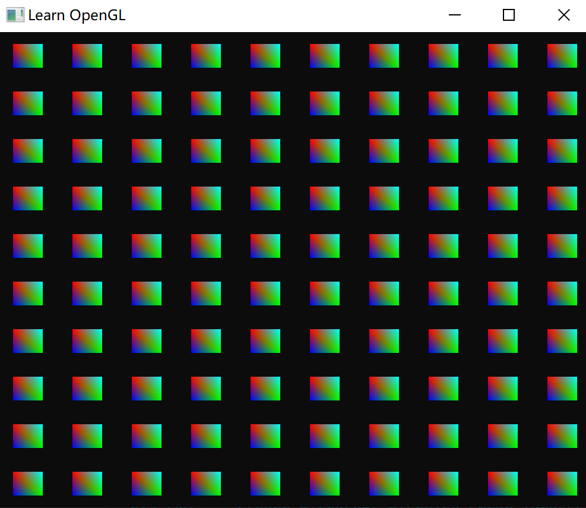
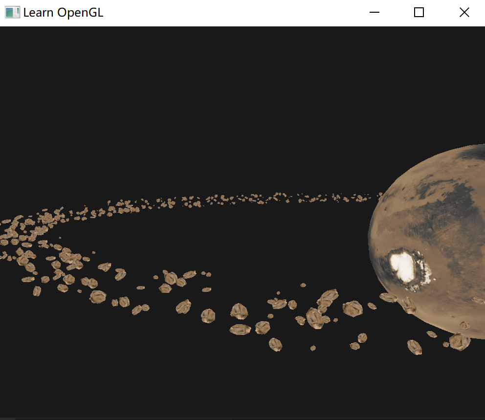
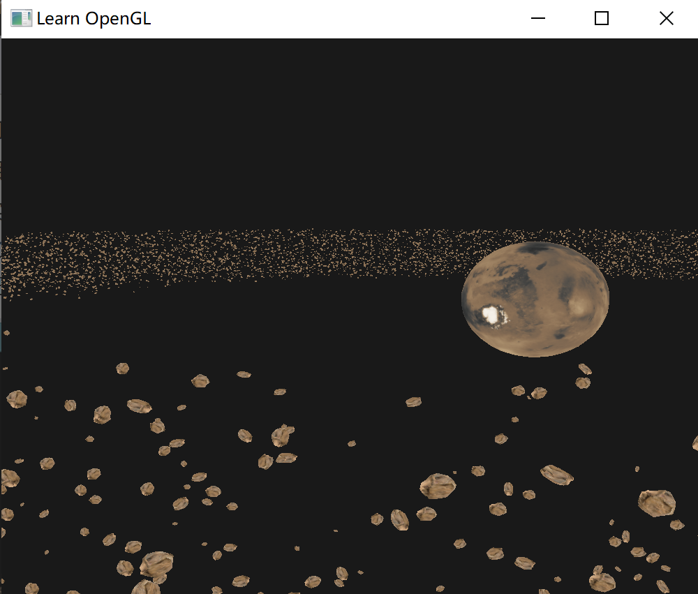

# 实例化

如果一个场景包含大量某个物体，比如充满草。渲染一个草很快，但上千个渲染函数调用却会极大地影响性能。

````c++
for(unsigned int i = 0; i < amount_of_models_to_draw; i++)
{
    DoSomePreparations(); // 绑定VAO，绑定纹理，设置uniform等
    glDrawArrays(GL_TRIANGLES, 0, amount_of_vertices);
}
````

与绘制顶点本身相比，使用 `glDrawArrays` 或 `glDrawElements` 函数告诉 GPU 去绘制顶点数据会消耗更多的性能，因为 OpenGL 在绘制顶点数据之前需要做很多准备工作（告诉 GPU 该从哪个缓冲读取数据，从哪寻找顶点属性，而且这些都是在相对缓慢的 CPU 到 GPU 总线(CPU to GPU Bus)上进行的）。所以，即便渲染顶点非常快，命令GPU去渲染却未必。

如果能够将数据一次性发送给 GPU，然后使用一个绘制函数让 OpenGL 利用这些数据绘制多个物体，就会更方便了。这就是实例化(Instancing)。

实例化使用一个渲染调用来绘制多个物体，来节省每次绘制物体时 CPU -> GPU 的通信。

如果想使用实例化渲染，只需将 `glDrawArrays` 和 `glDrawElements` 的渲染调用分别改为 `glDrawArraysInstanced` 和 `glDrawElementsInstanced`。

这些渲染函数的**实例化**版本需要一个额外的参数，叫做实例数量(Instance Count)，设置需要渲染的实例个数。

但显然在同一个位置绘制同一个物体没有什么意义，所以需要改变每个实例的世界坐标。GLSL在顶点着色器中嵌入内建变量 `gl_InstanceID`。

在使用实例化渲染调用时，`gl_InstanceID` 从 0 开始，在每个实例被渲染时递增 1。可以建立一个数组，保存对应索引实例化的偏移位置。

绘制一个 100 个正方形的例子：

每个四边形由2个三角形所组成，一共有6个顶点。每个顶点包含一个2D的标准化设备坐标位置向量和一个颜色向量：

````c++
float quadVertices[] = {
    // 位置          // 颜色
    -0.05f,  0.05f,  1.0f, 0.0f, 0.0f,
     0.05f, -0.05f,  0.0f, 1.0f, 0.0f,
    -0.05f, -0.05f,  0.0f, 0.0f, 1.0f,

    -0.05f,  0.05f,  1.0f, 0.0f, 0.0f,
     0.05f, -0.05f,  0.0f, 1.0f, 0.0f,   
     0.05f,  0.05f,  0.0f, 1.0f, 1.0f                   
};  
````

片段着色器从顶点着色器获得颜色，并且输出：

````glsl
#version 330 core
out vec4 FragColor;

in vec3 fColor;

void main()
{
    FragColor = vec4(fColor, 1.0);
}
````

在顶点着色器中，创建一个 `uniform` 类型的 `vec2` 数组，每个代表对应位置的偏移。

````glsl
#version 330 core
layout (location = 0) in vec2 aPos;
layout (location = 1) in vec3 aColor;

out vec3 fColor;

uniform vec2 offsets[100];

void main()
{
    vec2 offset = offsets[gl_InstanceID];
    gl_Position = vec4(aPos + offset, 0.0, 1.0);
    fColor = aColor;
}
````

并且根据 `gl_Position` 得到偏移，附加到每个实例上。

在程序中定义这 100 个偏移：

````c++
glm::vec2 translations[100];
int index = 0;
float offset = 0.1f;
for(int y = -10; y < 10; y += 2)
{
    for(int x = -10; x < 10; x += 2)
    {
        glm::vec2 translation;
        translation.x = (float)x / 10.0f + offset;
        translation.y = (float)y / 10.0f + offset;
        translations[index++] = translation;
    }
}
````

同时赋值到着色程序：

````c++
shader.use();
for(unsigned int i = 0; i < 100; i++)
{
    stringstream ss;
    string index;
    ss << i; 
    index = ss.str(); 
    shader.setVec2(("offsets[" + index + "]").c_str(), translations[i]);
}
````

最后执行实例化版本的绘制函数：

```c++
glDrawArraysInstanced(GL_TRIANGLES, 0, 6, 100);
```

其中最后一个参数指定绘制数量。




## 实例化数组

如果要渲染远超过 100 个实例，最终会超过最大能够发送至着色器的uniform数据大小上限。可以使用实例化数组解决。

实例化数组被定义为一个顶点属性，把偏移保存到顶点本身的内存数据中：

```c++
#version 330 core
layout (location = 0) in vec2 aPos;
layout (location = 1) in vec3 aColor;
layout (location = 2) in vec2 aOffset;

out vec3 fColor;

void main()
{
    gl_Position = vec4(aPos + aOffset, 0.0, 1.0);
    fColor = aColor;
}
```

但会存在一个问题，一个偏移量一个是针对某个物体的所有顶点都是相同的，如果使用普通的顶点属性，每个顶点都需要定义一个偏移。如果绘制的是三角形，就有很多重复的数据。

所以这个部分的属性不能普通方式配置。

先创建一个偏移量数组，这个数组的每一个元素代表一个图元的偏移，而不是一个顶点！

并且这个属性不会跟其他属性一起放在同一个数组缓冲中，需要多定义一个：

````c++
unsigned int instanceVBO;
glGenBuffers(1, &instanceVBO);
glBindBuffer(GL_ARRAY_BUFFER, instanceVBO);
glBufferData(GL_ARRAY_BUFFER, sizeof(glm::vec2) * 100, &translations[0], GL_STATIC_DRAW);
glBindBuffer(GL_ARRAY_BUFFER, 0);
````

这个缓冲数组专门保存偏移数据。之后就需要定义属性指针：

```c++
glEnableVertexAttribArray(2);
glBindBuffer(GL_ARRAY_BUFFER, instanceVBO);
glVertexAttribPointer(2, 2, GL_FLOAT, GL_FALSE, 2 * sizeof(float), (void*)0);
glBindBuffer(GL_ARRAY_BUFFER, 0);   
glVertexAttribDivisor(2, 1);
```

注意，这个属性是独立在一个缓冲数组中，不是跟其他的一起。

特别的是最后一行，调用了 `glVertexAttribDivisor`。这个函数告诉了OpenGL该**什么时候**更新顶点属性的内容至新一组数据。它的第一个参数是需要的顶点属性，第二个参数是属性除数(Attribute Divisor)。

- 除数是0，告诉 OpenGL 在顶点着色器的每次迭代时更新顶点属性。
- 为 1 时，告诉 OpenGL 在渲染一个新实例的时候更新顶点属性。
- 为 2 时，每2个实例更新一次属性，以此类推。

这里设置为 1，表示每个图元更新一次。

> 两个缓冲对象都会被保存到这个 VAO 中，OpenGL 知道几号属性要去哪个缓冲对象的哪个位置找。


## 小行星带

在宇宙中有一个大的行星，它位于小行星带的中央。这样的小行星带可能包含成千上万的岩块，在很不错的显卡上也很难完成这样的渲染。

实例化渲染正是适用于这样的场景，因为所有的小行星都可以使用一个模型来表示。每个小行星可以再使用不同的变换矩阵来进行少许的变化。

对每个小行星，需要一个变换矩阵，使得大小位置角度都不相同。

先不使用实例化绘制：

````c++
unsigned int amount = 1000;
glm::mat4 *modelMatrices;
modelMatrices = new glm::mat4[amount];
srand(glfwGetTime()); // 初始化随机种子    
float radius = 50.0;
float offset = 2.5f;
for(unsigned int i = 0; i < amount; i++)
{
    glm::mat4 model;
    // 1. 位移：分布在半径为 'radius' 的圆形上，偏移的范围是 [-offset, offset]
    float angle = (float)i / (float)amount * 360.0f;
    float displacement = (rand() % (int)(2 * offset * 100)) / 100.0f - offset;
    float x = sin(angle) * radius + displacement;
    displacement = (rand() % (int)(2 * offset * 100)) / 100.0f - offset;
    float y = displacement * 0.4f; // 让行星带的高度比x和z的宽度要小
    displacement = (rand() % (int)(2 * offset * 100)) / 100.0f - offset;
    float z = cos(angle) * radius + displacement;
    model = glm::translate(model, glm::vec3(x, y, z));

    // 2. 缩放：在 0.05 和 0.25f 之间缩放
    float scale = (rand() % 20) / 100.0f + 0.05;
    model = glm::scale(model, glm::vec3(scale));

    // 3. 旋转：绕着一个（半）随机选择的旋转轴向量进行随机的旋转
    float rotAngle = (rand() % 360);
    model = glm::rotate(model, rotAngle, glm::vec3(0.4f, 0.6f, 0.8f));

    // 4. 添加到矩阵的数组中
    modelMatrices[i] = model;
}  
````

在渲染循环中绘制：

````c++
// 绘制行星
shader.use();
glm::mat4 model =  glm::mat4(1.0f);
model = glm::translate(model, glm::vec3(0.0f, -3.0f, 0.0f));
model = glm::scale(model, glm::vec3(4.0f, 4.0f, 4.0f));
shader.setMat4("model", model);
planet.Draw(shader);

// 绘制小行星
for(unsigned int i = 0; i < amount; i++)
{
    shader.setMat4("model", modelMatrices[i]);
    rock.Draw(shader);
}  
````



如果将数量改大就会很卡。

现在对其修改为实例化，先修改顶点着色器：

```glsl
#version 330 core
layout (location = 0) in vec3 aPos;
layout (location = 2) in vec2 aTexCoords;
layout (location = 3) in mat4 instanceMatrix;

out vec2 TexCoords;

uniform mat4 projection;
uniform mat4 view;

void main()
{
    gl_Position = projection * view * instanceMatrix * vec4(aPos, 1.0); 
    TexCoords = aTexCoords;
}
```

使用一个属性作为单个图元的变换矩阵。

创建属性指针：

````c++
// 顶点缓冲对象
unsigned int buffer;
glGenBuffers(1, &buffer);
glBindBuffer(GL_ARRAY_BUFFER, buffer);
glBufferData(GL_ARRAY_BUFFER, amount * sizeof(glm::mat4), &modelMatrices[0], GL_STATIC_DRAW);

for(unsigned int i = 0; i < rock.meshes.size(); i++)
{
    unsigned int VAO = rock.meshes[i].VAO;
    glBindVertexArray(VAO);
    // 顶点属性
    GLsizei vec4Size = sizeof(glm::vec4);
    glEnableVertexAttribArray(3); 
    glVertexAttribPointer(3, 4, GL_FLOAT, GL_FALSE, 4 * vec4Size, (void*)0);
    glEnableVertexAttribArray(4); 
    glVertexAttribPointer(4, 4, GL_FLOAT, GL_FALSE, 4 * vec4Size, (void*)(vec4Size));
    glEnableVertexAttribArray(5); 
    glVertexAttribPointer(5, 4, GL_FLOAT, GL_FALSE, 4 * vec4Size, (void*)(2 * vec4Size));
    glEnableVertexAttribArray(6); 
    glVertexAttribPointer(6, 4, GL_FLOAT, GL_FALSE, 4 * vec4Size, (void*)(3 * vec4Size));

    glVertexAttribDivisor(3, 1);
    glVertexAttribDivisor(4, 1);
    glVertexAttribDivisor(5, 1);
    glVertexAttribDivisor(6, 1);

    glBindVertexArray(0);
}  
````

因为一个模型有多个图元，即多个 Mesh，所以对这些模型的同一个 Mesh 需要调用一次 `glDrawElementsInstanced` 。

````c++
// 绘制小行星
instanceShader.use();
for(unsigned int i = 0; i < rock.meshes.size(); i++)
{
    glBindVertexArray(rock.meshes[i].VAO);
    glDrawElementsInstanced(
        GL_TRIANGLES, rock.meshes[i].indices.size(), GL_UNSIGNED_INT, 0, amount
    );
}
````


