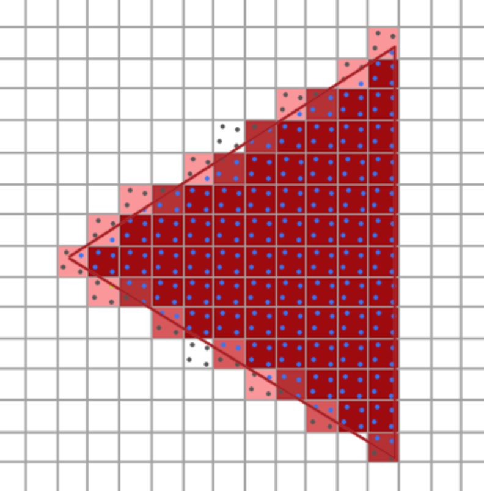

# 锯齿状

渲染得到的图像边缘是锯齿状的图案：


这种现象被称之为走样(Aliasing)。种抗锯齿（Anti-aliasing，也被称为反走样）的技术能够缓解这种现象，从而产生更**平滑**的边缘。


## 多重采样

光栅器是位于最终处理过的顶点之后到片段着色器之前所经过的所有的算法与过程的总和。

光栅器会将一个图元的所有顶点作为输入，并将它转换为一系列的片段。顶点坐标理论上可以取任意值，但片段不行，因为它们受限于窗口的分辨率。

顶点坐标与片段之间也不会有一对一的映射，所以光栅器必须以某种方式来决定每个顶点最终所在的片段/屏幕坐标。


比如这个三角形，每个像素的中心包含一个采样点。某个像素是否被覆盖取决于采样点是否被图元覆盖，最后得到这样的效果：


多重采样(Multisample Anti-aliasing, MSAA)所做的正是将单一的采样点变为多个采样点。一个像素中使用四个采样点。由这些像素的遮盖程度决定像素的颜色，被覆盖的越多，颜色越深。


如上图，使用了多重采样后输出的颜色不再是白色。因为两个点被遮挡，所以输出没有那么深的蓝色。

颜色的计算规则是：每个被覆盖的采样点各自颜色的平均。

比如这里两个被颜色覆盖，两个没有覆盖，所以平均就是谈蓝色。

对上面的三角形使用多重采样：


得到的结果是：



这样，使得三角形的边缘颜色有过度，看起来就会平滑一些。


## 多重采样的使用

在创建窗口之前调用 `glfwWindowHint` 来完成：

````c++
glfwWindowHint(GLFW_SAMPLES, 4);
````

现在再调用 `glfwCreateWindow` 创建渲染窗口时，每个屏幕坐标就会使用一个包含4个子采样点的颜色缓冲。

请求多重缓冲后，还需要启动：

````c++
glEnable(GL_MULTISAMPLE);
````
