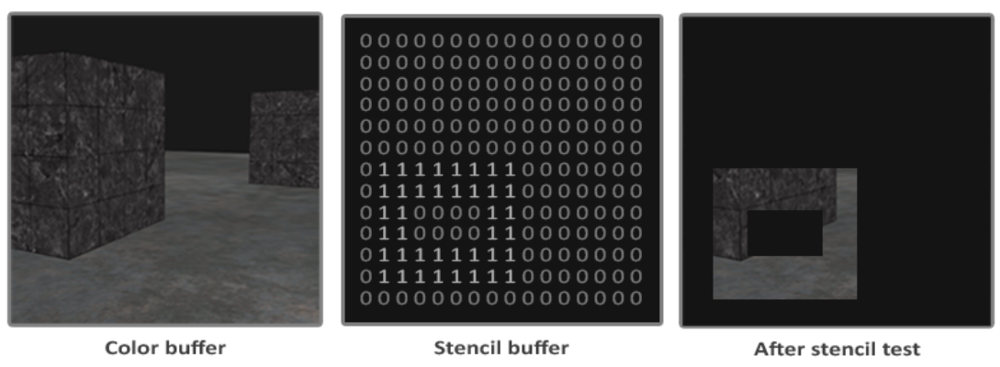
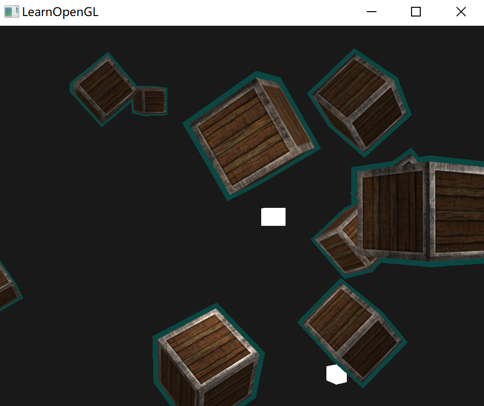

# 模板测试

当片段着色器处理完一个片段之后，模板测试(Stencil Test)会开始执行，和深度测试一样，它也可能会丢弃片段。

接下来，被保留的片段会进入深度测试，它可能会丢弃更多的片段。模板测试是根据又一个缓冲来进行的，它叫做模板缓冲(Stencil Buffer)。

一个模板缓冲中，（通常）每个模板值(Stencil Value)是8位的。所以每个像素/片段一共能有256种不同的模板值。可以将这些模板值设置为我们想要的值，然后当某一个片段有某一个模板值的时候，就可以选择丢弃或是保留这个片段了。

模板缓冲的一个简单的例子：



模板缓冲首先会被清除为0，之后在模板缓冲中使用1填充了一个空心矩形。场景中的片段将会只在片段的模板值为1的时候会被渲染（其它的都被丢弃了）。

使用模板缓冲的步骤：

1. 启动模板缓冲的写入；
2. 渲染物体，更新模板缓冲的内容；
3. 禁用模板缓冲写入；
4. 渲染其他物体，根据模板缓冲丢弃特定片段。

所以，使用模板缓冲，可以根据场景中已绘制的其它物体的片段，来决定是否丢弃特定的片段。

启用GL_STENCIL_TEST来启用模板测试：

```c++
glEnable(GL_STENCIL_TEST);
```

和颜色和深度缓冲一样，在每次迭代之前清除模板缓冲。

```c++
glClear(GL_COLOR_BUFFER_BIT | GL_DEPTH_BUFFER_BIT | GL_STENCIL_BUFFER_BIT);
```

`glStencilMask` 可以设置一个位掩码(Bitmask)，与将要写入缓冲的模板值进行与(AND)运算。

默认情况下设置的位掩码所有位都为1，不影响输出，但如果设置为`0x00`，写入缓冲的所有模板值最后都会变成0.这与深度测试中的 `glDepthMask(GL_FALSE)` 是等价的。

```c++
glStencilMask(0xFF); // 每一位写入模板缓冲时都保持原样
glStencilMask(0x00); // 每一位在写入模板缓冲时都会变成0（禁用写入）
```

> 大部分情况下都只会使用`0x00`或者`0xFF`作为模板掩码(Stencil Mask)。


## 模板函数

和深度测试一样，对模板缓冲应该通过还是失败，以及它应该如何影响模板缓冲，也是有一定控制的。一共有两个函数能够用来配置模板测试：glStencilFunc和glStencilOp。

### `glStencilFunc`

```c++
glStencilFunc(GLenum func, GLint ref, GLuint mask)
```

- `func`：设置模板测试函数(Stencil Test Function)。这个测试函数将会应用到已储存的模板值上和glStencilFunc函数的`ref`值上。可用的选项有：GL_NEVER、GL_LESS、GL_LEQUAL、GL_GREATER、GL_GEQUAL、GL_EQUAL、GL_NOTEQUAL和GL_ALWAYS。它们的语义和深度缓冲的函数类似。
- `ref`：设置了模板测试的参考值(Reference Value)。模板缓冲的内容将会与这个值进行比较。
- `mask`：设置一个掩码，它将会与参考值和储存的模板值在测试比较它们之前进行与(AND)运算。初始情况下所有位都为1。

比如：

```c++
glStencilFunc(GL_EQUAL, 1, 0xFF)
```

告诉 OpenGL，只要一个片段的模板值等于(因为使用了 `GL_EQUAL`)参考值1，片段将会通过测试并被绘制，否则会被丢弃。

但是 glStencilFunc 仅仅描述了 OpenGL 应该对模板缓冲内容做什么，而不是如何更新缓冲。这就需要glStencilOp这个函数了。

### `glStencilOp`

````c++
glStencilOp(GLenum sfail, GLenum dpfail, GLenum dppass)
````

- `sfail`：模板测试失败时采取的行为。
- `dpfail`：模板测试通过，但深度测试失败时采取的行为。
- `dppass`：模板测试和深度测试都通过时采取的行为。

每个选项都可以选用以下的其中一种行为：

| 行为         | 描述                                               |
| :----------- | :------------------------------------------------- |
| GL_KEEP      | 保持当前储存的模板值                               |
| GL_ZERO      | 将模板值设置为0                                    |
| GL_REPLACE   | 将模板值设置为glStencilFunc函数设置的`ref`值       |
| GL_INCR      | 如果模板值小于最大值则将模板值加1                  |
| GL_INCR_WRAP | 与GL_INCR一样，但如果模板值超过了最大值则归零      |
| GL_DECR      | 如果模板值大于最小值则将模板值减1                  |
| GL_DECR_WRAP | 与GL_DECR一样，但如果模板值小于0则将其设置为最大值 |
| GL_INVERT    | 按位翻转当前的模板缓冲值                           |

默认情况下glStencilOp是设置为`(GL_KEEP, GL_KEEP, GL_KEEP)`的，所以不论任何测试的结果是如何，模板缓冲都会保留它的值。


## 物体轮廓

一个使用模板测试就可以完成的有用特性——物体轮廓(Object Outlining)。为每个（或者一个）物体在它的周围创建一个很小的有色边框。

1. 在绘制（需要添加轮廓的）物体之前，将模板函数设置为GL_ALWAYS，每当物体的片段被渲染时，将模板缓冲更新为1；
2. 渲染物体；
3. 禁用模板写入以及深度测试；
4. 将每个物体缩放一点点；
5. 使用一个不同的片段着色器，输出一个单独的（边框）颜色；
6. 再次绘制物体，但只在它们片段的模板值不等于1时才绘制；
7. 再次启用模板写入和深度测试。

> 绘制轮廓的思路就是：先把物体的本身画出来，把这些数据保存到模板缓冲中，表示这些部分之后不会被绘制出。
>
> 之后再绘制一个单一颜色的，大一点的物体，此时原物体的部分会因为模板缓冲隐藏。

给轮廓一个很简单的着色器，就是输出单一的颜色：

````glsl
void main()
{
	FragColor = vec4(0.04, 0.28, 0.26, 1.0);
}
````

在渲染之前，开始模板测试，设置通过或者失败的行为：

```c++
glEnable(GL_STENCIL_TEST);
glStencilOp(GL_KEEP, GL_KEEP, GL_REPLACE);
```

只有模板测试和深度测试都通过了，将储存的模板值设置为参考值（通过 `glStencilFunc` 设置的参数）。如果其中的一个测试失败了，什么都不做。

就是说先绘制物体，它们的测试都会通过，那么就会以某个值保存保存。

所以在绘制物体前：

```c++
glStencilFunc(GL_ALWAYS, 1, 0xFF); // 所有的片段都应该更新模板缓冲
glStencilMask(0xFF); // 启用模板缓冲写入
normalShader.use();
DrawTwoContainers();
```

对物体中所有绘制的片段，将模板值更新为1。

> 通过使用GL_ALWAYS模板测试函数，保证了物体的每个片段都会将模板缓冲的模板值更新为1。
>
> 因为片段永远会通过模板测试，在绘制片段的地方，模板缓冲会被更新为参考值 1。

现在模板缓冲在箱子被绘制的地方都更新为1了，将要绘制放大的箱子，但这次要禁用模板缓冲的写入：

````c++
glStencilFunc(GL_NOTEQUAL, 1, 0xFF);
glStencilMask(0x00); // 禁止模板缓冲的写入
glDisable(GL_DEPTH_TEST);
shaderSingleColor.use(); 
DrawTwoScaledUpContainers();
````

将模板函数设置为GL_NOTEQUAL，保证只绘制箱子上模板值不为1的部分，即只绘制箱子在之前绘制的箱子之外的部分。也禁用了深度测试，让放大的箱子，即边框，不会被地板所覆盖。

在完成之后重新启用深度缓冲。

得到的效果：

