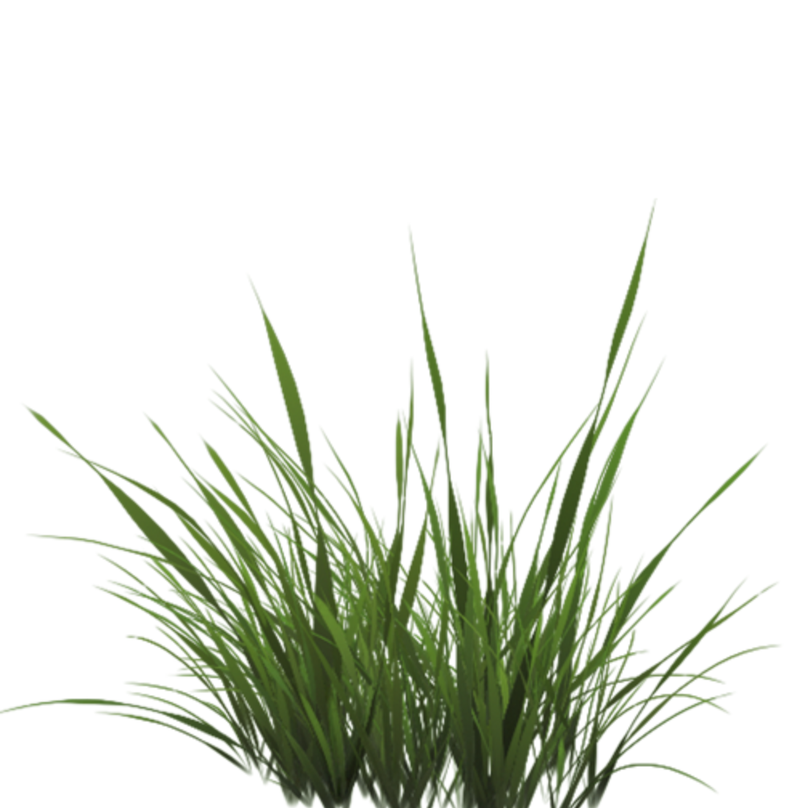
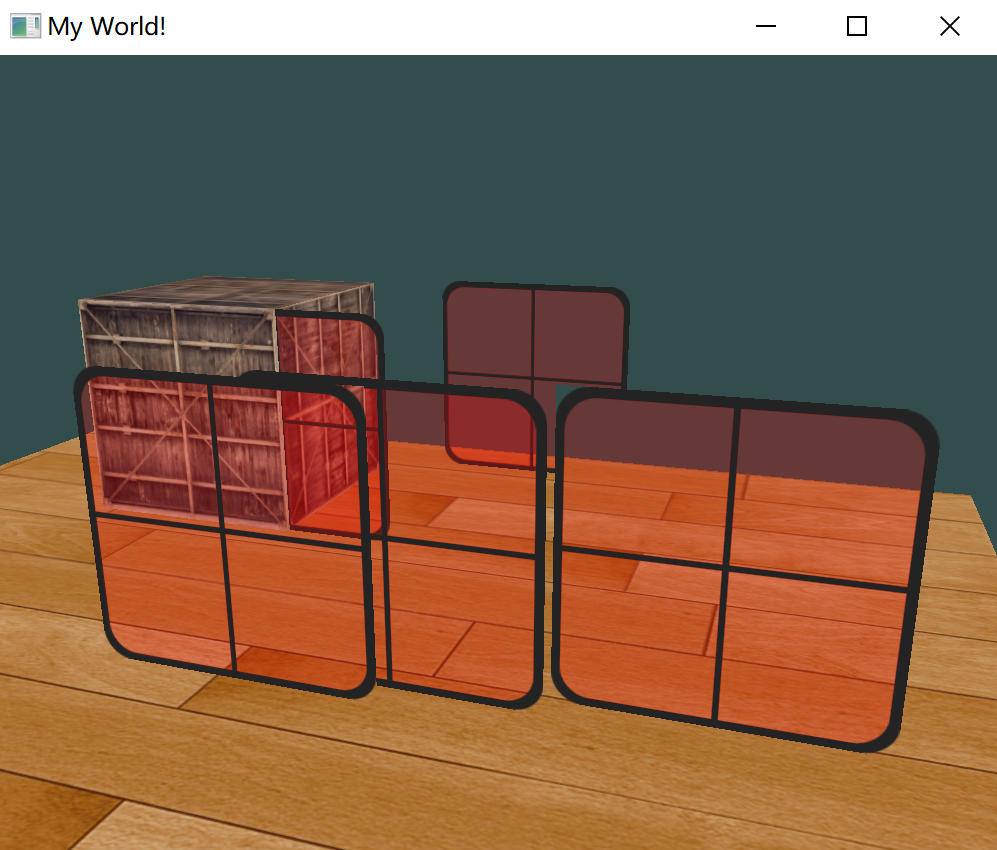

# 混合

OpenGL 中，混合(Blending)通常是实现物体透明度(Transparency)的一种技术。透明就是说一个物体（或者其中的一部分）不是纯色(Solid Color)的，它的颜色是物体本身的颜色和它背后其它物体的颜色的不同强度结合。

混合(Blend)（不同物体的）多种颜色为一种颜色。所以透明度能使得看穿物体。


- 完全透明的（让所有的颜色穿过）
- 半透明的（它让颜色通过，同时也会显示自身的颜色）

一个物体的透明度是通过它颜色的 alpha 值来决定的。Alpha 颜色值是颜色向量的第四个分量。

- 当alpha值为0.0时物体将会是完全透明的；
- 当alpha值为0.5时，物体的颜色有50%是来自物体自身的颜色，50%来自背后物体的颜色；
- 当alpha值为 1.0 表示完全不透明。


## 丢弃片段

有些图片并不需要半透明，只需要根据纹理颜色值，显示一部分，或者不显示一部分（alpha 要么 1 要么 0），没有中间情况，比如草：



想要丢弃(Discard)显示纹理中透明部分的片段，不将这些片段存储到颜色缓冲中。

stb_image 库会自动加载 alpha 值，只是需要在纹理生成时开启 alpha 通道：

```c++
glTexImage2D(GL_TEXTURE_2D, 0, GL_RGBA, width, height, 0, GL_RGBA, GL_UNSIGNED_BYTE, data);
```

并且修改片段着色器，不再指定 alpha 为 1.0：

````glsl
void main()
{
    // FragColor = vec4(vec3(texture(texture1, TexCoords)), 1.0);
    FragColor = texture(texture1, TexCoords);
}
````


为了在场景中消除草的透明纹理，OpenGL 默认不会处理，可以手动在片段着色器处理：

```glsl
#version 330 core
out vec4 FragColor;

in vec2 TexCoords;

uniform sampler2D texture1;

void main()
{             
    vec4 texColor = texture(texture1, TexCoords);
    if(texColor.a < 0.1)
        discard;
    FragColor = texColor;
}
```

判断 `texColor.a` 的值，如果大小，就执行 `discard` ，保证片段不会被进一步处理，所以就不会进入颜色缓冲。


## 混合

虽然直接丢弃片段很好，但它不能渲染半透明的图像，要么渲染一个片段，要么完全丢弃它。

要想渲染有多个透明度级别的图像，需要启用混合(Blending)。和OpenGL大多数的功能一样，启用 `GL_BLEND` 来启用混合：

````c++
glEnable(GL_BLEND);
````

启用了混合之后，需要告诉OpenGL它该**如何**混合。通过下面这个方程实现：


- $\overline C_{source}$：源颜色向量。这是源自纹的颜色向量；
- $\overline C_{destination}$：目标颜色向量。这是当前储存在颜色缓冲中的颜色向量；
- $\overline F_{source}$：源因子值。指定了alpha值对源颜色的影响；
- $\overline F_{destination}$：目标因子值。指定了alpha值对目标颜色的影响；

片段着色器运行完成后，并且所有的测试都通过之后，这个混合方程(Blend Equation)才会应用到片段颜色输出与当前颜色缓冲中的值上。

源颜色和目标颜色将会由OpenGL自动设定，但源因子和目标因子的值可以由用户来决定。比如：


有两个方形，希望将这个半透明的绿色方形绘制在红色方形之上。红色的方形将会是目标颜色（所以它应该先在颜色缓冲中），将要在这个红色方形之上绘制这个绿色方形。

所以，有透明度的颜色应该是绿色方形，所以绿方形作为源，乘上 alpha，加上红色方形作为目标，乘上 1 - alpha：


结果就是重叠方形的片段包含了一个60%绿色，40%红色的一种脏兮兮的颜色：


最终的颜色将会被储存到颜色缓冲中，替代之前的颜色。

`glBlendFunc` (GLenum sfactor, GLenum dfactor)函数接受两个参数，来设置源和目标因子。

OpenGL 定义了很多个选项，下面列出大部分最常用的选项：

| 选项                          | 值                                                     |
| :---------------------------- | :----------------------------------------------------- |
| `GL_ZERO`                     | 因子等于00                                             |
| `GL_ONE`                      | 因子等于11                                             |
| `GL_SRC_COLOR`                | 因子等于源颜色向量 $\overline C_{source}$              |
| `GL_ONE_MINUS_SRC_COLOR`      | 因子等于 $1 - \overline C_{source}$                    |
| `GL_DST_COLOR`                | 因子等于目标颜色向量 $\overline C_{destination}$       |
| `GL_ONE_MINUS_DST_COLOR`      | 因子等于 $1 - \overline C_{destination}$               |
| `GL_SRC_ALPHA`                | 因子等于 $\overline C_{source}$ 的 alpha 分量          |
| `GL_ONE_MINUS_SRC_ALPHA`      | 因子等于  $1 - \overline C_{source}$ 的 alpha 分量     |
| `GL_DST_ALPHA`                | 因子等于  $\overline C_{destination}$ 的 alpha 分量    |
| `GL_ONE_MINUS_DST_ALPHA`      | 因子等于  $1 - \overline C_{destination}$ 的alpha 分量 |
| `GL_CONSTANT_COLOR`           | 因子等于常数颜色向量 $\overline C_{constant}$          |
| `GL_ONE_MINUS_CONSTANT_COLOR` | 因子等于 $1-\overline C_{constant}$                    |
| `GL_CONSTANT_ALPHA`           | 因子等于 $\overline C_{constant}$ 的 alpha 分量        |
| `GL_ONE_MINUS_CONSTANT_ALPHA` | 因子等于 $1-\overline C_{constant}$ 的alpha 分量       |

为了获得之前两个方形的混合结果，需要使用源颜色向量的 alpha 作为源因子，使用 1−alpha1 作为目标因子。这将会产生以下的 `glBlendFunc`：

```c++
glBlendFunc(GL_SRC_ALPHA, GL_ONE_MINUS_SRC_ALPHA);
```


## 渲染半透明纹理

首先，在初始化时启用混合，并设定相应的混合函数：

```c++
glEnable(GL_BLEND);
glBlendFunc(GL_SRC_ALPHA, GL_ONE_MINUS_SRC_ALPHA);
```

启用混合后，设置片段着色器：

```glsl
#version 330 core
out vec4 FragColor;

in vec2 TexCoords;

uniform sampler2D texture1;

void main()
{             
    FragColor = texture(texture1, TexCoords);
}
```

现在（每当OpenGL渲染了一个片段时）它都会将当前片段的颜色和当前颜色缓冲中的片段颜色根据 alpha 值来进行混合。由于窗户纹理的玻璃部分是半透明的，能通窗户中看到背后的场景。



可以看到，绘制的效果有一点奇怪，有些位置没有被透视。

## 顺序问题

要想让混合在多个物体上工作，需要最先绘制最远的物体，最后绘制最近的物体。

普通不需要混合的物体仍然可以使用深度缓冲正常绘制，所以它们不需要排序。

但要保证它们在绘制（排序的）透明物体之前已经绘制完毕了。

当绘制一个有不透明和透明物体的场景的时候，原则如下：

1. 先绘制所有不透明的物体。
2. 对所有透明的物体排序。
3. 按顺序绘制所有透明的物体。

排序透明物体的一种方法是，从观察者视角获取物体的距离。这可以通过计算摄像机位置向量和物体的位置向量之间的距离所获得。接下来把距离和它对应的位置向量存储到一个 STL 库的 map 数据结构中。map会自动根据键值(Key)对它的值排序，所以只要添加了所有的位置，并以它的距离作为键，它们就会自动根据距离值排序了。

````c++
std::map<float, glm::vec3> sorted;
for (unsigned int i = 0; i < windows.size(); i++)
{
    float distance = glm::length(camera.Position - windows[i]);
    sorted[distance] = windows[i];
}
````

在渲染的时候，将以逆序（从远到近）从map中获取值，之后以正确的顺序绘制对应的窗户：

```c++
for(std::map<float,glm::vec3>::reverse_iterator it = sorted.rbegin(); it != sorted.rend(); ++it) 
{
    model = glm::mat4();
    model = glm::translate(model, it->second);              
    shader.setMat4("model", model);
    glDrawArrays(GL_TRIANGLES, 0, 6);
}
```

最后的效果：

