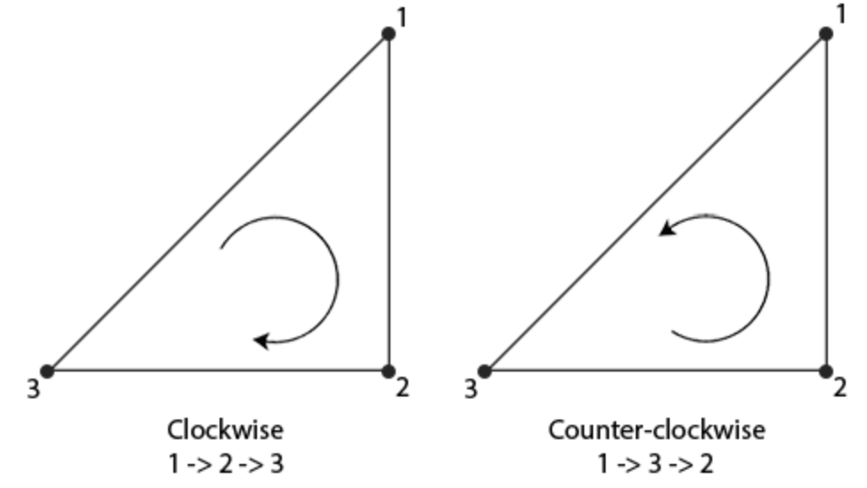
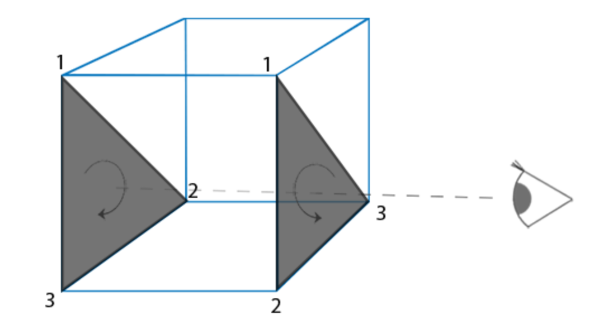
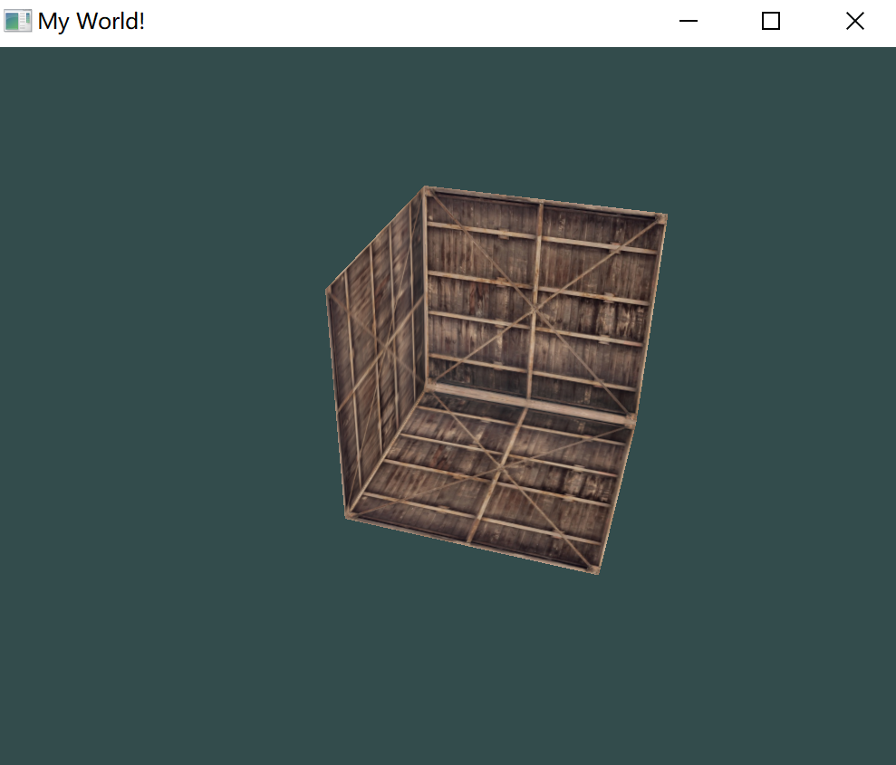
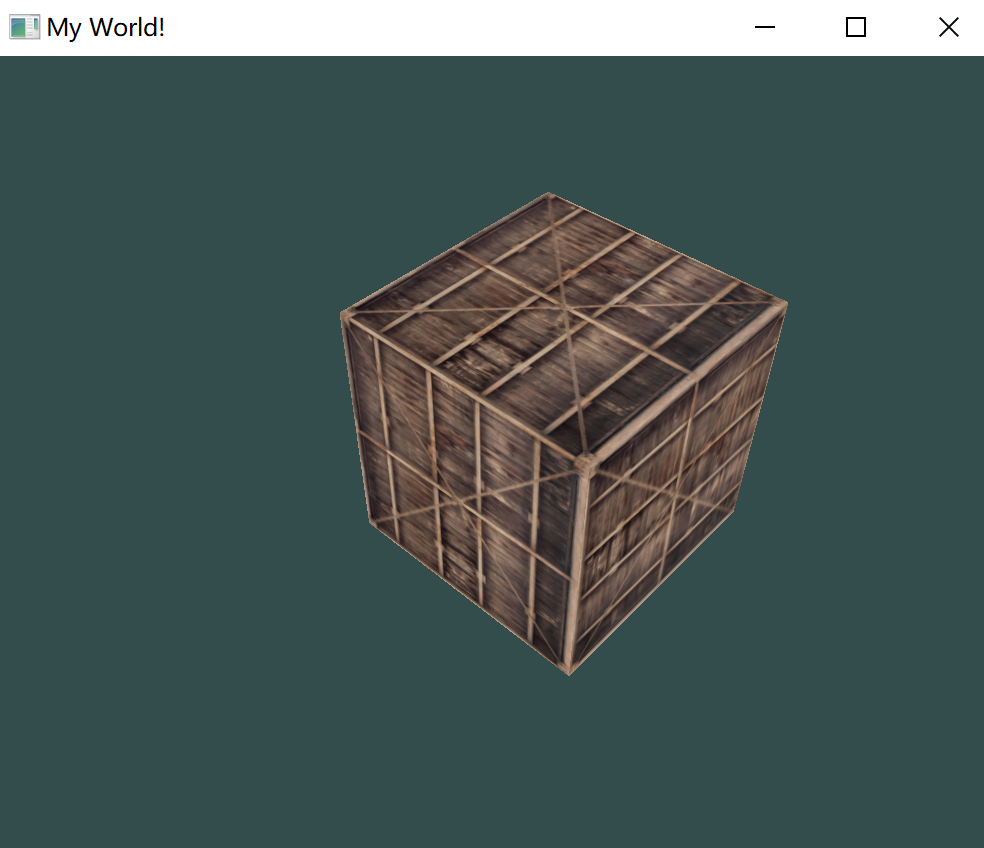

# 面剔除

在 3D 实际中，对一个立方体，在某个视角来说，最多只能看到三个面。所以可以设法将其丢弃，减小着色器的工作量。

OpenGL 能够检查所有面向(Front Facing)观察者的面，并渲染它们，而丢弃那些背向(Back Facing)的面，节省很多的片段着色器调用。

但需要告诉 OpenGL 哪些面是正向面(Front Face)，哪些面是背向面(Back Face)。OpenGL 使用了一个很聪明的技巧，分析顶点数据的环绕顺序(Winding Order)。


## 环绕顺序

定义一组三角形顶点时，会以特定的环绕顺序来定义它们，可能是顺时针(Clockwise)的，也可能是逆时针(Counter-clockwise)的。

每个三角形由 3 个顶点所组成，从三角形中间来看，为这 3 个顶点设定一个环绕顺序：



OpenGL 在渲染图元的时候将使用这个信息来决定一个三角形是一个正向三角形还是背向三角形。

默认情况下，逆时针顶点所定义的三角形将会被处理为正向三角形。

当用户定义顶点顺序的时候，应该想象对应的三角形是面向用户的，所以定义的三角形从正面看去应该是逆时针的。

结果就是，摄像机面向的三角形将会是正向三角形，而背面的三角形则是背向三角形：



在顶点数据中，将两个三角形都以逆时针顺序定义（正面的三角形是1、2、3，背面的三角形也是1、2、3）。

然而，如果从观察者当前视角使用 1、2、3 的顺序来绘制的话，从观察者的方向来看，背面的三角形将会是以顺时针顺序渲染的。这正是想要剔除（Cull，丢弃）的不可见面。


## 面剔除

启用OpenGL的GL_CULL_FACE选项，开始进行面剔除，OpenGL 自动根据三角形的方向剔除那些不可以图元。

````c++
glEnable(GL_CULL_FACE);
````

从这一句代码之后，所有背向面都将被丢弃，能够节省50%以上的性能。

但注意这只对像立方体这样的封闭形状有效。对透明的物体，必须要再次禁用面剔除。

使用 glCullFace 来定义 OpenGL 剔除哪种三角形图元：

````c++
glCullFace(GL_FRONT);
````

有三个可用的选项：

- `GL_BACK`：只剔除背向面。
- `GL_FRONT`：只剔除正向面。
- `GL_FRONT_AND_BACK`：剔除正向面和背向面。

使用 `glFrontFace` 告诉 OpenGL 将哪个方向的面定义为正向面：

````c++
glFrontFace(GL_CCW);
````

默认值是GL_CCW，它代表的是逆时针的环绕顺序，另一个选项是GL_CW，它代表的是顺时针顺序。


如果进入箱子，就看不到任何面了。

如果设置为正面不可见：



地面也不见了。


## 练习

- 重新定义顶点数据，将每个三角形设置为顺时针顺序，并将顺时针的三角形设置为正向面，仍将场景渲染出来吗？

  把所有三角形的第三个点放到第二位置即可：

  