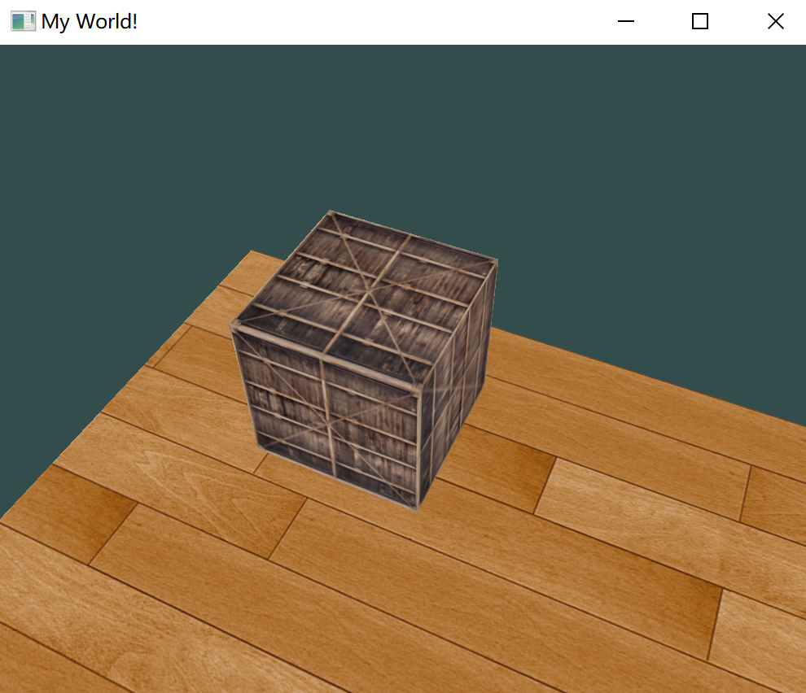
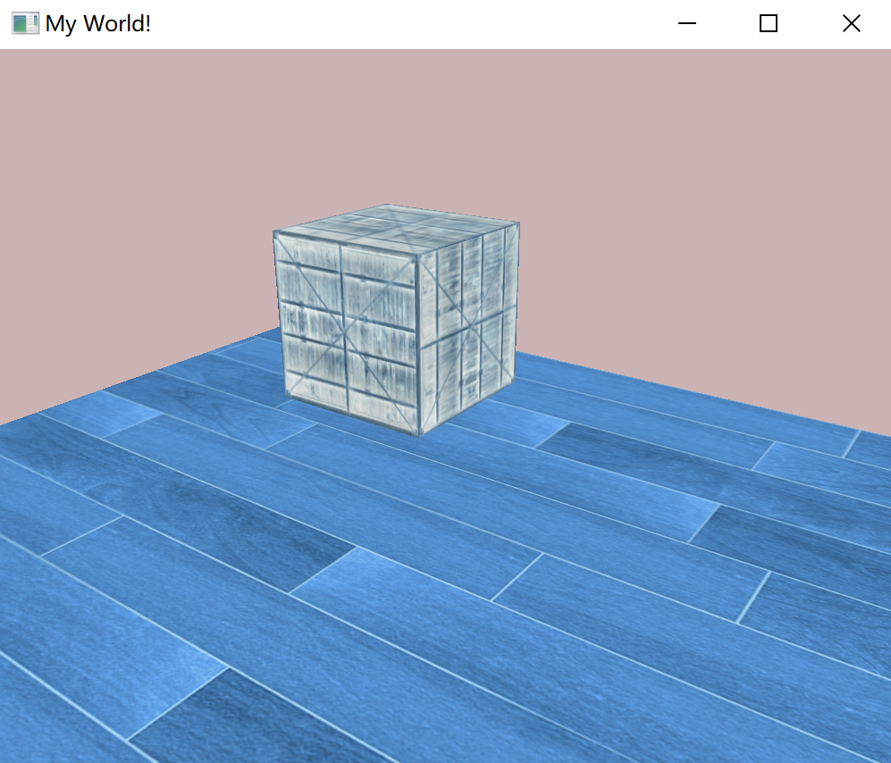
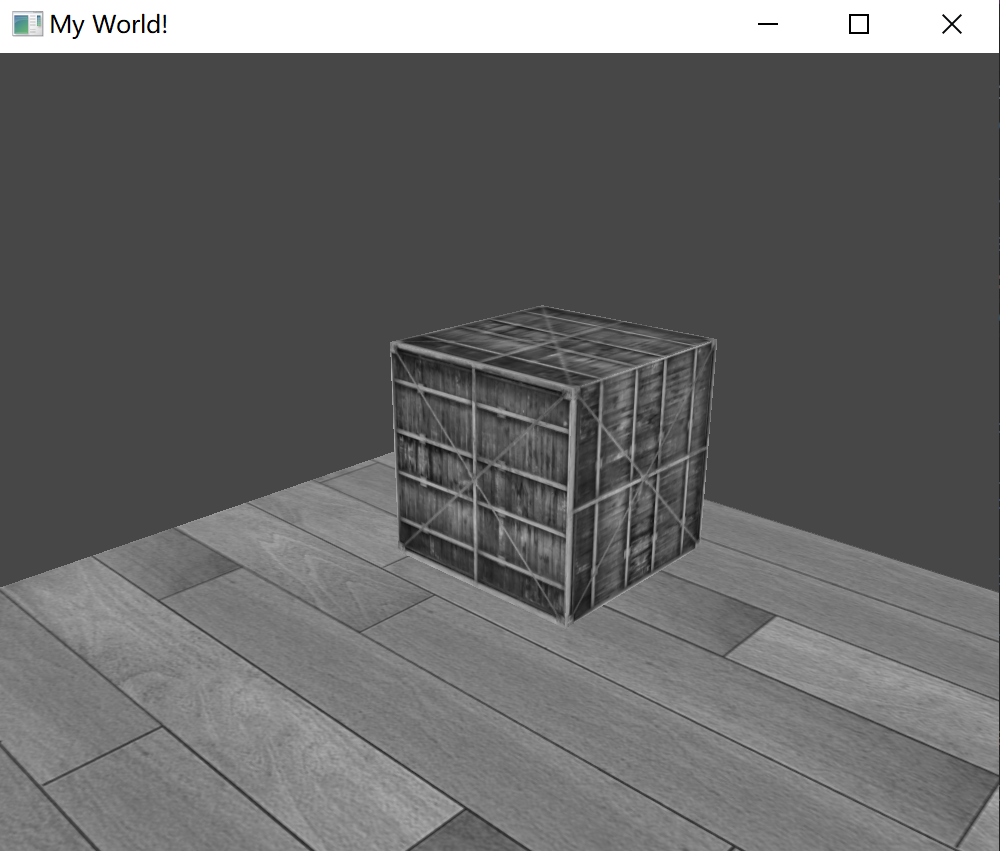
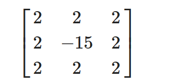
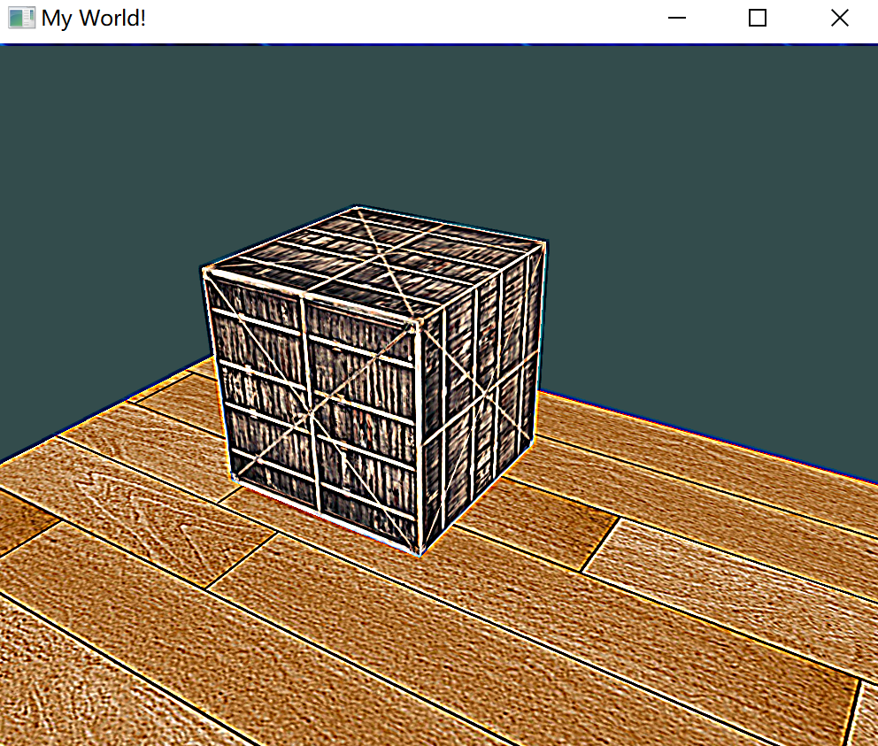
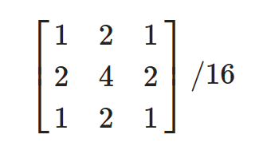
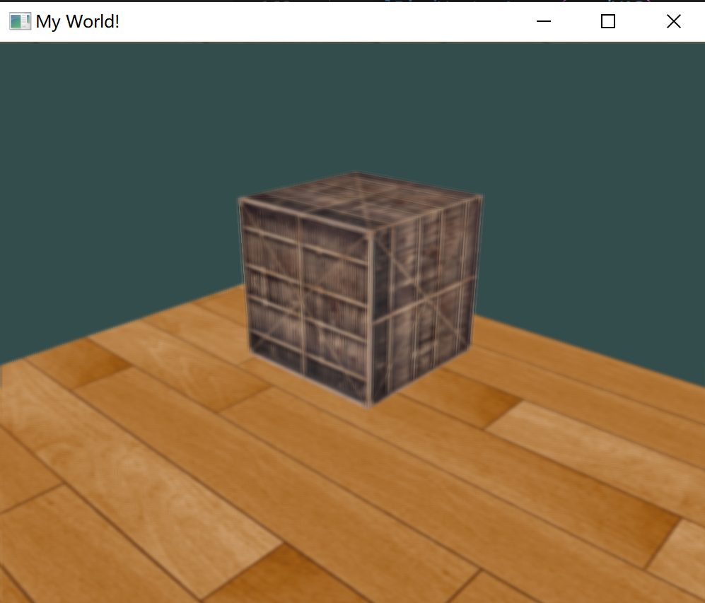
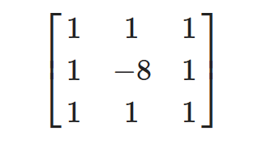
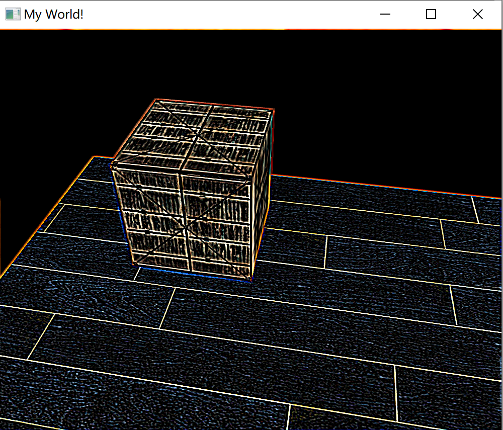

# 帧缓冲

用于写入颜色值的颜色缓冲、用于写入深度信息的深度缓冲和允许我们根据一些条件丢弃特定片段的模板缓冲。这些缓冲结合起来叫做帧缓冲(Framebuffer)，它被储存在内存中。

OpenGL 允许用户定义自己的帧缓冲。

目前所做的所有操作都是在默认帧缓冲的渲染缓冲上进行的（在创建窗口的时候生成和配置的（GLFW完成））。


## 创建帧缓冲

`glGenFramebuffers` 创建帧缓冲对象：

````c++
unsigned int fbo;
glGenFramebuffers(1, &fbo);
````

使用glBindFramebuffer来绑定帧缓冲：

````c++
glBindFramebuffer(GL_FRAMEBUFFER, fbo);
````

在绑定到GL_FRAMEBUFFER目标之后，所有的**读取**和**写入**帧缓冲的操作将会影响当前绑定的帧缓冲。

也可以使用 `GL_READ_FRAMEBUFFER` 或 `GL_DRAW_FRAMEBUFFER` 参数，将一个帧缓冲分别绑定到读取目标或写入目标。

一个完整的帧缓冲需要满足以下的条件：

- 附加至少一个缓冲（颜色、深度或模板缓冲）；
- 至少有一个颜色附件(Attachment)；
- 所有的附件都必须是完整的（保留了内存）；
- 每个缓冲都应该有相同的样本数。

以 `GL_FRAMEBUFFER` 为参数调用 `glCheckFramebufferStatus`，检查帧缓冲是否完整。如果返回的是 `GL_FRAMEBUFFER_COMPLETE`，帧缓冲就是完整的：

```
if(glCheckFramebufferStatus(GL_FRAMEBUFFER) == GL_FRAMEBUFFER_COMPLETE)
{
}
```

用户创建的帧缓冲不是默认的帧缓冲，渲染指令不会对视觉输出有任何影响。所以为了渲染到主窗口，就需要再激活默认帧缓冲（其为 0 号），即绑定 0 号帧缓冲：

````c++
glBindFramebuffer(GL_FRAMEBUFFER, 0);
````

删除帧缓冲：

````c++
glDeleteFramebuffers(1, &fbo);
````

### 纹理附件

当把一个纹理附加到帧缓冲的时候，所有的渲染指令将会写入到这个纹理中，就像它是一个普通的颜色/深度或模板缓冲一样。

为帧缓冲创建一个纹理和创建一个普通的纹理差不多：

````c++
unsigned int texture;
glGenTextures(1, &texture);
glBindTexture(GL_TEXTURE_2D, texture);

glTexImage2D(GL_TEXTURE_2D, 0, GL_RGB, 800, 600, 0, GL_RGB, GL_UNSIGNED_BYTE, NULL);

glTexParameteri(GL_TEXTURE_2D, GL_TEXTURE_MIN_FILTER, GL_LINEAR);
glTexParameteri(GL_TEXTURE_2D, GL_TEXTURE_MAG_FILTER, GL_LINEAR);
````

主要的区别就是，将维度设置为了屏幕大小（尽管这不是必须的），并且给纹理的`data`参数传递了`NULL`。

仅仅分配了内存而没有填充它。填充这个纹理将会在渲染到帧缓冲之后来进行。同样并不关心环绕方式或多级渐远纹理，大多数情况下都不会需要它们。

将纹理附加到帧缓冲上：

````c++
glFramebufferTexture2D(GL_FRAMEBUFFER, GL_COLOR_ATTACHMENT0, GL_TEXTURE_2D, texture, 0);
````

`glFrameBufferTexture2D` 的参数：

- `target`：帧缓冲的目标（绘制、读取或者两者皆有）
- `attachment`：想要附加的附件类型。当前附加的是颜色附件；
- `textarget`：希望附加的纹理类型；
- `texture`：要附加的纹理本身；
- `level`：多级渐远纹理的级别。

除了颜色附件之外，还可以附加一个深度和模板缓冲纹理到帧缓冲对象中。

- 附加深度纹理：将附件类型设置为 `GL_DEPTH_ATTACHMENT`，将纹理类型设置为 `GL_DEPTH_COMPONENT`；
- 模板深度纹理：将附件类型设置为 `GL_STENCIL_ATTACHMENT`，将纹理类型设置为 `GL_STENCIL_INDEX`。

也可以将深度缓冲和模板缓冲附加为一个单独的纹理。纹理的每32位数值将包含24位的深度信息和8位的模板信息。使用 `GL_DEPTH_STENCIL_ATTACHMENT` 类型：

````c++
glTexImage2D(
  GL_TEXTURE_2D, 0, GL_DEPTH24_STENCIL8, 800, 600, 0, 
  GL_DEPTH_STENCIL, GL_UNSIGNED_INT_24_8, NULL
);

glFramebufferTexture2D(GL_FRAMEBUFFER, GL_DEPTH_STENCIL_ATTACHMENT, GL_TEXTURE_2D, texture, 0);
````

### 渲染缓冲对象附件

渲染缓冲对象直接将所有的渲染数据储存到它的缓冲中，不会做任何针对纹理格式的转换，让它变为一个更快的可写储存介质。

因为它的数据已经是原生的格式了，当写入或者复制它的数据到其它缓冲中时是非常快的。

创建渲染缓冲对象：

```c++
unsigned int rbo;
glGenRenderbuffers(1, &rbo);
```

绑定渲染缓冲对象：

````c++
glBindRenderbuffer(GL_RENDERBUFFER, rbo);
````

渲染缓冲对象通常都是只写的，它们会经常用于深度和模板附件，因为大部分时间都不需要从深度和模板缓冲中读取值，只关心深度和模板测试。

glRenderbufferStorage 函数来创建一个深度和模板渲染缓冲对象：

````c++
glRenderbufferStorage(GL_RENDERBUFFER, GL_DEPTH24_STENCIL8, 800, 600);
````

创建一个渲染缓冲对象和纹理对象类似，不同的是这个对象是专门被设计作为帧缓冲附件使用的，而不是纹理那样的通用数据缓冲(General Purpose Data Buffer)。

这里选择 `GL_DEPTH24_STENCIL8` 作为内部格式，它封装了24位的深度和8位的模板缓冲。

附加这个渲染缓冲对象：

````c++
glFramebufferRenderbuffer(GL_FRAMEBUFFER, GL_DEPTH_STENCIL_ATTACHMENT, GL_RENDERBUFFER, rbo);
````

通常的规则是：

- 如果不需要从一个缓冲中采样数据，使用渲染缓冲对象；
- 如果需要从缓冲中采样颜色或深度值等数据，选择纹理附件。性能方面它不会产生非常大的影响的。


## 渲染到纹理

把场景渲染到一个附加帧缓冲对象上的颜色纹理中，之后在一个横跨屏幕的四边形上绘制这纹理。

首先要创建一个帧缓冲对象，并绑定它：

````c++
unsigned int framebuffer;
glGenFramebuffers(1, &framebuffer);
glBindFramebuffer(GL_FRAMEBUFFER, framebuffer);
````

需要创建一个纹理图像，将它作为一个颜色附件附加到帧缓冲上：

````c++
// 生成纹理
unsigned int texColorBuffer;
glGenTextures(1, &texColorBuffer);
glBindTexture(GL_TEXTURE_2D, texColorBuffer);
glTexImage2D(GL_TEXTURE_2D, 0, GL_RGB, 800, 600, 0, GL_RGB, GL_UNSIGNED_BYTE, NULL);
glTexParameteri(GL_TEXTURE_2D, GL_TEXTURE_MIN_FILTER, GL_LINEAR );
glTexParameteri(GL_TEXTURE_2D, GL_TEXTURE_MAG_FILTER, GL_LINEAR);
glBindTexture(GL_TEXTURE_2D, 0);

// 将它附加到当前绑定的帧缓冲对象
glFramebufferTexture2D(GL_FRAMEBUFFER, GL_COLOR_ATTACHMENT0, GL_TEXTURE_2D, texColorBuffer, 0);  
````

因为这里采样深度、模板测试，即不需要采样缓冲，渲染缓冲对象是更好的选择。

创建一个渲染缓冲对象：

````c++
unsigned int rbo;
glGenRenderbuffers(1, &rbo);
glBindRenderbuffer(GL_RENDERBUFFER, rbo); 
glRenderbufferStorage(GL_RENDERBUFFER, GL_DEPTH24_STENCIL8, 800, 600);  
glBindRenderbuffer(GL_RENDERBUFFER, 0);
````

将渲染缓冲对象附加到帧缓冲的深度**和**模板附件上：

````c++
glFramebufferRenderbuffer(GL_FRAMEBUFFER, GL_DEPTH_STENCIL_ATTACHMENT, GL_RENDERBUFFER, rbo);
````

希望检查帧缓冲是否是完整：

````c++
if(glCheckFramebufferStatus(GL_FRAMEBUFFER) != GL_FRAMEBUFFER_COMPLETE)
    std::cout << "ERROR::FRAMEBUFFER:: Framebuffer is not complete!" << std::endl;
glBindFramebuffer(GL_FRAMEBUFFER, 0);
````

解绑帧缓冲，保证不会不小心渲染到错误的帧缓冲上。

现在这个帧缓冲就完整了，只需要绑定这个帧缓冲对象，让渲染到帧缓冲的缓冲中而不是默认的帧缓冲中。

之后的渲染指令将会影响当前绑定的帧缓冲。所有的深度和模板操作都会从当前绑定的帧缓冲的深度和模板附件中（如果有的话）读取。

要想绘制场景到一个纹理上，采取以下的步骤：

1. 将新的帧缓冲绑定为激活的帧缓冲，和往常一样渲染场景；
2. 绑定默认的帧缓冲；
3. 绘制一个横跨整个屏幕的四边形，将帧缓冲的颜色缓冲作为它的纹理。

为了绘制这个四边形，新创建一套简单的着色器：

````glsl
#version 330 core
layout (location = 0) in vec2 aPos;
layout (location = 1) in vec2 aTexCoords;

out vec2 TexCoords;

void main()
{
    gl_Position = vec4(aPos.x, aPos.y, 0.0, 1.0); 
    TexCoords = aTexCoords;
}
````

````glsl
#version 330 core
out vec4 FragColor;

in vec2 TexCoords;

uniform sampler2D screenTexture;

void main()
{ 
    FragColor = texture(screenTexture, TexCoords);
}
````

帧缓冲的一个渲染迭代将会有以下的结构：

````c++
// 第一处理阶段(Pass)
glBindFramebuffer(GL_FRAMEBUFFER, framebuffer);
glClearColor(0.1f, 0.1f, 0.1f, 1.0f);
glClear(GL_COLOR_BUFFER_BIT | GL_DEPTH_BUFFER_BIT); // 我们现在不使用模板缓冲
glEnable(GL_DEPTH_TEST);
DrawScene();    

// 第二处理阶段
glBindFramebuffer(GL_FRAMEBUFFER, 0); // 返回默认
glClearColor(1.0f, 1.0f, 1.0f, 1.0f); 
glClear(GL_COLOR_BUFFER_BIT);

screenShader.use();  
glBindVertexArray(quadVAO);
glDisable(GL_DEPTH_TEST);
glBindTexture(GL_TEXTURE_2D, textureColorbuffer);
glDrawArrays(GL_TRIANGLES, 0, 6);  
````

每个帧缓冲都有它自己一套缓冲，希望设置合适的位，各自调用 glClear，清除这些缓冲。

最后的效果跟正常的一样：



> 现在屏幕绘制出来的就是一张纹理，这个纹理的大小是屏幕大小。这个纹理是从用户创建的帧缓冲读出来的。
>
> 就是说，每一次渲染循环，先把帧缓冲换到自定义的，接下来对这个帧缓冲操作，绘制地面、绘制箱子等。但目前都没有对屏幕的帧缓冲有任何影响。但因为设置了纹理附加，写入到这个帧缓冲的图像数据被保存在纹理附加中。
>
> 之后切到默认的屏幕缓冲，把这个纹理附加直接画在屏幕上。所以多定义了一个很简单的着色器，就是画一个 2D 的纹理。


## 后期处理

整个场景都被渲染到了一个纹理上，可以简单地通过修改纹理数据创建出一些非常有意思的效果。

### 反相

修改片段着色器，让其反向：

````glsl
void main()
{
    FragColor = vec4(vec3(1.0 - texture(screenTexture, TexCoords)), 1.0);
}
````

方法很简单，就是对一张纹理反向即可。



### 灰度

移除场景中除了黑白灰以外所有的颜色，让整个图像灰度化(Grayscale)。很简单的实现方式是，取所有的颜色分量，将它们平均化：

````glsl
void main()
{
    FragColor = texture(screenTexture, TexCoords);
    float average = 0.2126 * FragColor.r + 0.7152 * FragColor.g + 0.0722 * FragColor.b;
    FragColor = vec4(average, average, average, 1.0);
}
````

> 由于人眼会对绿色更加敏感一些，而对蓝色不那么敏感，所以为了获取物理上更精确的效果，需要使用加权的(Weighted)通道



### 核效果

在一个纹理图像上做后期处理的另外一个好处是：可以从纹理的其它地方采样颜色值。

比如说在当前纹理坐标的周围取一小块区域，对当前纹理值周围的多个纹理值进行采样。

核(Kernel)（或卷积矩阵(Convolution Matrix)）是一个类矩阵的数值数组，它的中心为当前的像素，它会用它的核值乘以周围的像素值，并将结果相加变成一个值。

所以，这是在对当前像素周围的纹理坐标添加一个小的偏移量，并根据核将结果合并。下面是核的一个例子：



这个核取了8个周围像素值，将它们乘以2，而把当前的像素乘以-15。这个核的例子将周围的像素乘上了一个权重，并将当前像素乘以一个比较大的负权重来平衡结果。

> 大部分核将所有的权重加起来之后都应该会等于1，如果它们加起来不等于1，这就意味着最终的纹理颜色将会比原纹理值更亮或者更暗了。

核是后期处理一个非常有用的工具。需要稍微修改一下片段着色器，让它能够支持核：

````glsl
const float offset = 1.0 / 300.0;  

void main()
{
    vec2 offsets[9] = vec2[](
        vec2(-offset,  offset), // 左上
        vec2( 0.0f,    offset), // 正上
        vec2( offset,  offset), // 右上
        vec2(-offset,  0.0f),   // 左
        vec2( 0.0f,    0.0f),   // 中
        vec2( offset,  0.0f),   // 右
        vec2(-offset, -offset), // 左下
        vec2( 0.0f,   -offset), // 正下
        vec2( offset, -offset)  // 右下
    );

    float kernel[9] = float[](
        -1, -1, -1,
        -1,  9, -1,
        -1, -1, -1
    );

    vec3 sampleTex[9];
    for(int i = 0; i < 9; i++)
    {
        sampleTex[i] = vec3(texture(screenTexture, TexCoords.st + offsets[i]));
    }
    vec3 col = vec3(0.0);
    for(int i = 0; i < 9; i++)
        col += sampleTex[i] * kernel[i];

    FragColor = vec4(col, 1.0);
}
````

1. 首先为周围的纹理坐标创建了一个9个`vec2`偏移量的数组；
2. 偏移量是一个常量，可以自定义；
3. 定义一个核；
4. 在采样时将每个偏移量加到当前纹理坐标上，获取需要采样的纹理，之后将这些纹理值乘以加权的核值，并将它们加到一起。

最后的效果：



### 模糊

创建模糊(Blur)效果的核是这样的：



```glsl
float kernel[9] = float[](
    1.0 / 16, 2.0 / 16, 1.0 / 16,
    2.0 / 16, 4.0 / 16, 2.0 / 16,
    1.0 / 16, 2.0 / 16, 1.0 / 16  
);
```

最后的效果：



### 边缘检测

下面的边缘检测(Edge-detection)核和锐化核非常相似：



这个核高亮了所有的边缘，而暗化了其它部分：

