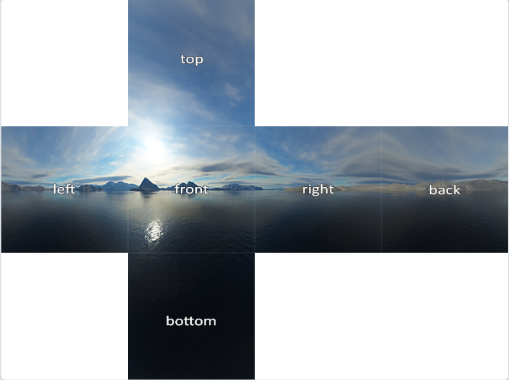

# 立方体贴图

立方体贴图就是一个包含了6个2D纹理的纹理，每个2D纹理都组成了立方体的一个面：一个有纹理的立方体。

立方体贴图有一个非常有用的特性，它可以通过一个方向向量来进行索引/采样。

比如一个1x1x1的单位立方体，方向向量的原点位于它的中心。使用一个橘黄色的方向向量来从立方体贴图上采样一个纹理值会像是这样：


> 可以用一个方向向量确定纹理上的某个点


## 创建立方体贴图

生成一个纹理，并将其绑定到纹理目标上， 这次要绑定到GL_TEXTURE_CUBE_MAP：

````c++
unsigned int textureID;
glGenTextures(1, &textureID);
glBindTexture(GL_TEXTURE_CUBE_MAP, textureID);
````

因为立方体贴图包含有6个纹理，需要调用 `glTexImage2D` 函数6次，其中的纹理模板参数 `target` 需要设置为立方体的一个特定的面，向 OpenGL 指定当前在创建立方体的哪个面：

| 纹理目标                         | 方位 |
| :------------------------------- | :--- |
| `GL_TEXTURE_CUBE_MAP_POSITIVE_X` | 右   |
| `GL_TEXTURE_CUBE_MAP_NEGATIVE_X` | 左   |
| `GL_TEXTURE_CUBE_MAP_POSITIVE_Y` | 上   |
| `GL_TEXTURE_CUBE_MAP_NEGATIVE_Y` | 下   |
| `GL_TEXTURE_CUBE_MAP_POSITIVE_Z` | 后   |
| `GL_TEXTURE_CUBE_MAP_NEGATIVE_Z` | 前   |

它们背后的int值是线性递增的。可以从GL_TEXTURE_CUBE_MAP_POSITIVE_X开始遍历它们，在每个迭代中对枚举值加 1，遍历整个目标：

````c++
int width, height, nrChannels;
unsigned char *data;  
for(unsigned int i = 0; i < textures_faces.size(); i++)
{
    data = stbi_load(textures_faces[i].c_str(), &width, &height, &nrChannels, 0);
    glTexImage2D(
        GL_TEXTURE_CUBE_MAP_POSITIVE_X + i, 
        0, GL_RGB, width, height, 0, GL_RGB, GL_UNSIGNED_BYTE, data
    );
}
````

textures_faces 包含了立方体贴图所需的所有纹理路径，并以表中的顺序排列。

设定环绕和过滤方式：

````c++
glTexParameteri(GL_TEXTURE_CUBE_MAP, GL_TEXTURE_MAG_FILTER, GL_LINEAR);
glTexParameteri(GL_TEXTURE_CUBE_MAP, GL_TEXTURE_MIN_FILTER, GL_LINEAR);
glTexParameteri(GL_TEXTURE_CUBE_MAP, GL_TEXTURE_WRAP_S, GL_CLAMP_TO_EDGE);
glTexParameteri(GL_TEXTURE_CUBE_MAP, GL_TEXTURE_WRAP_T, GL_CLAMP_TO_EDGE);
glTexParameteri(GL_TEXTURE_CUBE_MAP, GL_TEXTURE_WRAP_R, GL_CLAMP_TO_EDGE);
````

这里多设置了 R 维度。环绕方式设置为 `GL_CLAMP_TO_EDGE`。

在片段着色器中，使用了一个不同类型的采样器，`samplerCube`，还是用 `texture` 函数进行采样，但使用的是一个 `vec3` 的方向向量而不是 `vec2`：

````glsl
in vec3 textureDir; // 代表3D纹理坐标的方向向量
uniform samplerCube cubemap; // 立方体贴图的纹理采样器

void main()
{             
    FragColor = texture(cubemap, textureDir);
}
````


## 天空盒

天空盒是一个包含了整个场景的（大）立方体，它包含周围环境的6个图像，让玩家以为他处在一个比实际大得多的环境当中。

立方体贴图能完美满足天空盒的需求：一个6面的立方体，每个面都需要一个纹理。

天空盒图像通常有以下的形式：



### 加载天空盒

使用下面的函数，它接受一个包含6个纹理路径的vector：

````c++
unsigned int loadCubemap(vector<std::string> faces)
{
    unsigned int textureID;
    glGenTextures(1, &textureID);
    glBindTexture(GL_TEXTURE_CUBE_MAP, textureID);

    int width, height, nrChannels;
    for (unsigned int i = 0; i < faces.size(); i++)
    {
        unsigned char *data = stbi_load(faces[i].c_str(), &width, &height, &nrChannels, 0);
        if (data)
        {
            glTexImage2D(GL_TEXTURE_CUBE_MAP_POSITIVE_X + i, 
                         0, GL_RGB, width, height, 0, GL_RGB, GL_UNSIGNED_BYTE, data
            );
            stbi_image_free(data);
        }
        else
        {
            std::cout << "Cubemap texture failed to load at path: " << faces[i] << std::endl;
            stbi_image_free(data);
        }
    }
    glTexParameteri(GL_TEXTURE_CUBE_MAP, GL_TEXTURE_MIN_FILTER, GL_LINEAR);
    glTexParameteri(GL_TEXTURE_CUBE_MAP, GL_TEXTURE_MAG_FILTER, GL_LINEAR);
    glTexParameteri(GL_TEXTURE_CUBE_MAP, GL_TEXTURE_WRAP_S, GL_CLAMP_TO_EDGE);
    glTexParameteri(GL_TEXTURE_CUBE_MAP, GL_TEXTURE_WRAP_T, GL_CLAMP_TO_EDGE);
    glTexParameteri(GL_TEXTURE_CUBE_MAP, GL_TEXTURE_WRAP_R, GL_CLAMP_TO_EDGE);

    return textureID;
}
````

调用这个函数之前，将合适的纹理路径按照立方体贴图枚举指定的顺序加载到一个vector中。

````c++
vector<std::string> faces
{
    "right.jpg",
    "left.jpg",
    "top.jpg",
    "bottom.jpg",
    "front.jpg",
    "back.jpg"
};
unsigned int cubemapTexture = loadCubemap(faces);
````

### 显示天空盒

由于天空盒是绘制在一个立方体上的，和其它物体一样，需要另一个VAO、VBO以及新的一组顶点。

也需要新的着色器：

```glsl
#version 330 core
layout (location = 0) in vec3 aPos;

out vec3 TexCoords;

uniform mat4 projection;
uniform mat4 view;

void main()
{
    TexCoords = aPos;
    gl_Position = projection * view * vec4(aPos, 1.0);
}
```

其中将输入的位置向量作为片段着色器的纹理坐标。因为立方体贴图只要一个方向向量即可确定位置（以立方体中心为原点），正好可以让天空盒以原点为立方体中心，使用 `aPos` 做纹理坐标。

````glsl
#version 330 core
out vec4 FragColor;

in vec3 TexCoords;

uniform samplerCube skybox;

void main()
{    
    FragColor = texture(skybox, TexCoords);
}
````

渲染天空盒：先需要绑定立方体贴图纹理，skybox 采样器就会自动填充上天空盒立方体贴图。绘制天空盒时，需要将它变为场景中的第一个渲染的物体，并且禁用深度写入。这样子天空盒就会永远被绘制在其它物体的背后了。

```c++
glDepthMask(GL_FALSE);
skyboxShader.use();
// ... 设置观察和投影矩阵
glBindVertexArray(skyboxVAO);
glBindTexture(GL_TEXTURE_CUBE_MAP, cubemapTexture);
glDrawArrays(GL_TRIANGLES, 0, 36);
glDepthMask(GL_TRUE);
// ... 绘制剩下的场景
```

但现在的天空盒是以世界原点为中心，玩家运动，天空也会动，这个是不对的。应该让天空盒以玩家为视野为中心。

所以对传入天空的着色器中的 `view`，需要去掉位移分量：

```c++
glm::mat4 view = glm::mat4(glm::mat3(camera.GetViewMatrix()));
```

最后就可以了。


### 优化

目前是先渲染天空盒，之后再渲染场景中的其它物体。这样子能够工作，但不是非常高效。

如果先渲染天空盒，就会对屏幕上的每一个像素运行一遍片段着色器，即便只有一小部分的天空盒最终是可见的。可以使用提前深度测试(Early Depth Testing)轻松丢弃掉的片段。

所以，将会最后渲染天空盒，以获得轻微的性能提升。

这样的话，深度缓冲就会填充满所有物体的深度值，只需要在提前深度测试通过的地方渲染天空盒的片段就可以了，很大程度上减少了片段着色器的调用。

因为天空世界上是一个 1x1x1 的立方体，距离摄像机的距离只有 1，是不过由于刻意让他跟着摄像机运动，看起来很大。如果直接来深度测试，实际上他距离摄像机很久。

所以需要在深度测试前，把天空的距离改为最远的，让 z 分量标注化后是最大的 1。方法就是在顶点着色器中，让输出的 `gl_Position` 的 z 、 w 分量相同，这样计算标注坐标的时，z  = z / w = w / w = 1.0 是最大的：

```
void main()
{
    TexCoords = aPos;
    vec4 pos = projection * view * vec4(aPos, 1.0);
    gl_Position = pos.xyww;
}
```

还要改变一下深度函数，将它从默认的GL_LESS改为GL_LEQUAL。深度缓冲将会填充上天空盒的 1.0 值，所以需要保证天空盒在值小于或等于深度缓冲而不是小于时通过深度测试。

画完天空盒后还需要改回来！：

````c++
        glDepthFunc(GL_LEQUAL);  
   		...
        glDepthFunc(GL_LESS); 
````


## 环境映射

### 反射

反射表现为物体（或物体的一部分）反射它周围环境，即根据观察者的视角，物体的颜色或多或少等于它的环境。

镜子就是一个反射性物体：它会根据观察者的视角反射它周围的环境。


根据观察方向向量 I 和物体的法向量 N，来计算反射向量 R。

最终的 R 向量将会作为索引/采样立方体贴图的方向向量，返回环境的颜色值。最终的结果是物体看起来反射了天空盒。

> 立方体贴图只要一个方向就可以确定贴图颜色值。光路可逆，人可以看到 R 指向的，因为 R 指向位置的光沿相同位置反射到人眼！
>
> 因为天空很大，所以不管在那里看，中心都是摄像机。

改变箱子的片段着色器，让箱子有反射性：

```glsl
#version 330 core
out vec4 FragColor;

in vec3 Normal;
in vec3 Position;

uniform vec3 cameraPos;
uniform samplerCube skybox;

void main()
{             
    vec3 I = normalize(Position - cameraPos);
    vec3 R = reflect(I, normalize(Normal));
    FragColor = vec4(texture(skybox, R).rgb, 1.0);
}
```

1. 先计算了观察/摄像机方向向量`I`；
2. 并使用它来计算反射向量`R`；
3. 使用`R`来从天空盒立方体贴图中采样。

顶点着色器也需要修改：

````glsl
#version 330 core
layout (location = 0) in vec3 aPos;
layout (location = 1) in vec3 aNormal;

out vec3 Normal;
out vec3 Position;

uniform mat4 model;
uniform mat4 view;
uniform mat4 projection;

void main()
{
    Normal = mat3(transpose(inverse(model))) * aNormal;
    Position = vec3(model * vec4(aPos, 1.0));
    gl_Position = projection * view * model * vec4(aPos, 1.0);
}
````

需要更新一下顶点数据，并更新属性指针。设置cameraPos这个uniform。


### 折射

环境映射的另一种形式是折射，它和反射很相似。折射是光线由于传播介质的改变而产生的方向变化。


有一个观察向量 I，一个法向量 N，而这次是折射向量 R。可以看到，观察向量的方向轻微弯曲了。弯折后的向量 R 将会用来从立方体贴图中采样。

使用GLSL的内建 refract 函数实现折射。需要一个法向量、一个观察方向和两个材质之间的折射率(Refractive Index)。

| 材质 | 折射率 |
| :--- | :----- |
| 空气 | 1.00   |
| 水   | 1.33   |
| 冰   | 1.309  |
| 玻璃 | 1.52   |
| 钻石 | 2.42   |

例如使用玻璃，在片段着色器中，实现：

````glsl
void main()
{             
    float ratio = 1.00 / 1.52;
    vec3 I = normalize(Position - cameraPos);
    vec3 R = refract(I, normalize(Normal), ratio);
    FragColor = vec4(texture(skybox, R).rgb, 1.0);
}
````


## 练习

- 尝试在我们之前在

  模型加载

  小节中创建的模型加载器中引入反射贴图。你可以在

  这里

  找到升级后有反射贴图的纳米装模型。仍有几点要注意的：

  - Assimp在大多数格式中都不太喜欢反射贴图，所以我们需要欺骗一下它，将反射贴图储存为**漫反射贴图**。你可以在加载材质的时候将反射贴图的纹理类型设置为aiTextureType_AMBIENT。
  - 我偷懒直接使用镜面光纹理图像来创建了反射贴图，所以反射贴图在模型的某些地方不能准确地映射:)。
  - 由于模型加载器本身就已经在着色器中占用了3个纹理单元了，你需要将天空盒绑定到第4个纹理单元上，因为我们要从同一个着色器中对天空盒采样。

- 如果你都做对了，它会看起来像[这样](https://learnopengl-cn.github.io/img/04/06/cubemaps_reflection_map.png)。