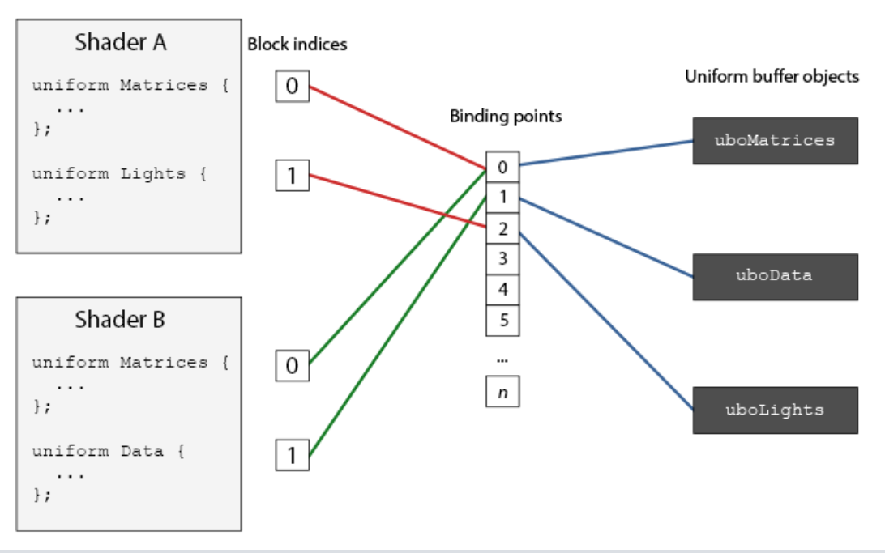

# 高级 GLSL


## GLSL 的内建变量

GLSL 定义了若干个以 `gl_` 为前缀的变量，它们能提供更多的方式来读取/写入数据。

### 顶点着色器变量

在顶点着色器中，最重要的就是 `gl_Position` 变量，只要将数据赋值给这个变量，OpenGL 自动将其作为裁剪空间的输出向量。

还有其他一些常用的。

#### `gl_PointSize`

是一个  `float` 类型的变量，表示了点的像素宽高。在顶点着色器修改这个值，可以对每个顶点设置不同的大小。

比如可以将 `gl_Point` 设置为 `gl_Position` 的 z 分量，那么距离越远的点越大：

````glsl
void main()
{
    gl_Position = projection * view * model * vec4(aPos, 1.0);    
    gl_PointSize = gl_Position.z;    
}
````

默认情况下，修改点大小的功能被禁用，需要手动开启：

````c++
glEnable(GL_PROGRAM_POINT_SIZE);
````

#### `gl_VertexID`

`gl_Position` 和 `gl_PointSize` 都是输出变量，因为其值是作为顶点着色器的输出被读取的。

而 `gl_VertexID` 变量保存当前正在绘制顶点的当前 ID。当使用 `glDrawElement` 进行渲染的是h，这个变量保存正在绘制顶点的当前索引。

### 片段着色器

#### `gl_FragCoord`

`gl_FragCoord` 的 z 分量等于对应片段的深度值，x 和 y 分量是片段的窗口空间(Window-space)坐标，其原点为窗口的左下角。

x 和 y 的取值范围就是设置的 `glViewport` 的视口大小。

`gl_FragCoord` 的一个常见用处是对比不同片段计算的视觉输出效果，比如把屏幕分成两个部分，左边渲染一种，右边渲染一种：

```c++
void main()
{             
    if(gl_FragCoord.x < 400)
        FragColor = vec4(1.0, 0.0, 0.0, 1.0);
    else
        FragColor = vec4(0.0, 1.0, 0.0, 1.0);        
}
```

判断：当 x 值小于 400（当前绘制的点在屏幕的左半平面）就输出红色，否则为绿色。

#### `gl_FrontFacing`

如果不使用 `GL_FACE_CULL` 进行面剔除，那么 `gl_FrontFacing` 变量（一个输入变量）会表示当前绘制的片段属于正面的一部分还是反面。

即：可以根据一个面的正反信息，绘制不同的颜色；

`gl_FrontFacing` 是 `bool` 类型的变量，如果当前片段是正向面的一部分那么就是`true`，否则就是`false`。

````
#version 330 core
out vec4 FragColor;

in vec2 TexCoords;

uniform sampler2D frontTexture;
uniform sampler2D backTexture;

void main()
{             
    if(gl_FrontFacing)
        FragColor = texture(frontTexture, TexCoords);
    else
        FragColor = texture(backTexture, TexCoords);
}
````

这样，判断正反面，并且进行不同的纹理输出，使得正方体在里面看可以有不同的纹理。

#### `gl_FragDepth`

输入变量 `gl_FragCoord` 的 z 分量代表当前片段的深度。

`gl_FragDepth` 是一个 `float` 类型的输出变量，可以通过这个值调整片段的深度值；将其写为 0.0 到 1.0 中的一个值即可。

````glsl
gl_FragDepth = 0.0; // 这个片段现在的深度值为 0.0
````

如果着色器没有写入值到 `gl_FragDepth`，它会自动取用`gl_FragCoord.z`的值。


## 接口块

接口块类似于一个 `struct`，但是需要使用 `in` 或者 `out` 关键字表示作为输出还是输入：

````glsl
#version 330 core
layout (location = 0) in vec3 aPos;
layout (location = 1) in vec2 aTexCoords;

uniform mat4 model;
uniform mat4 view;
uniform mat4 projection;

out VS_OUT
{
    vec2 TexCoords;
} vs_out;

void main()
{
    gl_Position = projection * view * model * vec4(aPos, 1.0);    
    vs_out.TexCoords = aTexCoords;
}  
````

声明了一个叫做 `vs_out` 的接口块，它打包了希望发送到下一个着色器中的所有输出变量。

那么在片段着色器中就需要定义一个输入接口块，块名与之前的着色器输出需要相同（`VS_OUT`），但实例名（`vs_out`）可以任意：

````glsl
#version 330 core
out vec4 FragColor;

in VS_OUT
{
    vec2 TexCoords;
} fs_in;

uniform sampler2D texture;

void main()
{             
    FragColor = texture(texture, fs_in.TexCoords);   
}
````


## Uniform 缓冲对象

当一个程序中使用多于一个的着色器时，尽管大部分的 uniform 变量都是相同的，还是需要不断地设置它们（每个着色器程序都需要三个变换矩阵）

`Uniform` 缓冲对象允许定义一系列在多个着色器中相同的**全局**Uniform变量。当使用Uniform缓冲对象的时候，只需要设置相关的uniform**一次**。

### `Uniform` 块内存布局

使用 `uniform` 缓冲对象就需要在着色器中定义一个Uniform 块，其内容是储存在一个缓冲对象中的，它实际上只是一块预留内存。

因为这块内存并不会保存它具体保存的是什么类型的数据，需要告诉 OpenGL 内存的哪一部分对应着着色器中的哪一个uniform变量。

例如这个 `uniform` 块：

```glsl
layout (std140) uniform ExampleBlock
{
    float value;
    vec3  vector;
    mat4  matrix;
    float values[3];
    bool  boolean;
    int   integer;
};
```

其中的 `std140` 表示使用以下的规则分配这个块的内存。GLSL中的每个变量，比如说int、float和bool，都被定义为4字节量。每4个字节将会用一个`N`来表示。

| 类型                | 布局规则                                                     |
| :------------------ | :----------------------------------------------------------- |
| 标量，比如int和bool | 每个标量的基准对齐量为N。                                    |
| 向量                | 2N或者4N。这意味着vec3的基准对齐量为4N。                     |
| 标量或向量的数组    | 每个元素的基准对齐量与vec4的相同。                           |
| 矩阵                | 储存为列向量的数组，每个向量的基准对齐量与vec4的相同。       |
| 结构体              | 等于所有元素根据规则计算后的大小，但会填充到vec4大小的倍数。 |

比如这个例子：

```glsl
layout (std140) uniform ExampleBlock
{
                     // 基准对齐量       // 对齐偏移量
    float value;     // 4               // 0 
    vec3 vector;     // 16              // 16  (必须是16的倍数，所以 4->16)
    mat4 matrix;     // 16              // 32  (列 0)
                     // 16              // 48  (列 1)
                     // 16              // 64  (列 2)
                     // 16              // 80  (列 3)
    float values[3]; // 16              // 96  (values[0])
                     // 16              // 112 (values[1])
                     // 16              // 128 (values[2])
    bool boolean;    // 4               // 144
    int integer;     // 4               // 148
}; 
```

### 使用 `uniform` 缓冲

需要调用glGenBuffers，创建一个Uniform缓冲对象。

需要将它绑定到GL_UNIFORM_BUFFER目标，并调用glBufferData，分配足够的内存。

````c++
unsigned int uboExampleBlock;
glGenBuffers(1, &uboExampleBlock);
glBindBuffer(GL_UNIFORM_BUFFER, uboExampleBlock);
glBufferData(GL_UNIFORM_BUFFER, 152, NULL, GL_STATIC_DRAW); // 分配152字节的内存
glBindBuffer(GL_UNIFORM_BUFFER, 0);
````

现在，每当需要对缓冲更新或者插入数据，都会绑定到 `uboExampleBlock` 这个对象，并使用 `glBufferSubData` 来更新它的内存。

只需要更新这个 `Uniform` 缓冲一次，所有使用这个缓冲的着色器就都使用的是更新后的数据了。

为例让 OpenGL 知道哪个Uniform缓冲对应的是哪个Uniform块，在 OpenGL 上下文中，定义了一些绑定点(Binding Point)，可以将一个Uniform缓冲链接至它。在创建Uniform缓冲之后，将它绑定到其中一个绑定点上，并将着色器中的Uniform块绑定到相同的绑定点，把它们连接到一起：



> 每个 `Uniform` 缓冲对象对应上下文中的一个绑定点（数组索引）。
>
> 再设置不同的着色器程序中的 `uniform` 结构体指向同一个绑定点，那么对应的   `Uniform` 缓冲对象的值就被拷贝到这些 `uniform` 结构体中。

可以绑定多个 Uniform 缓冲到不同的绑定点上。因为着色器A和着色器B都有一个链接到绑定点0的Uniform块，它们的Uniform块将会共享相同的uniform数据

调用 `glGetUniformBlockIndex` 函数，获得一个索引代表指定着色器中的指定块：

````c++
unsigned int lights_index = glGetUniformBlockIndex(shaderA.ID, "Lights");   
````

- 参数一：对应着色器程序的 id；
- 参数二：着色器中需要绑定的 `Uniform` 块的名称；

调用 `glUniformBlockBinding` 函数将指定的块绑定到指定的绑定点上：

```c++
glUniformBlockBinding(shaderA.ID, lights_index, 2);
```

需要对**每个**着色器重复这一步骤。

绑定完着色器的块后，还需要绑定 `Uniform` 缓冲对象，使用 `glBindBufferBase` 或 `glBindBufferRange` 来完成：

```
glBindBufferBase(GL_UNIFORM_BUFFER, 2, uboExampleBlock); 
// 或
glBindBufferRange(GL_UNIFORM_BUFFER, 2, uboExampleBlock, 0, 152);
```

- 参数一：绑定目标：`GL_UNIFORM_BUFFER`；
- 参数二：要绑定的绑定点；
- 参数三：`Uniform` 缓冲对象。

这样就绑定好了对象与块，之后调用 `glBufferSubData` 向这个缓冲对象的指定其实偏移的位置写入指定的内容。比如这里这是 `boolean` 值：

```c++
glBindBuffer(GL_UNIFORM_BUFFER, uboExampleBlock);
int b = true; // GLSL中的bool是4字节的，所以我们将它存为一个integer
glBufferSubData(GL_UNIFORM_BUFFER, 144, 4, &b); 
glBindBuffer(GL_UNIFORM_BUFFER, 0);
```

注意计算偏移要正确。


