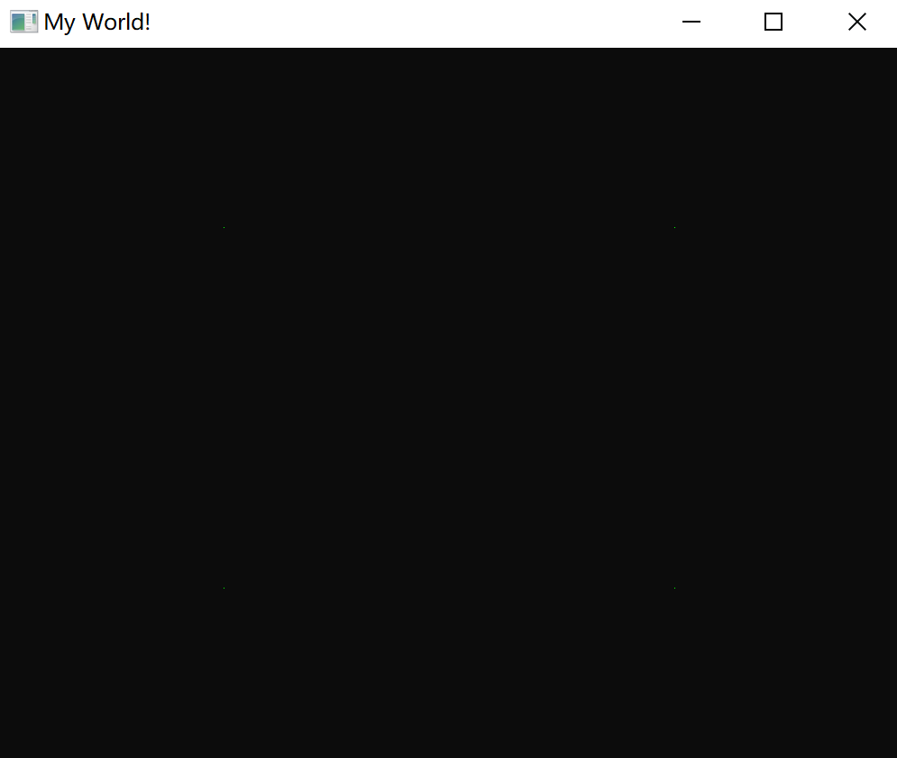
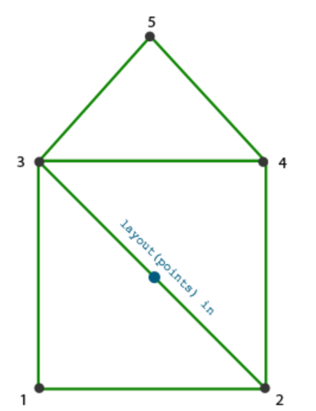
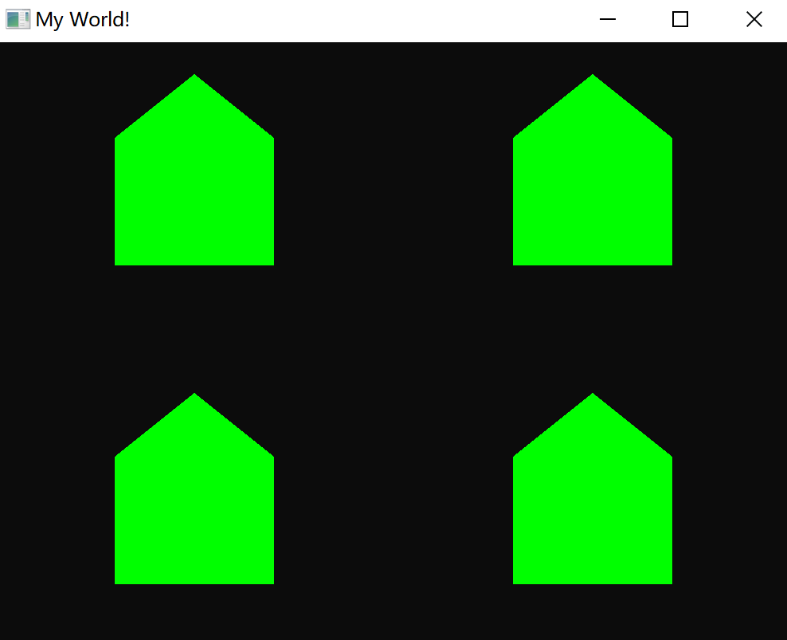
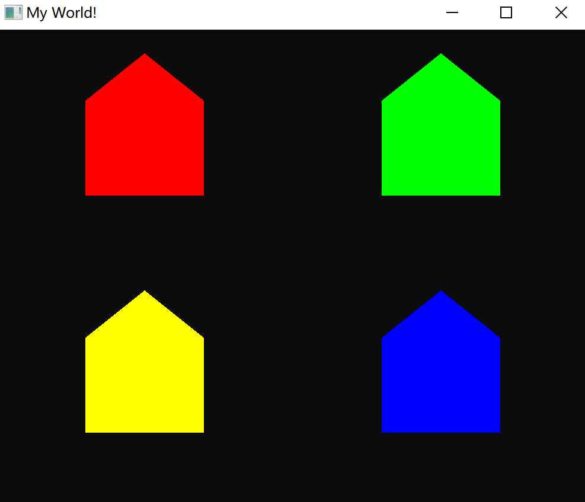
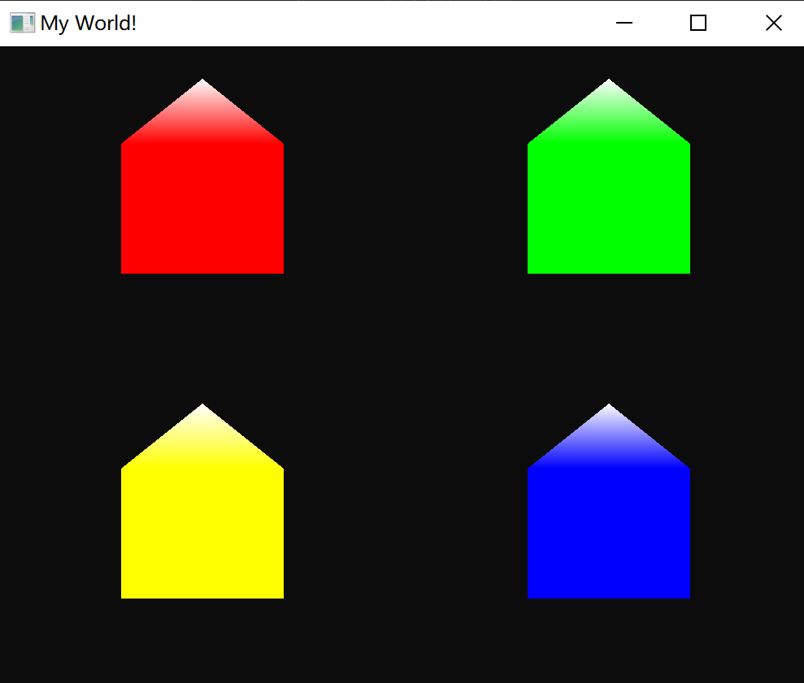
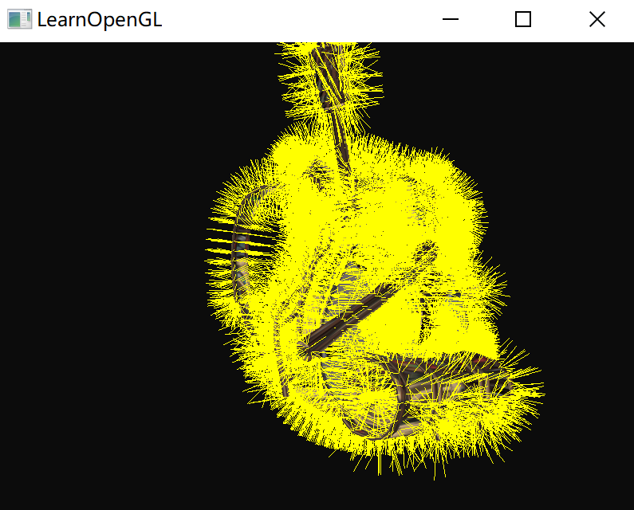

# 几何着色器

## 几何着色器介绍

在顶点和片段着色器之间有一个可选的几何着色器(Geometry Shader)，几何着色器的输入是一个图元（如点或三角形）的一组顶点。

几何着色器可以在顶点发送到下一着色器阶段之前对它们随意变换。它能够将（这一组，或一个）顶点变换为完全不同的图元，并且还能生成比原来更多的顶点。

### 一个例子

`````glsl
#version 330 core
layout (points) in;
layout (line_strip, max_vertices = 2) out;

void main() {    
    gl_Position = gl_in[0].gl_Position + vec4(-0.1, 0.0, 0.0, 0.0); 
    EmitVertex();

    gl_Position = gl_in[0].gl_Position + vec4( 0.1, 0.0, 0.0, 0.0);
    EmitVertex();

    EndPrimitive();
}
`````

在几何着色器的顶部，需要声明从顶点着色器输入的图元类型。

### 定义输入

需要在 `in` 关键字前声明一个布局修饰符(Layout Qualifier)，表示渲染的图元类型：

- `points`：绘制GL_POINTS图元时（1）。
- `lines`：绘制GL_LINES或GL_LINE_STRIP时（2）
- `lines_adjacency`：GL_LINES_ADJACENCY或GL_LINE_STRIP_ADJACENCY（4）
- `triangles`：GL_TRIANGLES、GL_TRIANGLE_STRIP或GL_TRIANGLE_FAN（3）
- `triangles_adjacency`：GL_TRIANGLES_ADJACENCY或GL_TRIANGLE_STRIP_ADJACENCY（6）

想要将顶点绘制为 GL_TRIANGLES，要将输入修饰符设置为 `triangles`。

可以看到，这里只可以定义几何着色器的输入顶点数量，但每个顶点是什么样的数据已经被 GLSL 定义好了：

````glsl
in gl_Vertex
{
    vec4  gl_Position;
    float gl_PointSize;
    float gl_ClipDistance[];
} gl_in[];
````

这是一个数组变量（因为几何着色器的输入是一个图元的所有顶点），每个顶点包含：位置、点大小、ClioDistance 信息。

### 定义输出

接下来，还需要指定几何着色器输出的图元类型，这需要在 `out` 关键字前面加一个布局修饰符。其接收几种图元类型：

- `points`
- `line_strip`
- `triangle_strip`

同时需要设置一个它最大能够输出的顶点数量（如果超过这个值，OpenGL将不会绘制**多出的**顶点），跟输出类型一起写再 `layout` 后。

### 实现功能

综上，这个几何着色器的输入是一组点图元的顶点（那么就只有一个点），输出是线类型，并且最多只有两个点。

需要在 main 函数中实现这个功能，使用 2 个几何着色器函数，`EmitVertex` 和`EndPrimitive`，

````glsl
void main() {
    gl_Position = gl_in[0].gl_Position + vec4(-0.1, 0.0, 0.0, 0.0); 
    EmitVertex();

    gl_Position = gl_in[0].gl_Position + vec4( 0.1, 0.0, 0.0, 0.0);
    EmitVertex();

    EndPrimitive();
}
````

`gl_in[0]` 表示输入的 0 个顶点（这里只有一个）。

1. 先将输入顶点的位置偏移一定量赋值给 `gl_Position`，再调用 `EmitVertex()` 函数，表示之前赋值的 `gl_Position` 将作为第一个输出顶点；
2. 同理第二个顶点也是一样；
3. 最后调用 `EndPrimitive()` 将之前发射的两个顶点合并作为两个顶点的线条输出。

所以这个几何着色器的功能很简单：接收一个点输入，以这个点为中心，创建一条水平的线图元。

同时在程序中，需要给 `glDrawArrays` 函数传入 `GL_POINTS` 类型：

 ```c++
 glDrawArrays(GL_POINTS, 0, 4);
 ```


## 使用几何着色器

渲染一个简单的场景，展示几何着色器用法，只在屏幕上绘制四个点：

````c++
float points[] = {
    -0.5f,  0.5f, // 左上
     0.5f,  0.5f, // 右上
     0.5f, -0.5f, // 右下
    -0.5f, -0.5f  // 左下
};
````

顶点着色器：

````glsl
#version 330 core
layout (location = 0) in vec2 aPos;

void main()
{
	gl_Position = vec4(aPos, 0.0, 1.0);
}
````

片段着色器：

````glsl
#version 330 core
out vec4 FragColor;

void main()
{
    FragColor = vec4(0.0, 1.0, 0.0, 1.0);   
}
````

为顶点数据生成 VAO 和 VBO，使用 glDrawArrays 绘制：

````glsl
shader.use();
glBindVertexArray(VAO);
glDrawArrays(GL_POINTS, 0, 4);
````

效果：



增加一个什么都不做的几何着色器，输入一个点，原原本本输出一个点：

````glsl
#version 330 core
layout (points) in;
layout (points, max_vertices = 1) out;

void main() {    
    gl_Position = gl_in[0].gl_Position; 
    EmitVertex();
    EndPrimitive();
}
````

> 可以看到，集合着色中定义输入时一个点，输出也是点图元，并且最多就一个点。

修改 `Shader` 类型，让他可以多接收一个几何着色器（流程跟其他两个着色器一样）。

最后的输出还是原来那样没有变化。


## 造房子

来一个比较复杂的几何着色器，输入一个点，最后输出以这个点为中心的一座房子。房子长这样：



以输入点为基础，计算周围的几个点，并且按照顺序 `Emit`。

几何着色器是这样的：

````glsl
#version 330 core
layout (points) in;
layout (triangle_strip, max_vertices = 5) out;

void build_house(vec4 position)
{    
    gl_Position = position + vec4(-0.2, -0.2, 0.0, 0.0);    // 1:左下
    EmitVertex();   
    gl_Position = position + vec4( 0.2, -0.2, 0.0, 0.0);    // 2:右下
    EmitVertex();
    gl_Position = position + vec4(-0.2,  0.2, 0.0, 0.0);    // 3:左上
    EmitVertex();
    gl_Position = position + vec4( 0.2,  0.2, 0.0, 0.0);    // 4:右上
    EmitVertex();
    gl_Position = position + vec4( 0.0,  0.4, 0.0, 0.0);    // 5:顶部
    EmitVertex();
    EndPrimitive();
}

void main() {    
    build_house(gl_in[0].gl_Position);
}
````

> 注意此时的输出类型是 `triangle_strip`，将每三个点链接为三角形。
>
> 5 个点可以连三个三角形：123、234、345

输出：



在顶点着色器中，为每个房子都新增颜色属性：

````c++
float points[] = {
    -0.5f,  0.5f, 1.0f, 0.0f, 0.0f, // 左上
     0.5f,  0.5f, 0.0f, 1.0f, 0.0f, // 右上
     0.5f, -0.5f, 0.0f, 0.0f, 1.0f, // 右下
    -0.5f, -0.5f, 1.0f, 1.0f, 0.0f  // 左下
};
````

顶点着色器，增加一个颜色输出接口到几何着色器：

````glsl
#version 330 core
layout (location = 0) in vec2 aPos;
layout (location = 1) in vec3 aColor;

out VS_OUT {
    vec3 color;
} vs_out;

void main()
{
    gl_Position = vec4(aPos.x, aPos.y, 0.0, 1.0); 
    vs_out.color = aColor;
}
````

几何着色器增加输入接口：

````glsl
in VS_OUT {
    vec3 color;
} gs_in[];
````

这里还是定义为数组形式，尽管这个例子只有一个输入点，但可以是多个。

同时，需要将颜色输出到片段着色器：

````glsl
out vec3 fColor;
````

因为片段着色器只需要一个（插值的）颜色，所以 fColor 向量就不是一个数组

当发射一个顶点的时候（执行  `EmitVertex`），每个顶点将会使用最后在fColor中储存的值，来用于片段着色器的运行。

````glsl
fColor = gs_in[0].color; // gs_in[0] 因为只有一个输入顶点
gl_Position = position + vec4(-0.2, -0.2, 0.0, 0.0);    // 1:左下  
EmitVertex();   
gl_Position = position + vec4( 0.2, -0.2, 0.0, 0.0);    // 2:右下
EmitVertex();
gl_Position = position + vec4(-0.2,  0.2, 0.0, 0.0);    // 3:左上
EmitVertex();
gl_Position = position + vec4( 0.2,  0.2, 0.0, 0.0);    // 4:右上
EmitVertex();
gl_Position = position + vec4( 0.0,  0.4, 0.0, 0.0);    // 5:顶部
EmitVertex();
EndPrimitive(); 
````



将最后一个顶点的颜色设置为白色，给屋顶落上一些雪。




## 爆破物体

将每个三角形沿着法向量的方向移动一小段时间。整个物体看起来像是沿着每个三角形的法线向量**爆炸**一样。

首先需要根据三角形的三个点得到法向量：

```glsl
vec3 GetNormal()
{
   vec3 a = vec3(gl_in[0].gl_Position) - vec3(gl_in[1].gl_Position);
   vec3 b = vec3(gl_in[2].gl_Position) - vec3(gl_in[1].gl_Position);
   return normalize(cross(a, b));
}
```

原理很简单，三个点两两相减得到边，两个边叉乘的结果就是法向量方向。

而爆炸函数就是沿着这个方向移动：

```glsl
vec4 explode(vec4 position, vec3 normal)
{
    float magnitude = 2.0;
    vec3 direction = normal * ((sin(time) + 1.0) / 2.0) * magnitude; 
    return position + vec4(direction, 0.0);
}
```

向法向量方向延长一段距离，再把坐标点都加上这个延长向量。

````glsl
#version 330 core
layout (triangles) in;
layout (triangle_strip, max_vertices = 3) out;

in VS_OUT {
    vec2 texCoords;
} gs_in[];

out vec2 TexCoords; 

uniform float time;

vec4 explode(vec4 position, vec3 normal) { ... }

vec3 GetNormal() { ... }

void main() {    
    vec3 normal = GetNormal();

    gl_Position = explode(gl_in[0].gl_Position, normal);
    TexCoords = gs_in[0].texCoords;
    EmitVertex();
    gl_Position = explode(gl_in[1].gl_Position, normal);
    TexCoords = gs_in[1].texCoords;
    EmitVertex();
    gl_Position = explode(gl_in[2].gl_Position, normal);
    TexCoords = gs_in[2].texCoords;
    EmitVertex();
    EndPrimitive();
}
````


## 法向量可视化

显示任意物体的法向量

思路是这样的：

1. 先不使用几何着色器正常绘制场景；
2. 然后再次使用带几何着色器的绘制场景，但这次只显示通过几何着色器生成法向量。
3. 几何着色器接收一个三角形图元，并沿着法向量生成三条线——每个顶点一个法向量。

````c++
shader.use();
DrawScene();
normalDisplayShader.use();
DrawScene();
````

几何着色器中，使用模型提供的顶点法线。在将法线变换到观察空间坐标之前，先使用法线矩阵变换一次：

````c++
#version 330 core
layout (location = 0) in vec3 aPos;
layout (location = 1) in vec3 aNormal;

out VS_OUT {
    vec3 normal;
} vs_out;

uniform mat4 view;
uniform mat4 model;

void main()
{
    gl_Position = view * model * vec4(aPos, 1.0); 
    mat3 normalMatrix = mat3(transpose(inverse(view * model)));
    vs_out.normal = normalize(vec3(vec4(normalMatrix * aNormal, 0.0)));
}
````

几何着色器会接收每一个顶点（包括一个位置向量和一个法向量），并在每个位置向量处绘制一个法线向量：

````glsl
#version 330 core
layout (triangles) in;
layout (line_strip, max_vertices = 6) out;

in VS_OUT {
    vec3 normal;
} gs_in[];

const float MAGNITUDE = 0.4;

uniform mat4 projection;

void GenerateLine(int index)
{
    gl_Position = projection * gl_in[index].gl_Position;
    EmitVertex();
    gl_Position = projection * (gl_in[index].gl_Position + 
                                vec4(gs_in[index].normal, 0.0) * MAGNITUDE);
    EmitVertex();
    EndPrimitive();
}

void main()
{
    GenerateLine(0); // 第一个顶点法线
    GenerateLine(1); // 第二个顶点法线
    GenerateLine(2); // 第三个顶点法线
}
````

片段着色器显示为单色的线：

````glsl
#version 330 core
out vec4 FragColor;

void main()
{
    FragColor = vec4(1.0, 1.0, 0.0, 1.0);
}
````

