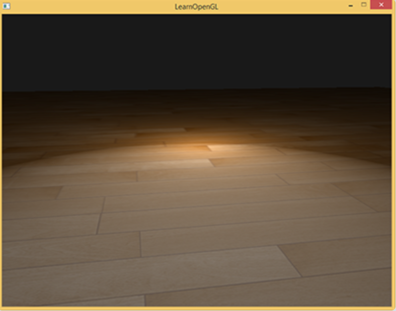

# 高级光照

## Blinn-Phong

冯氏光照不仅比较真实还原了自然光，并且性能很高。

但镜面反射会在某些情况出现问题，特别是物体反射光很低时，导致大片（粗糙）的高光区域：



镜面高光边缘出现断层。

问题的原因是观察向量和反射向量间的夹角不能大于90度。如果点积的结果为负数，镜面光分量会变为0.0。


如上图，左图是正常的，视线与反射光夹角小于 90，但右图大于 90，会直接被设置为 0。

这在大多数情况下都不是什么问题。但是当物体的反光度非常小时，它产生的镜面高光半径足以让这些相反方向的光线对亮度产生足够大的影响。在这种情况下就不能忽略它们对镜面光分量的贡献了。

1977年，James F. Blinn在冯氏着色模型上加以拓展，引入了Blinn-Phong着色模型。

与冯氏模型很相似，只是对镜面不再依赖反射向量，而是采用半程向量：


即光线与视线夹角一半方向上的一个单位向量。当半程向量与法线向量越接近时，镜面光分量就越大。

当视线与反射方向相同，此时半程向量也正好与法线契合。并且不管从哪个方向看，半程向量与法线夹角不会超过 90°（除非背光）。

获取半程向量：将光线的方向向量和观察向量相加，并将结果正规化(Normalize)：


```glsl
vec3 lightDir = normalize(lightPos - FragPos);
vec3 viewDir = normalize(viewPos - FragPos);
vec3 halfwayDir = normalize(lightDir + viewDir);
```

之后再将半程与法向量点乘：

```
float spec = pow(max(dot(normal, halfwayDir), 0.0), shininess);
vec3 specular = lightColor * spec;
```

