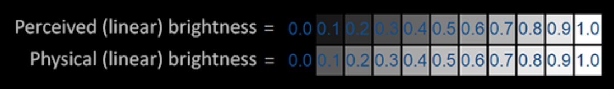

# Gamma校正

计算出场景中所有像素的最终颜色以后，需要把它们显示在监视器上。

过去，大多数监视器是阴极射线管显示器（CRT）。这些监视器有一个物理特性就是两倍的输入电压产生的不是两倍的亮度。输入电压产生约为输入电压的2.2次幂的亮度，这个值为监视器 Gamma。

> Gamma 也叫灰度系数，每种显示设备都有自己的 Gamma 值，都不相同。
>
> 有公式：设备输出亮度 = 电压的 Gamma 次幂。任何设备 Gamma 基本上都不会等于 1，等于 1 是一种理想的线性状态，这种理想状态是：输出亮度随着电压线性增加。
>
> 对于 CRT，Gamma 通常为2.2，因而，输出亮度 = 输入电压的 2.2 次幂。

人类所感知的亮度恰好和 CRT 所显示出来相似的指数关系非常匹配。



- 第一行表示的是人眼感受到的亮度与实际亮度的变化关系；
- 第二行就是真实的物理颜色变化与实际亮度的变化关系。

可以看到，虽然光照强度线性增长，人眼看到的强度不是线性变化的，更类似于一个指数增长关系。

而 CRT 亮度恰好满足人眼的这个关系，其 Gamma 为 2.2：
$$
输出电压亮度 = {输入电压}^{2.2}
$$
也满足指数关系。

但是，CRT 根据电压计算出的输出亮度也是物理亮度，这个物理亮度还是会经过人眼的一次 “处理” 才能得到人感受到的亮度。

比如，有一个颜色值 $(0.5, 0.0, 0.0)$，现在将其值翻倍：$(1.0, 0.0, 0.0)$，那么会希望人眼最后看到的颜色亮度翻倍。但实际原来的亮度应该是 $0.5^{2.2} = 0.218$，而翻倍的亮度是 $1 ^ {2.2} = 1$。所以如果想让颜色翻倍，实际 CRT 输出会是 $2^{2.2} = 4.6$ 倍。

并且这个值还是物理亮度，经过人眼后会再经过大概 2.2 次幂才能变成人感受到的颜色，那么前后的颜色差就是 $2^{2.2 * 2.2} = 28.4$ !


## Gamma 校正

要让颜色值翻倍，最后人看到的也翻倍，很简单，让 CRT 使用校正曲线，即：
$$
输出亮度 = 输入电压 ^{1/2.2}
$$
这样翻倍的颜色先经过 CRT 增加 $1/2.2$ 次幂，再经过人眼增加 $2.2$ 次幂，最后就倍抵消。最后翻倍的颜色值，人眼看起来也翻倍了。

### 开启 GL_FRAMEBUFFER_SRGB

调用 `glEnable` 开启 Gamma 校正：

````c++
glEnable(GL_FRAMEBUFFER_SRGB);
````

### 片段着色器手动校正

````c++
void main()
{
    // do super fancy lighting 
    [...]
    // apply gamma correction
    float gamma = 2.2;
    fragColor.rgb = pow(fragColor.rgb, vec3(1.0/gamma));
}
````

将输出的颜色值手动附加 $1/2.2$ 次幂。


## 衰减

开启 Gamma 校正后，计算光照衰减的公式需要修改。

原来光照的衰减随着距离平方衰减，但如果开启 Gamma 校正后，颜色本来就附加了一个 1/2.2 次幂，所以这时衰减只要与距离反比即可。

否则会使得光太弱。

