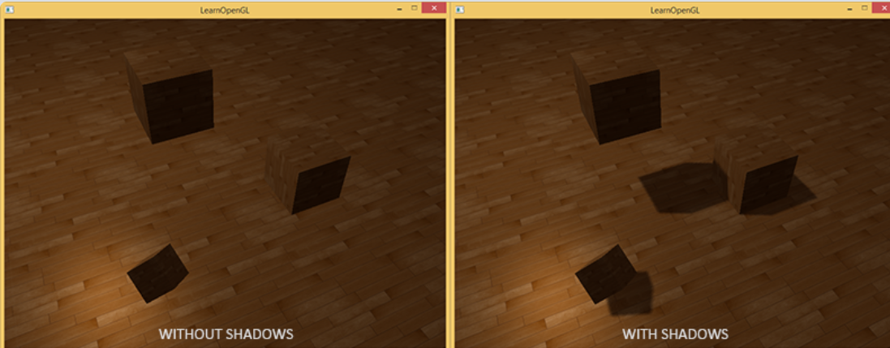
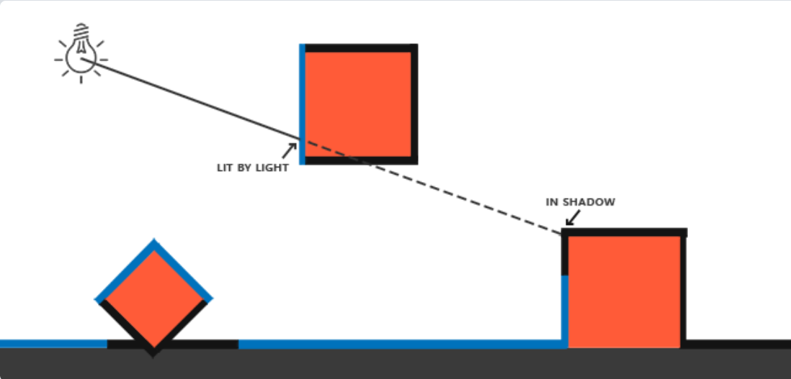
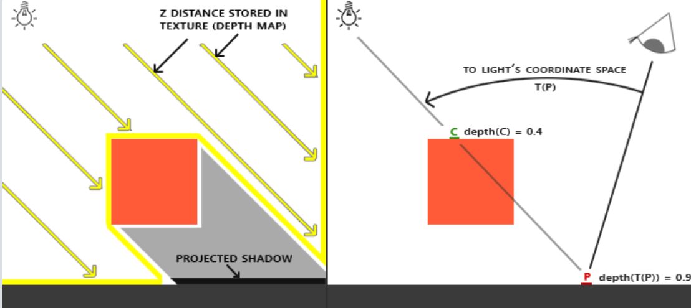
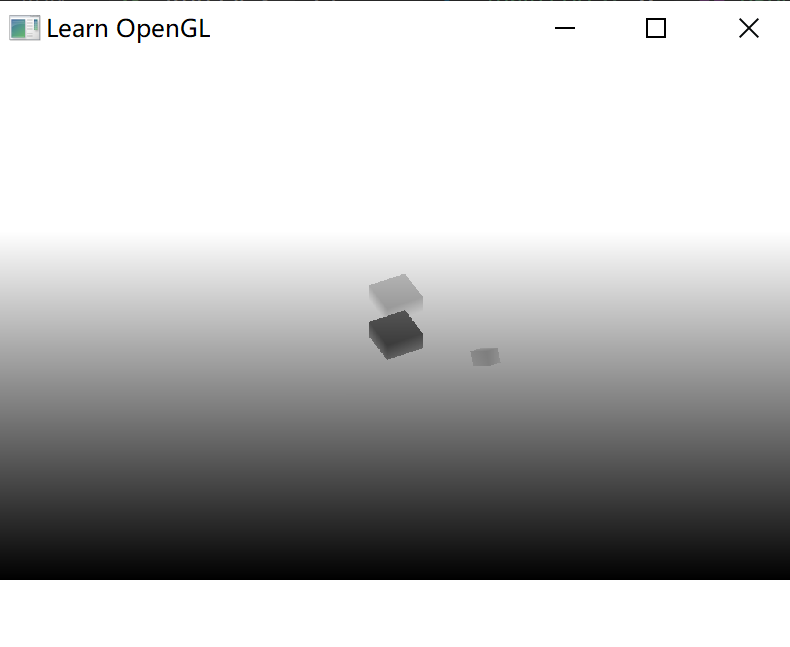
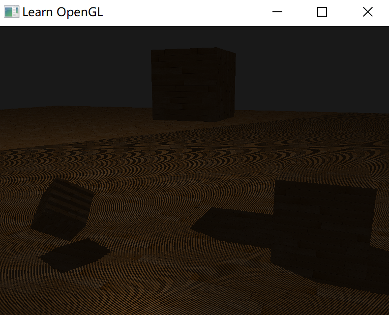
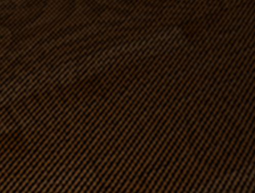
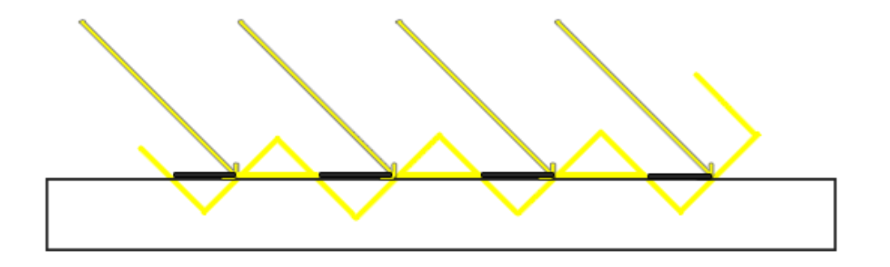
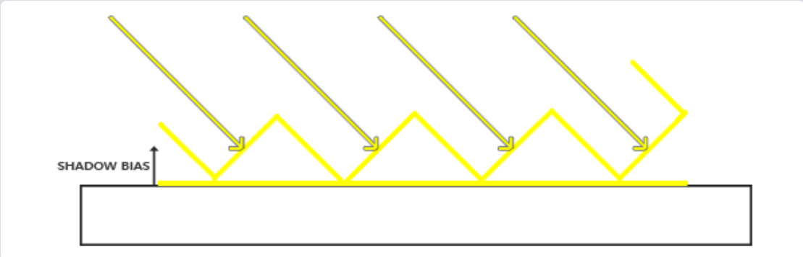

# 阴影映射

阴影是光线被阻挡的结果；



阴影映射是实现阴影的一种方式。

阴影映射(Shadow Mapping)思路很简单：以光的位置为视角进行渲染，能看到的东西都将被点亮，看不见在阴影之中。



所有蓝线代表光源可以看到的片段。黑线代表被遮挡的片段。

如果绘制一条从光源出发，到达最右边盒子上的一个片段上的线段或射线，那么射线将先击中悬浮的盒子，随后才会到达最右侧的盒子。结果就是悬浮的盒子被照亮，而最右侧的盒子将处于阴影之中。

希望得到射线第一次击中的那个物体，然后用这个最近点和射线上其他点进行对比。然后测试一下看看射线上的其他点是否比最近点更远，如果是的话，这个点就在阴影中。

对从光源发出的射线上的成千上万个点进行遍历极端消耗性能，可以采取相似举措，不用投射出光的射线。使用深度缓冲。

深度缓冲里的一个值是摄像机视角下，对应于一个片段的一个0到1之间的深度值。从光源的透视图来渲染场景，并把深度值的结果储存到纹理中，通过这种方式，就能对光源的透视图所见的最近的深度值进行采样。

最终，深度值就会显示从光源的透视图下见到的第一个片段了。管储存在纹理中的所有这些深度值，叫做深度贴图（depth map）或阴影贴图。



左侧的图片展示了一个定向光源在立方体下的表面投射的阴影。通过储存到深度贴图中的深度值，就能找到最近点，用以决定片段是否在阴影中。

我们使用一个来自光源的视图和投影矩阵来渲染场景就能创建一个深度贴图。这个投影和视图矩阵结合在一起成为一个 T 变换，它可以将任何三维位置转变到光源的可见坐标空间。

在右边的图中显示出同样的平行光和观察者。

1. 渲染一个点 P 处的片段，需要决定它是否在阴影中。先得使用 T 把 P 点变换到光源的坐标空间里；
2. 此时 P 是从光的透视图中看到的，它的 z 坐标就对应于它的深度，例子中这个值是 0.9；
3. 使用点 P 点在光源的坐标空间的坐标，可以索引深度贴图，来获得从光的视角中最近的可见深度，结果是点 C ，最近的深度是 0.4；
4. 因为索引深度贴图的结果是一个小于点 P 点的深度，可以断定 P 被挡住。

阴影映射由两个步骤组成：

1. 首先，渲染深度贴图；
2. 然后像往常一样渲染场景，使用生成的深度贴图来计算片段是否在阴影之中。


## 深度贴图

第一步需要生成一张深度贴图(Depth Map)。

深度贴图是从光的透视图里渲染的深度纹理，用它计算阴影。因为需要将场景的渲染结果储存到一个纹理中，将再次需要帧缓冲。

### 创建帧缓冲对象

````c++
GLuint depthMapFBO;
glGenFramebuffers(1, &depthMapFBO);
````

### 创建 2D 纹理

创建 2D 纹理，用来保存帧缓存对象的深度缓冲：

````c++
const GLunit SHADOW_WIDTH = 1024, SHADOW_HEIGHT = 1024;

GLuint depthMap;
glGenTextures(1, &depthMap);
glBindTexture(GL_TEXTURE_2D, depthMap);
glTexImage2D(GL_TEXTURE_2D, 0, GL_DEPTH_COMPONENT, SHADOW_WIDTH, SHADOW_HEIGHT, 0, GL_DEPTH_COMPOENET, GL_FLOAT, NULL);
glTexParameteri(GL_TEXTURE_2D, GL_TEXTURE_MIN_FILTER, GL_NEAREST);
glTexParameteri(GL_TEXTURE_2D, GL_TEXTURE_MAG_FILTER, GL_NEAREST);
glTexParameteri(GL_TEXTURE_2D, GL_TEXTURE_WRAP_S, GL_REPEAT); 
glTexParameteri(GL_TEXTURE_2D, GL_TEXTURE_WRAP_T, GL_REPEAT);
````

纹理格式指定为 GL_DEPTH_COMPONENT 。纹理的高宽设置为1024：这是深度贴图的分辨率。

把生成的深度纹理作为帧缓冲的深度缓冲：

````c++
glBindFramebuffer(GL_FRAMEBUFFER, depthMapFBO);
glFramebufferTexture2D(GL_FRAMEBUFFER, GL_DEPTH_ATTCCHMENT, GL_TEXTURE_2D, depthMap, 0);
glDrawBuffer(GL_NONE);
glReadBuffer(GL_NONE);
glBindFramebuffer(GL_FRAMEBUFFER, 0);
````

通过将调用 `glDrawBuffer` 和 `glReadBuffer` 把读和绘制缓冲设置为 `GL_NONE` 告诉 `OpenGL` 不使用任何颜色数据进行渲染。因为只需要获得深度信息即可！

### 生成深度贴图

````c++
// 1. 首选渲染深度贴图
glViewport(0, 0, SHADOW_WIDTH, SHADOW_HEIGHT);
glBindFramebuffer(GL_FRAMEBUFFER, depthMapFBO);
glClear(GL_DEPTH_BUFFER_BIT);
ConfigureShaderAndMatrices();
RenderScene();
glBindFramebuffer(GL_FRAMEBUFFER, 0);
// 2. 像往常一样渲染场景，但这次使用深度贴图
glViewport(0, 0, SCR_WIDTH, SCR_HEIGHT);
glClear(GL_COLOR_BUFFER_BIT | GL_DEPTH_BUFFER_BIT);
ConfigureShaderAndMatrices();
glBindTexture(GL_TEXTURE_2D, depthMap);
RenderScene();
````

以上是 阴影映射 的基本思路。其中一定要调用 `glViewport`，因为阴影贴图经常和原来渲染的场景（通常是窗口分辨率）有着不同的分辨率。

### 光源空间的变换

上述代码中的 `ConfigureShaderAndMatrices` 确保为每个物体设置了合适的投影和视图矩阵，以及相关的模型矩阵。

但渲染深度贴图时，需要使用光位置下的变换矩阵。

假设光线是定向光，为光源事业正交投影矩阵，透视图将没有任何变形（得到 project 矩阵）：

```c++
GLfloat near_plane = 1.0f, far_plane = 7.5f;
glm::mat4 lightProjection = glm::ortho(-10.0f, 10.0f, -10.0f, 10.0f, near_plane, far_plane);
```

使用glm::lookAt函数；从光源的位置看向场景中央（得到 view 矩阵）：

````c++
glm::mat4 lightView = glm::lookAt(glm::vec(-2.0f, 4.0f, -1.0f), glm::vec3(0.0f, 0.0f, 0.0f), glm::vec3(0.0f, 1.0f, 0.0f));
````

二者相结合为提供了一个光空间的变换矩阵，它将每个世界空间坐标变换到光源处所见到的那个空间：

````c++
glm::mat4 lightSpaceMatrix = lightProjection * lightView;
````

即 T 变换矩阵。

### 渲染至深度贴图

以光的透视图进行场景渲染的时候，会用一个比较简单的着色器：

````glsl
#version 330 core
layout (location = 0) in vec3 position;

uniform mat4 lightSpaceMatrix;
uniform mat4 model;

void main()
{
    gl_Position = lightSpaceMatrix * model * vec4(position, 1.0f);
}
````

将一个单独模型的一个顶点，使用lightSpaceMatrix变换到光空间中。

由于没有颜色缓冲，最后的片段不需要任何处理，直接使用一个空片段着色器：

````glsl
#version 330 core

void main()
{             
    // gl_FragDepth = gl_FragCoord.z;
}
````

这样，在绘制场景前，先切换到光照位置的变换矩阵，渲染后得到一张深度缓冲纹理。再换到屏幕显示，把纹理直接绘制出来。




## 渲染阴影

正确地生成深度贴图以后，就可以开始生成阴影了。

### 顶点着色器

在顶点着色器中进行光空间的变换：

```glsl
#version 330 core
layout (location = 0) in vec3 position;
layout (location = 1) in vec3 normal;
layout (location = 2) in vec2 texCoords;

out vec2 TexCoords;

out VS_OUT {
    vec3 FragPos;
    vec3 Normal;
    vec2 TexCoords;
    vec4 FragPosLightSpace;
} vs_out;

uniform mat4 projection;
uniform mat4 view;
uniform mat4 model;
uniform mat4 lightSpaceMatrix;

void main()
{
    gl_Position = projection * view * model * vec4(position, 1.0f);
    vs_out.FragPos = vec3(model * vec4(position, 1.0));
    vs_out.Normal = transpose(inverse(mat3(model))) * normal;
    vs_out.TexCoords = texCoords;
    vs_out.FragPosLightSpace = lightSpaceMatrix * vec4(vs_out.FragPos, 1.0);
}
```

用 lightSpaceMatrix，把世界空间顶点位置转换为光空间，传递到片段着色器。

### 片段着色器

片段着色器中，计算出一个shadow值，当fragment在阴影中时是1.0，在阴影外是0.0。然后，diffuse 和 specular 颜色会乘以这个阴影元素。由于阴影不会是全黑的（由于散射），把 ambient 分量从乘法中剔除。

````glsl
#version 330 core
out vec4 FragColor;

in VS_OUT {
    vec3 FragPos;
    vec3 Normal;
    vec2 TexCoords;
    vec4 FragPosLightSpace;
} fs_in;

uniform sampler2D diffuseTexture;
uniform sampler2D shadowMap;

uniform vec3 lightPos;
uniform vec3 viewPos;

float ShadowCalculation(vec4 fragPosLightSpace)
{
    [...]
}

void main()
{           
    vec3 color = texture(diffuseTexture, fs_in.TexCoords).rgb;
    vec3 normal = normalize(fs_in.Normal);
    vec3 lightColor = vec3(1.0);
    // Ambient
    vec3 ambient = 0.15 * color;
    // Diffuse
    vec3 lightDir = normalize(lightPos - fs_in.FragPos);
    float diff = max(dot(lightDir, normal), 0.0);
    vec3 diffuse = diff * lightColor;
    // Specular
    vec3 viewDir = normalize(viewPos - fs_in.FragPos);
    vec3 reflectDir = reflect(-lightDir, normal);
    float spec = 0.0;
    vec3 halfwayDir = normalize(lightDir + viewDir);  
    spec = pow(max(dot(normal, halfwayDir), 0.0), 64.0);
    vec3 specular = spec * lightColor;    
    // 计算阴影
    float shadow = ShadowCalculation(fs_in.FragPosLightSpace);       
    vec3 lighting = (ambient + (1.0 - shadow) * (diffuse + specular)) * color;    

    FragColor = vec4(lighting, 1.0f);
}
````

声明一个shadowCalculation函数，用它计算阴影。

片段着色器的最后，把 diffuse 和 specular 乘以(1-阴影元素)，这表示这个片段有多大成分不在阴影中。

这个片段着色器还需要两个额外输入，一个是光空间的片段位置和第一个渲染阶段得到的深度贴图。

### `ShadowCalculation` 函数

````glsl
float ShadowCalculation(vec4 fragPosLightSpace)
{
    // 执行透视除法
    vec3 projCoords = fragPosLightSpace.xyz / fragPosLightSpace.w;
    // 变换到[0,1]的范围
    projCoords = projCoords * 0.5 + 0.5;
    // 取得最近点的深度(使用[0,1]范围下的fragPosLight当坐标)
    float closestDepth = texture(shadowMap, projCoords.xy).r; 
    // 取得当前片段在光源视角下的深度
    float currentDepth = projCoords.z;
    // 检查当前片段是否在阴影中
    float shadow = currentDepth > closestDepth  ? 1.0 : 0.0;

    return shadow;
}
````

### 效果




## 改进阴影贴图

### 阴影失真

出现明显的线条样式：



这种阴影贴图的不真实感叫做**阴影失真(Shadow Acne)**，成因为：



因为阴影贴图受限于分辨率，在距离光源比较远的情况下，多个片段可能从深度贴图的同一个值中去采样。图片每个斜坡代表深度贴图一个单独的纹理像素。可以看到，多个片段从同一个深度值进行采样。

> 带箭头的线为光照方向，三角波形的黄线为每一个纹理像素。显然一个纹理像素上可以多个片段进行采样。
>
> 而不同片段映射到一个纹理像素时，一半被判顶在表面下面，一半在上面，导致在表面下的片段被视为阴影。

使用**阴影偏移**（shadow bias）解决，对表面的深度（或深度贴图）应用一个偏移量，这样片段就不会被错误地认为在表面之下了。



实现这个偏移：

````glsl
float bias = 0.005;
float shadow = currentDepth - bias > closestDepth  ? 1.0 : 0.0;
````

这个偏移大多情况够用，但如果表面坡度很大，仍然会产生阴影失真。有一个更加可靠的办法能够根据表面朝向光线的角度更改偏移量：使用点乘：

````glsl
float bias = max(0.05 * (1.0 - dot(normal, lightDir)), 0.005);
````

