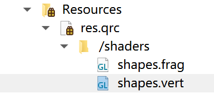

# QOpenGLShaderProgram 类

Qt 封装了着色器程序的类，可以很方便地创建着色器程序。


## 根据字符串创建

使用成员函数 `addShaderFromSourceCode` 从指定字符串创建着色器：

````c++
bool addShaderFromSourceCode(QOpenGLShader::ShaderType type, const char *source);
````

- 参数一：要创建着色器的类型：
  - `QOpenGLShader::Vertex`：表示顶点着色器；
  - `QOpenGLShader::Fragment`：表示片段着色器；
  - `    QOpenGLShader::Geometry`：表示几何着色器。
- 参数二：着色器程序字符串；
- 返回值：`bool` 类型，表示是否创建成功。


## 根据文件创建

使用成员函数 `addShaderFromSourceFile` 从指定文件中创建着色器：

```c++
bool addShaderFromSourceFile(QOpenGLShader::ShaderType type, const QString& fileName);
```

- 参数一：要创建着色器的类型：
  - `QOpenGLShader::Vertex`：表示顶点着色器；
  - `QOpenGLShader::Fragment`：表示片段着色器；
  - `    QOpenGLShader::Geometry`：表示几何着色器。
- 参数二：着色器程序文件名；
- 返回值：`bool` 类型，表示是否创建成功。

可以将着色器文本文件放入项目中的资源文件。类似这个文件结构：



之后在程序中使用的资源文件时，需要注意路径：

```c++
this->_shaderProgram.addShaderFromSourceFile(QOpenGLShader::Vertex, ":/shaders/shapes.vert");
this->_shaderProgram.addShaderFromSourceFile(QOpenGLShader::Fragment, ":/shaders/shapes.frag");
```


## 链接着色器

创建好若干着色器后，需要将其链接为完整的着色器程序，使用成员函数 `link`：

````c++
bool link();
````

返回是否链接成功。


## 使用着色器程序

使用成员函数 `bind` 将着色器程序绑定到上下文：

````c++
bool bind();
````


## 设置 `Uniform` 变量

通过成员函数 `setUniformValue` 函数来设置 `uniform` 变量的值：

````c++
    void setUniformValue(const char *name, GLfloat value);
    void setUniformValue(const char *name, GLint value);
    void setUniformValue(const char *name, GLuint value);
    void setUniformValue(const char *name, GLfloat x, GLfloat y);
    void setUniformValue(const char *name, GLfloat x, GLfloat y, GLfloat z);
    void setUniformValue(const char *name, GLfloat x, GLfloat y, GLfloat z, GLfloat w);
    void setUniformValue(const char *name, const QVector2D& value);
    void setUniformValue(const char *name, const QVector3D& value);
    void setUniformValue(const char *name, const QVector4D& value);
    void setUniformValue(const char *name, const QColor& color);
    void setUniformValue(const char *name, const QPoint& point);
    void setUniformValue(const char *name, const QPointF& point);
    void setUniformValue(const char *name, const QSize& size);
    void setUniformValue(const char *name, const QSizeF& size);
    void setUniformValue(const char *name, const QMatrix2x2& value);
    ...
````

这个函数有很多重载：

- 参数一：可以写入 `uniform` 变量的名称，也可以直接写由 `glGetUniformLocation` 函数查找到这个变量的位置，写名称的话，也还是会先调用 `glGetUniformLocation` 找到位置；
- 参数二：要设置的值，有很多类型，只要填入 `uniform` 变量对应的类型即可。


