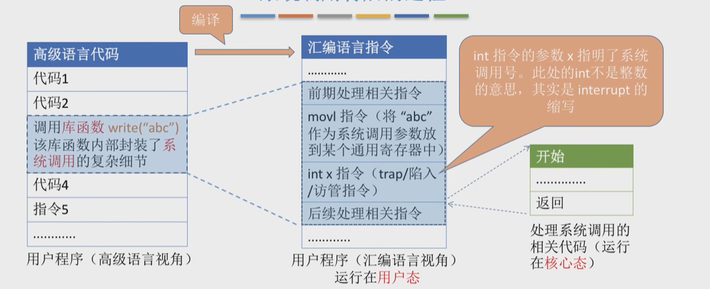

# 第1章 操作系统概述

## 1.1 操作系统的概念、功能、目标

### 操作系统的概念（定义）

> :zap:==操作系统（Operating System, OS）==是**控制和管理**整个计算机系统的**硬件软件资源**，并合理地**组织调度**计算机的**工作和资源的分配**，以提供用户和其他软件方便的**接口和环境**，是计算机系统中最基本的==系统软件==；

计算机层次结构：

- 用户
- 应用程序（软件）
- 操作系统
    - 负责管理协调硬件、软件等计算机资源的工作；
    - 为上层的应用程序、用户提供简单易用的服务；
    - 操作系统是软件；
- 裸机（纯硬件）

### 操作系统的功能和目标

作为==系统资源管理者==：
- 提供的功能：
    - 处理机管理；
    - 存储器管理；
    - 文件管理；
    - 设备管理；
- 目标：安全高效；

作为==用户和计算机硬件之间的接口==：
- 提供的功能：
    - 命令接口（允许用户直接使用，在cmd中）：
        - 联机命令接口（交互式命令接口）：<u>用户说一句，系统做一句</u>；
        - 脱机命令接口（批处理命令接口.bat文件）：<u>用户说一堆，系统做一堆</u>；
    - 程序接口（由一组系统调用组成）：
        - 通过程序才能调用的，比如调用.dll中的函数；
    - GUI（图形用户界面）：
        - 用户使用形象的图形界面操作，不需要记忆命令；
- 目标：方便用户使用

作为==最接近硬件的层次==：
- 提供的功能和目标：实现对硬件机器的拓展；

## 1.2 操作系统的特征

操作系统的特征：并发、共享、虚拟、异步；

并发与共享是最基本的，二者互为存在条件。

### 并发

<u>指两个或多个事件在同一时间间隔内发送</u>;

这些事件宏观上是同时发送的，但微观上的交替发送的；

与并行相对：指两个或以上事件同一时刻发送；

### 共享

即资源共享，是指<u>系统中的资源可供内存中多个并发执行的进程共同使用</u>；

两种**资源共享方式**：

- 互斥共享方式：
    - 系统中的某些资源，虽然可以提供多个进程使用，但一个时间段内只能允许一个进程访问资源；
- 同时共享方式：
    - 系统中的某些资源，允许一个进时间段内由多个进程 “同时” 对其访问（类型并发）；

> 并发与共享的关系：
>
> 如果失去并发性，则系统中只有一个程序正在运行，则共享性就失去存在价值；如果失去共享性，则就无法同时访问硬件，不可能完成并发性；

### 虚拟

指<u>把一个物理上的实体变为若干个逻辑上的对应物</u>。物理实体（前者）是实际存在的，而逻辑上对应物（后者）是用户感受到的；

> 例如，使用虚拟处理器技术，把物理上单核的CPU，在用户看来确是多个CPU运行着多个进程；

### 异步

指在多到程序环境下，运行多个程序并发执行，但由于资源有限，进程的执行不是一贯到底的，而是走走停停，<u>以不可预知的速度向前推进，着就是进程的异步性</u>；

## 1.3 操作系统的发展与分类

### 手工操作阶段

- 通过输入纸带，将需要执行的程序、执行过程中的数据放入计算机；
- 主要缺点：
    - 用户独占全：一台机器只能由一个人使用；
    - 人机速度矛盾导致资源利用率低：计算机计算快，人工输入慢，多数时间计算机都在等待输入；

### 批处理阶段——单道批处理系统

- 引入脱机输入/输出技术（用磁带完成），并**监督程序**（操作系统的雏形）负责控制作业的输入、输出；
- 使用磁带速度比纸快得多，并且由监督程序负责控制，速度快；
- 主要优点：
    - 缓解一定程度的人机速度矛盾，资源利用率有所提高；
- 主要缺点：
    - 内存中只有一个程序功能运行，只有在这个程序结束后才能调用下一个。CPU有大量时间在等待I/O完成，资源利用率还是很低；

### 批处理阶段——多道批处理系统

- 计算机可以从磁带中每次往内存中输入**多个程序**；
- 操作系统正式诞生，并引入**中断技术**，由操作系统负责管理这些程序的运行。各个程序并发执行；
- 主要优点：
    - 多个程序**并发执行**，**共享计算机资源**；资源**利用率大大提高**，CPU与其他资源长期保持忙碌状态，系统吞吐量大；
- 主要缺点：
    - 用户响应时间长，没有人机交互功能，用户提交自己的作业后就只能等待计算机批处理完毕，过程中不能控制自己的作业执行；

### 分时操作系统

- 计算机以时间片为单位轮流为各个用户/作业服务，各个用户可通过终端与计算机进行交互；
- 主要优点：
    - 用户请求可以被即时响应，解决了人机交互问题。运行多个用户同时使用一台计算机，并且用户对计算机的操作系统相互独立，感受不到别人的存在；
- 主要缺点：
    - 不能优先处理一些紧急任务。操作系统对各个程序完全公平，循环为每个程序运行；

### 实时操作系统

- 在实时操作系统的控制下，计算机系统接收到外部信号后及时进行处理，并且在严格的时限内处理完事件。实时操作系统的主要特点是及时性和可靠性；
- 主要优点：能够优先响应一些紧急任务，某些紧急任务不需要时间片排队；
- 实时系统的分类：
    - 硬实时系统：必须在绝对严格的规定时间内完成处理（导弹控制系统，自动驾驶）；
    - 软实时系统：能接受偶尔违反时间规定；

### 其他操作系统

- 网络操作系统；
- 分布式操作系统；
- 个人计算机操作系统；

## 1.4 操作系统的运行机制与体系结构

### 运行机制

> ==指令==是处理器（CPU）能识别、执行的最基本；

- 指令分类
    - **特权指令**：不允许用户程序执行的指令；
    - **非特权指令**：运行用户程序执行的指令；
- 为了判断CPU是否能够执行特权指令，将处理器分为==用户态（目态）==与==核心态（管态）==两种状态；
- 使用==程序状态字寄存器（PSW）==中的某个标志位来标识当前处理器的状态；
- 再根据程序<u>是否能够执行特性指令</u>，将其分为：
    - **内核程序**：操作系统的内核程序是系统的管理者，既可以执行特权指令又可以执行非特权指令；
    - **应用程序**：为了保证系统的安全运行，普通应用程序只能执行非特权指令，运行在用户态；

### 操作系统内核

> ==内核==是计算机上配置的底层软件，是操作系统最基本、最核心的部分。实现操作系统内核功能的程序就是内核程序；

操作系统具体分为：
- 非内核功能；
- 内核：
    - **时钟管理**：实现计时功能；
    - **中断管理**：负责实现中断；
    - **原语**：
        - 一种特殊的程序；
        - 处于操作系统最底层，最接近硬件的部分；
        - 这种程序的运行具有原子性——运行只能一气呵成，不能中断；
        - 运行时间短，调用频繁；
    - 对系统**资源进程管理**：
        - 进程管理、存储器管理、设备管理等功能；

### 操作系统的体系结构

参考上述操作系统的层次：
- ==大内核==：
    - 把进程管理、存储器管理、设备管理等**资源进程管理**功能也划分进操作系统的功能，就是**大内核**；
    - 优点：**高性能**；
    - 缺点：<u>内核代码庞大、结构混乱、难以维护</u>；
- ==微内核==：
    - 只有**时钟、中断管理与原语**这样靠近底层必不可少的功能，就是**微内核**；
    - 优点：<u>内核功能少，结构清晰，方便维护</u>；
    - 缺点：需要频繁地在核心态和用户态之间切换，**性能低**；

## 1.5 中断与异常

### 中断机制的诞生

为了解决串行执行效率低的问题，人们发明了操作系统，引入==中断机制==，实现了多道程序并发执行；

> 本质上，发送中断就意味着需要操作系统介入，开展管理工作；
>

### 中断的概念和功能

- 当中断发生时，CPU立即进入**核心态**；
- 当中断发生后，<u>当前运行的进**程暂停运行**，并由操作**系统内核**对中断进行处理</u>；
- 对不同的中断信号，会进行不同的处理；

发送中断就意味着需要**操作系统介入**，开展**管理工作**。由于操作系统的管理工作（比如上下文切换、分配IO设备）需要使用特权指令，因此CPU会进入核心态。

中断可以使CPU<u>从用户态进入核心态</u>，使得操作系统获得计算机的**控制权**；有了中断才可以实现多程序并发；

<u>只有中断才能使用户态进入核心态（唯一途径）</u>;

### 中断的分类

中断分类1：
- 内中断（也称为异常、例外、陷入，<u>信号来源CPU内部，与当前执行的指令有关</u>(也不一定吧)）：
    - 自愿中断——**指令中断**；
        - 如：系统调用时使用的访管指令（trap）
    - **强迫中断**：
        - **硬件中断**：缺页中断
        - **软件中断**：整数÷0
- 外中断（中断，<u>信号来源CPU外部，与当前执行的指令无关</u>）：
    - 外设请求；
    - 人工干预；

中断分类2：
- 内中断（内部**异常**，来源CPU内部）：
    - **陷阱、陷入（trap）**：有意为之的异常，如系统调用；
    - **故障（fault）**：由错误条件引起的，可能被故障程序修复，如缺页；
    - **终止（abort）**：不可能恢复的致命错误导致，÷0；
- 外中断（来源CPU外部）：
    - **I/O中断请求**；
    - **人工干预**；

### 外中断的处理过程

- 每条指令执行结束后，CPU检查是否有外部中断信号；
- 若有外部中断信号，则需要保护被中断进程的CPU环境；
- 根据中断信号类型转入相应的中断处理程序；
- 恢复原进程的CPU环境，返回中断前的程序继续执行；

## 1.6 系统调用

### 系统调用的概念作用与分类

> 操作系统作为用户和计算机硬件之间的接口，需要<u>向上提供一些简单易用的服务</u>。主要包括==命令接口==和==程序接口==。其中程序接口由一组==系统调用==组成；

应用程序通过==系统调用==请求操作系统发服务。

系统中的各种共享资源都由**操作系统统一管理**，因此用户程序中，凡是与**资源**有关的操作（存储分配、I/O操作、文件管理等），都必须<u>通过系统调用的方法向操作系统提出服务，由操作系统代为完成</u>。

这样可以<u>保证系统的**稳定性**和**安全性**</u>，防止用户进行非法操作；

系统调用（按功能分类）：
- **设备管理**：完成<u>设备的请求、释放、启动</u>等功能；
- **文件管理**：完成<u>文件的读、写、创建、删除</u>等功能；
- **进程管理**：完成<u>进程的创建、撤销、阻塞、唤醒</u>等功能；
- **进程通信**：完成<u>进程间的消息传递、信号传递</u>等功能；
- **内存管理**：完成<u>内存的分配、回收等</u>功能；

### 系统调用与库函数的区别

| 普通应用程序 | 可以直接进行系统调用，也可以使用库函数。有的库函数涉及系统调用，有些没有 |
| ------------ | ------------------------------------------------------------ |
| 编程语言     | 向上提供库函数。有时会将系统调用封装为库函数，使得向上使用更方便； |
| 操作系统     | 向上提供系统调用                                             |
| 裸机         |                                                              |

​	比如，可以使用c语言的库函数`fread()`，也可以直接使用系统调用`read()`;

### 系统调用背后的过程

由汇编指令 `int` 指令陷入内核，进行系统调用；

系统调用**过程**：
- 传递系统调用的**参数**（如上图，把要写入文件的信息"abc"记录到某个寄存器）；
- 执行==陷入指令==（用户态执行`int`）；
- 执行系统调用相应服务程序（**核心态**）；
- 返回用户程序；

系统调用**注意事项**：
- `int` 后的整形数字表示调用哪个系统调用；
- 陷入指令是在**用户态执行**的，执行陷入指令之后立即引发有关**内中断**，从而CPU进入核心态；
- **发出系统调用请求**是在用户态，而对系统调用的处理是在**核心态**；
- 陷入指令是唯一一个<u>只能在用户态执行，而不能在核心态执行的指令</u>；
