# 第2章 进程管理

## 2.1 进程

### 2.1.1 定义

> 程序：一个指令序列

单道程序的计算机中只能执行一个程序，同一时间计算机的内存中只需要这个程序的代码段与数据段；

引入多道程序技术后，计算机内存中同时存放多个程序，各个程序的代码段、数据段放置的位置不同，操作系统作为程序的管理者，需要知道每个程序的信息，指导 CPU 到内存中寻找程序的位置；

<u>为了方便操作系统管理，完成各程序并发执行，引入了进程、进程实体的概念</u>；

操作系统为每个运行的程序配置一个数据结构，称为**进程控制块（PCB）**，用来描述进程的各种信息；

> PCB、程序段、数据段三部分构成了进程实体（进程映像），简称进程；

创建进程，就是创建进程实体中的 PCB，而撤销进程，就是撤销进程实体中的 PCB；

PCB是进程存在的唯一标志；

> 进程是进程实体的运行过程，是系统进程资源配置和调度的独立单位；

虽然把进程实体也简称为进程，但进程实体是静态的概念，进程则是动态的；

但一般情况下，可以认为进程实体就是进程；

### 2.1.2 组成

进程（进程实体）由**程序段、数据段、PCB** 三部分组成：
- **PCB**：操作系统通过 PCB 管理进程，因此PCB中包含了操作系统对其进行管理的各种信息；
    - 进程描述信息：进程标识符 PID、用户标识符 UID；
    - 进程描述信息：进程当前状态、进程优先级；
    - 资源管理分配清单：程序段指针、数据段指针、键盘、鼠标；
    - 处理机相关信息：各种寄存器值
- **数据段**：程序运行时需要的数据；
- **程序段**：程序运行的二进制代码；

### 2.1.3 组织

系统中有很多进程，也即很多 PCB，为了能够对其高效管理，应用适当的方式将这些 PCB 组织起来；

进程的组织讨论的是多个进程之间的组织方式问题，主要有以下方式：

#### 链接方式

- 按照进程状态将PCB分为多个队列，操作系统持有指向各个队列的指针；

- 执行指针：指向当前处于运行状态（执行态）的进程，单CPU计算机，就一个进程可以运行；

- 就绪队列指针：指向当前处于就绪态的进程队列，通常把优先级高的放在队头，这样可以先出队先执行；

- 阻塞队列指针：指向当前处于阻塞态的进程队列；

    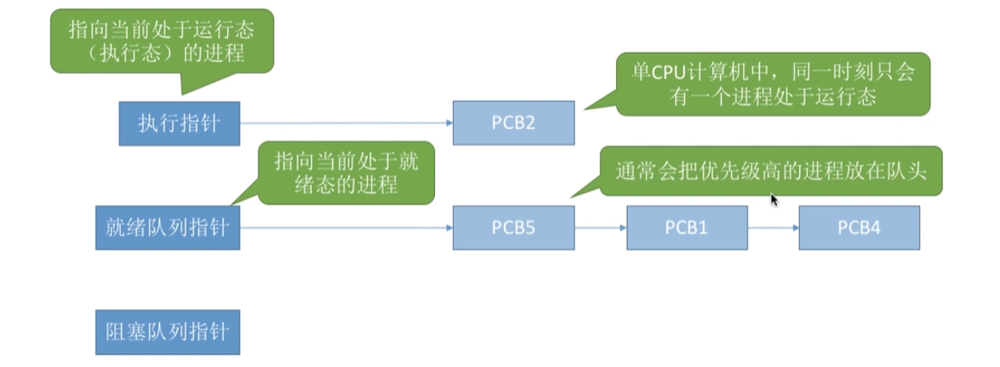

#### 索引方式

- 根据进程状态不同，建立几张索引表，操作系统持有指向各个索引表的指针；

- 跟链接方式差不多，只是把队列这种数据结构换成了数组，操作系统拥有指向各个表头的地址，其中每个表项保持进程；

    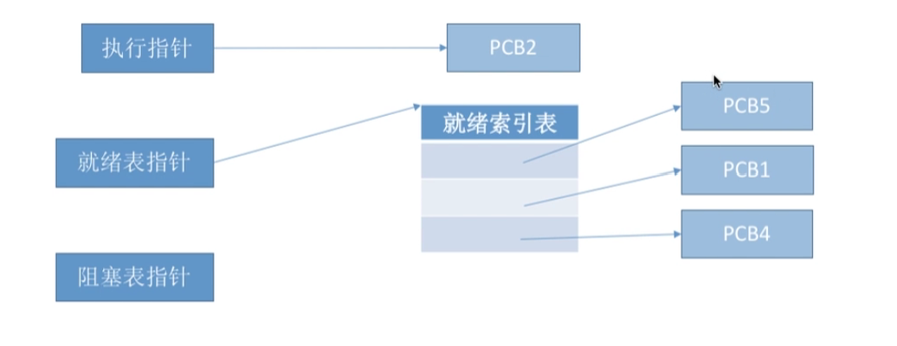

### 2.1.4 特征

- :star:**动态性**：进程是程序的一次执行过程，是动态产生、变化和消亡的，进程的基本特征；
- **并发性**：内存中有多个进程实体，各进程可并发执行；
- :star:**独立性**：进程是独立运行的、独立获得资源、独立接受调度的基本单位；
- **异步性**：各进程按各自独立的、不可预知的速度向前推进，操作系统要提高“进程同步机制”来解决异步问题；
- **结构性**：每个进程都会配置一个PCB。结构上看，进程由程序段、数据段、PCB组成；


## 2.2 线程

### 2.2.1 概念

> 有些进程需要”同时“处理多个事件，而传统的进程只能串行得执行一系列程序。
>
> 为了引入了线程，增加并发性；

引入线程之前，进程是CPU调度的最小单位：
​    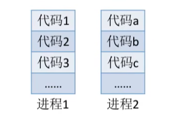

而引入线程后，线程成为了程序执行流的最小单位。每个线程的代码可以不同，在同一个进程中完成不同的任务；
​    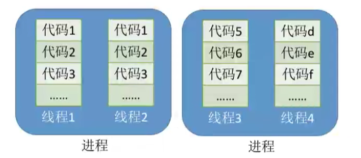

线程是一种“轻量级的进程”，是一个基本的 CPU 执行单元，也是程序执行流的最小单位；

引入线程后，不仅进程之间可以并发，进程内部的各个线程也可以并发，进一步提高了系统的并发度，使得一个进程内部可以处理各种任务；

> 比如一个QQ可以视频聊天、文字聊天、传文件”同时“进行，如果没有线程，我们就只能开很多QQ分布处理这些任务

引入线程后，进程只作为除 CPU 外系统资源的分配单位（打印机、内存地址空间等是以进程为单位分配）；

### 2.2.2 带来的变化

引入线程后，对系统的影响：

#### 资源分配、调度

- 传统进程机制，进程是资源分配、调度的基本单位；
- 引入线程后，进程只是资源分配的基本单位，线程是CPU调度的基本单位；

#### 并发性

- 传统进程机制中，只能进程间并发；
- 引入线程后，各线程也可以并发执行；

#### 系统开销

- 传统的进程间并发，需要切换进程的运行环境，系统开销很大；
- 线程间并发，如果在同一个进程内的线程切换，不需要进程切换进程环境，系统开销小；
- 引入线程后，并发带来的系统开销小；

### 2.2.3 属性

- 线程是处理机调度的基本单位；
- 多CPU计算机中，各个线程可以占用不同的CPU；
- 每个线程都有一个线程ID、线程控制块TCB；
- 线程也有就绪、阻塞、运行三个基本状态；
- 线程几乎不拥有系统资源；
- 同一进程的不同线程之间共享进程的资源；
- 由于共享内存地址空间，同一个进程的线程通信无需系统干预；
- 同一进程中的线程切换，不会引起进程切换；
- 不同进程的线程切换，会引起进程切换；
- 切换同进程的线程，系统开销小；
- 切换进程，系统开销大；

### 2.2.4 实现方式

#### 用户级线程（User-Level Thread, ULT）

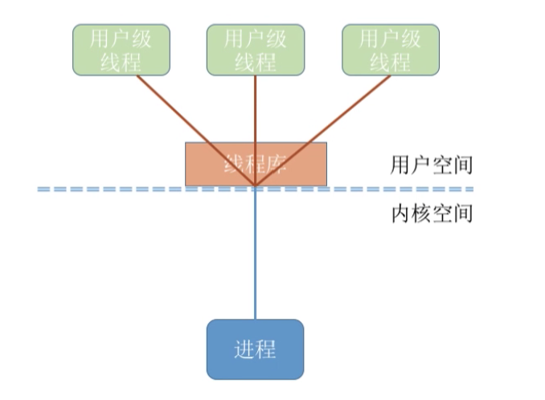

- 用户级线程是由应用程序通过线程库实现的；
- 所有的线程管理工作都由应用程序负责（包括线程切换）
- 用户级线程中，线程切换可以在用户态完成；
- 在用户看来，是有多个线程，但在操作系统的内核看来，并意识不到线程的存在（用户级线程对用户不透明，对操作系统透明）；
- 同一个进内的用户级线程是不可以并行的；

> 应用程序自己实现多线程

#### 内核级线程（Kernel-Level Thread, KLT）

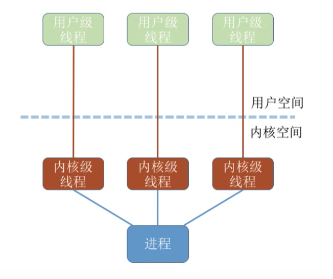

- 内核级线程的管理工作由操作系统内核完成；
- 线程的调度、切换等工作由内核负责，因此内核级线程的切换必然需要在核心态才能完成；
- 操作系统只看得到内核级线程，所有只有内核级线程才是处理机分配的单位；

> 有些系统只支持用户级线程，有的只支持内核级线程；
>
> 在同时支持两种进程的系统中，可以采用二者组合的方式：将n个用户级映射到m个内级线程上；就是要把用户创建的用户级线程映射到内核能够管理的内核级线程去执行；

### 2.2.5 多线程模型

在同时支持用户级线程和内核级线程的系统中，由几个用户级线程映射到几个内核级线程的问题引出了 “多线程模型”：

#### 多对一模型

多个用户级线程映射到一个内核级线程。每个用户进程只对应一个内核级线程；

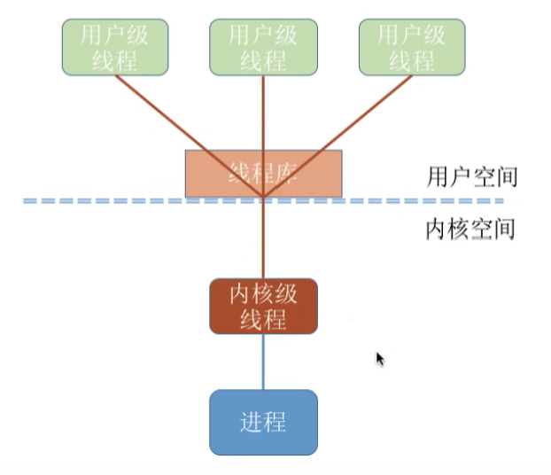

优点：用户级线程的切换在用户空态即可完成，不需要切换到核心态，线程管理的系统开销小，效率高；

缺点：

- 当一个用户级线程被阻塞，整个进程都会阻塞，并发度不高；
- 多个线程不能在多核处理机并行，因为操作系统只看得到这一个内核级线程；

#### 一对一模型

一个用户级线程映射到一个内核级线程。

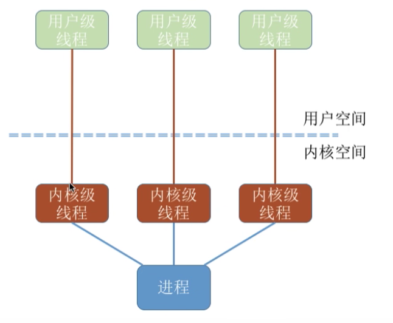

优点：

- 当一个线程被堵塞，其他的用户级线程还可以继续执行，并发能力强；
- 多线程可以在多核处理机并行；

缺点：

- 一个用户进程会占用多个内核级线程，线程切换由操作系统内核完成，需要到核心态，因此线程管理的成本高，开销大；

#### 多对多模型

多个用户级线程映射到多个内核级线程。

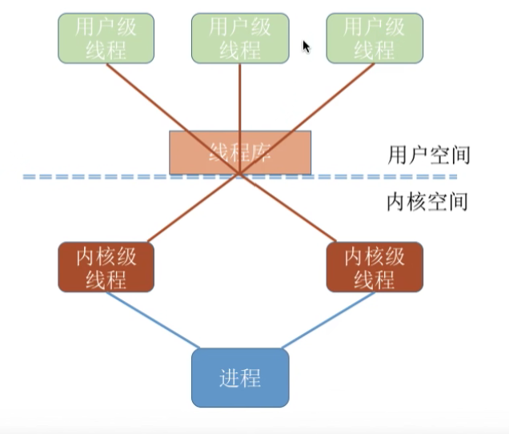

优点：

- 克服了多对一模型并发现不高的问题；
- 克服了一对一模型中系统开销大的问题；


## 2.3 进程状态

进程是程序的一次执行，在执行过程中，有的进程正在被CPU处理，有的进程在等待CPU，所以进程的状态是在改变的，操作系统将进程合理划分为几种状态

### 2.3.1 三种基本状态

进程的三种基本状态：
- **运行态（Runing）**：占用CPU，运行在CPU上；(CPU:heavy_check_mark:其他所有资源:heavy_check_mark:）
- **就绪态（Ready）**：已经具备运行条件，但由于没有空闲CPU，而暂时不能运行，万事俱备只差CPU；(CPU:x:其他所有资源:heavy_check_mark:）
- **阻塞态（Waiting/Blocked，又称等待态）**：因等待某一事件而暂时不能运行。比如等待操作系统分配打印机、等待读取磁盘等操作，在这些需要比较长时间的等待中，把进程先阻塞，让其不占用CPU，等待资源准备好了，进入就绪态，等待CPU的到来；(CPU:x:其他所有资源:x:）

### 2.3.2 另外两种状态

进程的另外两种状态：
- **创建态（New）**：进程正在被创建，操作系统为进程分配资源、初始化PCB；
- **终止态（Terminated）**：进程正在从系统中撤销，操作系统会回收进程拥有的资源、撤销PCB；

### 2.3.3 进程状态转换

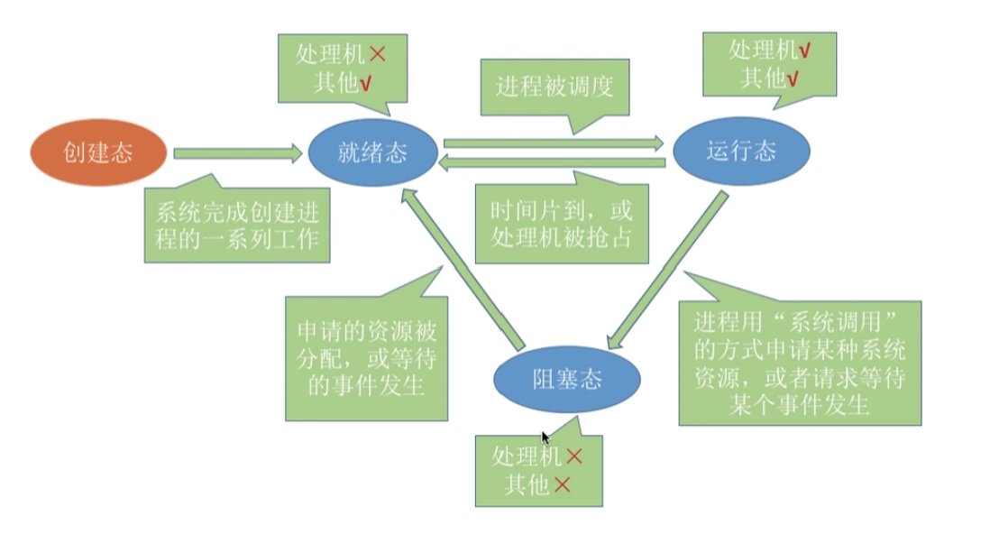

需要注意：
- 运行态--->阻塞态：是进程自身做出的主动行为；
- 阻塞态--->就绪态：不是进程本身可以控制的，是被动行为；
- 不能由阻塞态直接转运行态；


## 2.4 进程控制

### 2.4.1 概念

进程控制的主要功能是对系统中的所有进程实施有效的管理，其具有创建新进程、撤销已有进展、实现进程状态转换等功能；

> 进程控制就是要实现进程状态转换，即进程如何从就绪到运行，运行到阻塞等这些过程；
>

### 2.4.2 实现

2.1 中提到进程的组织方式，操作系统将相同状态的进程 PCB 放入同一个队列中进行管理，而进程控制的实现就是让PCB在不同队列中进出，并修改PCB中的一些信息；
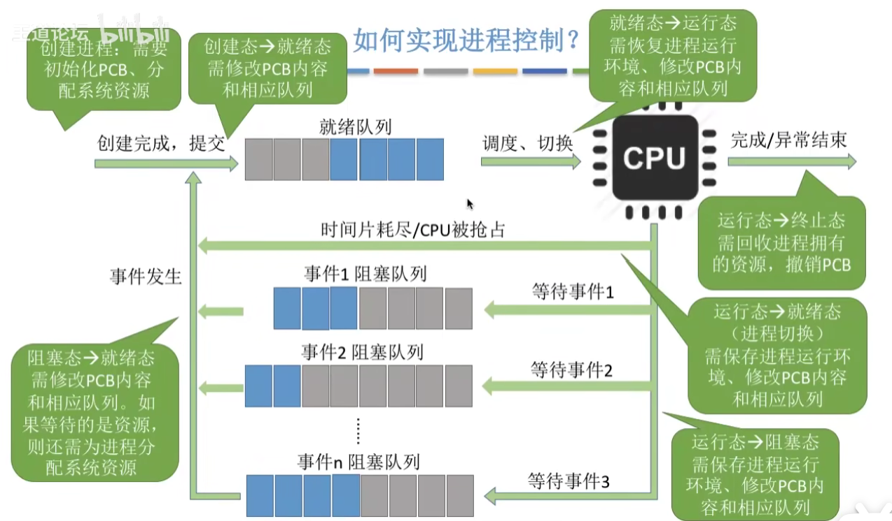

所以，改变某个进程所处的队列时，必须同时修改其 PCB 内的信息，否则将导致很危险的错误；

所以使用原语实现进程控制。原语的特点是执行期间不允许中断，只能一气呵成。这种不可被中断的操作即为原子操作；

执行原语代码前先进行关中断指令，使得外部中断信号不会打断当前的执行；而当原语代码执行完毕，执行关中断指令，使得外部中断可以再次起作用；
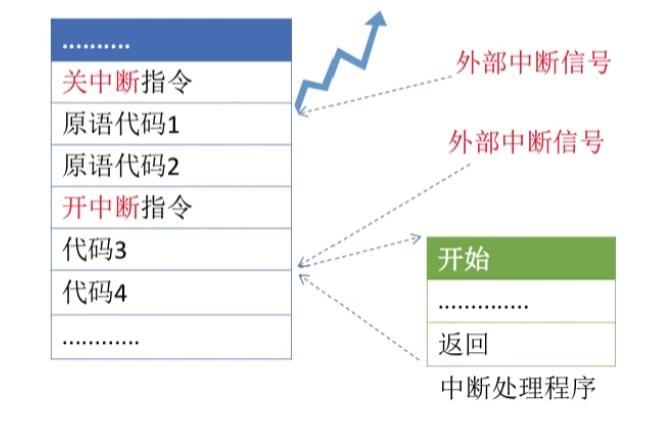

> 开/关中断指令的权限很高，必然只运行在核心态下执行的特权指令；
>

### 2.4.3 进程控制相关原语

进程控制导致进程状态的转换。无论是哪个原语，其需要完成：

- 更新PCB中的信息（如修改进程状态标志、将运行环境保持在PCB、从PCB恢复运行环境）
    - 所有的进程控制原语一定都会修改进程状态标志；
    - 剥夺当前运行进程的CPU使用权必然需要保持其运行环境；
    - 某进程开始运行前必然要恢复其运行环境；
- 将PCB插入对应的队列中；
- 分配/回收资源；

下面为几种进程控制的情况：

#### 进程创建：

创建原语（无--->创建态--->就绪态）：
- 申请空白PCB
- 为新进程分配所需资源；
- 初始化PCB；
- 将PCB插入就绪队列；

引起进程创建的事件：
- 用户登录：分时系统中，用户登录成功，系统建立一个新的进程；
- 作业调度：多道批处理系统中，有新的作业放入内存，会为其建立一个新的进程；
- 提供服务：用户向操作系统提出某些请求时，会新建一个进程处理该请求；
- 应用请求：由用户进程主要请求创建一个子进程；

#### 进程的终止：

撤销原语（就绪态/阻塞态/运行态--->终止态--->无）：
- 从PCB集合中找到终止进程的PCB；
- 若进程正在运行，立刻剥夺其CPU，将CPU分配给其他进程；
- 终止其所有子进程；
- 将该进程拥有的所有资源归还给父进程或者操作系统；
- 删除PCB；

引起进程终止的事件：
- 正常结束；
- 异常结束；
- 外界干扰；

#### 进程的阻塞：

阻塞原语：
- 找到要阻塞的进程对应的PCB；
- 保护进程运行现场，将PCB状态信息设置为阻塞，暂时停止进程的运行；
- 将PCB插入相应事件的等待队列；

引起进程阻塞的事件：
- 需要等待系统分配某种资源；
- 需要等待互相合作的其他进程完成工作；

#### 进程的唤醒：

唤醒原语：
- 在事件等待队列中找到PCB；
- 将PCB从等待队列中移除，设置进程状态为就绪态；
- 将PCB插入就绪队列，等待被唤醒；

引起进程唤醒的事件：
- 等待的事件发生；

#### 进程的切换：

切换原语（运行态--->阻塞态/就绪态--->运行态）
- 将运行环境信息存入PCB；
- PCB移入相应队列；
- 选择另一个进程执行，并更新其PCB；
- 根据PCB恢复新进程所需要的运行环境；

引起进程切换的事件：
- 当前进程时间片到；
- 有更高优先级的进程到来；
- 当前进程主动阻塞；
- 当前进程终止；


## 2.5 进程通信

进程通信就是指进程之间的信息交换；

进程是分配系统资源的单位（包括内存地址空间），因此各进程拥有的内存地址空间相互独立；

为了保证系统的安全，一个进程是不能直接访问另一个进程的地址空间。但进程之间的通信又是必要的，为了保证进程间通信的安全，操作系统提供了一些进程通信的方式；

### 2.5.1 共享存储

开辟一个共享空间供两个进程进行通信：
​           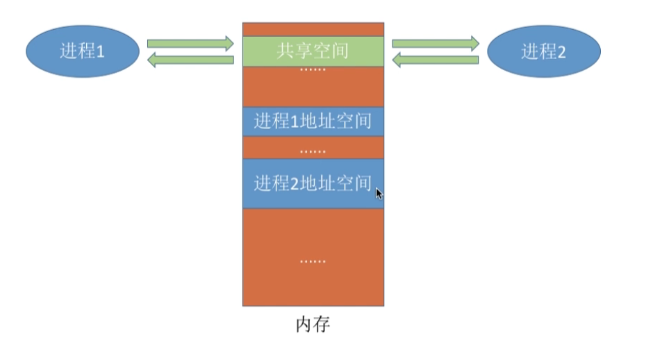

两个进程对共享空间的访问必须是互斥的，一个访问时，另一个就不能访问（互斥由操作系统提供的工具实现）

操作系统只负责提供共享空间和同步互斥工具（P、V操作）；

共享存储的类型：

- 基于数据结构的共享：
  
    进程向共享空间内写的数据大小是固定的，这种共享方式速度慢、限制多，是低级的通信方式；
    
- 基于存储区的共享：
  
    在内存中划出一块共享存储区，数据的格式、存放的位置都由进程控制，而非操作系统。
    
    相比之下，这种共享方式速度更快，是一种高级的通信方式；

### 2.5.2 管道通信

管道是指用于连接读写进程的一个共享文件，又名为 pipe 文件。其实就是内存中开辟的一个固定大小的缓冲区；
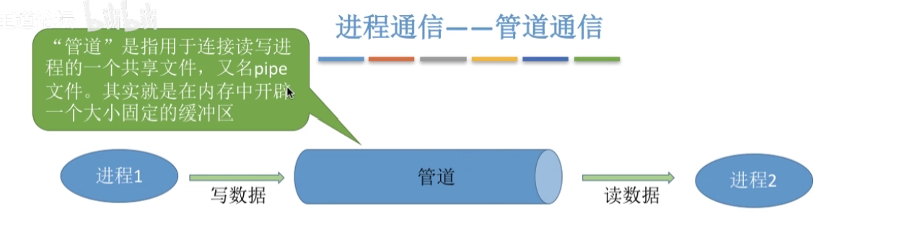

管道只能采用半双工通道（数据可以从任意一方到另一方，但同一时刻只能由一方作为发送者），某一时间内只能实现单向的传输。如果要实现双向同时通信，则需要设置两个管道；

各进程要互斥地访问导管（某一个进程访问时，另一个不能访问）；

数据以字符流的形式写入管道：

- 当管道写满时：写进程的`write()`系统调用将被阻塞，等待读进程将数据取走；
- 当读进程将数据全部取走，管道变空：此时读进程的`read()`系统调用将被阻塞。

并且如果管道没有写满，就不允许读。如果没有读空，就不允许写；

数据一旦被读出，就从管道中被抛弃，这就意味着读进程最多只能有一个，否则有可能出现读错数据的情况；

### 2.5.3 消息传递

进程间的数据交换以格式化的消息（Message）为单位。进程通过操作系统提供的“发送消息/接受消息”两个原语进程数据交换；


消息传递的两种方式：

#### 直接通信方式：

消息直接挂到接收进程的消息缓冲队列上；

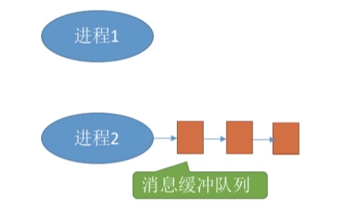

#### 间接通信方式：

消息要先发送到中间实体（信箱）中，因此也称为“信箱通信方式”；

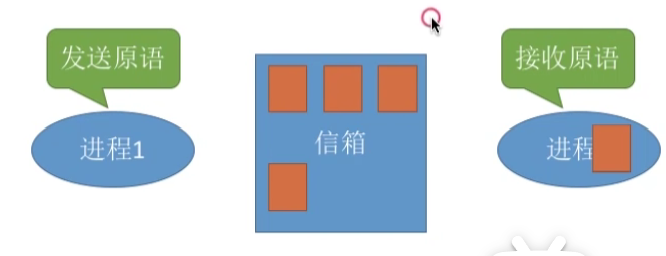


## 2.6 :star:进程调度

### 2.6.1 处理机调度

#### 处理机调度的基本概念

当存在一系列任务需要处理，但由于资源有限，这些任务没办法同时处理。这就需要确定某种规则来决定处理这些任务的顺序，这就是 “调度” 研究的问题；

在多道程序系统中，进程的数量往往多于处理机的个数，这样就不能同时并行得处理各个进程；

> 处理机调度就是从就绪队列中按照一定的算法选择一个进程并将处理机分配给它运行，以实现进程的并发；

#### 高级调度

由于内存空间有限，有时无法将用户提交的作业全部放入内存，因此就需要确定某种规则来决定作业调入内存的顺序；

> 高级调度（作业调度），按照一定原则从外存上处于后备队列的作业中挑选一个（或多个）作业，给它们分配内存等必要资源，并建立相应的进程（创建PCB），以使其获得竞争处理机的权力；

高级调度是外存与内存之间的调度。每个作业只调入一次，调出一次。作业入队会建立相应的 PCB，作业调出时才会撤销PCB。高级调度主要指调入的问题；

#### 中级调度

引入虚拟存储技术后，可将暂时不能运行的进程掉至外存等待。等待其具备了运行条件并且内存由稍有空闲时，再重新调入内存；

目的是为了提高内存利用率和系统吞吐量；

暂时调到外存等待的进程状态为状态为挂起状态。处于挂起状态进程的 PCB 仍然在内存中，受操作系统管理；

PCB会记录进程数据在外存中的存放位置，进程状态等信息，操作系统通过内存中的PCB来保持对各个进程的监控、管理；被挂起的进程PCB会放入到挂起队列中；

> 中级调度（内存调度），就是决定哪个处于挂起状态的进程重新调入内存；

一个进程可能被多次调出、调入内存，因此中级调度发送的频率要比高级点的更高；

补充知识：进程的挂起与七状态模型

> 暂时调到外存等待的进程状态为挂起状态（挂起态，suspend）
>
> 挂起态又可以进一步分为就绪挂起、阻塞挂起两种；

加上这两种状态，组成器状态模型：

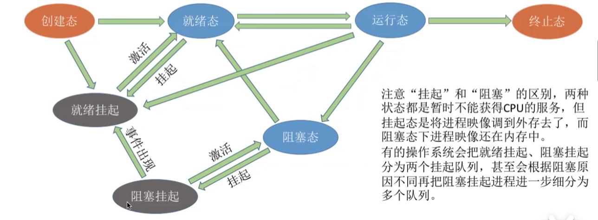             

#### 低级调度

> 低级调度（进程调度），其主要任务是按照某种方式和策略从就绪队列中选取一个进程，就处理机分配给它；

进程调度是操作系统中最基本的一种调度，在一般操作系统中必须配置进程调度；
​进程调度频率很高，几十ms一次；

### 2.6.2 进程调度概念

#### 进程调度的时机

> 进程调度（低级调度），是按照某种算法从就绪队列中选择一个进程为其分配处理机；

需要进程调度与切换的情况：
- 当前运行的进程主动放弃处理机：
    - 进程正常终止；
    - 运行过程中发送异常而终止；
    - 进程主动请求阻塞（如，等待IO）
- 当前运行的进程被动放弃处理机：
    - 分给进程的时间片用完；
    - 有更紧急的事需要处理（如I/O中断）
    - 有更高优先级的进程进入就绪队列；

不能进行进程调度与切换的情况：
- 在处理中断的过程中：
    - 中断的处理过程复杂，与硬件密切相关，很难做到在中断处理过程中进行进程切换；
- 进程在操作系统内核临界区中；
- 在原子操作过程中（原语）。原子操作不可中断，必须一气呵成（如果之前说过的修改PCB中进程状态标志，并把PCB放入相应队列，如果被打断，会导致PCB标志与其所在队列不一致）

​	PS：

​	:interrobang:进程在操作系统内核临界区中不能进程调度与切换；
​	:interrobang:但进程处于临界区时可以进程处理机调度的；
​	这两句话的主要不同是一个是系统内核临界区，一个是用户程序的临界区；

首先看临界资源与临界区的定义的定义：

> 临界资源，一个时间段内只允许一个进程使用的资源。各个进程需要互斥得访问临界资源；
> 临界区，访问临界资源的那段代码；
> 内核程序临界区，一般是用来访问某种内核数据结构的，比如进程的就绪队列（由各就绪进程的PCB组成）

对临界区，如果正在执行临界区内部的程序，此时发送了进程切换，那么由于原来允许的程序还没对次临界区“解锁”，所以其他的进程是不能访问这个临界区内部的资源，也既临界资源的；

这对一般的用户程序当然问题不大，但如果内核临界区访问的临界资源不能尽快释放，很可能会影响操作系统内核的其他管理工作。比如如果把就绪队列上锁，那么这部分资源无法访问，那么也就不法从中取出就绪进程PCB去执行；

综上：访问内核临界区期间不能进程调度与切换，但对一般的临界区是可以的；

#### 进程调度的方式

**非剥夺调度方式**，又称为非抢占方式，即，只允许进程主动放弃处理机。

- 在允许过程中即便有更紧急的任务到达，当前进程依然会继续使用处理机，指导进程终止或者主动进入阻塞状态；
- 实现简单，系统开销小但无法及时处理紧急任务，适用于早期的批处理系统；

**剥夺调度方式**，又称为抢占方式，即，当一个进程正在处理机上执行时，

- 如果一个更重要或更紧迫的进程需要使用处理机，则立刻暂停当前正在执行的进程，将处理机分配给更重要紧迫的那个进程；
- 可以有优先处理更紧急的进程，也可以实现让个进程按时间片轮流执行的功能（通过时钟中断），更适合于分时操作系统、实时操作系统；

#### 进程的切换与调度

> “狭义的进程调度”：指的是从就绪队列中选中一个要允许的进程（这个进程可以是刚刚被暂停执行的进程，也可能是另一个进程，后一种情况就需要进程切换）；
>
> 进程切换：指一个进程让出处理机，由另一个进程占用处理机的过程；
>
> “广义的进程调度”：包含选择一个进程和进程切换两个步骤；

进程切换的过程主要完成：
- 对原来运行的进程各种数据的保存；
- 对新进程各种数据的恢复：
    - 程序计数器、程序状态字、各种数据寄存器等处理机现场信息，一般都在PCB当中保存着；

所以，进程调度是需要时间、有代价的；

### 2.6.3 调度算法的评价指标

#### （一）CPU利用率

> CPU利用率，指CPU工作时间占总时间的比例；

$$
CPU利用率 = \frac {工作时间}{总时间}
$$

#### （二）系统吞吐量

> 系统吞吐量，单位时间内完成的作业数量；

$$
系统吞吐量 = \frac {总共完成的作业数量}{总时间}
$$

#### （三）周转时间

> 周转时间，是指从作业被提交给系统开始，到作业完成为止的这段时间间隔；

周转时间包含四个部分：
- 作业在外存后备队列上等待作业调度（高级调度）的时间
- 进程在就绪队列上等待进程调度（低级调度）的时间；
- 进程在 CPU 上执行的时间；
- 进程等待 I/O 操作完成的时间；

后三项在一个作业的整个处理过程中，可能会发生多次；

周转时间分类：

- （作业）周转时间：

    对用户而言，更关心自己的单个作业的周转时间：（作业提交时间就是指等待作业调度的时间）
    $$
    （作业）周转时间 = 作业完成时间 - 作业提交时间
    $$

- 平均周转时间：

    对操作系统来说，更关心系统的整体表现，因此更关心所有作业周转时间的平均值：
    $$
    平均周转时间 = \frac {各作业周转时间之和}{作业数}
    $$

- 带权周转时间：

    对（作业）周转时间中，作业不一定都在运行，可能会处于就绪状态，只有部分时间才是实际在运行的；

    对于周转时间相同的两个作业，实际运行时间更长的作业在相同时间内被服务的时间更多，带权周转时间更小，用户满意度更高；（等一分钟，做十分钟的作业跟等十分钟做一分钟的作业）

    对实际运行时间相同的两个作业，周转时间短的带权周转时间更小，用户更满意；
    $$
    带权周转时间 = \frac {作业周转时间}{作业实际运行的时间} = \frac {作业完成的时间 - 作业提交时间}{作业实际运行的时间} \ge 1
    $$
    带权周转时间显然大于1，因为作业实际运行的时间是包含在作业周转时间里的；
    
- 平均带权周转时间：

    对操作系统来说，更关心系统的整体表现，因此更关心所有作业带权周转时间的平均值：
    $$
    平均带权周转时间 = \frac {各作业的带权周转时间}{作业数}
    $$

#### （四）等待时间

> 计算机，指进程/作业处于等待处理机状态时间之和，等待时间越长，用户满意度越低；

注意，等待时间分为进程等待时间与作业等待时间；

进程等待时间不需要计算被高级调度（作业调度）的时间，只是当进程已经进入内存，开始执行后，等待被服务的时间（因为进程不是一直处于运行的）；

需要注意，等待I/O等设备的期间，进程是被服务的，所以不计入等待时间；

对于作业等待时间来说，不仅要考虑建立进程后等待的时间，还要加上作业在外存后备队列中的等待时间；

#### （五）响应时间

> 响应时间，用户从提交请求到首次产生响应所用的时间；

对用户来说，会希望自己提交的请求，尽快得开始被系统服务、回应；

### 2.6.4 调度算法

学习调度算法的思路：

​	:one:算法思想；:two:算法规则；:three:这种调度算法是用于作业调度还是进程调度；
​	:four:抢占or非抢占；:five:优点和缺点；:six:是否导致饥饿（某个进程/作业长期得不到服务）；

#### FCFS（先来先服务算法）

- 算法思想：主要从“公平”的角度考虑（排队买东西）；

- 算法规则：按照作业/进程到达的先后顺序进程服务；

- 用于作业/进程调度：
    - 用于作业调度时：考虑哪个作业先到达后备队列；
    - 用于进程调度时：考虑哪个进程先到达就绪队列；
    
- 是否可抢占？：
    
    一般是非抢占的算法：对于当前正在占据处理机的作业或进程，只能等待其自己正常结束或出现异常终止；
    
- 优缺点：
    - 优点：公平、算法实现简单；
    - 缺点：排在长作业（进程）后面的短作业需要等待很长的时间，带权周转时间很大，对短作业来说用户体验不好；即FCFS算法对长作业有利、对短作业不利；
    
- 是否导致饥饿：
    - 不会导致饥饿，只要一直等待，一定会轮到自己；

#### SJF（短作业优先）

- 算法思想：Shortest Job First，追求最少的平均等待时间，最少的平均周转时间、最少的平均带权周转时间；

- 算法规则：最短的作业/进程优先得到服务（所谓最短就是指服务时间最短）

- 用于作业/进程调度：
    
    可以作作业调度，也可以作为进程调度。用于进程调度时称为“短进程优先”（SPF, Shortest Process First）；
    
- 是否可抢占？：
    
    SJF 和 SPF 是非抢占式的算法。但也存在抢占式的版本——:star:最短剩余时间优先算法（SRTN, Shortest Remaining Time Next）；
    
    一般的非抢占式的SJF与SPF算法，在每个作业/进程执行完毕后去查看后备队列/就绪队列中哪个作业/进程的运行时间最短，就挑选哪个；
    
    而最短剩余时间算法是抢占式的，每当有一个新的进程到达，需要判断新到达的进程运行时间会不会比当前运行的进程的剩余时间短，如果更短，那么就运行新到达的进程；出现了抢占；如果当前进程正常完成，就跟抢占式的算法一样，选择一个剩余时间最短的运行；
    
- 优缺点：
    - 优点：得到了比较小的平均等待时间与平均周转时间，并且如果使用的是SRTN，可以获得最短的等待时间、平均周转时间；
    - 缺点：不公平。对短作业有利、对长作业不利。可能产生饥饿现象。另外运行时间是由用户提供的，不不一定真实，不可以真正做到短作业优先；
    
- 是否导致饥饿：会，如果一直都没有出现一个比更长运行时间的作业/进程，导致进程/作业一直无法执行，出现饿死；

#### HRRN（高响应比优先）

- 算法思想：综合考虑作业/进程的等待时间与要求服务的运行时间；

- 算法规则：在每次调度时，先计算各个作业/进程的响应比，选择更高的为其服务；

    $$
    响应比 = \frac {已经的等待时间 + 要求服务时间}{要求服务时间}
    $$
    
- 用于作业/进程调度：既可以进程调度，也可以作业调度；

- 是否可抢占？：

    非抢占式的算法。因此只有当当前运行的作业/进程主动放弃处理机，才需要调度，使用次算法；

- 优缺点：

    优点：综合考虑了等待时间与运行时间；
    - 等待时间相同时，要求服务时间短的优先（SJF的优点）；
    - 要求服务时间相同时，等待时间更长的时间优先（FCFS的优先）；
    - 避免长作业饥饿；

- 是否导致饥饿：不会；

#### 总结 

上述三种调度算法主要关心对用户的公平性、等待时间等评价系统的指标，不关心“响应时间”，不能区分任务的紧急性，所以对用户而言，交互性很糟糕。
​因此这个三种算法一般只使用于早期的批处理系统中；


### 2.6.5 调度算法（分时系统）

这节的三种调度算法是应用在分时操作系统中，更注重响应时间；

#### 时间片轮转（RR,Round-Robin）

- 算法思想：
    
    公平地、轮流地为各个进程服务，让每个进程在一定时间间隔内都可以得到响应；
    
- 算法规则：
    - 按照各进程达到就绪队列的顺序，轮流让各个进程执行一个时间片。若进程未在一个时间片内执行完毕，则剥夺处理机，将进程重新放到就绪队列尾部重新排队；如果进程提前执行完毕，也需要进行新的调度；
    - 如果时间片轮转算法的时间片设置过大，那么RR退化为FCFS；
    - 如果时间片太小，会导致切换过于频繁；
    - 一般来说，设计时间片时要让切换进程的开销不超过总开销的1%；
    
- 用于作业/进程调度：
    
    用于进程调度（只有进程才能被处理机分配时间片）
    
- 是否可抢占？：
    
    是抢占式算法。若进程经过时间片还未执行完毕，则剥夺其处理机；
    
    由时钟装置发出的时钟中断来通知CPU时间片已经到；
    
- 优缺点：
    - 优点：公平、响应快、适用于分时操作系统；
    - 缺点：存在进程切换的开销、不区分任务的紧急程度；
    
- 是否会导致饥饿：不会；

#### 优先级调度算法

- 算法思想：
    
    随着计算机的发展，特别是实时操作系统的出现，越来越多的应用场景需要根据任务的紧急程度来决定处理顺序
    
- 算法规则：
    - 每个作业/进程有各自的优先级，调度时选择优先级最高的作业/进程；
    - 对进程调度，就绪队列不一定只有一个，可以按照不同的优先级来组织就绪队列；或者把优先级高的排在靠近队头的位置；
    - 根据优先级是否可以动态变化，分为：
        - 静态优先级：创建进程时确定，之后不能改变；
        - 动态优先级：创建进程时有一个初始值，之后根据情况动态调整优先级；
    - 对优先级，通常有：
        - 系统进程优先级高于用户进程；
        - 前台进程优先级高于后台进程；
        - 操作系统更偏好I/O型进程（或I/O繁忙型进程，与其相对的是计算型进程）；
    - 调整优先级的策略：
        - 如果进程在就绪队列中已经等待了较长的时间，适当提升其优先级；
        - 如果进程占用处理机运行了很长时间，适当降低其优先级；
    
- 用于作业/进程调度：
    
    既可以作业调度，也可以进程调度；甚至于I/O调度；
    
- 是否可抢占？：
    
    抢占、非抢占都有；
    
    非抢占式的只需要在进程主动放弃处理机时进行调度即可；
    
    抢占式的除了进程主动放弃处理机时，还需要在就绪队列发生变化时，检查是否会发生抢占；
    
- 优缺点：
    - 优点：区分紧急程度、适用实时操作系统、灵活调整优先级；
    - 缺点：如果不断进入优先级更高的进程，可能导致饥饿；
    
- 是否会导致饥饿：会；

#### 多级反馈队列调度算法

- 算法思想：
    
    对其他调度算法的设中权衡；
    
- :star:算法规则：
    - :one:设置多级就绪队列，各级队列优先级从高到底，时间片从小到大；
        - 第1级队列的优先级最高，第2级次之……，依次类推；
        - 第1级队列的时间片最小，之后各级队列时间片越来越大；
    - :two:新进程到达时先进入第1级队列，按照FCFS原则排队等待被分配时间片，若用完时间片进程还没结束，则进程进入下一级队列队尾。如果此时已经是在最下级的队列，则会重新放回这个队列队尾；
    - :three:只有第k级队列为空时，才会为k+1级队头分配时间片；
    - :four:当有新进程到达或运行进程主动放弃处理机（时间片到），都会进行一次调度算法；对新进程到达的情况，需要比较当前运行的进程与新进程的优先级（其实就是看运行进程是不是在第1级队列），优先级高的运行；
    
- 用于作业/进程调度：用于进程调度；
    
- 是否可抢占？：
    
    可抢占的算法；在k级队列的进程运行过程中，若更上级的队列（1~k-1级）中进入了一个新进程，则由于新进程处于优先级更高的队列中，因此新进程会抢占处理机，原来运行的进程放回k级队列队尾；
    
- 优点：
    
    - 对各种进程相对公平（对同一级队列的进程，先到达先运行，FCFS的优点）；
    - 每个新到达的进程很快就可以得到响应（新进程的优先级最高，RR的优点）；
    - 短进程只用较少的时间就可以完成（SPF）;
    - 不必实现估计进程的运行时间（避免用户作假）；
    - 可以灵活调整各类进程的偏好程度：CPU密集型、I/O密集型；
    
- 是否会导致饥饿：会；

#### 总结

此三种算法更适合于交互式操作系统；（UNIX系统采用多级反馈队列调度算法）；


## 2.7 :star:进程同步与互斥

### 2.7.1 进程同步与互斥

#### 什么是进程同步

> 同步亦称直接制约关系，它指的是为完成某种任务而建立的两个或多个进程，这些进程因为需要再某些位置上协调它们的工作次序而产生的制约关系。进程间的直接制约关系就是源于它们之间的互相合作；

进程具有异步性的特征。异步性是指，各并发执行的进程以各自独立的、不可预知的速度向前推进；就是我们不能保证哪个进程的指令会被先执行；

但有些进程的执行必须按照一定的顺序，比如在进程通信中，需要让写管道的进程先写，再让读管道的进程读。这个顺序是不能颠倒的。而进程同步就是为了解决这种异步问题；

#### 什么是进程互斥

> 互斥亦称为间接制约关系。进程互斥指当一个进程访问临界资源时，另一个想要访问该资源的进程必须等待。当访问临界资源的进程访问结束，释放资源后，另一个进程才可以去访问临界资源；

进程的“并发”需要“共享”的支持。各个并发执行的进程不可避免的需要共同享有一些系统资源（内存、打印机、摄像头）；

把一个时间段内只允许一个进程使用的资源称为临界资源。许多物理设备（摄像头、打印机）都属于临界资源。此外还有很多变量、数据、内存缓冲区等都属于临界资源；对临界资源的访问，必须互斥得进行。

对临界资源的互斥访问，可以再逻辑上分为四个部分：

````c
do {
    entry section; 			//进入区
    critical section;		//临界区
    exit section;			//退出区
    remainder section		//剩余区
} while(true)
````

- `entry section`进入区：
    - 负责检查是否可以进入临界区，若可以进入，则应设置当前正在访问临界资源的标志（上锁），以阻止其他进程同时进入临界区；
- `critical section`临界区：
    - 访问临界资源的代码；
- `exit section`退出区：
    - 负责解除正在访问临界资源的标志（解锁）；
- `remainder section`剩余区：
    - 做其他处理；	

#### 访问临界资源的原则

为了实现对临界资源的互斥访问，同时保证系统整体性能，需要遵循以下原则：

- 空闲让进：临界区空闲时，可以允许一个请求进入临界区的进程立即进入临界区；
- 忙则等待：当已有进程进入临界区，其他试图进程临界区的进程必须等待；
- 有限等待：对请求访问的进程，应保证能在有限时间内进入临界区（保证不会饥饿）；
- 让权等待：当进程不能进入临界区时，应该立即释放处理机，防止进程忙等待；


### 2.7.2 进程互斥的软件实现方法

#### 单标志法

- 算法思想：
    
    两个进程在访问完临界区后会把使用该临界区的权限转交给另一个进程。也就是说每个进程进入临界区的权限只能被另一个进程赋予；
    
- 算法规则：

    在系统中设置设置一个`turn`变量：

    ````c
    int turn = 0; //ture表示当前允许进入临界区的进程号
    ````

    现在编写两个进程访问临界区：

    ````c
    // P0进程
    while (turn != 0);
    critical section;
    turn = 1;
    remainder section;
    
    // P1进程
    while (turn != 1);
    critical section;
    turn = 0;
    remainder section;
    ````

    - `trun`初值为0，假设开始执行P1，那么进程卡在`while(turn != 1)`一直循环，直到时间片用完；
    - 之后P0开始执行，`while(turn != 0 ` 不满足，继续执行P0的`critical section`；
    - 若在执行P0的`critical section`发生调度，由于`turn` 还是0，P1还是卡在循环；
    - 只有P0完成临界区代码，修改`turn = 1`，之后P1便可以执行，之后P1与P0轮流执行临界区；

- 缺点：

    - 违背空闲让进原则，如果`turn`所指向的进程一直不访问临界区，那么虽然此临界区为空闲，单其他进程都不可以访问；
    - 违背让权等待原则，不可以访问临界区的进程会一直卡在while直到时间片到；

#### 双标志先检查法

- 算法思想：

    设置一个`bool`型数组`flag[]`，数组中各个元素用来标记进程想进入临界区的意愿；

- 算法规则：

    - `flag[0] = ture`表示0号进程P0现在想进入临界区；

    - 每个进程在进程临界区之前会先检查当前有没有别的进程想要进入临界区，如果没有，则把自身的表示设置为ture，之后开始访问临界区；

        ````c
        bool flag[2];		//表示进入临界区意愿的数组
        flag[0] = false;	
        flag[1] = false;	//刚开始两个进程都不想进入临界区
        ````

        现在编写两个进程访问临界区：

        ````c
        // P0进程
        while (flag[1]);
        flag[0] = true;
        critical section;
        flag[0] = false;
        remainder section;
        
        // P1进程
        while (flag[0]);
        flag[1] = true;
        critical section;
        flag[1] = false;
        remainder section;
        ````

- 缺点：

    违背忙则等待原则，如果在某个改变自身`flag`前发生了进程调度，由于还没来得及成功修改，其他进程认为没有进程正在访问，于是发生两个进程同时进入临界区的现象；检查与上锁不一定是一气呵成的；

#### 双标志后检查法

- 算法思想：对双标志先检查法的改版。先“上锁”后“检查”；
  
- 算法规则：先上锁，再进去：

    ````c
    // P0进程
    flag[0] = true;
    while (flag[1]);
    critical section;
    flag[0] = false;
    remainder section;
    
    // P1进程
    flag[1] = true;
    while (flag[0]);
    critical section;
    flag[1] = false;
    remainder section;
    ````
    
- 缺点：

    - 解决了“忙则等待”的问题，但是违背了“空闲让进”和“有限等待”；
    - 可能会导致双方都无法进入；

#### Peterson算法

- 算法思想：如果双方都争着想进入临界区，就让进程尝试“孔融让梨”，主动让对方先使用临界区；

- 算法规则：

    ````c
    // P0进程
    flag[0] = true;
    turn = 1;
    while (flag[1]);
    critical section;
    flag[0] = false;
    remainder section;
    
    // P1进程
    flag[1] = true;					//表示自己想进入
    turn = 0;			     		//可以优先让对方进入临界区
    while (flag[0] && turn  0);	 //对方想进入，并且是自己让出去的，那么自己保持等待
    critical section;
    flag[1] = false;
    remainder section;
    ````

- 优点：遵循了“空闲让进”、“忙则等待”、“有限等待”三个原则；

- 缺点：没有解决“让权”的问题；


### 2.7.3 进程互斥的硬件实现方法

#### 中断屏蔽放大

- 实现原理：
    
    利用“开/关中断指令”实现（与原语的实现思想相同，即在某个进程开始访问临界区到结束访问为止都不允许中断，也就不能发生进程切换，因此也不可能发生两个同时访问临界区的情况）
    
- 实现方法：
    - 在进入临界区之前执行“关中断指令”；
    - 在离开临界区之前执行“开中断指令“；
    
- 优点：简单、高效；

- 缺点：不适合于多处理机；指适用于操作系统内核进程，不适用于用户进程（因为开/关中断只能允许在内核态，这组指令如果能在用户执行很危险） 

#### TestAndSet指令

- TestAndSet指令，也称TS指令，或者TSL指令；

- TSL指令是使用硬件实现的，执行过程不允许被中断，只能一气呵成，以下为使用c语言描述的逻辑：

    ````c
    //bool变量lock表示当前临界区是都被加锁
    //ture表示已经加锁，false表示没有加锁
    bool TestAndSet{
        bool old;
        old = *lock;		//old存放之前的lock值
        *lock = ture;		//无论之前是否加锁，都将lock设置为ture
        return old;			//返回lock之前的值
    }
    
    //以下是是都TSL指令实现互斥的算法逻辑
    while(TestAndSet(&lock));		//上锁并且检查
    ...临界区代码块
    lock = false;				   //解锁
    剩余代码块
    ````

    在软件实现方法中，双标志先检查与双标志后检查出问题的原因都是因为检查和上锁有可能被中断；而使用TSL指令，硬件实现保证了检查与实现是同步执行的；

- 优点：实现简单、使用于多处理机环境；

- 缺点：不满足”让权等待“原则，没有执行权力还是会一直占用CPU；


#### Swap指令

- 也称Exchange指令，或者简称为XCHG指令；

- Swap指令是由硬件实现的，执行过程一气呵成不会被中断，以下是用C语言描述的逻辑：

    ````c
    //Swap指令的作业是交换两个变量的值
    Swap(bool *a, bool *b){
        bool temp;
        temp = *a;
        *a = *b;
        *b = temp;
    }
    
    //以下是swap指令实现互斥的算法逻辑
    //lock表示当前临界区是否被枷锁
    bool old = ture;
    while(old  true)
        Swap(&lock, &old);
    ...临界区代码段
    lock = false;
    ...剩余区代码段
    ````

    - 在软件实现方法中，双标志先检查与双标志后检查出问题的原因都是因为检查和上锁有可能被中断；而使用TSL指令，硬件实现保证了检查与实现是同步执行的；
    - 优点：实现简单、使用于多处理机环境；
    - 缺点：
        - 不满足”让权等待“原则，没有执行权力还是会一直占用CPU；

### 2.7.4 信号量机制

之前学习了四种进程互斥的软件实现方法（单标志、双标志先检查、双标志后检查、Peterson算法）、三种进程互斥的硬件实现方式（中断屏蔽法、TS/TSL指令、Swap指令）；

这些算法都存在一个问题——违背”让权等待“原则；而信号量机制就可以很好解决这个问题；

#### 信号量机制

> 用户进程可以通过使用操作系统提供的一对原语来对信号量进行操作，从而很方便的实现进程互斥、进程同步；

信号量其实就是一个变量（可以是一个整数、也可以是更复杂的记录型变量），可以用一个信号量来表示系统中某种资源的数量，比如：系统中只有一台打印机，就可以设置一个初值为1的信号量；

原语在之前介绍过，是一种特殊的，只能一气呵成的一段代码，不可以被中断；

上述概念提到的一对原语指的是——`wait(S)` 原语和 `signal(S)` 原语，可以它们理解为两个函数，信号量`S`就是传入函数的参数。通常这两个操作也称为`P(S)`和`V(S)`；

#### 整型信号量

> 用一个整数型的变量作为信号量，用来表示系统中某种资源的数量；

不同于普通的整数变量，对信号量的操作只有三种：初始化、P操作、V操作；
​Eg：某计算机系统中有一台打印机：

````c
int S = 1;	//初始化整数型信号量，表示当前系统中可用的打印机数量

void wait(int& S){	//wait原语，相当于”进入区“
    while(S <= 0);	//如果资源不足，就一直保持循环
    S = S - 1;		//如果资源足够，就占用一个
}

void signal(int& S){	//signal原语，相当于”退出区“
    S = S + 1;		//使用完资源后，在退出区释放资源；
}
````

假设某个进程需要使用打印机：

```c
...
wait(S);		  		//进入区，申请资源
使用打印机资源...		  //临界区，访问资源
signal(S);				//退出区，释放资源
```

可以看出整型信号量来解决进程互斥问题时，思想跟之前还是很相似，也是把检查与上锁分开；但仍然违背了”让权等待“原则；

#### 记录型信号量

> 整型信号量的缺陷是存在“忙等”问题，因此人们又提出了“记录型信号量”，即用记录型数据结构表示的信号量

````c
/*记录型信号量的定义*/
typedef struct{
    int value;			//剩余资源数量
    struct process* L;	//等待队列
} semaphore;
````

对记录型信号量的`wait`：

````c
void wait(semaphore& S){
	S.value--;		//进程希望使用这个资源，让数量减一
    if (S.value < 0){//减一后，如果资源数量不足0，说明资源不够了：
        block(S.L);// 如果剩余资源不足，使用block原语使进程从运行到阻塞，并且把S挂到信号的等待队列当中，也就是记录了这个进程是需要资源的，当资源空余时，就从队列中找到进程，分配资源；
	}
}
````

对记录型信号量的`signal`：

````c
void signal(semaphore S){
	S.value++;
	if (S.value <= 0){
		wakeup(S.L);//释放资源后，若还有别的进程在等待这种资源，则使用wakeup原语唤醒等待队列中的一个进程，该进程从阻塞到就绪，因为每个想要使用资源的进程都会先让value--，所以value小于等于0，就表示还有进程希望使用这个资源，那么就使用wakeup原语唤醒这个进程；
	}
}
````

有了等待队列，当资源不足时，马上让进程进入阻塞态，放弃处理机，并把这个进程的信号保存到等待队列，当资源再次空闲，再唤醒这个进程去执行；

当一个进程使用完资源，会检查value的值，如果小于等于0，说明还有进程等待这个资源，那么其就帮助唤醒这个进程；

可以看出，记录型信号量遵循了“让权等待”原则。

### 2.7.5 信号量机制的应用

用信号量机制实现：进程互斥、同步、前驱关系；

#### 信号量机制实现进程互斥

1. 分析并发进程的关键获得，划定临界区（如，对临界资源的访问放在临界区内）；

2. 设置互斥量信号`mutex`，初值为1（临界区在一个时间内只有一个进程可以访问）；

3. 在临界区之前执行`P(mutex)`；

4. 在临界区之后执行`V(mutex)`；

    ````c
    //定义互斥量信号，对不同的临界资源需要定义不同的互斥量信号
    semaphore mutex = 1;
    
    P1(){
        //...
     	P(mutex);
        //临界区代码段
        V(mutex);
        //...
    }
    
    P2(){
        //...
        P(mutex);
        //临界区代码段
        V(mutex);
        //...
    }
    ````

#### 信号量机制实现进程同步

> 进程同步，要求各个并发进程有序推进；

进程的异步性导致我们无法保证几个进程、几个语句的执行先后顺序，但有些情况下，必须要求某些语句先执行；这就时进程同步要解决的问题；

信号量机制实现进程同步：

1. 分析什么地方需要实现“同步关系”，即必须保证“一前一后”执行的两个操作；

2. 设置同步信号S，初始化为0；

3. 在必须先执行的操作之后执行`V(S)`（解锁）；

4. 在必须后执行的操作之前执行`P(S)`（加锁）；

    ````c
    //信号量机制实现同步
    semaphore S = 0; //初始化同步信号量，初值为0
    
    P1(){
        //代码1
        //代码2
        V(S)
        //代码3
    }
    
    P2(){
        P(S)
        //代码4
        //代码5
        //代码6
    }
    ````

步骤分析：

- 上述代码要求：1、2代码必须在4、5、6之前执行；
- 如果一开始执行的就是1、2，那么程序运行完毕，执行`V(S)`，其中会先把`value++`，那么现在就是1，再根据value是不是小于等于1判断是否需要唤醒一个队列中的进程，这里显然不需要，直接完成了1、2、4、5、6顺序执行；
- 但如果一开始调用了4、5、6代码的进程，会先进行`P(S)`，因为value初始为0，那么value--后小于0，说明资源不足，此进程会进入队列阻塞；直到调用完1、2代码，执行`V(S)`后，将其唤醒。也完成了1、2、4、5、6的顺序执行。

#### 信号量机制实现进程前驱关系

> 进程P1中有代码S1，P2中有代码S2，P3......PN中有代码SN，这些语句的执行必须按照一定的顺序执行；

​	其实没一对前驱关系都是一个进程同步问题（需要保证一前一后的操作）

- 信号量机制实现进程前驱关系：
    1. 为每一对前驱关系各设置一个同步变量；
    2. 在前操作之前进行`V`操作（解锁）；
    3. 在后操作之前进行`P`操作（加锁）；

### 2.7.6 生产者-消费者问题

#### 问题描述

> 系统中有一组生产者和一组消费者进程，生产者进程每次生产一个产品放入缓冲区，消费者进程每次从缓冲区中取出一个产品并使用（产品即为某种数据）

- 生产者、消费者共享一个初始为空、大小为n的缓冲区；
- 只有缓冲区没满时，生产者才能把产品放入缓冲区、否则必须等待（同步关系）；
- 只有缓冲区不空时，消费者才能从产品中取出产品，否则必须等待（同步关系）；
- 缓冲区是临界资源，各进程必须互斥访问（互斥关系）；

#### 问题分析

如何使用信号量机制（P  V操作）实现生产者、消费者进程的这些功能；

对同步问题。设置一个信号量：

- :one:对只有缓冲区没满时，生产者才能把产品放入缓冲区、否则必须等待（同步关系）问题：

    - 生产者每次生产需要消耗一个空闲缓冲区，执行P操作（加锁）；

    - 消费者每次消费需要释放一个空闲缓冲区，执行V操作（解锁）；

    - 显然，这是同一个信号量，来实现同步关系，保证了缓冲区空闲时才能进行生产；

    - 注意对信号量的初始化：

        ````c
        //同步信号量，表示空闲缓冲区的数量：一开始缓冲区全部为空闲
        semaphore empty = n;
        ````

- :two:对只有缓冲区不空时，消费者才能从产品中取出产品，否则必须等待（同步关系）

    - 当生产者确认了存在空闲缓冲区，需要生产一个产生放入缓冲区，需要执行V操作（解锁）；

    - 当消费者确认了缓冲区有内容，需要取走一个产品时，需要执行P操作（加锁）；

    - 显然，这是另一个的信号量，来实现同步关系，保证只有生产者先生产，消费者才能去消费；

    - 注意对信号量的初始化：

        ````c
        //同步信号量，表示产品的数量：一开始没有产品
        semaphore full = 0;
        ````

对互斥问题，使用一个初值为1的互斥量即可：

- 进入临界区之前作P操作（加锁）；

- 离开临界区之后作V操作（解锁）；

- 互斥量初始为1：

    ````c
    semaphore mutex = 1;
    ````

#### 具体实现

````c
//生产者：
producer(){
    while(1){
        //生产一个产品
        //生产之前先检查是否有空闲缓冲区
        P(empty); // --> 消耗一个空闲缓冲区
        P(mutex);
        //把产品放入缓冲区
        V(mutex);
        //生产完毕增加一个产品
        V(full); // --> 增加一个产品
	}-
}

//消费者：
consumer(){
    while(1){
        //消耗前线检查是否有产品
        P(full);	//-->消耗一个产品
        P(mutex);
        //从缓冲区取出一个产品
        V(mutex);
        //消费完毕增加一个空闲缓冲区
        V(empty);	//-->增加一个空闲缓冲区
        //消耗一个产品
    }
}
````

注意：实现同步与互斥的P操作是不可以交换顺序的，否则会出现死锁；

### 2.7.7 吸烟者问题

#### 问题描述

设置一个系统有三个吸烟者进程和一个供应商进程；
​每个抽烟者不停地卷烟并且抽调它，但是要卷烟，需要三种材料——烟草、纸和水；三位抽烟者各拥有烟草、纸和水；供应者每次将两种材料放在桌子上，拥有剩下那材料的进程会卷起一支烟并且抽掉，并给供应者一个信号告诉其材料被用了，供应者又会放另外两种材料到桌子上，这个过程不断重复（让三个抽烟者轮流抽烟）；

#### 问题分析

本质上也属于“生产者-消费者”问题，是特殊的情况：“可生产多产品的单生产者-多消费者问题”；
1. 分析关系：找出题目中各个进程，分析它们之间的同步，互斥关系；
    - 显然有四个进程，一个供应商、三个抽烟者；
    - 互斥问题：
        - 桌子可以抽象为容量为1的缓冲区，四个进程互斥访问，生产者向桌子上轮流放置三种组合物品供各个抽烟者使用，各抽烟者互斥得获取物品；
        - 组合一：纸+胶水；
        - 组合二：烟草+胶水；
        - 组合三：烟草+纸
    - 同步问题：
        - 桌子上有组合一  --->  第一个抽烟者才能取走东西（同步关系1）；
        - 桌子上有组合二  --->  第二个抽烟者才能取走东西（同步关系2）；
        - 桌子上有组合三  --->  第三个抽烟者才能取走东西（同步关系3）；
        - 发出完成信号  --->  供应商将下一个组合放在桌子上（同步关系4）；
2. 整理思路：根据各个进程的操作流程确定P、V操作的大致顺序：
    - 互斥先P后V，同步先V后P；
3. 设置信号量：设置需要的信号量，根据题目条件确定信号量的初值（互斥信号量的初值一般为1，同步信号量的初值要看对应的系统资源是多少）；
    - :one:同步关系1：设置同步信号量`offer1`，而开始桌子没有组合一，所以`offer1 = 0`；
    - :two:同步关系2：设置同步信号量`offer2`，而开始桌子没有组合二，所以`offer2 = 0`；
    - :three:同步关系3：设置同步信号量`offer3`，而开始桌子没有组合三，所以`offer3 = 0`；
    - :four:同步关系4：这只同步信号量`finsh`，一开始没有抽烟者完成了抽烟，所以`finsh = 0`；

#### 具体实现

定义信号量：

````c
semaphore offer1 = 0;			//卓上组合一的数量
semaphore offer2 = 0;			//卓上组合二的数量
semaphore offer3 = 0;			//卓上组合三的数量
semaphore finish = 0;			//抽烟是否完成
semaphore mutex = 1;
int i = 0;					   //实现三个抽烟者轮流抽烟
````

供应商代码：

````c
provider(){
    while(1){
        if (i  0){
            //将组合一放置在桌子上
            V(offer1); //->对offer1解锁，表示有组合一了
		}
        else if (i  1){
            //将组合一放置在桌子上
            V(offer2); //->对offer2解锁，表示有组合二了
	   	}
        else if (i  2){
            //将组合一放置在桌子上
            V(offer3); //->对offer3解锁，表示有组合三了
        }
        //更新i的值
        i = (i + 1) % 3;
        
        //放好后，供应商等待有人抽完严再去放
        P(finish);
    }
}
````

抽烟者的代码：

````c
smoker1(){
	while(1){
		P(offer1); //等待放置组合一
       	//抽烟
       	V(finsh); //抽完了，通知供应商可以放了
	}
}

smoker2(){
	while(1){
		P(offer2); //等待放置组合一
       	//抽烟
       	V(finsh); //抽完了，通知供应商可以放了
	}
}

smoker3(){
	while(1){
		P(offer3); //等待放置组合一
       	//抽烟
       	V(finsh); //抽完了，通知供应商可以放了
	}
}
````

### 2.7.8 读者-写者问题

#### 问题描述

有读者和写者两组并发进程，共享一个文件，当两个或两个以上的读者进程同时访问共享数据时不会产生副作用，但若某个写进程和其他进程（读进程或者写进程）同时访问共享数据时则可能导致数据不一致的错误，所以要求：

- 允许多个读者可以同时对文件执行读操作；
- 只允许一个写者往文件写信息；
- 任一写者完成写操作之前不允许其他读进程或写进程工作；
- 写者执行写操作之前，应该让已有的读者和写者全部退出；

#### 问题分析

1. 分析关系。找出题目中描述的各个进程，分析它们的同步、互斥关系；
    - 两类进程：写进程、读进程；
    - 互斥关系：写进程与写进程、写进程与读进程；
2. 整理思路，根据各进程的操作流程确定P、V操作的大致顺序；
    - 写进程与其他任何进程都要互斥，设置一个互斥信号`rw`，在写进程访问共享文件前后分布进程P、V操作；
    - :x:读进程与写进程之间互斥，因此读进程访问共享文件前后也要对`rw`执行P、V操作:x:
    - 读者、写者问题的核心就在于，虽然读进程与写进程是互斥的，但是我们不应该让读进程之间互斥，如果按上述做法，读者之间也被互斥了。正确的做法可以设置一个变量记录当前是否已经有读者进程在访问共享文件了，如果还没有，那么第一个去读的进程应该对共享文件加锁，而之后的读进程就不需要加锁了；

#### 具体实现

定义信号量：

````c
semaphore rw = 1;			//对文件的互斥访问
int count = 0;			 	//记录当前有多少读者在访问文件
semphore mutex = 1;			//保证对count变量的互斥访问
````

写者进程：

````c
write(){
    while(1){
        P(rw);
        //写文件
        V(rw);
	}
}
````

读者进程：

````c
reader(){
    while(1){
		//检查是否已经有读者在访问文件，加互斥量是为了保证加锁与count自加不被中断，否则当进程在加锁后发生		//进程切换到另一个读进程，由于count还是0，会再次加锁
        P(mutex);
        if(count  0)
			P(rw);
        count++; //读文件进程自加1
        V(mutex);
        
        //读取文件...
       
        P(mutex);
        count--; //读完文件，读文件进程数量减1
        //检查当前是不是最后一个读进程，最后一个复杂解锁
        if(count  0)
            V(rw);
        V(mutex);
	}
}
````

### 2.7.9 哲学家进餐问题

#### 问题描述

一张圆桌上有五个哲学家，每两个哲学家之间的桌上摆着一根筷子（五个哲学家五根筷子），桌子的中间是一碗米饭。哲学家们只有吃饭与思考，哲学家思考时，不会影响其他人。只有当哲学家饥饿时，尝试拿起左、右两根筷子（一根一根拿起）。如果筷子已经在别人手上，则等待。饥饿的哲学家只有同时拿起两只筷子时才能吃饭，当进餐完毕，发下筷子继续思考；

#### 问题分析

1. 关系分析：

    - 系统中有五个哲学家进程；
    - 五个哲学家与左右临界对其中间的筷子是互斥关系；

2. 整理思路：

    - 只有互斥关系；
    - 每个哲学家同时拥有两根临界资源才可以开始吃饭。如何避免临界资源分配不当造成的死锁现象，是哲学家问题的精髓；

3. 信号量设置：

    - 定义互斥信号量数组，用来实现对5个筷子的互斥访问；

        ````c
        chopstick[5] = {1, 1, 1, 1, 1};
        ````

    - 对五个哲学家按照0到4编号，哲学家i左边的筷子编号为`i`，右边的筷子的编号为`(i+1)%5`；

#### 问题分析

信号量定义：

````c
semaphore chopstick[5] = {1, 1, 1, 1, 1};
````

哲学家进程：

- :one:版本1：

    ````c
    Pi(){
    	while(1){
    		P(chopstick[i]);			//拿左筷子
        	P(chopstick[(i + 1) % 5]);    //拿右筷子
            //吃饭...
    		V(chopstick[i]);			//放左筷子
        	V(chopstick[(i + 1) % 5]);    //放右筷子
            //思考
        }
    }
    ````

    当每个进程执行到拿右筷子时切换到另一个，最后导致所有哲学家都有左筷子，但没有右筷子，全部阻塞等待；出现了死锁现象；

- :two:版本2：

    对哲学家进程施加一些限制条件，比如最多允许四个哲学家同时进程，这样可以保证至少应该哲学及是可以拿到左右两只筷子的；

    ````c
    ````

- :three:版本3：

    要求奇数号哲学家先拿左边的筷子，然后再去拿右筷子；而对偶数号的哲学家刚好相反；这样保证当相邻的哲学家都想吃饭时，那么它们会先竞争同一支筷子，拿到筷子的继续执行，另一个阻塞；避免了占有一支筷子而又在在等待另一个筷子的情况发生；

    ````c
    Pi(){
    	while(1){
            //判断哲学家序号
            if (i % 2  0){
    			P(chopstick[i]);			//拿左筷子
        		P(chopstick[(i + 1) % 5]);    //拿右筷子
            }
            else if (i % 2){
        		P(chopstick[(i + 1) % 5]);    //拿右筷子
    			P(chopstick[i]);			//拿左筷子
            }
            //吃饭...
    		V(chopstick[i]);			//拿左筷子
        	V(chopstick[(i + 1) % 5]);    //拿右筷子
            //思考
        }
    }
    ````

- :four:版本4：

    要求一个哲学家左右筷子都空闲时才同时拿起两根筷子：

    ````c
    semaphore mutex = 1; 		//互斥得取筷子
    Pi(){
    	while(1){
            //使用mutex保证两只筷子只能同时被拿起
            P(mutex);
    		P(chopstick[i]);			//拿左筷子
        	P(chopstick[(i + 1) % 5]);    //拿右筷子
            V(mutex);
            //吃饭...
    		V(chopstick[i]);			//拿左筷子
        	V(chopstick[(i + 1) % 5]);    //拿右筷子
            //思考
        }
    }
    ````

### 2.7.10 管程

#### 为什么要引入管程

用信号量机制解决进程同步、互斥的问题，编写程序困难、容易出错；为了让程序员写程序不容易出错，不再关注复杂 的PV操作，1973年，Brinch Hansen在Pascal语言中引入了"管程"成分——一种高级同步机制！

#### 管程的定义和基本特性

- 管程是一种特殊的软件模块，由这些组成（类似与定义一个class）：
    - 局部于管程的共享数据结构说明（class的数据成员）；
    - 对该数据结构进行操作的一组过程（class的函数成员）；
    - 对局部于管程的共享数据设置初始值的语句（对class数据成员进行初始化）；
    - 管程有一个名字；
- 管程的基本特性：
    - 局部于管程的数据只能被局部于管程的过程访问（private数据成员只能在类内函数使用）
    - 一个进程只有通过调用管程内的过程才能进入管程访问共享数据（跟第一句意思差不多）；
    - 每次只允许一个进程在管程内执行某个内部过程；

#### 使用管程解决生产者消费者问题

- 以下仅为伪代码：

    ````c
    //定义一个管程
    class ProduceConsumer{
    private:
    	semamphore_t full;			//一开始没有产品
    	semamphore_t empty;		    //一开始都是空闲缓冲区
        int count = 0;				//缓存区的产品数量
    
    public:
        // 把产品放入缓冲区
    	void insert(Item item){		
            if(count  N)
                wait(full);
            count++;
            insert_item(item);
            if(count  1)
                signal(empty);
        }
        //从缓冲区取出一个产品
        Item remove(){
            if (count  0)
                wait(empty);
            count--;
            if(count  N - 1)
                signal(full);
            return remove_item();
    	}
    };
    ````

- 生产者进程

    ````c++
    Producer(){
    	while(1){
    		item = XXX;
    		//直接使用管程函数
    		ProdecerConsumer.inser(item);
    	}
    }
    ````

- 消费者进程

    ````c++
    Consumer(){
    	while(1){
    		Item item = ProdecerConsumer.remove();
    	}
    }
    ````

​	其实就是对信号量操作进程封装；


## 2.8 死锁

### 2.8.1 死锁

#### 死锁的概念

> 死锁，在并发环境下，各进程因竞争资源而造成的一种相互等待对方手里的资源，导致各进程都阻塞，都无法向前推进的现象，就是”死锁“；

#### 死锁、饥饿、死循环的区别

三种概念：
- 死锁：各进程因竞争资源而造成的一种相互等待对方手里的资源，导致各进程都阻塞，都无法向前推进的现象；
- 饥饿：由于长期得不到想要的资源，某进程无法向前推进的现象；在短进程优先算法中，短进程不断到来，长进程将无法得到处理机；
- 死循环：进程执行过程中一直跳不出来的现象；`while(1)`

相同点：
- 都使得进程无法推进；

不同点：
- 死锁：至少需要两个或两个以上的进程同时发生死锁；
- 饥饿：可能只有一个进程发送饥饿，可能处于阻塞、就绪；
- 死循环：死锁与饥饿是操作系统的问题，死循环是用户的问题，而且是可以处于运行态的；

#### 死锁的必要条件：

- :one:互斥条件：只有对必须互斥使用的资源的争抢才会导致死锁；
- :two:不剥夺条件：进程所获得的资源在未使用之前，不能由其他进程夺走，只能主动释放；
- :three:请求和保持条件：进程已经保持了至少一个资源，但又提出了新的资源请求，而该资源被其他进程占用；
- :four:循环等待条件：存在一种进程资源的循环等待链，链中的每一个进程已获得的资源同时被下一个进程请求；

#### 什么时候会发生死锁

- 对系统资源的竞争。各进程对不可剥夺（打印机）的资源的竞争可能引起死锁，对可剥夺的资源（CPU）的竞争编号引起死锁；
- 进程推进顺序非法。请求和释放资源的顺序不当；
- 信号量的使用不当也会造成死锁；

​	总之，对不可剥夺的资源的不合理分配，可能导致死锁！

#### 死锁的处理策略

- 不允许死锁发生：
    - :one:预防死锁。破坏死锁产生的必要条件；
    - :two:避免死锁。防止系统进入不安全状态（银行家算法）；
- 允许死锁发生：
    - :three:死锁的检测与解除。操作系统复杂检测死锁发生，然后解除；

### 2.8.2 预防死锁策略

​	破坏死锁产生的四个必要条件中的一个或者多个；

#### 破坏互斥条件

互斥条件：只有对必须互斥使用的资源的争抢才会导致死锁；
​把互斥资源改为可以共享的资源；

但不是所有的资源都可以修改为共享的，而且为了系统的安全，有些地方必须要互斥性；因此很多情况下都无法破坏互斥条件；

#### 破坏不剥夺条件

不剥夺条件：进程所获得的资源在未使用之前，不能由其他进程夺走，只能主动释放：
- 实现方式：
    - 方案一：当某个进程请求新资源得不到满足时，立刻释放保持的资源，待以后需要时再申请，破坏了不可剥夺条件；
    - 方案二：当某个进程需要的资源被其他进程占用，由操作系统协助，将需要的资源抢夺。这种方案一般要考虑进程的优先级；
- 缺点：
    - 实现复杂；
    - 释放已经获得的资源可能造成一阶段工作的失败；
    - 反复申请资源使得系统开销大；

#### 破坏请求和保持条件

请求和保持条件：进程已经保持了至少一个资源，但又提出了新的资源请求，而该资源被其他进程占用；
- 实现方式：
    - 采用静态分配方式：进程运行前一次申请所需的所有资源；
- 缺点：
    - 对使用频率低的资源，却需要一直占用，导致资源利用率低；
    - 可能导致饥饿；

#### 破坏循环等待条件

循环等待条件：存在一种进程资源的循环等待链，链中的每一个进程已获得的资源同时被下一个进程请求；
- 实现方式：采用顺序资源分配法。先给系统资源编号，规定每个进程必须按照编号顺序申请资源；


