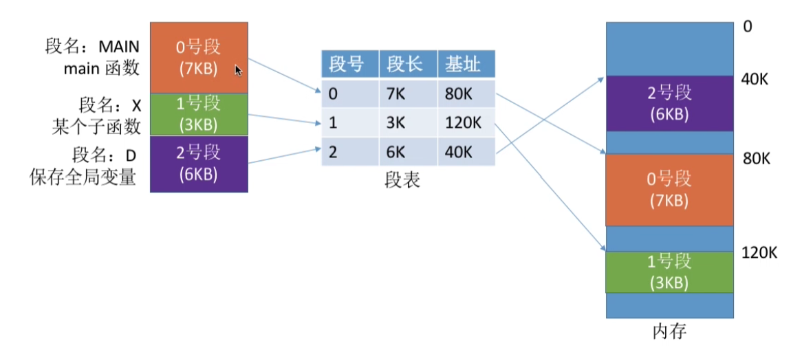

# 第3章 内存管理

## 3.1 内存基础知识

### 3.1.1 内存的概念与作用

> 内存是用于存放数据的硬件。程序执行前需要先存放内存中才能被CPU处理；

### 3.1.2 进程运行的基本原理

指令的工作原理：操作码+若干参数：`mov $0xffff0000 12`；

编写程序到执行：
- **编辑**源代码文件；
- **编译**：由源文件生成目标文件（高级语言翻译为低级语言）；
- **链接**：由目标模块装入模块（Windows下的.exe文件，就是可执行文件），链接后形成完成的逻辑地址；
- **装入**：将装入模块装入内存，装入后形成物理地址；

三种链接方式：
- 静态链接：装入前链接成一个完整的装入模块；
- 装入时动态链接：运行前边装入边链接；
- 运行时动态链接：运行时需要目标模块才装入并连接；

三种装入方式：
- 绝对装入：编译时产生绝对地址；（单道程序阶段，由编译器完成）
- 可重定位装入：装入时将逻辑地址转换为物理地址；（用于早期多道批处理操作系统）
- 动态运行时装入：运行时将逻辑地址转换为物理地址，需要设置重定位寄存器；（现代操作系统）

## 3.2 内存管理概念

操作系统是系统资源的管理者，需要对内存进行管理；

- 操作系统负责内存空间的**分配与回收**；

- 操作系统需要提供某种技术从逻辑上对内存进行**扩充**；

- 操作系统需要提供**地址转换**功能，负责程序的逻辑地址与物理地址的转换（三种方法）；

- 操作系统需要提供**内存保护**功能，保证各个进程在各自存储空间内运行，互不干扰；
    
    方法一：在CPU中设置一对上、下限寄存器，存放进程的上、下限地址。进程的指令要访问地址空间时，CPU检查是否越界；
    
    方法二：采用重定位寄存器（基地址寄存器，进程的起始物理地址）与界地址寄存器（限长寄存器）进行越界检查。

## 3.3 覆盖与交换

### 3.3.1 覆盖技术

早期的计算机内存很小；因此经常出现内存大小不够用的情况；

后来人们引入了覆盖技术，用来解决 “程序大小超过物理内存总和” 的问题：

#### 基本思想

将程序分为多个段（多个模块），常用的段常驻内存，不常用的段在需要时调入内存；

#### 实现方式

在内存中分为一个固定区，和若干个覆盖区；

需要常驻内存的段放在固定区中，调入后就不再调出（除非运行结束）；

不常用的段放在覆盖区，需要用到时调入内存，用不到时调出内存；

缺点：必须由程序员声明覆盖结构，操作系统完成自动覆盖。对用户不透明，增加了用户编程负担，已经不再使用；

### 3.3.2 交换技术

#### 基本思想：

内存空间紧张时，系统将内存中某些进程暂时换出外存，把外存中已经某些已经具备运行条件的进程换入内存（进程在内存与磁盘间动态调度），中级调度（内存调度）就是决定将哪个处于挂起状态的进程重新调入内存；

暂时换出外存等待的进程状态为挂起状态，又分为就绪挂起、阻塞挂起；

#### 实现方式：

具有交换功能的操作系统，通常把磁盘空间分为**文件区**与**对换区**两部分。
- 文件区主要用于存放文件，主要追求存储空间的利用率，因此对文件区空间的管理采用离散分配方式；
- 对换区空间只占磁盘空间的小部分，被换出的进程数据就存放在对换区。由于对换的速度直接影响系统的整体速度，所以对交换区空间的管理主要追求换入换出速度，因此通常采用连续分配方式；
- 总之：对换区IO速度比文件区快，在磁盘的对换区保持换出的进程；

- 交换通常发生在许多进程运行并且内存吃紧时，而系统负荷降低时就暂停；

- 优先换出阻塞进程；可换出优先级低的进程；为了防止优先级低的进程在调入后内存后很快就被换出，有的系统会考虑进程在内存的驻留时间；
- PCB会常驻内存，操作系统需要对进程进行管理；

### 3.3.3 区别

覆盖是在同一个进程中的，而交换是不同进程之间的；

## 3.4 连续分配

> 连续分配，指的是系统为用户进程分配的必须是一个连续的内存空间；

### 3.4.1 连续分配管理方式

#### 单一连续分配

分配方式

- 在单一连续分配方式中，内存被分为系统区和用户区；

- 系统区用测位于内存的低地址部分，用于存放操作系统相关数据，用户区用于存放用户进程相关数据；

- 内存中只能有一道用户程序，用户程序独占整个用户空间；

    

优点：实现简单；无外部碎片；可以采用覆盖技术扩充内存，不一定需要内存保护；

缺点：只能用于单用户、单任务的操作系统；有内部碎片，存储器利用率低；

#### 固定分区分配

分配方式：

- 将整个用户空间划分为若干个固定大小的分区，在每个分区内部只能装入一道作业；

- 根据分配的分区大小是都相同，分为：分区大小相等于分区大小不相等：

    

    - 分区大小相等：缺乏灵活性，但是很适用于用一台计算机控制多个相同对象的场景（钢铁厂有N个练钢炉，每个控制程序相同，把内存分为N个大小相同的分区，并行执行）；
    - 分区大小不等：增加了灵活性，可以满足不同大小的进程需求；

实现方式：

- 操作系统需要建立一个数据结构——分区说明表，来实现各个分区的分区与回收；每个表现对应一个分区，通常按分区大小排列，每个表现包括对应分区的大小、起始地址、状态（是否被分配）；
- 当用户程序装入内存时，由操作系统内核程序根据用户程序大小检索该表格。从中找到一个能满足大小、没有分配的分区；

优点：实现简单、无外部碎片；

缺点：

- 当用户程序太大、可能所有分区都不能满足；
- 会产生内存碎片，内存利用率低；

#### 动态分区分配

分配方式：

- 动态分区分配又称为可变分区分配。这种分配方式不会预先划分内存分区，而是在进程装入内存时，根据进程的大小动态建立分区，并使分区的大小正好适合进程的需要；

    

实现方式：

- 操作系统通常采用空闲分区表或空闲分区链来记录内存的情况；

    - 空闲分区表：每个空闲分区对应一个表项，表项中包含：分区号、分区大小、分区起始地址等信息；

        

    - 空闲分区链：每个分区的起始部分和末尾部分分别设置前向指针与后向指针。起始部分处还可以记录分区大小等信息；

        

- 把一个作业装入内存时，需按照一定的动态分区分配算法，从空闲分区表（空闲分区链）中选出一个分区分配给该作业。主要有四种分配算法，在下一节详细介绍；

- 回收内存分区时，可能出现一些特殊情况：

    - :one:回收分区前有一个相邻的空闲分区：合二为一；
    - :two:回收分区后有一个相邻的空闲分区：合二为一；
    - :three:回收分区前后有一个相邻的空闲分区：合三为一；
    - :four:回收分区前后都不是空闲分区，增加一个；

优点：没有内部碎片（分配给某进程的内存区域中，有些部分没有用上）；

缺点：有外部碎片（内存中的某些空闲区由于太小而难以利用）；

- 可能使得内存中空闲分区多但是小，虽然总空间大，但是不连续，无法装入大进程，此时可以采用紧凑技术；

### 3.4.2 动态分区分配算法

> 动态分区分配算法：在动态分区分配方式中，当很多空闲分区都可以满足需求时，严格选择哪个分区进程分配；

#### 首次适应算法

- 算法思想：
    - 每次都从低地址开始查找，找到第一个能满足大小的空闲分区；
- 实现方式：
    - 空闲分区以地址递增的次序排列。每次分配内存时顺序查找空闲分区链（空闲分区表），找到能满足要求的第一个空闲分区；

#### 最佳适应算法

- 算法思想：
    - 由于动态分区分配是连续分配方式，为各个进程分配的空间必须是连续的一整片区域。因此为了保证当“大进程”到来时能有连续的大片空间，可以尽可能多地留下大片空闲分区，即：优先使用更小的空闲区；
- 实现方式：
    - 空闲分区按容量递增次序链接，每次分配内存时顺序查找空闲分区链（空闲分区表），找到能满足要求的第一个空闲分区；
    - 每次分配一个后，需要对数据结构重新组合，保证按容量递增排列；
- 缺点：
    - 每次都选最小的分区进行分配，会留下越来越多、很小的、难以利用的外部碎片。

#### 最坏适应算法

- 算法思想：
    - 为了解决最佳适应算法的问题——留下太多难以利用的小碎片，可以在每次优先使用最大的连续空闲区，这样分配后的剩余空间就不会大小，方便使用；
- 实现方式：
    - 空闲分区按容量递减次序链接，每次分配内存时顺序查找空闲分区链（空闲分区表），找到能满足要求的第一个空闲分区；
- 缺点：
    - 每次都选择最大的分区进程分配，导致较大的连续空闲区被迅速用完，如果之后出现很大的进程，就没有内存空间可以使用了；

#### 邻近适应算法

- 算法思想：
    - 首次适用算法每次都从链头开始查找。这可能导致低地址出现很多小的空闲分区，而每次分配查找，都要经过这些低地址，检索比较满。如果每次都从上次查找结束的位置开始检索，就可以解决这个问题；
- 实现方式：
    - 空闲分区以地址递增的次序排列。每次分配内存时，从上次查找结束的位置开始顺序查找空闲分区链（空闲分区表），找到能满足要求的第一个空闲分区；
- 优点：相对于首次适应算法，减少了查找的次数；
- 缺点：相对于首次适应算法，可能会使得高地址的大分区也被用完；

## 3.6 :star:非连续分配方式

之前介绍的连续分配方式，不管是固定分区分配还是动态分区分配都会产生碎片，导致内存利用率低；

所以如果允许将一个进程分散地装入入到许多不相邻的分区，就不需要考虑碎片的问题，可以更高效利用内存；

> 非连续分配，为用户分配的可以是一些分散的内存空间；

### 3.6.1 基本分页存储

#### 基本分页存储基本概念

基本思想：基本分页存储管理的思想——把内存分为一个个相等大小的小分区，再按照分区的大小把进程拆为一个个小部分；

实现方式：

- 将内存空间分为一个个大小相等的分区（比如每个分区4KB），每个分区就是一个“页框”，或称为“页帧”、“内存块”、“物理块”；

- 每个页帧都有一个编号，即为“页框号”，或称为“页帧号”、“内存块号”、“物理块号”，从0开始；

- 将用户进程的地址空间也分为与页框大小相同的一个个区域，称为页，或页面。每个页面一个编号，从0开始；（所以一个进程的最后一个页面大小可能没有一个页框的大小那么大，产生一些碎片，因此页框不能太大）；

    

- 操作系统以页框为单位为各个进程分配内存空间。进程的每个页面分别放入一个个页框中，即页面与页框一一对应；并且各个页面不一定是连续存放的，也不需要按照先后顺序；

出现的问题：

- :interrobang:将进程地址空间分页后，操作系统如何实现逻辑地址到物理地址的转换？；

    - 逻辑地址是相对于此进程起始地址的地址；
    - 物理地址是最后进入到内存中，内存的地址；

- 实现地址的转换，操作系统需要知道：

    - :one:逻辑地址对应的页号（注意这里是页号，即进程分页后小块的序号，不是内存地址的页帧号）；
    - :two:页号对应页面在内存中的起始地址；（页面对应放入内存的哪个页框中，给定页框号的页框起始位置是可以直接计算的：页框号 * 页框大小）；
    - :three:逻辑地址在此页面中"偏移量"；

- 所以有计算公式：
    $$
    页号 = 逻辑地址/页面长度\\
    页内偏移量 = 逻辑地址 \% 页面长度\\
    页面中的起始位置 = 操作系统由某种数据结构记录\\
    物理地址 = 页面地址 + 页内偏移量
    $$

- 所以为了方便计算，页面大小一般为2的整幂（计算机为2进制存储）：页面为2^K大小，末尾K位为页面偏移，其余为页号；

    | N - 1                 ......            K | K-1  ...... 0 |
    | :---------------------------------------: | :-----------: |
    |                   页号                    |    偏移量     |

- 为了能知道进程的每个页面在内存中的存放位置，操作系统为每个进程建立一张页表：

    - 一个进程对应一张页表；
    - 进程的每一页对应一个页表项；
    - 每个页表项由页号与块号组成；
    - 页表项记录页面和实际存放的内存块之间的对应关系；

    

    - 需要注意，页表不一定就真的需要像图中显示的那样把页号与块号都保持在内存中，我们可以把页表想象为一个数组，第0个数组元素保持的就是页号0对应的块号；

- 综上，实现逻辑地址到物理地址的转换步骤为：

    - :one:计算逻辑地址对应的页号；
    - :two:找到对应页面在内存中存放的位置，在哪个页框号中（查找页表）；
    - :three:算出逻辑地址对应的页内偏移量；
    - :four:物理地址 = 页面起始地址 + 页内偏移量；

#### 基本地址变换机构

> 基本地址变换机构，可以在借助进程的页表将逻辑地址转为物理地址；

通常会在系统中设置一个页表寄存器（PTR），存在页表在内存中的起始位置F和页表长度M（有这两个信息就可以查找特定的页面对应的页框了，因为每个页表项的大小是固定的）。

进程未执行时，页表的起始地址和页表长度放在进程控制块PCB中，当进程被调度，操作系统内核会把它们放到页表寄存器当中；

查找一个内存地址的步骤为：

- :one:根据逻辑地址计算页号、页内偏移量；
- :two:判断页号是否越界，将页号与页表寄存器中的页表长度进程比较；
    - 越界：发生越界中断；
    - 不越界：继续查找；
- :three:查询页表，找到页号对应的页表项，确定页面存放的页框号；
- :four:用内存块号与页内偏移量得到物理地址；
- :five:访问目标内存单元；

#### 具有快表的地址变换机构

局部性原理：
- 时间局部性：如果执行了程序的某条指令，那么不久后这条语句很可能被再次执行；如果某个数据被访问过，不久之后该数据可能再次被访问（因为程序中存在大量循环）；
- 空间局部性：一旦程序访问了某个存储单元，在不久后，其附近的存储空间很可能再次被访问。（因为很多数据在内存中都是连续存放的）；

之前介绍了基本地址变换机构，每次访问一个逻辑地址，都需要查找内存中的页表。而根据局部性原理，可能连续很多次都查到的是同一个页表项。既然如此，如何根据局部性原理减少访问页面的次数？

> 快表，又称联想寄存器（TLB），是一种访问速度比内存快很多的高速缓冲存储器，用来存放当前访问的若干页表项，以加快地址变换的过程。于此对应，内存中的页表常称为慢表；

基本地址变换过程中，在查找表格之前先去访问TLB;

- 如果此时TLB已经记录了页表与页框的对应关系(hit)，就不需要再去查找页表，直接使用TLB的映射关系即可；
- 如果没有找到，那么再去页表中查找，之后把这一对映射关系复制到TLB当中；
- 因为TLB的查询速度比页表快得多，而根据一致性原理，一段时间内部访问的经常是连续的地址，那么很容易从TLB中找到映射关系，提高速度；

引入TLB的地址变换过程：

- :one:根据逻辑地址计算页号、页内偏移量；
- :two:判断页号是否越界，将页号与页表寄存器中的页表长度进程比较；
    - 越界：发生越界中断；
    - 不越界：继续查找；
- :three:查询TLB：
    - TLB存在此页号与某个页框的映射，直接跳到第:six:步；
    - TLB不存在此映射，就去查找页表；
- :four:查询页表，找到页号对应的页表项，确定页面存放的页框号；
- :five:缓存映射关系，将从页表中寻找到的页号与页框号的映射保存到TLB中；
    - 如果TLB未满，直接保存即可；
    - 如果TLB已满，需要使用一些算法，将原有的一个映射关系替换为新的映射；
- :six:用内存块号与页内偏移量得到物理地址；
- :seven:访问目标内存单元；

#### 两级页表

单级页表的主要问题：

- :one:如果一个系统支持 32 位的逻辑地址空间，每个页表大小位4KB，而2^12 = 4KB，所以需要对32位的地址，后12位标识页内偏移量，前20位标识页号，也即一个进程需要一个有2^20次方个表项的页表，每个表项如果是 4字节，那么一个进程就需要 4 * 2 ^ 20 字节即 4 M 的空间存放页表；

    而一个页框才 4K，而页表为了快速索引，又必须物理内存中连续，违背了分散内存的原则；

- :two:根据局部性原理，很多时候，进程在一段时间内只要需要访问某几个页面就可以运行，不需要让进程的整个页表都常驻内存；

    但是由于查询页表采用的是数组索引，所以要求不管页面有没有使用，标识这个页面的页表也必须存在（比如一个进程没有使用页面 2，但是页表中索引为 2 的页表项必须存在）；所以一个进程的 4M 的页表开销无法避免，极大造成了内存的浪费；

解决单级页表问题的方法：

- :one:解决页表连续存放，导致页表很大，需要很多页框的问题；

    

    - 因为一个页表最大只能 4K，将原来 4M 的页表进行分组，使每个内存块刚好可以放入一个分组（比如，页面大小位4KB，每个页表项目为4B，那么每个页面可以存放1K的页表项），将一张完整的页表分为了离散的小块；

    - 另外，为了将离散的小块组织起来，还需要再建立一张页表，称为页目录表，或称为外层页表、顶层页表；

        - 一级页表：保存页表号与保存此页表的页框号的映射；
        - 二级页表：保存页面号与保存此页面的页框号的映射；

    - 采用了二级页表的地址变换过程：

        - :one:将地址机构将逻辑地址分为三个部分——一级页号、二级页号、页内偏移量；
        - :two:从PCB中读出页目录表（一级页表）起始地址，根据一级页号找到页表（二级页表）起始地址；
        - :three:根据二级页号查找页面对应的页框；
        - :four:用内存块号与页内偏移量得到物理地址；

    - 当逻辑地址位数更多，就需要分更多的层级，但是查找逻辑都是一样的：

        

- :two:没有必要让整个页面常驻内存；

    - 可以在需要访问页面时才把页面调入内存（虚拟存储技术）。可以在页面项中增加一个标志位，用于标识该页面是否已经调入内存；
    - 若想访问的页面不在内存中，则产生缺页中断page fault（内中断），如何由操作系统将目标页面调入内存；
    - 具体在虚拟内存中讲述；
    
- :three: 就拿上图举例，假设这个进程只用了部分的地址空间，如上图所示，对第一级，需要内存中 4K 的大小的内存来存放页目录表，这个是必要的；

    但对其中的页目录项，由图，只需要用到 0、1、1023 三张页表，其他所有的页表项虽然存在，但是其不对应内存中的任一页表，不需要为它们申请内存；

    所以这个进程用来进程管理的就只有：页目录表、0、1、1023 号页表，每个表 4K，一个才 16K，远远小于基本分页需要的 4M，节约了空间，并且这才是可以实现的（连续 4M 是不可能的）；

### 3.6.2 基本分段存储

#### 分段

> 分段，进程的地址空间，按照自身逻辑关系划分为若干个段，每个段都有一个段名，每段从0开始编址（.text段、.data段……）；

内存分配规则：以段为单位进程分配，每个段在内存中占据连续的空间，但各个段之间可以不相邻；

由于是按逻辑功能模块划分的，用户编程更加方便，程序的可读性更高；

比如对代码，都是从代码段的 0 开始，而对数据，都是从数据端的 0 开始，方便编程；

并且方便管理：数据段可以修改，代码段不可以，分段后更好管理；

采用分段技术后，逻辑地址由段号（段名）和段内地址（偏移量）所组成：

- 段号：决定了每个进程最多可以分为几个段，同时可以辨识某个段（数据段、代码段……）；
- 段内地址：决定了每个段内的最大长度是多少（从 0 开始在段内偏移）；

#### 段表

> 段表，程序分为多个段，各段离散地装入内存，为了保证程序可以正常运行，就必须能够从物理地址中找到各个逻辑段的存放位置，为此，需要为每个进程建立一张段映射表，简称段表；

- 每个段对应一个段表项，其中记录了该段在内存中的起始位置（又称为基址）和段的长度；
- 各个段表项的长度是相同的；所以段号是隐含的，不占用存储空间，比如规定一个段表项一共6个字节，前面4个标识段长，后2两个字节标识基本地址；

#### 地址变换

​	         

- :one:根据逻辑地址得到段号、段内地址；
- :two:判断短号是是否越界，如果段号S大于等于段内地址长度M，那么明显是越界了，否则继续执行；
- :three:查询段表，找到对应的段表项，段表项的存放地址为F + S * 段表项长度；
- :four:检查段内地址是否超过段长，若段内地址W 大于等于 查询到的段长 就产生越界中断，否则继续执行（与分页存存储不同的地方）；
- :five:计算得到物理地址；
- :six:访问目标内存单元；

#### 分页与分段的对比

- 页是信息的物理单位，分页的主要目的是为了实现离散分配，提高内存利用率。分页仅仅是系统管理上的需要，完全是系统行为，对用户是不可见的；
- 段是信息的逻辑单位，分段的主要目的是更好的满足用户需求。一段通常包含着一组属于一个逻辑模块的信息。分段对用户是可见的，用户编程时显示给出段名；
- 页的大小是固定的，并且由操作系统给出；
- 段的长度是不固定的，决定于用户编写的程序；
- 分段比分页更容易实现信号的共享和保护；

### 3.6.3 段页式存储

#### 分页、分段的优缺点分析

- 分页管理：
    - 优点：空间利用率高，不会产生外部碎片，只有少量的页内碎片；
    - 缺点：不方便按照逻辑模块实现信息的共享与保护；
- 分段管理：
    - 优点：很方便按逻辑模块实现信息的共享与保护；
    - 缺点：如果段长过大，为其分配很大的连续空间会很不方便，另外，会产生外部碎片；

#### 基本段页式管理

将进程按逻辑模块分段，再将各段分页：	

再将内存空间分为大小相同的内存块\页框\页帧，进程将各页面装入内存块中；

#### 段页式管理的逻辑地址结构

- 段号的位数决定了每个进程最多可以分为多少段；
- 页号位数决定了每个段最多有多少页；
- 页面偏移量决定了页面的大小，内存块大小是多少；

#### 段表、页表

- 每个段对应一个段表项，每个段表项由段号、页表长度、页表存放的块号（页面起始地址）组成。每个段表项长度相等，段号是隐藏的；
- 每个页面对应一个页表项，每个页表项由页号、页面存放的内存块号组成。每个页表项长度相等，页号是隐含的；

​	一个进程只会对应一个段表，因为每个段是由一些页面组成，所以我们根据段号查段表得到的是一张页表，再根据页表号去这个页表查询页面的地址；所以一个进程对应多个页表；

#### 地址变换过程

- :one:根据地址得到段号、页号、页内偏移量；
- :two:判断段号是否越界，越界发生中断，否则继续执行；
- :three:查询段表，找对对应的段表项；
- :four:检查页号是否越界，越界发生中断，否则继续执行；
- :five:根据页表存放块号、页号查询页表，找到对应页表项；
- :six:根据内存块号，页偏移量得到物理地址；
- :seven:访问目标内存单元；

## 3.7 :star:虚拟内存

### 3.7.1 虚拟内存

#### 传统存储方式的特征、缺点

- 传统存储方式：
    - 分类：
        - 连续分配：单一连续分配、固定分区分配、动态分区分配；
        - 非连续分配：基本分页存储管理、基本分段存储管理、基本段页式存储管理；
    - 基本特征：
        - 一次性：作业必须一次性全部装入内存后才开始运行。这会造成两根问题：
            - :one:作业很大时，不能全部转入内存，导致大作业无法运行；
            - :two:当大量作业要求运行时，由于内存无法容纳所有作业，因此只有少量作业能运行，导致多道程序并发度下降；
        - 驻留性：一旦作业放入内存中，就会一直驻留在内存中，直到作业运行结束；但实际上同一个时间段，只需要访问作业的一小部分数据即可正常工作，这导致了内存中会驻留大量的、暂时用不到的数据，浪费了宝贵的内存资源；

#### 高速缓存技术

根据局部性原理，将近期会频繁访问到的数据防止更高速的存储器中，暂时用不到的数据放在更低速的存储器中；

快表机构TLB就是将近期常访问的页表项副本放在更高速的寄存器中；

#### 虚拟内存的定义与特征

基于局部性原理，在程序装入时，可以将程序中很快会用到的部分装入内存，暂时用不到的部分留在外存，就可以让程序开始执行；

在程序执行过程中，当所访问的信息不在内存时，由操作系统复制将所需要的信息从外存调入内存，然后继续执行程序；

> 若内存空间不够，由操作系统负责将内存中暂时用不到的信息换出外存；在操作系统的管理下，在用户看来似乎由一个比实际内存大很多的内存，这就是虚拟内存；	

虚拟内存是操作系统虚拟性的一个体现，实际的物理内存大小没有变化，只是在逻辑上进行了拓展；

- 虚拟内存的容量：
    - 虚拟内存的最大容量是由计算机的寻址能力决定的（地址由多少个bit）；
    - 虚拟内存的实际容量 = min(内存和外存容量之和，CPU寻址范围)；

- 虚拟内存的特征：
    - 多次性：无需在作业运行时一次性全部转入内存，而是允许被分为多次调入内存；
    - 对换性：在作业运行时无需一直常驻内存，而是允许在作业运行过程中，将作业换入、换出；
    - 虚拟性：从逻辑上扩充了内存的容量；

#### 虚拟内存的实现

虚拟内存技术需要在建立在离散分配的内存管理方式之上；

所以在三种基本非连续性管理方式：基本分页、基本分段、基本段页管理方式之上，加入虚拟内存机制，实现了：
​请求分页存储管理、请求分段存储管理、请求段页存储管理；

主要的区别是：

- 在程序执行过程中，当所访问的信息不在内存时，由操作系统负责将所需要的信息从外存调入内存，然后继续执行程序，即为请求调页（请求调段）功能；
- 若内存空间不足，由操作系统负责将内存中暂时用不到的信息换出外存，即为页面置换（段置换）功能；

### 3.7.2 请求分页管理方式

​	为了增加虚拟内存，操作系统需要提供：

- 调页功能：将缺少的页面从外存调入内存；
- 页面置换：将暂时用不到的页面换出外存；

#### 页表机制

与基本分页管理相比，请求分页管理中，
​为了实现“请求调页”，操作系统需要知道每个页面是否已经调入内存；如果还没调入，那么需要知道页面在外存中存放的位置；
​为了实现“页面置换”，操作系统需要通过某些指标来决定到底换出哪个页面；有的页面没有修改过，就不用浪费时间写回外存。有的页面修改过，就需要将外存中的旧数据覆盖，因此操作系统还需要记录各个页面是否被修改的信息；

综上分析，请求分页管理方式的页表项增加了几个新字段：（请求页表）

- 状态位：标识此页面是否已经调入内存；
    - 0-->还没调入，1-->已经调入；
- 访问字段：记录最佳被访问的次数，或记录上次访问的时间，供置换算法选择换出页面时参考；
- 修改位：标识此页面是否被修改过；
    - 0--->没有修改，1-->已经修改；
- 外存地址：页面在外存中存放的位置，当页面没有调入内存时，就放在外存的这个位置；

#### 缺页中断机构

> 缺页中断，因为当前执行的指令想要访问目标页面未调入内存而产生的。属于内中断的故障（fault）；

在请求分页系统中，每当访问的页面不在内存中时，就产生一个缺页中断，然后由操作系统的缺页中断处理程序处理中断；此时缺页的进程阻塞，放入阻塞队列，调页完成后再将其唤醒，放回就绪队列；

- 如果内存中有空闲块，则为进程分配一个空闲块，将所缺页装入该块，并修改页表中的相应页表项；
- 如果内存中没空闲块，则由页面置换算法选择一个页面淘汰，若该页面在内存期间被修改过，则需要将其写回外存。没有修改过的页面就不需要；

#### 地址变换机构

​	对基本分页存储管理方式的基础上，需要新增几个步骤：

- :one:请求调页，查找到页表项时需要进行判断；
- :two:页面置换，需要调入页面但没有空闲内存时进行；
- :three:进程页面换入换出时，需要修改请求页表中表项的信息；

- 注意：

    - 请求分页中，一个页面调出内存，会删除其在TLB中保存的记录。所以其中的页面一定是存在内存中的，如果可以在TLB中找到某个页面，那么不需要判断其是否在内存中，直接就可以读取；
    - 如果修改某个页面，需要修改此页面在页表中的修改位，标识此页面被修改过了；
    - 页面调入内存后，需要修改页面，还需要将这个表项目加入到快表中；

- 步骤：

    

    - :one:根据虚拟地址得到页号与页内偏移量；
    - :two:判断页号是否越界，将页号与页寄存器中保存的页表总长度对比；
    - :three:去快表中查找是否存在此页号对应的缓存：
        - 如果有：跳转到:six:步；
        - 如果没有：继续下一步；
    - :four:去页寄存器中获得页表的起始地址，找到此页号页面对应的页表项，判断其是否已经调入内存；
        - 如果有：继续下一步；
        - 如果没有：进行缺页中断：
            - :one:保留CPU现场；
            - :two:从外存中找到缺页；
            - :three:判断内存是否已满：
                - 如果没有满：选择一个空闲内存页框放入此页面；
                - 如果已经满：选择一个页面调出内存，并且需要判断这个页面是否修改过，如果修改过，还需要修改页面对应的外存，如果没有直接替换这个页面；
            - :four:修改页表；
    - :five:修改快表TLB；
    - :six:修改访问位与修改位；
    - :seven:计算得到物理地址；
    - :eight:访问；

#### 页面置换算法

在请求分页管理中，当需要将页面调入内存时，发现内存已满，需要选择一个页面换出到外存，再把所需要的页面调入内存。页面置换算法就决定应该换出哪个页面；

---

##### :one:最佳置换算法（OPT）

> 最佳置换算法（OPT, Optimal），每次选择淘汰的页面将是以后永远用不到的，或者在最长时间内不再被访问的页面，这样就可以保证最低的缺页率；

​	操作系统是无法得知接下来会访问到的页面的，所以这是一个理想算法，无法实现；

---

##### :two:先进先出置换算法（FIFO）

- 算法思想：先进先出置换（FIFO），每次选择淘汰的页面是最早进入内存的页面；
- 实现方式：
    - 把调入内存的页面根据调入的先后顺序排成一个队列，需要换出页面时选择头页面即可，队列的最大长度取决于系统未进程分配了多少内存块；
- 缺点：
    - 会产生Belady异常（当为进程分配的物理块数增加时，缺页次数不减反升的异常现象），只有先进先出会产生Belady异常，因为先进入的页面也有可能最经常访问，因此，算法性能很差；

---

##### :three:最近最久未使用置换算法（LRU）

- 最近最久未使用置换算法（LRU, least recently used）：每次淘汰的页面是最近最久未使用的页面；

- 实现方式：

    - 赋予每个页面对应的页表项中，用访问字段记录该页面自上次被访问以来所经历的时间t；当需要淘汰一个页面时，选择现有的页面中t值最大的，即最近最久未使用的页面；

        

- 优缺点：

    - 需要专门的硬件支持，随机算法性能好，但是实现困难，开销大；

---

##### :four:时钟置换算法（CLOCK）

​	最佳置换算法性能最好，但无法实现；先进先出实现简单，但是性能插；最近最久未使用置换算法性能好，但实现开销大；

- 时钟置换算法（CLOCK）：是一种性能和开销较均衡的算法，又称CLOCK算法，或最近未用算法；

- 简单的时钟置换算法实现方式：

    - 为每个页面设置一个访问位，再将内存中的页面都通过链接指针链接成一个循环队列，当某页被访问时，其访问位置为1。当需要淘汰一个页面时，只需要检查页的访问位。如果是0，就选择该页换出；如果是1，将其设置为0，暂时不换出，继续检查下一个页面，若第一轮扫描的页面都是1，则将这些页面的访问位依次设置为0后，再进程第二轮扫描（第二轮一定有访问位为0的页面，因此简单的CLOCK算法选择一个淘汰页面最多经过两轮扫描）；

        

- 改进型的时钟置换算法实现方式

    - 如果置换出的页面被修改过，那么还需要进程IO操作，这很需要时间；
    - 那么就在与简单的时钟置换算法其他条件相同时。增加一个标识页面是否被修改过的位，优先选择没有被修改过的页面；

#### 页面分配策略

> 驻留集，指请求分页存储管理中给进程分配的物理块的集合（是物理块的合集）；

​		在采用了虚拟存储技术的系统中，驻留集的大小一般小于进程的总大小（进程的一些页面不在内存中）；

- 若驻留集太小，导致缺页频繁，系统要花费大量的时间处理缺页，实践进程推进的时间很少；
- 若驻留集太大，会导致多道程序并发度下降，资源利用率低，所以应该选择一个合适的驻留集大小。

- 局部置换：发生缺页时只能选出自己的物流块进行置换；
- 区局置换：可以将操作系统保留的空闲物流块分配给缺页进程，也可以将别的进程持有的物流快置换到外存，再分配给缺页进程；

