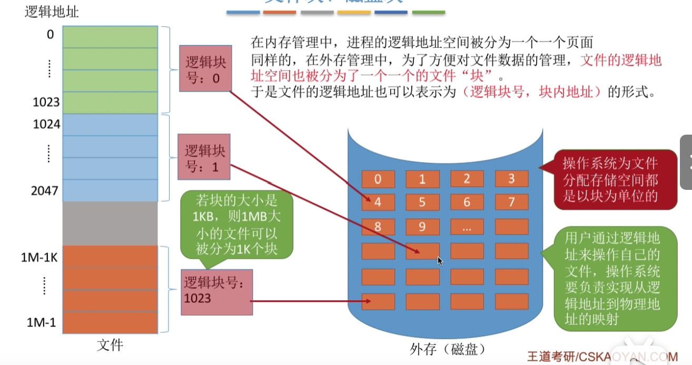
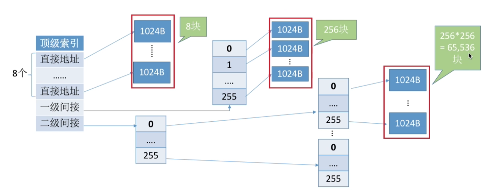

# 第4章 文件管理

文件是对磁盘的抽象，使用磁盘需要有磁盘相关的知识，使用从磁盘块来操作生磁盘；

在磁盘块上引入更高的抽象概念——文件，用户看到的是一个个文件保存在磁盘中，每个文件就是一个字符集；曹操作系统需要做的就是完成文件到磁盘块的映射，让用户可以通过操作文件来操作磁盘；

用户给出某个指定文件（调用 `open()`，只需要给出文件名称），操作系统负责根据文件名称找到这个文件在磁盘中的位置（根据文件 FCB 中保存的文件信息找到文件在磁盘中的具体位置），读取磁盘块；将用户与直接操作磁盘分离；

## 4.1 初识文件管理

文件的属性：
- 文件名：由创建文件的用户决定文件名，主要是为了方便用户找到文件，同一个目录下不允许有重名文件；
- 标识符：一个系统内的各个文件标识符唯一，对用户来说没有可读性；
- 类型：指明文件的类型；
- 文件的位置：文件存放的路径（让用户使用）、在外存中的地址（对操作系统使用，对用户不可见）；
- 大小：指明文件的大小；
- 创建时间、上次修改时间、文件所有者信息；
- 保护信息：对文件进行保护的访问控制信息；

文件内部数据的组织：
- 无结构文件（流式文件）：由一些二进制或字符流组成，比如.txt文件；
- 有结构文件（记录式文件）：由一组相似的记录组成，比如excel表、数据库文件；

文件之间的组织：树状格式；

操作系统向上提供的功能：
- 创建文件`create()`系统调用；
- 读取文件`read()`系统调用；
- 写文件`write()`系统调用；
- 删除文件`delete`系统调用；
- 打开文件`open()`系统调用；
- 关闭文件`close()`系统调用；

文件如何存放在外存：
- 与内存一样，外存也由一个个存储单元组成，每个存储单位可以存储一定量的数据。每个存储单元对应一个物理地址；
- 类似于内存分为一个个内存块，外存会分为一个个“块/磁盘块/物理块”。每个磁盘块的大小是相等的；
- 相似的，文件的逻辑地址也可以分为：逻辑块、块内地址；
- 操作系统同样需要将逻辑地址转换为外存的物理地址；
- 块内地址的位数取决于磁盘块的大小；
- 操作系统以“块”为单位分配存储空间；即使一个文件只有10B，但依然需要一个磁盘块的大小；外存中的数据读入内存同样以块为单位；

## 4.2 文件系统基础

### 4.2.1 文件目录

文件目录就是文件夹；

#### 文件控制块

文件目录（文件夹）本身也是一个结构文件，由一条条记录组成。每条记录对应一个在该目录下的文件；

这些记录包括：文件名、文件类型、存取权限、物理地址（该文件保存在外存的哪个外存块）中；

当我们双击打开一个文件后，操作系统会在这个目录表找到关键字（可能是文件名等）对应的目录项目（对应的记录），然后得到次文件在外存中存放的位置，去外存中找到文件；（文件目录里面也可以有文件目录）；

文件控制块（FCB）就是文件目录中的一条一条记录，每个文件都会对应一个FCB；其中保存该文件的许多信息，最重要的是文件名与文件存放的物理地址；（建立文件名到文件物理地址的映射）；

对目录的操作：

- :one:搜索：用户想要使用一个文件时，系统根据文件名搜索文件目录，找到该文件对应的FCB；
- :two:创建文件：创建一个新文件时，需要在其所属的目录中增加一个目录项(FCB)；
- :three:删除文件：删除一个文件时，需要在目录中删除相应的目录项(FCB)；
- :four:显示目录：用户可以请求显示目录的内容，如显示该文件目录下所有文件；
- :five:修改目录：当文件属性发生变化时，需要修改PCB中的信息；

#### 目录结构

:one:单级目录结构：

- 整个系统中只有一张目录表，每个文件占一个目录项；
- 单级目录实现了“按名存取”，但是不允许文件重名；在创建一个文件时，需要先检查目录表中有没有重名文件，确定不重名后才能建立文件，并将新文件对应的目录表项插入目录表中；

:two:两级目录结构：

- 早期的多用户操作系统，采用两级目录结构。分为主文件目录（MFD, Master File Directory）和用户文件目录（UFD, User File Directory）;

    

    - 主文件目录记录用户名以及相应用户文件目录存放的位置；
    - 用户文件目录由该用户文件的FCB组成；

- 此时允许不同用户的文件重名。文件名虽然相同，但是对应的其实是不一样的文件；

- 两级用户结构不允许同一个用户的文件重名；

:three:多级目录结构：

- 多级目录结构，又称为树形目录结构；

    

- 用户（用户进程）想要访问某个文件时要用文件路径名标识文件，文件路径是一个字符串。各级目录之间使用 “/” 隔开；

- 从根目录出发的路径称为绝对路径；

- 系统的绝对路径是一层一层找到下一级目录；

- 每次都从根目录开始寻找比较麻烦，可以把最近经常使用的一个文件目录设置为当前目录，也即这张目录调入内存，当用户想要访问当前目录的文件时，直接从当前目录开始寻找，称为绝对路径；

- 树形目录结构可以很方便对文件进行分类，层次结构；清晰，也能够更加有效得进行文件的管理和保护。但是不便于实现文件的共享，为此提出了：无环图目录结构；

:four:无环图目录结构：

- 在树形目录的基础上，增加了一些指向同一个节点的有向边，使得整个目录称为一个有向无环图；更方便得实现用户之间的文件共享；

    

- 可以用不同的文件名指向同一个文件（文件目录）；

- 需要为每个共享节点设置一个共享计数器，用于记录此时有多少个用户拥有这个文件；当某个用户删除此文件，那么共享计数器减一。只有当共享计数器为0时，其才会被删除；

#### 索引节点（FCB改进）

FCB中除了文件名，还有其他很多信息，但是在查找各级目录过程中，只需要文件名称这个信息，考虑让FCB瘦身，使得一个磁盘块可以存放更多的FCB，不需要频繁切换磁盘IO操作，提供查找效率；

可以使用索引节点，把其他信息放入索引节点，然后再FCB中，仅仅保存文件名称与该文件对应索引节点的指针；

​	当找到目标文件名称时，操作系统根据索引节点指针去外存中把索引节点调入内存，在其中找到此文件在外存中的物理位置，即可打开此文件；

​	存在在外存中的索引节点称为磁盘索引节点，当索引节点调入内存称为内存索引节点，内存索引节点需要增加一些信息：文件是否被修改、有几个进程访问文件等；

### 4.2.2 文件共享

多个用户共享一份文件，意味着系统中只有一份文件数据，并且只要某个用户修改了该文件的数据，其他用户也可以看到文件数据的变化；

#### 基于索引结点的共享方式（硬链接）

在文件的索引结点中设置一个链接计数变量count，来表示链接到本索引结点上的用户目录项数；两个FCB中的索引节点中的物理地址信息都是一样的指向这个共享文件；

​	删除时，先删除一个用户对次文件的FCB，让count-1，如果count不是0，这个文件就还不可以删除；

#### 基于符号链的共享方式（软连接）

类似于快捷方式

在共享文件的索引节点中创建一个Link类似的文件，根据其中记录的路径一步一步找到共享文件；其中只有路径，没有共享文件的物理地址；所以删除这个Link文件是不可以删除源文件的；

### 4.2.3 文件保护

#### 口令保护

- 为文件设置一个口令，保存在文件对应FCB中的索引结点中，用户请求访问该文件时，必须提供口令；操作系统会将用户提供的口令与FCB中保存的口令对比，正确才能访问；
- 优点：保存口令的空间开销不多，验证口令是实际也快；
- 缺点：口令在系统内部，不够安全；

#### 加密保护

- 使用某个密码对文件进行加密，在访问文件时需要提供正确的密码才能对文件进行正确的解密；
    - 比如，使用异或加密，使用一个加密密码：`01001`，对文件原始数据每5位依次与密码作异或；之后系统保存的就是异或之后的数据，这样如果不知道加密密码，就无法看懂数据；
    - 对异或加密的解密过程也很简单，直接对加密后的数据再次对加密密码异或即可；
- 优点：保密性强，不需要在系统中存储密码；
- 缺点：加密/解密需要花费一定时间；

#### 访问控制

- 每个文件的FCB（或索引结点）中添加一个访问控制列表（Access-Control List），该表中记录了各个用户可以对该文件执行哪些操作；

    - 访问类型：
        - 读：从文件中读取数据；
        - 写：像文件中写数据；
        - 执行：将文件装入内存；
        - 添加：将新信息添加到文件结尾部分；
        - 删除：删除文件，释放磁盘空间；
        - 列表清单：列出文件名和文件属性；

- 精简的访问列表：以组为单位，标记各“组”用户可以对文件执行哪些操作；

    

    - 比如分为系统管理员、文件主、文件主的伙伴、其他用户几个组；
    - 当用户访问文件时，系统检查该用户所属的分组是否有相应的访问权限；

### 4.2.4 文件的基本操作

#### 创建文件

- 创建文件实际调用了`create()`系统调用，需要提供几个参数：
    - 所需要的外存空间；
    - 文件存放路径；
    - 文件名称；
- 操作系统创建文件时，主要做了：
    - 在外存寻找文件锁需要的空间（结合之前学习的空闲链表法等管理测量，找到空闲空间）；
    - 根据文件存放的路径信息找到改目录对应的目录文件，在目录中创建文件对应的目录项，包含文件名称、文件存放地址等信息；

#### 删除文件

- 删除文件实际调用了`delete()`系统调用，需要提供几个参数：
    - 文件存放路径；
    - 文件名称；
- 操作系统在删除文件时，主要做了：
    - 根据文件存放路径找到相应的目录文件，从目录文件中找到该文件对应的目录项；
    - 根据目录项找到文件在外存的位置、文件大小等信息，回收文件占用的磁盘块；
    - 从目录项中删除目录项；

#### 打开文件

- 打开文件实际调用了`open()`系统调用，需要提供几个参数：

    - 文件存放路径；
    - 文件名称；
    - 要对文件的操作类型（只读、只写、读写）；

- 操作系统在打开文件时，主要做了：

    - 根据文件存放路径找到该文件对应的目录项，检查该用户是否有指定的操作权限；

    - 将目录项复制到内存中的打开文件表中。并将对应表的编号返回给用户。之后用户使用打开文件的编号来指明要操作的文件（Linux中的文件描述符），打开文件表分为：

        

        - 系统打开文件表：整个系统只有一张，记录所有打开的文件，每个表项对应一个被打开的文件，其中有一个字段记录该文件被多少进程打开；
        - 进程打开文件表：每个进程有一张，记录该进程此时已经打开的文件，并且每个进程打开文件表项会记录该文件在系统打开文件表的编号；
            - 读写指针：该进程对次文件度/写的位置；
            - 访问权限：打开文件时声明的操作权限；、
            - 系统表索引号：该文件在系统打开文件表中的编号；

#### 关闭文件

- 关闭文件实际执行了`close()`系统调用；
- 操作系统在关闭文件时，主要做了：
    - 将进程的打开文件表相应的表项删除；
    - 回收分配给该文件的内存空间等资源；
    - 系统打开文件表的打开计时器count-1，若为0，就删除这个表项；

#### 读文件

- 进程使用`read()`系统调用完成读操作（此时文件已经打开，进程的打开文件表中已经有了这个文件的信息），需要的参数：
    - 文件在打开文件表中的索引号（Linux使用文件描述符）；
    - 还需要指明读入多少数据；
    - 读入的数据需要存放在内存的什么位置；
- 操作系统读文件时，主要做了：
    - 从打开文件表对应表项中的读指针字段找到对应的外存，将用户指定的大小读入用户传入的内存；

#### 写文件

- 进程使用`write()`系统调用完成写操作（此时文件已经打开，进程的打开文件表中已经有了这个文件的信息），需要的参数：
    - 文件在打开文件表中的索引号（Linux使用文件描述符）；
    - 要写多少数据；
    - 写回外存的数据放在内存的位置；
- 操作系统写文件时，主要做了：
    - 从用户指定的内存区域，将指定大小的数据写回写指针指向的外存；

### 4.2.5 文件系统的层次结构

- 用户接口：文件系统需要向上层提供简单易用的功能接口。这层就是用于处理用户发出的系统调用请求（`read(), wirte(), close()`）等；[文件的基本操作](## 4.5 文件的基本操作)
- 文件目录系统：用户通过文件路径访问文件，因此这一层需要根据用户给出的文件路径找到相应的FCB或索引节点，所有的和目录、目录项相关的管理工作都在本层完成；（文件目录）
- 存取控制模块：为了保护文件的安全，还需要验证用户是否有访问权限。这一层主要完成了文件保护功能；（文件保护）
- 逻辑文件系统与文件信息缓冲区：用户指明要访问的文件记录号（对有结构文件才有），这一层需要将记录号转换为对应的逻辑地址；（文件的逻辑结构）
- 物理文件系统：这一层需要把上一层提供的文件逻辑地址转换为实际的物理地址；（文件的分配方式）
- 辅助分配模块：辅助文件存储空间的管理，负责分配和回收存储空间；（文件的存储空间管理）
- 设备管理模块：直接与硬件交互，负责和硬件直接相关的一些管理工作，如：分配设备、分配设备缓冲区、磁盘调度、启动设备、释放设备；（磁盘管理）

## 4.3 文件的逻辑结构

> 文件的逻辑结构，就是指在用户看来，文件内部的数据应该是如何被组织起来的。
>
> “物理结构”，指的是在操作系统看来，文件的数据是如何被存放在外存中的；

类似于数据结构的”逻辑结构“与”物理结构“；
​比如线性表是一种数据结构，在用户看来，其就是一组有先后顺序的元素序列。而线性表可以由数组实现，也可以由一个一个不相邻的元素不相邻的链表构成；因为其不同实现方式，也即物理结构，有的线性表可以随机访问，有的不可以；

可见，算法的具体实现与逻辑结构、物理结构都有关系，文件也一样，文件操作的具体实现与文件逻辑结构、物理结构都有关。

按文件是否有结构分类，可以分为无结构文件、有结构文件；

### 无结构文件

无结构文件：文件内部的数据就是一系列二进制流或字符流组成，又称为”流式结构“。如.txt；

因为无结构文件本来就没有结构，所以没有逻辑结构；

### 有结构文件

有结构文件：由一组相似的记录组成，又称为”记录式文件“。每条记录又分为若干个数据项组成。如数据库表文件。一般来说，每条记录有有关数据项可作为关键字（作为识别不同记录的ID）；

- 按照每条记录的长度（占用的存储空间）是都相同，又分为定长记录与可边长记录两种；

- 按照逻辑结构可以分为：

    - :one:顺序文件：

        - 文件中的记录一个接一个顺序排列（逻辑上），记录可以定长或者变长的，各个记录在物理上可以顺序存储或链式存储；（这样就可以分为四种结构：定长顺序存储、定长链式存储、变长顺序存储、变长链式存储）

            

        - 而顺序文件还可以细分为：

            - 串结构：记录之间的顺序与关键字无关；
            - 顺序结构：记录之间的顺序按关键字顺序排列；

        - 对顺序文件的物理物理结构进行分类：

            - 链式存储：无论定长还是可变长度，都无法实现随机存取，每次只能从第一个开始依次寻找（链表只能从头开始寻找）；
            - 顺序存储：
                - 可变长记录：无法实现随机存取，每次也只能从头开始查找；
                - 定长记录：可以实现随机存取，就像根据数组下标直接找到某个元素一样；
                    - 但是如果定长记录的顺序存储，如果使用串结构，无法使用关键字快速找到对应记录，但使用顺序结构就是可以的；

        - 缺点：不方便增加/删除记录；

    - :two:索引文件：

        - 每个索引文件建立一张索引表，每个表项包含索引号、长度、指针三个固定长度的信息，并且每个索引表项指向一个记录；这样即使每个记录在外存中是离散的分布，也可以直接通过索引号查索引表得到记录；

            

        - 若索引表按照关键字排序，可以快速查找；

        - 索引表本身是一个定长记录的顺序文件；

    - :three:索引顺序文件

        - 在索引文件中，每个记录对应一个索引表项，因此索引表可能会很大；比如一个记录本身就8B，而每个索引表项目有32字节，大大于记录本身，存储空间利用率太低；

        - 索引顺序文件，同样会为文件建立一张索引表，但不同的是：并不是每个记录都对应一个索引表项，而是一组记录对应一个索引表项；

            

    - :four:多级索引顺序文件：

        - 与内存分页管理方式多级页面类似；

## 4.4 :star:文件的物理结构

作为系统资源的管理者，操作系统需要对磁盘进行管理；包括对非空闲磁盘块的管理（存放了文件数据的磁盘块）与空闲磁盘块的管理；4.4.2 学习对非空闲磁盘块的管理、4.4.3 学习对空闲磁盘块的管理；

### 4.4.1 内存块、磁盘块

类似于内存分页，磁盘中的存储单元也会被分为一个个“块/磁盘块/物理块”；很多操作系统中，磁盘块的大小与内存块、页面的大小相同，方便数据在内存与外存中按块分配；

在内存管理中，进程的逻辑地址空间被分为一个个页面；类似的，外存管理中，为了方便文件数据的管理，文件的逻辑地址空间也被分为一个一个的文件“块”；

于是文件的逻辑地址也可以表示为（逻辑块号，块内地址）的形式。操作系统为文件分配存储空间都是以块为单位存储的。用户通过逻辑地址来操作自己的文件，操作系统要负责实现从逻辑地址到物理地址的映射；

 	  

### 4.4.2 文件分配方式

文件的分配方式，即文件的内容是如何在磁盘中存放的，由操作系统维护；

使用的磁盘块是如何组织成一个个文件的，如何使用文件的 FCB 来找到这个文件对应的磁盘块；

文件的分配方式信息是需要在磁盘中的，开机后需要根据磁盘中的信息构建文件系统，把文件的分配信息载入内存，放入每个文件的 FCB 中；

#### 连续分配

- 连续分配方式要求每个文件在磁盘上占有一组连续分配的块；

- 连续分配的地址映射：

    - 为了实现逻辑块号与物理块号的映射，操作系统需要在FCB中记录每个文件的起始物理块号与文件长度；

        

    - 用户给出需要访问的逻辑块号，操作系统找到该文件对应的FCB：

$$
物理块号 = 起始块号 + 逻辑块号
$$

- 连续分配的优点：
    - :one:因为逻辑块不仅在逻辑上连续，并且在物理外存中连续存储，支持随机访问与直接访问；
    - :two:读取磁盘块时，需要移动磁头，顺序读写磁盘时，读写速度最快；
- 连续分配的缺点：
    - :one:如果某个文件前后的物理外存被使用，如果想要增加此文件的大小，必须要再找一个更大的连续空间，将文件全部复制过去，拓展很困难；
    - :two:如果文件之间的空闲磁盘块很小，使得离散的磁盘块被浪费，产生磁盘碎片，空间利用率低；

#### 链接分配

- 链接分配采用离散分配的方式，可以为文件分配离散的磁盘块；可以分为隐式链接与显示链接两种；

- 隐式链接：

    - FCB中记录了文件存放的起始块号与结束块号；除了文件的最后一个磁盘块以外，每个磁盘块都会保存指向下一个磁盘块的指针，这些指针对用户是透明的；

        

    - 这样的分配方式只能支持顺序访问，必须一个一个向下寻找；并且需要花费一些空间保存下一个磁盘块的指针；

    - 方便文件拓展，不会产生碎片；

- 显式链接：

    - 把用于连接文件各物理块的指针显示地存放在一张表中，即文件分配表（FAT），这个表是对整个磁盘而言的，每个非最后一块的磁盘都会有下一块的地址，如果是文件的最后一块磁盘块，那么其对应的FAT表项就写-1；然后在每个文件的FCB中记录文件的第一个起始物理块号；

    - 比如一个文件"a"依次存放在磁盘块 2 -> 5 -> 0 -> 1；那么在FAT中，第2表项为5，第5表项为0，第0表项为1，第1表明为-1；打开文件时，先去FCB找到第一个物流块号，之后的物理块号就可以去FAT中查找；

        

    - 这样一张磁盘只需要一个FAT，开机时候将FAT读入内存，并且常驻内存；FAT中每个表项长度相同，所以物理块号字段是隐含的；

    - 因为FAT在内存中，所以实现逻辑地址到物理地址的转变过程，只需要在FCB与FAT依次查询，不需要使用磁盘IO操作，既支持随机访问，可以支持顺序访问；

    - 方便文件拓展、不会产生磁盘碎片；但FAT需要占用一定的存储空间；

#### 索引分配

- 索引分配，索引分配允许文件离散地分配在各个磁盘块中，操作系统为每个文件建立一张索引表，索引表记录了文件的各个逻辑块对应的物理块（索引表的功能类型于内存管理中的页表——建立逻辑页面到物理页面的映射关系）。

    - 索引表存放的磁盘块称为索引块。文件数据存放的磁盘块称为从数据块；
    - 在FCB中记录该文件的索引块的块号，去找到索引表；

    

- 每个文件都需要一个索引表。而在显式链接中，一个磁盘只需要一张文件分配表FAT；

- 索引表的逻辑块号是隐含的；

- 用户需要一个文件时，先去FCB找到此文件的索引表，再到索引表中找到各个逻辑块对应的物理块；

    - 显然：索引分配支持随机访问，并且文件拓展容易；
    - 但是索引表需要占用一定的存储空间；

- 索引分配会带来与基本分页管理相同的问题，当一个文件过大，其索引表项太多，一个磁盘块放不下其所索引表。有以下三种解决方式：

    - :one:链接方案：将索引表分开为一个一个磁盘块，每个磁盘块的一个部分记录下一张索引表的位置：

        

        - FCB中保存该文件第一张索引表的物理课；
        - 如果需要的逻辑块不在第一张索引表，那么就不支持随机访问；
        - 并且如果索引表很大，比如需要256个索引表，，那么找到最后一张就需要256次进行磁盘IO操作，效率低；

    - :two:多层索引：建立多层索引（类似于多级页表）。使得第一层索引块指向第二层索引块。还可以根据文件大小的要求再建立第三层、第四层……；

        

        - FCB中保存一级索引表的物理块；
            - 此时如果一个文件索引表有256张，如果采用上图的二级索引，我们甚至只需要查找一次就可以找到最后一张索引表了，效率高了很多；
            - 并且如上图，如果一个磁盘块为1KB，那么一个二级索引就可以支持最大为 256 * 256 * 1KB = 64MB的文件，并且查找更快；
        - 用户想要访问文件的第1026个逻辑块：（访问一次需要3次磁盘IO）
            - 先去FCB中找到一级索引表的物理块
            - 并且从中找到第1026/256 = 4个二级索引表的物理块，
            - 再到这个索引表中找到第 1026%256 = 2 个表项，即为数据块号；
        - 采用K层索引结构，并且顶级索引表没有调入内存，则访问一个数据块只需要 K + 1次磁盘IO；
        - 但如果文件本身的大小很小，但却需要比文件大很多的空间来保存其索引表，为了解决这个问题，提出混合索引；

    - :three:混合索引：多种索引分配方式的结合；例如一个文件的顶级索引表中，既包含直接地址索引（直接指向数据块），又包含一级间接索引（指向单层索引表）、还包含两级间接索引（指向两层索引表）；

        

        - 如上图的结构，可以保存 （8 + 256 + 256 * 256）KB
        - 这种方式下，不同的逻辑块寻过程磁盘IO次数不同；
        - 对小文件，只有占用前面几个直接地址块就好了；

### 4.4.3 磁盘空间管理

磁盘存储空间管理，即操作系统如何得知某个磁盘块是否被使用，哪些是空闲的，如何管理空闲的磁盘块；

空闲的磁盘块是如何被组织起来的；

- 存储空间的划分：将物理磁盘划分为一个个文件卷（逻辑卷、逻辑盘）；

- 存储空间的初始化：将各个文件卷划分为目录区、文件区：

    - 目录区：存放文件目录信息（FCB）、用于磁盘存储空间管理的信息；
    - 文件区用于存放文件数据：

    

#### 空闲表法

- 使用空闲表记录磁盘中空闲磁盘块的起始位置与长度（类似于存储管理中的动态分区分配）；适用于文件分配方式为：连续分配方式的系统；

    

- 分配磁盘块方法：

    - 与内存管理的动态分区很类型，为一个文件分配连续的存储空间。可以采用首次适用、最佳适应、最坏适应等算法来决定要为文件分配哪个区间；

- 回收磁盘块的方法：

    - 与内存管理的动态分区很类型：
        - :one:回收区前后都没有相邻的空闲区：直接释放这个空间；
        - :two:回收区前是空闲区：与前方的空闲区域合并为一个空闲空间；
        - :three:回收区后是空闲区：与后方的空闲区域合并为一个空闲空间；
        - :three:回收区前后都是空闲区：把前后的空闲与本身和三为一；

#### 空闲链表法

- 空闲盘块链：以磁盘块为单位，将空闲的磁盘块链接在一起；

    - 每个磁盘块需要记录下一个空闲磁盘块的指针；

        

    - 操作系统保存着空闲链表的链头、链尾指针；

    - 分配磁盘的方法：

        - 若申请K个磁盘块，从链头开始一次摘下K个磁盘块分配，并修改空闲链表的链头指针；

    - 回收磁盘的方法：

        - 回收的磁盘依次挂到链尾，并修改链尾指针；

- 空闲盘区链：以若干个连续的磁盘块为单位，将空闲的磁盘空间链接在一起；

    - 每个磁盘区需要记录下一个空闲磁盘区的指针，以及本空闲盘区长度；

        

    - 操作系统保存着空闲链表的链头、链尾指针；

    - 分配磁盘的方法：

        - 若申请K个磁盘块，采用首次适应、最佳适应等算法，从链头开始检索，按照算法规则找到一个大小符合要求的空闲盘区，分配给分解；若没有合适的连续空闲盘区，也可以将不同盘曲的盘块同时分配给一个分解，注意分配后可能要修改相应的链指针、盘区大小等数据；

    - 回收磁盘的方法：

        - 若回收区和某个空闲盘曲相邻、则需要要将回收合并到空闲盘区中；若没有，直接挂到链尾；

#### 位示图法 

- 位示图：每个二进制对应一个盘块；可以设置0表示空闲、1表示被分配；

    

- 分配磁盘的方法：

    - 需要K个块：首先顺序扫描位示图，找到K个相邻或不相邻的0；然后根据字号、位号算出对应的盘块号，将相应的盘块号分配；最后把相应的位设置位1；

- 回收磁盘的方法：

    - 根据回收的盘块号计算对应的字号、位号，将其二进制位设置位0；

#### 成组链接法

- 成组链接法：文件卷的目录区中专门用一个磁盘块作为“超级块”，系统启动时将超级块读入内存。并且保证内存与外存中的“超级块”数据一致；

    

- 超级块记录下一组空闲盘块的数量以及空闲块号；

    

    - 这里的超级块，首先是100，表示其下保存着100个空闲块；之后的100个数据就是这100个空闲块的物理块号；但是第一个空闲块号对应的磁盘块其实是另一个超级块；

## 4.5 磁盘的结构

### 磁盘、磁道、扇区

- 磁盘的表明由一些磁性物质组成，可以用这些磁性物质记录二进制数据；
- 磁盘的表明背划分为一个一个磁道，这样的一个圈就是一个磁道；
- 一个磁道又可以划分为一个个扇区，每个扇区就是一个磁盘块，各个扇区存放的数据量相同；（因为最内侧的扇区最小，但是各个扇区数据量相同，所以其数据密度最大）；

### 如何在磁盘中读/写数据

- :one:将磁头移动到想要读写的扇区所在的磁道，使得磁头对准数据所在的磁道；

      ---》 

- :two:将磁盘旋转，让目标扇区在磁头下划过，完成对扇区的读/写；

### 盘面、柱面

- 可以由很多的磁盘堆叠起来，每个磁盘为一个盘面；
- 每个盘面对应一个磁头；
- 所有的磁头都是连接一个磁臂的，所以所有的磁头只能一起运动；
- 所有的盘面中相对位置相同的磁道组成柱面；

### 磁盘的物理地址

所以可以使用（柱面号（也就是磁道号）、盘面号、扇区号）来定位任意一个“磁盘块”；

根据地址得到一个磁块的过程：

- :one:根据“柱面号”移动磁壁，让磁头指向指定的柱面（确定柱面（磁道））；
- :two:激活指定盘面对应的磁头（确定盘面）；
- :three:磁盘旋转过程中，指定的扇区从磁头下划过，完成读/写操作（确定扇区）；

### 磁盘的分类

- 活动头磁盘：磁头可以移动，磁臂可以来回伸缩带动磁头定位磁道；

    

- 固定头磁盘：磁头不能移动，这种磁盘的每个磁道都有一个磁头；

    

## 4.6 磁盘调度算法

### 4.9.1 磁盘读写操作的时间

- 寻道时间$T_S$：在读/写数据之前，需要把磁头移动到指定磁道所花费的时间；

    - :one:启动磁头臂需要时间，用时$s$；
    - :two:移动磁头需要时间，假设磁头匀速移动，每跨一个磁道需要$m$，总共要跨过$n$个磁道
    - 所以得到：$T_S = s + m * n$；

- 延迟时间$T_n$：通过旋转磁盘，使磁头定位道目标扇区所需要的时间；

    - 设磁盘转速为$r$，则平均所需要的延迟时间为：$T_n = (1/2) * (1/r)$；

- 传输时间$T_t$：从磁盘读出或写入数据所经历的时间；

    - 假设磁盘转速为r，此次需要b字节，每个磁道上字节数量为N：$T_t = (1/r) * (b/N) = b/(rN)$；

- 总时间为三者之和：
    $$
    T = T_S + T_n + T_t
    $$

​	其中 $Tn$ 与 $T_t$ 与磁盘本身的速度相关，操作系统无法加速，但其可以减少寻道时间；

### 4.9.2 磁盘调度算法

#### 先来先服务算法（FCFS）

- 根据进程访问磁盘的先后顺序进行调度；
- 优点：公平；
- 缺点：但如果先后两个来到的进程需要访问的磁道可能跨度很大，使得磁道很分散，导致寻道时间长；

#### 最短寻道时间优先（SSTF）

- 优先处理与当前磁道最近的磁道，可以保证每次的寻到时间最短，但不可以保证总的寻道时间最短；
- 优点：性能较好，平均寻道时间短；
- 缺点：可能产生“饥饿”现象；

#### 扫描算法（SCAN）

- 规定只有磁头移动道最外侧磁道时，才可以向内移动（即使外侧已经没有需要访问的磁道）；只有磁头移动道最内侧磁道时，才可以向外移动（即使内侧已经没有需要访问的磁道）；并且每次调度保证可以移动的磁道中最近的一条；（在SSTF的基础上增加了新规则）；
- 优点：性能好，平均寻道时间较短、不会产生饥饿；
- 缺点：
    - 必须达到最外或最内侧才能反方向，即使此时已经没有需要访问的磁道，浪费了时间；
    - 对各个位置的磁道响应频率不平均；

#### LOOK调度算法

- 在扫描算法的基础上，不再要求磁道必须到底最外/内侧没有请求才能反转方向，只要外/内侧没有需要访问的磁道即可反转方向；

#### 循环扫描算法（C-SCAN）

- 在扫描算法的基础上，规定只有磁头朝某个特定方向移动时，才处理磁道访问请求，而返回时直接快速移动会起始端，并且不执行任务；

#### C-LOOK调度算法

- LOOK与循环的结合；

### 4.9 3 减少磁盘延迟时间的方法

磁头读入一个扇区的数据后需要一小段的处理时间，但磁片是不断旋转的；如果刚刚处理完的数据的下一个数据就在刚刚读完的扇区后，那么磁头就会错过这个扇区（因为读完一个扇区需要一段处理时间），需要再转过一圈才能读取，导致“延迟时间”很长；

也即如果逻辑地址相邻的扇区在物理地址也是相邻的，就会导致延迟时间比较长；

以下为几种方法来减少延迟时间：

#### 交替编号

- 采样交替编号，既让逻辑上相邻的扇区在物理上有一定的间隔，可以使去读连接的逻辑扇区所需要的延迟时间更小；

#### 错位命名

- 相邻的磁面相对位置相同扇区编号相同；

## 4.7 磁盘管理

### 磁盘初始化

- 磁盘初始化：

    - :one:进行低级格式化（物理格式化），将磁盘的各个磁道划分为扇区。一个扇区通常可以分为头、数据区域（512B）、尾三个部分。管理扇区所需要的各种数据结构（链式结构）一般放在头、尾两部分，包括扇区校验码等；

        

    - :two:将磁盘分区，每个分区由若干个柱面组成（即：C盘、D盘……）

        

    - :three:进行逻辑格式化，创建文件系统。包括创建文件系统的根目录，初始化存储空间管理所用的数据结构；

### 引导块

计算机开机时需要进行一些列初始化工作，这些初始化工作是通过执行初始化程序（自举程序）完成的；

初始化可以存放在ROM（只读存储器）中，在出厂时写入，并且不能再修改；

但现代操作系统，通常只把很小的一部分自举程序放入ROM，完整的自举程序放在磁盘的启动块（即引导块）。开机时到ROM中找到引导块，之后再去引导块执行自举程序；

​	把拥有启动分区的磁盘称为启动磁盘系统磁盘（C盘）；

### 坏块

> 坏块，指无法正常使用的扇区；属于硬件故障，操作系统无法修复；应该记录这些坏块，防止错误使用；

- :one:在文件分配表FAT中记录；
- :two:磁盘控制器维护一个坏块链表，还会保留一些“备用扇区”，用于替换，称为扇区备用；

## 4.8 :star:文件系统格式

每次关机，内存中的数据全部清除，保存的所有文件都需要存放在磁盘中，标签需要保存各个文件之间的关系，如何形成一个树状的文件系统；

这些信息都应该保存在磁盘中，系统开机就去磁盘中解析这些信息，构建出文件系统；

### 4.8.1 文件系统布局

一个简单的文件系统格式如下：

将磁盘空间分成：

- 引导块：启动区，但不一定所有硬盘都有，但需要预留，保证格式统一；

- 超级块：用于描述整个文件系统的整体信息；

    - s_ninodes：i 节点数；
    - s_nzones：块数；
    - ...

    有了超级块，整个硬盘的布局就清晰；

- inode 位图与块位图；这就是位图的基本操作和作用，表示后面 inode 和块的使用情况，和之前所说的内存占用位图 `mem_map[]` 类型；

    都是一个数组记录着每个 indode 节点与块的使用情况；

- indode（i节点）存放每个文件或目录的元信息或索引信息，元信息就是文件类型、文件大小、修改时间等，索引信息使用大小为 9 的 `i_zone[9]` 数组来表示这个文件或目录的具体数据占用了哪些块；

    i节点保存一个文件的信息；块保存文件的内容；

    在 `i_zone[9]` 中，0 - 6 号表示直接索引，指向使用的块；7 表示因此间接索引，8 表示二次间接索引。当文件比较小，比如就占两个块，只需要使用 `i_zone[0]` 与 `i_zone[2]` 两个直接索引；

    （直接索引、间接索引是操作系统课中文件管理的内容，间接索引类似页表的管理方式）

    

- 块就是存在具体文件或目录信息；

    如果是一个普通文件类型的 inode 指向的块

    如果是一个目录类型的 inode 指向的块，那里面存放的就是这个目录下的文件和目录的 inode 索引以及文件或目录名称等信息;

### 4.8.2 寻找文件的过程

对 Linux 系统，存在一个根目录，所有文件都从这里除法来寻找；

根目录的 inode 默认存放在 inode 数组中的第一个；

每个文件目录中的内容是一组信息（保存在块中），对于文件目录中的每一个文件，保存文件的名称与改文件 inode 位于 inode 数组中的索引；

所以如果从根目录除法寻找： "/home/MoleSir/hello.c"：

- 到根目录对于的 0 号 inode 结点，根据 inode 结点中的块信息找到其内容所在的块；
- 在根目录块中依次搜索文件名称问  `home` 的项，找到后，根据给出的 inode 数组索引再去 inode 数组中找到 /home 目录的 inode；
- 依次类推最后找到 "hom/MoleSir/hello.c" 的 inode；
- 这个是一个文件，不是目录，所以块中保存的就是文件的内容；
