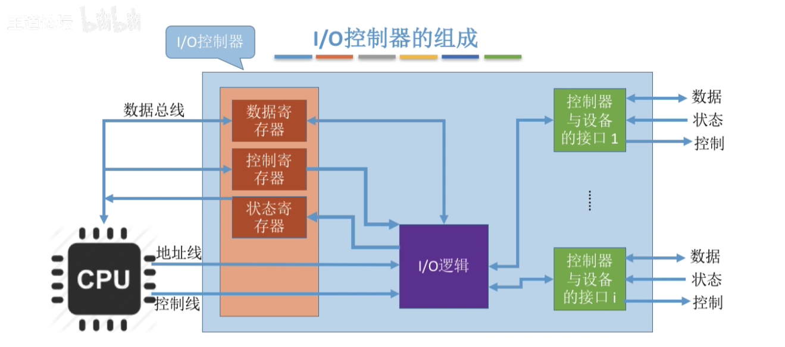

# 第5章 设备管理

## 5.1 I-O设备的基本概念

### I/O设备

==I/O==设备，指可以将数据**输入计算机**，或者可以接受**计算机输出**数据的外部设备，属于计算机中的**硬件设备**；

UNIX系统将外部设备抽象为特殊的文件，用户可以使用与文件操作相同的方式对外部设备进程操作；

### I/O设备的分类

- 按照**使用特性**分类：
    - :one:：**人机交互外部设备**，鼠标、键盘、打印机——用于人机交互；
    - :two:：**存储设备**，移动硬盘、光盘——用于数据存储；
    - :three:：**网络通信设备**，调制解调器——用于网络通信；
- 按照**传输速度**分类：
    - :one:：**低速设备**，鼠标、键盘等——传输速度为每秒几到几百字节；
    - :two:：**中速设备**，激光打印机等——传输速度为每秒数千至上万字节；
    - :three:：**高速设备**，磁盘——每秒千字节至兆字节；
- 按照**信息交互的单位**分类：
    - :one:：**块设备**：如磁盘——数据传输的基本单位为“块”；
    - :two:：**字符设备**：鼠标、键盘等——数据传输的基本单位为字符；

## 5.2 I/O控制器

- **I/O设备**，可以分为：
    - ==机械部件==：用来执行**具体的I/O操作**；
        - 比如看得见摸得着的鼠标、键盘，显示器的LED屏幕等；
    - ==点击部件==：通常是一块插入主板扩展槽的**印刷电路板**；
        - I/O控制器：
        - 设备控制器：

CPU无法直接控制I/O设备的机械部件，因此I/O设备还需要一个电子部件作为CPU和I/O设备机械部件之间的“中介”，用于实现CPU对设备的控制，这个设备就是==I/O控制器==，又称为==设备控制器==；

CPU控制I/O控制器，又由I/O控制器来控制设备的机械部件；

### I/O控制器的功能

- I/O控制器的功能：
    - :one:：**接受和识别**CPU发出的命令。如CPU发出的read/write命令，I/O控制器中会有相应的==控制寄存器==来存放**命令和参数**；
    - :two:：向CPU报告**设备的状态**。I/O控制器中会有相应的==状态寄存器==，用于记录I/O设备的当前状态；
    - :three:：**数据交换**。I/O控制器中会设置相应的==数据寄存器==。输出时，数据寄存器用于暂存CPU发来的数据，之后再由控制器传送设备。输入时，==数据寄存器==用于暂时备份发来的数据，之后CPU再从中取走；
    - :four:：**地址识别**。给I/O控制器中的寄存器编址，来区分不同的寄存器；

### I/O控制器的组成

- :one:：**CPU与控制器的接口**。用于实现CPU与控制器之间的通信：
    - CPU通过控制线发出命令；
    - 通过地址线来指明要操作的设备；
    - 通过数据线取出（输入）数据、放入（输出）数据；
- :two:：**I/O逻辑**。负责接受和识别CPU的各种命令，并负责对设备发出命令；
- :three:：**控制器与设备的接口**。用于实现控制器与设备之间的通信；
- 注意：
    - 一个控制器可能对应多个I/O设备；
    - 数据寄存器、控制寄存器、状态寄存器会有多个；

## 5.3 I/O控制方式

> ==I/O控制方式==：用什么样的方式来控制I/O设备的数据读/写；

### 程序直接控制方式

- 完成一次读/写操作的流程：
    - :one:：CPU向控制器发出读指令，设备启动，并将状态寄存器设置为**未就绪**；
    - :two:：轮询检查控制器的状态，既检查状态寄存器的数据，直到设备准备好；
    - :three:：输入设备准备好数据后将数据传给控制器，并报告自身状态；
    - :four:：控制器将输入的数据放到数据寄存器中时