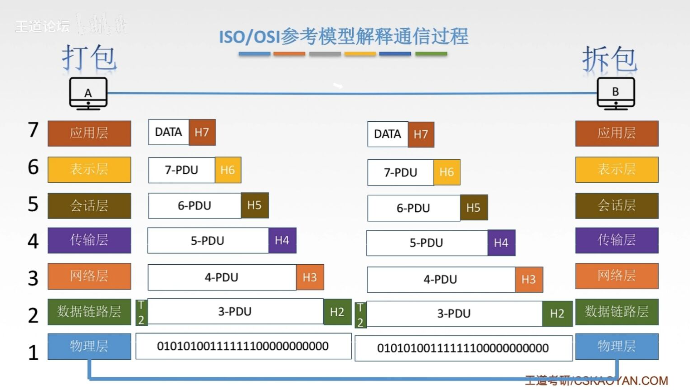

# 第一章

## 1.1 概念、组成、功能和分类

### 计算机网络的概念

计算机网络：是一个将分散的、具有独立功能的计算机系统，通过通信设备与线路连接起来，由功能完善的软件实现资源共享和信息传递的系统；

计算机网络是互连的、自治的计算机集合；

- 互连：互联互通、通信链路；
- 自治：无主从关系；

### 计算机网络的功能

- :star:数据通信；
- :star:资源共享：
    - 硬件资源共享；
    - 软件资源共享；
    - 数据资源共享；
- 分布式处理：多台计算机各自承担同一工作任务的不同部分；
- 提高可靠性：
- 负载均衡；
- $\cdots $

### 计算机网络的组成

- 以组成部分划分：硬件、软件、协议

- :star:以工作方式划分：
    - 边缘部分：用户直接使用的部分（电脑、主机）
    - 核心部分：为边缘部分部分（路由器、网络、交换机）
- :star:以功能组成划分（很重要）：
    - 通信子网：各种传输介质、通信设备、相应的网络协议组成；
    - 资源子网：实现资源共享功能的设备和软件的集合；

### 计算机网络的分类

- 按分布范围分：广域网WAN（交换技术）、城域网MNA、局域网LAN（广播技术）、个人区域网PAN；
- 按使用者分：公用网、专用网；

- 按交换技术分：电路交换、报文交换、分组交换；
- 按拓扑结构分：总线型、星型、环型、网状型；
- 按传输技术分：
    - 广播式网络：共享公共通信信道；
    - 点对点网络：使用分组存储转发和路由选择机制；

## 1.2 标准化工作及相关组织

要实现不同厂商的硬、软件之间的互相连通，必须遵守统一标准；

### 标准的分类

- 法定标准：由权威机构制定的正式的、合法的标准 OSI；
- 事实标准：某些公司在产品竞赛中占据了主流，时间长了，这些产品的协议和技术就成了标准 TCP；

### 标准化工作

RFC（Request For Comments） —— 因特网标准的形式

RFC要成为因特网正式标准的三个阶段：

1. 因特网草案
2. 建议标准
3. 因特网标准

### 标准化相关组织

- :star:国际标准化组织 ISO
- 国际电信联盟 ITU
- 国际电气电子工程师协会 IEEE
- Internet工程任务组 IETF

## 1.3 速率相关的性能指标

### 速率

速率即数据率或称数据传输率或比特率（1 bit）

连接在计算机网络上的主机在数字信道上传送数据位数的速率

单位有 b/s      kb/s     Mb/s     Gb/s    Tb/s （1000倍关系 10的三次方）

形容速率时 k M G T 之间通常差距 10的三次方

形容存储容量时 k M G T 之间通常差距 2的10次方 = 1024，并且一般以 1 字节为最小单位（1 B = 1 byte = 8 bit  = 8b）

### 带宽

原来的“带宽”指的是信号具有的频带宽度，即最高频率与最低频率之差，单位为 Hz

计算机网络中，带宽表示网络的通信线路传送数据的能力，通常是指单位时间内从网络中一个点到另一个点所能通过的“最高数据率”。单位为 比特每秒， b/s    kb/s     Mb/s   

### 吞吐量

吞吐量表示单位时间内通过某个网络（或信道、接口）的数据量。单位为 b/s  kb/s   Mb/s等；

吞吐量受到网络的带宽的限制，也就是说最大吞吐量是带宽；

​	

## 1.4 时延、时延带宽积、RTT和利用率

### 时延

数据（报文/分组/比特流）从网络（或链路）的一段传送到另一端所需要的时间。也叫延迟或延迟，单位s；	时延包括以下四个部分：

- 发送时延（传输时延）
    - 基本概念：从发送分组的第一个比特算起，到该分组的最后一个比特发送完毕所需要的时间；是发生在主机内部的；
    - 计算公式：发送时延 = 数据长度/信道带宽（发送速率）；
- 传播时延：
    - 基本概念：信号在信道上传播的速度；取决于电磁波的传播速度和链路长度，发生在传播链路上；
    - 计算公式：传播时延 = 信道长度/电磁波在信道上传播的速率；
- 排队时延：
    - 基本概念：等待输出/输入链路可用的时间；发生在路由器；
- 处理时延：
    - 基本概念：路由器需要检测数据与寻找数据发送的目标主机所用的时间；发生在路由器；

高速链路指的是提高主机的发送速率，减小发送时延；

### 时延带宽积

时延带宽积 = 传播时延 × 带宽，单位为 bit;

### 往返时延RTT

从发送方发送数据开始，到发送方收到接收方确认（接收方收到输入后立刻发送确认）总共经历的时延；

根据定义：

$$
RTT = 传播时延 * 2（往返） + 末端处理时间（占比较小）
$$
RTT 不包括发送时延；

### 利用率

- 信道利用率 = 有数据通过的时间/总时间；
- 网络利用率 = 信道利用率加权平均值；

​	其他条件不变的情况下，时延与利用率正相关；

## 1.5 分层结构、协议、接口、服务

### 基本概念

计算机网络需要完成的工作繁多并且复杂，所以将其分层为多个小问题来实现不同的功能；

- 实体：第n层的活动元素称为n层实体。同一层的实体叫对等实体；
- 协议：为进行网络中的对等实体数据交换而建立的规则、标准或约定称为网络协议【水平】；
    - 协议语法：规定传输数据的格式；
    - 协议语义：规定所要完成的功能；
    - 协议同步：规定各种操作的顺序；
- 接口（访问服务点SAP）：上层使用下层的服务的入口；
- 服务：下层为相邻上层提供的功能调用【垂直】；

各层间传输的数据不同：

​	

- SDU服务数据单元：为完成用户要求的功能而应传送的数据；
- PCI协议控制信息：控制协议操作的信息；
- PDU协议数据单元：对等层次之间传送的数据单位；

如上图：

第五层的数据交给第四层，第四层将这个数据作为 SDU，并且附加上第四层协议所需要的操作信息 PCI，最后组成了第四层的 PDU；

然后第四层把自己的 PDU传送给第三层，第三层将其作为自己的 SDU，附加第三层协议的操作信息 PCI 组成第三层的 PDU；之后以此类推；

### 概念总结

- 网络体系结构是从功能上描述计算机网络结构；
- 计算机网络体系结构（简称网络体系结构）是分层结构；
- 每层遵循某个/些网络协议以完成本层的任务；
- 计算机网络体系结构是计算机网络的各层以及其协议的集合；
- 第n层在向第n + 1层提供服务时，此服务不仅包含第n层本身的功能，还包含了由下层服务提供的功能；
- 仅仅在相邻层有接口，并且所提供的服务的具体实现对上一层完全屏蔽；

## 1.6 OSI参考模型

### OSI参考模型的由来

提出目的：支持异构网络系统的互联互通；

由国际标准化组织ISO在1984年提出开放系统互连（OSO）参考模型；

理论成功、市场失败；

### OSI 参考模型

七层模型：（物联网淑惠试用）

- 应用层
- 表示层
- 会话层
- 传输层
- 网络层
- 数据链路层
- 物理层

### OSI参考模型解释通信过程

上四层是中间系统所没有的，所以上面四层是端到端的传输，需要封装两个通信端口的信息，而看起来直接从一个端口送到另一个端口；

但下面三层是中间系统也有的，而中间系统可以有很多，所以下面三层是点到点的，它们只管送到下一个中间系统的信息的包装；

可以看到，高层向底层传输带有高层封装信息的整个数据，这个数据被低层视为有效数据进行打包；

比较特殊的是数据链路层，除了增加头部，还增加了尾部；

物理层不会进行封装，傻瓜层，只负责传输数据；

看起来就像一个打包与拆包的过程；	

### 各层的作用与主要协议

- 应用层

    - 概念：所有能和用户互相产生网络流量的程序，要联网的，记事本这样的不算；
    - 协议：文件传输（FTP）、电子邮箱（SMTP）、万维网（http）.....

- 表示层

    - 概念：用于处理两个通信系统中交换信息的表示方式；
    - 功能：
        - 功能1：数据格式变换（翻译官）；例：将数据流转换为图片；
        - 功能2：数据加密解密；
        - 功能3：数据的压缩与恢复；例：传送数据时，先压缩，发送，收到后再解压缩
    - 协议：通常将表示层归为应用层，所以没有什么协议；

- 会话层

    - 概念：向表示层实体/用户进程提供建立连接并在连接上有序地传输数据，这是会话，也是建立同步；
    - 功能：
        - 功能1：建立、管理、终止会话；
        - 功能2：使用校验点可使会话在通信失败时从校验点/同步点继续恢复通信，实现数据同步；
    - 协议：ADSP、ASP;

- 传输层

    - 概念：负责主机中的两个通信，即端到端的通信。传输单位是报文段或用户数据报；
    - 功能：
        - 功能1：可靠传输、不可靠传输；
        - 功能2：差错控制；
        - 功能3：流量控制；
        - 功能4：复用分用
            - 复用：多个应用层可同时使用下面传输层的服务；
            - 分用：传输层把收到的信息分别交付给上面应用层中的相应的进程；
    - 协议：TCP、UDP；

- 网络层

    - 概念：主要任务是把分组从源端传到目的端，为分组交换网上的不同主机提供通信服务；

        ​            网络层的传输单位是数据报；

    - 功能：

        - 功能1：路由选择：在多条路径中，通过路由算法选择最合适的从发送端到目的端；
        - 功能2：流量控制：协调发送段与目的端传输速率的控制；
        - 功能3：差错控制：检测发送过程中的错误，尝试纠错；
        - 功能4：拥塞控制：当网络处于拥堵状态，采取一些方法解决；

    - 协议：IP、IPX、ICMP、APRP；

- 数据链路层

    - 概念：主要任务是把网络层传下来的数据报组装为帧；

        ​			数据链路层的传输单位是帧；

    - 功能：

        - 功能1：成帧（定义帧的开始与结束）.......
        - 功能2：差错控制：帧错+位错；
        - 功能3：流量控制；
        - 功能4：访问（接入）控制：控制对信道的访问；

    - 协议：PPP、STP；

- 物理层

    - 概念：主要任务是在物理媒体上实现比特流的透明传输（指不管所传的数据是什么，都可以在其链路上传播）
    - 功能：
        - 功能1：定义接口特性；
        - 功能2：定义传输模式：
            - 单工：确定了一个时间上两个端口谁发送谁接受，只能由发送方发送；
            - 半双工：两个端口都只能作为发送与接受端，但同一时间只能有一个传输（对讲机）；
            - 双工：两个端口可以同时发送接收（电话）；

        - 功能3：定义传输速率；
        - 功能4：比特同步；
        - 功能5：比特编码（规定什么电压信号表示0、1）

    - 协议：Rj45、802.3；

## 1.7 TCP/IP 参考模型

### OSI与TCP/IP的相同点

- 都使用分层结构；
- 都基于独立协议栈的概念；
- 都可以实现异构网络互联；

### OSI与TCP/IP的相同点

- OSI定义三点：服务、协议、接口；
- OSI先出现，参考模型先于协议发明，不偏向特点协议；
- TCP/IP设计之初就考虑到异构网络互联问题，将IP作为重要层次；
- 见表格

|        | ISO/OSI参考模型 |   TCP/IP模型    |
| :----: | :-------------: | :-------------: |
| 网络层 | 无连接+面向连接 |     无连接      |
| 传输层 |    面向连接     | 无连接+面向连接 |

其中的无连接与面向连接是指两种传输数据方式：

面向连接分为三个阶段，第一个是建立连接，在此阶段，发出一个建立连接的请求。只有在连接成功建立后，才能开始数据传输，这是第二个阶段；接着数据传输完毕，开启第三个阶段：释放连接；

而无连接，就没有这么多阶段，直接进行数据传输；

### 5 层参考模式

5层参考模型结合了 OSI 与 TCP/IP 的优点，只是书本上的理论：

- 应用层：支持各种网络应用（FTP、SMTP、HTTP）；
- 传输层：进程-进程的数据传输（TCP、UDP）；
- 网络层：源主机到目的主机的数据分组路由与转发（IP、ICMP、OSPF）；
- 数据链路层：把网络层传下来的数据报组装成帧（PPP、Ethernet）；
- 物理层：比特传输

### 5层参考模型的数据封装与解封装

​	跟之前差不多；