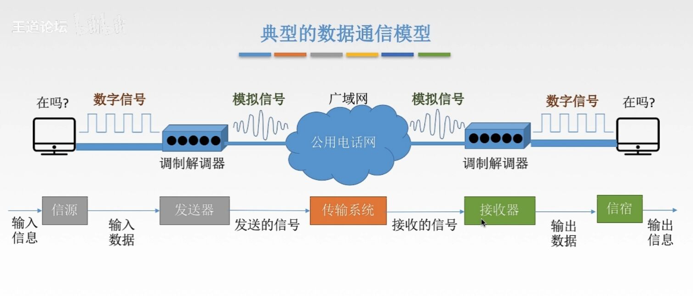

# 第2章 物理层

## 2.1 物理层的基本概念

物理层解决如何在连接各种计算机的传输媒体上传输数据比特流，而不是指具体的传输媒体；

物理层的主要任务：规定与传输媒体接口有关的一些特性----->定义标准

### 物理层的主要规定

- 机械特性：定义物连接的特性，规定物理连接时所采用的规格、接口形状、引线数量、引脚数量和排列情况；

- 电气特性：规定传输二进制位时，线路上信号的电压范围、阻抗匹配、传输速率和距离限制等；
- 功能特性：指明某条线上出现的某一电平表示何种意义，接口部件的信号线的用途；
- 规程特性：定义各条物理线路的工作规程和时序关系；

## 2.2 数据通信的基础知识

### 典型的数据通信模型

上述过程抽象为五个部分：

- 信源：信息的来源端口；
- 发送器：将输入的信号转换为可以进入传输系统中的信号（比如把数字信号转变为模拟信号）；
- 传输系统：负责传输数据；
- 接收器：将传输系统传输的信号转为输入端口需要的信号；
- 信宿：信息的接收端；

把信源与发送器称为源系统，接收器与信宿称为目的系统；

### 数据通信相关术语

通信的目的是传送信息；

- 数据：传送信息的实体，通常是有意义的符号序列；

- 信号：数据的电气\电磁的表现、是数据在传输过程中的存在形式；

  - 数字信号：代表消息的参数取值是离散的；

  -  模拟信号：代表消息的参数取值是连续的；

- 信源：产生和发送数据的源头；

- 信宿：接收数据的终点；

- 信道：

  - 概念：信号的传输媒介。一般用来表示向某一个方向传送信息的介质，因此一条信道线路往往包含一条发送信道与一条接收信道；

  - 分类：
      - 按照传输信号类型：
          - 模拟信道：传输的数据是模拟信号；
          - 数字信道：传输的数据是数字信号；
      - 按照传输介质：
          - 无线信道：无线电波；
          - 有线信道：光纤；

### 三种通信方式

从通信双方信息交互的方式来看，可以分为三种基本方式：

- 单工通信：只有一个方向的通信而没有反方向的交互，仅需要一条信道；
- 半双工通信：通信双方都可以发送或者接收信息，但任何一方都不可以同时发送与接收，需要两条信道；
- 全双工通信：通信双方可以同时发送与接收信号，需要两条信道；			

### 两种数据传输方式

- 串行传输：速度慢、费用低、适合远距离；
- 并行传输：速度快、费用高、适合近距离；

## 2.3 码元、波特、速率、带宽

### 码元

码元是指用一个固定时长的信号波形（数字脉冲），代表不同离散数值的基本波形，是数字通信中数字信号的计量单位，这个时长内的信号称为k进制码元（k表示有几种离散数值，只有0，1就是二进制），而该时长称为码元宽度。当码元的离散状态有M个时（M > 2）。此时码元为M进制码元；

一个码元可以携带多个比特的信息量；

举个例子：

比如我们的比特流为一个50%占空比的矩形脉冲，最大电压5V，最低0.2V，这段持续1ms，也就是周期为 2ms；我们可以这样规定：1ms为一个码元宽度，这一个码元宽度内规定5V代表离散数值1，0.2V代表离散数值0，这样我们就规定了两个2进制码元；

也可以使用另一种划分方法：规定2ms为码元宽度，当出现 2ms 0.2V 代表了离散值 00，1ms 0.2 后 1ms 5 代表了离散值 01，1ms 5 后 1ms 0.2 代表了离散值 10，2ms  5V 代表了离散值 11；四进制码元；所以一个码元可能含有多个bit；

### 速率、波特、带宽

速率也叫数据率，是指数据的传输速率，表示单位时间内传输的数据量。可以使用码元传输速率与信息传输速率表示；
- 码元传输速率：又称为码元速率、波形速率、调制速率、符号速率等，其表示单位时间内数字通信系统传输的码元个数（也称为脉冲个数或信号变化的次数），单位是波特（Baud）。1波特表示数字通信系统每秒传输一个码元。这里的码元可以是多进制的，也可以是二进制，码元速率与进制数无关；
- 信息传输速率：别名信息速率、比特速率，表示单位时间内数字通信系统传输的二进制码元个数（bit数）；1秒能传输多少bit；单位为 bit/s；
- 带宽：表示在单位时间内从网络中的某一点到另一点所能通过的“最高数据率”，常用来表示网络的通信线路所能传输数据的能力。单位是bit/s

关系：若一个码元携带n bit 的信息量，则 M Baud 的码元传输速率所对应的信息传输速率为$M\times n$ bit/s

## 2.4 奈氏准则和香农定理

### 失真

概念：现实中的信道由于带宽限制、噪声、干扰等，使得输出的波形相比输入不一致，有些失真可以被恢复，有些不行；影响失真程度的因素：

- 码元传输速率；
- 信号传输距离；
- 噪声干扰；
- 传播媒介质量；

### 信道带宽

信道带宽是信道能够通过最高频率与最低频率的差；

### 码间串扰

码间串扰：接收端收到的信号波形失去了码元之间清晰界限的现象；

### 奈氏准则（奈奎斯特定理）

在理想低通（无噪声、带通受限）条件下，为了避免码间串扰，极限码元传输速率为 2W Buad，W是信道带宽，单位是 Hz；

### 香农定理

噪声存在于所有电子设备和通信信道中，由于噪声随机产生，其瞬时值会很大，因此噪声会使得接收端对码元的判决产生错误。但是噪声的影响是相对的，若信号较弱，那么噪声影响相对较小。因此，信噪比就很重要；

信噪比 = 信号的平均功率/噪声的平均功率，常记作S/N，并用分贝（dB）作为度量单位，即：

香农定理：在宽带受限并且有噪声的信道中，为了不产生误差，信息的数据传输速率有上限；

- 信道的带宽或信道中的信噪比越大，则信息的极限传输速率越高；
- 对一定的传输带宽和一定的信噪比，信息传输速率的上限就确定了；
- 只要信息的传输速率低于信道的极限传输速率，就一定能找到某种方式实现无差错的传输；
- 香农定理得出的为极限信息传输速率，实际信道能达到的传输速率要比它低不少；
- 从香农定理看出，若信息带宽W或信噪比S/N没有上下限，那么信道的极限信息传输速率也就没有上限；

### “Nice” 和 "香浓"

奈氏准则---内忧

带宽受限无噪声条件下，为了避免码间串扰，码元传输速率的上限 2W Buad；

理想低通信道下的极限数据传输率为 = 2W log2V；

要想提高数据率，就要提高带宽/采用更好的编码技术；

香农定理---外患

带宽受限有噪声条件下的信息传输速率；

信道的极限数据传输速率 = Wlog2(1 + S/N)；

想要提高数据率，就要提高带宽/信噪比；

## 2.5 编码&调制

### 基带信号与宽带信号

信号可以分为：

- 基带信号：将数字信号1和0直接用两种不同的电压表示，再送到数字信道上去传输（基带传输）；

    ​					来自信源的信号；基带信号就是发出的直接表达了要传输的信息的信号；

- 宽带信号：将基带信号进行调指后形成的频分复用模拟信号，再传送到模拟信道上去传输；

    ​				   将基带信号经过调制后，把信号的频率范围搬移到较高的频段以便在信道上传播；

在传输距离近时，计算机网络采用基带传播（距离小衰减小，而信号内容不容易发生变化）；

在传输距离远时，计算机网络采用宽带传播（距离大衰减大，即使信号变化大最后也可还原）；

### 编码与调制

把数据转为数字信号---->编码；

把数据转为模拟信号---->调制；

数字数据：

- 通过数字发送器转为数字信号；
- 通过调制器转为模拟信号；

模拟数据：

- 通过PCM编码器转为数字信号；
- 通过放大器调制转为模拟信号；

### 编码与调制的方法

- 数字数据编码为数字信号：
    - 非归零编码：
        - 规则：高电平表示输入是1，低电平表示输入是0；
        - 优点：编码容易实现；
        - 缺点：没有检错规则；
    - 反向不归零编码：
        - 规则：信号电平翻转表示输入0，信号电平不变表示输入1；
    - 曼彻斯特编码：
        - 规则：将一个码元分成两个相等的间隔，前一个间隔高电平同时后一个间隔为低电平，表示输入1；前一个间隔低电平同时后一个间隔为高电平，表示输入0（当然也可以反相规定）；
        - 优点：每个码元里一定存在一个跳变，可以指定输入电平的时钟，输出变化说明有新的码元进入，可以实现自己同步；
        - 缺点：每个码元被编码为两个电平，所以数据传输速率只有调制速率的一半；
    - 差分曼彻斯特编码：
        - 规则：如果输入为0，那么次码元的前半个码元的电平与前一个码元的后半个相反，如果输入0则相同；
        - 优先：自同步；
- 数字数据调制为模拟信号；
    - 调幅：
        - 规则：输入1时，输出正弦波，输入0时，输出0；
    - 调频：
        - 规则：输入1时，输出高频正弦波，输入0时，输出低频正弦波；
    - 调相：
        - 规则：输入0或1分别对应余弦与正弦（相位不同）；
    - QAM（调幅+调相）

- 模拟数据编码为数字信号；
    - 脉码调制（PCM）
        - 在计算机应用中，能达到的最高保真水平的就时PCM编码；
        - 主要步骤
            - 抽样：对模拟信号周期扫描，把时间的连续的信号变成离散的信号；并且根据采用定理，采样周期的频率需要 >= 2倍的信号最高频率；
            - 量化：把抽样取得的电平幅值按照一定的分级标度转为对应的数字值，取整数，把连续电平幅值转为离散的数字量；
            - 编码：把量化的结果转换为与之对应的二进制编码；

- 模拟数据调制为模拟信号：

## 2.6 物理层的传输介质

传输介质也称传输媒体/传输媒介，它就是数据传输系统中发送设备和接收设备之间的物理通路；

物理层并不是传输介质；

记得我们在 2.1.1 中提到，物理层需要规定机械、电气、概念特性，能够识别所传输的比特流；

而传输介质在物理层的下面，只是穿信号，完全不知道传播的是什么意思；

### 传输介质的分类

- 导向性传输介质：电磁波被导向沿着固体媒介（铜线、光纤）传播；
- 非导向性传输介质：自由空间，介质可以是空气、真空、海水等；

### 传输介质的种类

先介绍导向性传输介质：

- 双绞线

    - 由两根采用一定规则并排绞合的、互相绝源的铜导线组成；

    ​		绞合可以减小对相邻导线的电磁干扰，两条流向相反的导线电流产生的磁场抵消；

    ​		为了提高屏蔽能力，还可以在双绞线外增加由金属丝编织的屏蔽层；

    ​		有屏蔽层的为屏蔽双绞线，没有称为非屏蔽双绞线；

    - 便宜、常用的介质之一，传播距离一半为几公里；

- 同轴电缆

    - 内导体铜芯外包裹绝缘层，再包裹外导体屏蔽层，最外为塑料外层，四层结构共轴；
    - 根据传输信号的不同分为基带同轴电缆、宽带同轴电缆；
    - 抗干扰能力比双绞线强，传播远，小贵；

- 光纤

    - 利用光导纤维传递光脉冲，有光脉冲为1，没有为0；
    - 带宽很大很大
    - 在输入输出需要光电转换；
    - 由内部高射速率纤芯，与外层低折射率包层组成，光在纤芯不断进行全反射来传播；
    - 快速，适合远距离，抗雷电与电磁干扰强、体积小、保密性好；
        - 多模光纤：同时传入多条光纤，适合近距离；
        - 单模光纤：将纤芯直径减小为光的波长，只传入一条,几乎为直线传播，几乎没有传播损失；

非导向性传输介质

- 无线电波
    - 信号向所有方向传播；
    - 穿透能力强，远距离传播，广泛用于通信领域；
- 微波
    - 信号沿着固定方向传播；
    - 频率很高，数据率很高；
        - 地面微博接力通信：
        - 卫星通信：
- 红外线、激光
    - 信号沿着固定方向传播；
    - 把要传输的信号分别转换为各自的新年好格式；

## 2.7 物理层设备

### 中继器

诞生原因：由于存在损耗，在线路上传输的信号功率逐步衰减，衰减到一定程度时造成信号失真；

中继器功能：对信号进行再生与还原，对衰减的信号进行放大，保持与原数据相同，以增加信号传输的距离，延长网络长度； ----->    再生数字信号；

中继器的两端：

- 两端的网络部分是网段，而不是子网，适用于完全相同的两类网络的互连，并且网段速率要相同；
- 只管再生还原，不处理错误；
- 两端可以连接相同媒体，也可以连不同媒体；
- 中继器两端的网段一定要是同一个协议；

​	5-4-3规则：网络标准中都对信号的延迟范围作了具体的规定，因而中继器只能在规定的范围内机进行；

### 集线器（多口中继器）

集线器功能：对信号进行再生放大转发，对衰减的信号进行放大，接着转发到其他所有（除了输入端口外）处于工作状态的端口上，增加信号传输的距离，延长网络长度；

不具备信号的定向传送能力，是一个共享设备；

各个主机收到集线器无脑转发的数据，自己判断这份数据是否是传递给自己的，是就要，不是就不要；

所以集线器不能分割冲突域，一个周期只能让一组通信；

​	

​	

​	

​				