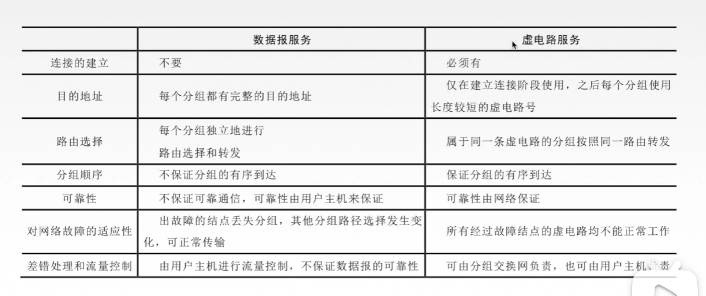
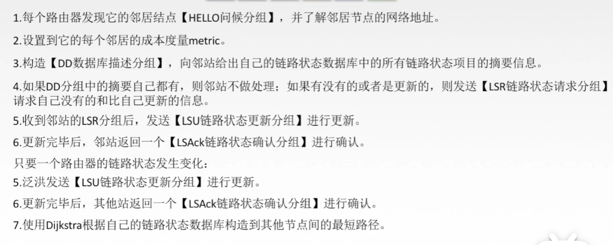
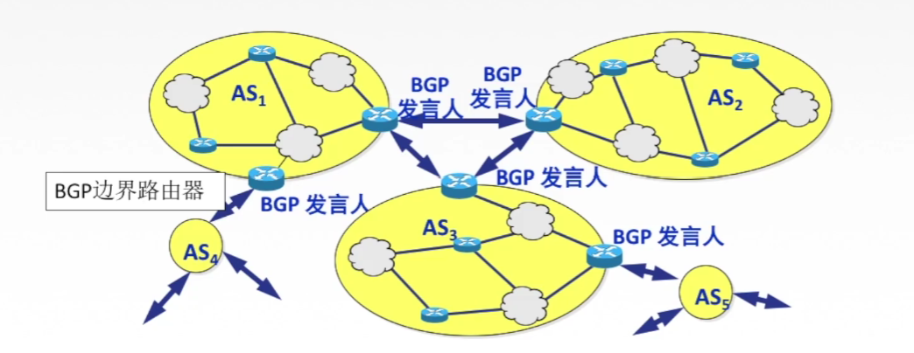
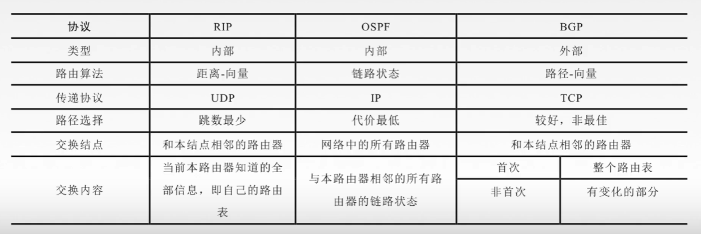
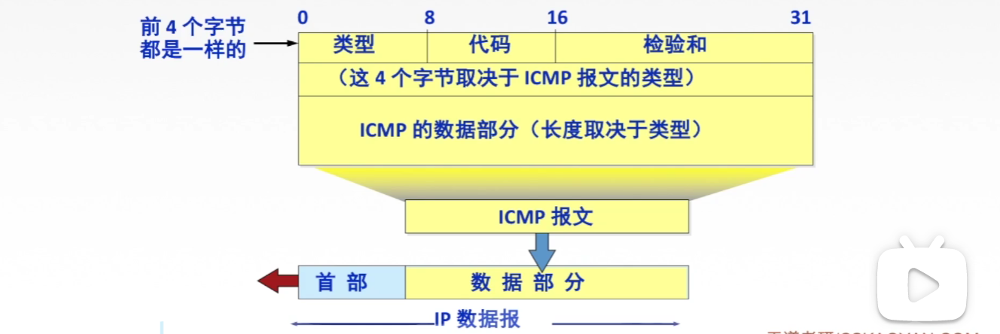

# 第4章 网络层

## 4.1 网络层概述

- 主要任务：把**分组**从源端传送到目的端，为分组交换网上的不同主机提供通信服务；
- 传输单位：数据报；
- 功能：
    - 一、路由选择与分组转发（最佳路径）；
    - 二、异构网络互联（不同网络的互相通信）；
    - 三、拥塞控制（所有结点都来不及接收分组，而要丢弃大量分组，网络处于拥塞状态，采取一定措施）；
        - WAY1：开环控制（静态）
        - WAY2：闭环控制（动态）


## 4.2 数据交换方式

### （一）网络的核心

​	通过许多路由器使用**数据交换**将大量主机联系到一起；

### （二）数据交换

​	主要分为三种：

- 电路交换；
- 报文交换；
- 分组交换；

### （电路交换

- **代表**：电话网络；
- **规则**：先在两个主机之间建立连接，之后只在这个通道上直接发送数据；
- **特点**：独占资源；

- 电路交换的**阶段**：
    - 建立连接（呼叫/电路建立）
    - 通信（在整个通信过程中，只使用刚才建立的连接）
    - 释放连接（拆除电路）

- 

- **缺点**：
    - 线路独占，使用效率低；
    - 建立连接时间长；
    - 灵活性差；
    - 没有差错控制能力；
- **优点**：
    - 通信时延小；
    - 有序传输；
    - 没有冲突；
    - 实时性强；

### （四）报文交换

- **报文**：源应用发送的信息整体；
- **规则**：分组先到交换设备中保存，等某个链路有空闲时再发送过去；
- **优点**
    - 无需建立连接；
    - 存储转发，动态分配线路；
    - 线路可靠性高；
    - 线路利用率高；
    - 多目标服务；
- **缺点**：
    - 有存储转发时延；
    - 报文大小不确定，需要网络节点有较大的缓存空间；

### （五）分组交换

- **分组**：把大的数据块（报文）分割成小的数据块（大部分为等大的）
- **规则**：把大的数据报分割，将报文交换的串行发送改为单个分组的**并行交换**；
- **优点**：
    - 无需建立连接；
    - 存储转发，动态分配线路；
    - 线路可靠性较高；
    - 线路利用率较高；
    - 相对于报文交换，存储管理更容易（分组大小比较小，缓存大小不需要很大）
- **缺点**：
    - 有存储转发时延；
    - 需要传输额外的信息量，把报文拆分后需要排序号；
    - 乱序到达目的主机时，需要对分组排序的重组；
- 效率最高，主要应用的方法；

### （六）三种数据交换方式的比较


- 报文交换和分组交换都采用存储转发；
- 传输数据最大，并且传送时间远大于呼叫时间，选择电路交换。其传输时延最小；
- 从信道利用率来看，报文交换和分组交换优于电路交换，分组交换时延更小；

### （七）分组交换的两种方式

- **数据报方式**：
    - **无连接**：为网络提供**无连接服务**（不事先为**分组**确定传输路径，每个**分组**独立确定路径，不同**分组**传输路径可能不同）；
    - 每个分组都携带**源**和**目的地址**；
    - 路由器根据分组的**目的地址**转发分组；
- **虚电路方式**：
    - **连接**：为网络提供**连接服务**（首先为**分组**传输确定传输路径，然后沿着该路径传输系列分组，系列**分组**传输路径相同，传输结束后拆除连接）
    - 把数据报方式和电路交换方式结合，发货二者的优点，每个分组携带的时**虚电路号**而非目的地址；
    - 过程：
        - **建立连接**（虚电路建立：源主机发送“呼叫请求”，分组并收到“呼叫应答”，分组建立后才算建立连接）
        - **数据传输**（全双工通信）
        - **释放连接**（虚电路释放：源主机发送“释放请求”，分组以拆除虚电路）



### （八）几种传输单元名称辨析

​	对五层参考模型来说，每个层次中的传输单元都不同：

- 应用层：**报文**；
- 传输层：如果应用层传输的报文比较大，传输层会将其分割为 **报文段**；
- 网络层：报文段在网络层被封装上IP地址（源地址和目的地址），称为 **IP 数据报**，如果这个 IP 数据包太大，就分割为一个个**分组**；
- 数据链路层：将分组加头加尾成**帧**；
- 物理层：**比特流**（10101010）


## 4.3 路由

### 4.3.1 路由算法与协议

#### （一）路由算法

​	最佳路由：“最佳”只能是相对于某一特定要求下得到的比较合理的选择；

#### （二）路由算法的分类

- **静态路由算法**（非自适应路由算法）管理员手工配置路由信息
    - 优点：简便、可靠，在负荷稳定、拓扑变化不大的网络中运行效果很好，广泛用于安全性的军事网络和较小的商业网络；
    - 缺点：路由更新慢、不适合大型网络；
- **动态路由算法**（自适应路由算法）路由器彼此交换信息，按照路由算法优化出路由表项
    - 优点：路由更新快，适用大型网络，及时响应链路费用或网络拓扑变化；
    - 缺点：算法复杂，增加网络负担；
    - 分类：
        - **全局性**：链路状态路由器算法 OSPF：所有路由器掌握完整的网络拓扑和链路费用信息；
        - **分散性**：距离向量路由算法 RIP：路由器只掌握物理相连的邻居以及链路费用；


#### （三）层次的路由选择协议

​	1、因特网规模大；

​	2、许多单位不想让外部知道自己的路由选择协议，但还想连入因特网；

​	采用自治系统AS：在单一的技术管理下的一组路由器，而这些路由器适应一种 AS 内部的路由选择协议和共同度量以确定分组在该AS内的路由，同时还使用一种AS之间的路由协议以确定AS之间的路由；

​	一个AS内部的所有网络都属于一个行政单位来管理，一个自治系统的所有路由器在本自治系统内都必须连通；

​	路由选择协议：

- **内部网关协议** IGP：一个AS内部使用的协议 RIP OSPF；
- **外部网关协议** EGP：AS 之间使用的 BGP；

### 4.3.2 RIP协议与距离向量算法

#### （一）RIP协议

​	RIP协议是一种分布式的基于距离向量的路由选择协议，是因特网的协议标准，最大优点是简单；

​	要求网络中的每一个路由器都维护从它自己到其他每一个目的网络的唯一最佳距离记录；

​	一个路由表：

| 目的网络 | 距离 | 下一跳路由器 |
| -------- | ---- | ------------ |
| Net2     | 1    | 直接交付     |
| Net1     | 2    | R1           |
| Net4     | 2    | R3           |

​	距离：通常为 “跳数”，即从源端口到目的端口所经过的路由器个数；特别得  16 表示网络不可达；

​	RIP 协议只适用于小互联网；

​	路由器是由路由器之间交换信息建立的；

#### （二）RIP协议路由器的交换

- 只根相邻路由器交换信息；
- 路由器交换的信息是自己的路由表；

- 每30S交换一次路由信息，然后更新路由器项；
- 若超过180s没有收到相邻路由器的信息，则判断此路不通，更新自己的表项；
- 路由器刚开始工作时，只知道直接连接的网络；
- 若干次更新后，所有路由器的路由器逐渐完善；

#### （三）距离向量算法

- 修改相邻路由器发送来的 RIP 报文中的所有表项；

    对地址为 X 的相邻路由器发送来的RIP报文，修改此报文的所有项目：把“下一跳”的地址改为X，并把所有的“距离”+1；

- 对修改后的RIP报文中的每一个项目，进行以下操作：

    - 若本地路由器没有达到这个目的网络，把这个表项填入自己的路由表；
    - 若本地路由器有这个目的网络，则查看本地的这表项的下一个是不是 "X" ，如果是则用收到的新表项替换旧表项；如果不是则判断本地的距离与收到表项的距离，使用距离小的；

- 如果180s还没收到相邻路由器X的更新路由器，把X即为不可达，距离设为16；

#### （四）RIP协议的报文格式


- RIP是应用层协议，使用 UDP

### 4.3.3 OSPF协议与链路状态算法

#### （一）OSPF协议

​	开放最短路径优先OSPF协议，使用了 Dijkstra 的最短路径算法；

​	使用分布式的链路状态协议；

​	OSPF特点（路由器之间的信息交换）

- 和谁交换信息：与所有路由器；
- 交换什么信息：相邻的所有路由器的链路状态（本路由器与拿些相邻，以及链路代价、费用……）；
- 多久交换：只有链路状态变化时；

​	最后，所有路由器都建立一个链路状态数据库，即全网拓扑图；

#### （二）链路状态路由算法



### 4.3.4 BGP协议

#### （一）BGP协议

- 和谁交换：与其他AS的邻站 BGP 发言人；
- 交换什么：交换网络可达性信息，即要达到某个网络所要经过的一系列 AS；
- 多久交换：发送变化时；



#### （二）BGP协议交换信息的过程

BGP 交换的网络可达信息就是要到达某个网络所经过的一系列AS。当 BGP 发言人互相交换了网络可达性信息后，各 BGP 发言人就根据所采用的策略从收到的路由信息中找出达到各 AS 的较好路径；

### 4.3.5 三种路由协议比较

- RIP是一种分布式的基于距离向量的内部网关路由选择协议，通过广播UDP报文交换路由信息；
- OSPF是内部网关协议，要交换的信息较大，应使报文长度尽量短，所以不使用传输层，而直接使用IP；
- BGP是一个外部网关协议，在不同自治系统之间交换路由信息，使用 TCP；




## 4.4 IP 协议

### 4.4.1 IP 数据报格式

#### （一）TCP/IP 协议栈


#### （二）IP 数据报格式


- 首部

    - 固定部分

        - **版本**：IPv4/IPv6；

        - **首部长度**：单位为4B，最小为5，因为固定部分大小是 20B；

        - **区别服务**：指示期望获得哪种类型的服务；

        - **总长度**：首部长度+数据，单位是1B，最大是 65535B；
        - **标识**：同一数据报的分片使用同一标识（原来分片）
        - **标志**：只2bit 有用：X--
            - 中间位DF：DF = 1-> 静止分片，DF = 0 -> 运行分片；
            - 最低位MF：MF = 1->后面还有分片，MF = 0->代表最后一片或没有分片；
        - **片偏移**：指出较长分组分片后，某片在原分组的相对位置，以 8B 为单位；
        - **生存时间（**TTL）：IP 分组的保质期，经过一个路由器-1，变成0则丢弃；
        - **协议**：TCP 是 6，UDP 是 17；
        - **首部检验和**：只检验首部；
        - **源地址与目的地址**：32bits；

    - 可变部分：

        - 可选字段：0-40B，来支持排错、检测以及安全等措施；
        - 填充：凑 4B 整数倍；

- 数据部分：来自传输层的报文段；

````c
typedef struct
{
    union
    {	
        uint64_t header: 80;
        struct
    	{
            uint64_t version: 4;
            uint64_t header_lenth: 4;
            uint64_t serve: 8;
            uint64_t symbol: 16;
            uint64_t sign: 3;
            uint64_t offset: 13;
            uint64_t suv_time: 8;
            uint64_t agreement: 8;
            uint64_t header_check: 16;
            uint64_t source: 32;
            uint64_t destination: 32;
		}
    }
    
    struct 
    {
        uint64_t changable; // a pointer
        uint64_t padding;   // a pointer
    }
    
    uint64_t data;			// a pointer
} IPdata_t
````

### 4.4.2 IP 数据报分片

#### （一）最大传送单元MTU

​	链路层数据可封装的数据上限；以太网的 MTU 是 1500字节；

​	网络层的 IP 数据报最后作为数据链路层的数据封装成帧；

​	而如果 IP 数据报长度超过 MTU，就需要分片；

#### （二）分片

​	将大的 IP 数据报进行分片；

​	对 IP 数据报的数据进行分割，分割后的数据越大越好，最给每个分片后的数据报一个首部，再修改首部的一些信息；

### 4.4.3 IPv4地址

#### （一）IP 地址

​	在因特网主机的标识；

#### （二）IP编址的历史阶段

- 分类的 IP 地址；
- 子网的划分；
- 构成超网（无分类编址方式）

#### （三）分类的 IP 地址

​	IP地址：全世界唯一的32位/ 4字节标识符，标识路由器主机的接口；

​	IP地址::={<网络号>,<主机号>}

- 网络号：确定主机区域；
- 主机号：确定区域内部的哪一个主机；

​	把每个字节都写为10进制：

11011111 00000001 00000001 00000001 = 223.1.1.1


#### （四）特殊的IP地址


#### （五）私有IP地址


#### （六）分类IP地址的数量


| 网络类别 | 最大可用网络 | 第一个可用网络号 | 最后一个可用网络号 | 每个网络的最大主机数量 |
| :------: | :----------: | :--------------: | :----------------: | :--------------------: |
|    A     |   $2^7 -2$   |        1         |        126         |      $2^{24} -2$       |
|    B     | $2^{14} -1$  |      128.1       |      191.255       |      $2^{16} -2$       |
|    C     | $2^{21} -1$  |     192.0.1      |    223.255.255     |       $2^{8} -2$       |

### 4.4.4 网络地址转换NAT

路由器对目的地址为私有IP地址的数据不进行转发；

网络地址转换**NAT**：在专用网连接到因特网的路由器上安装NAT软件，称为**NAT路由器**，至少有一个外部全球IP地址；

使得专用网可以通过 NAT路由器上的IP地址与外部主机通信；

### 4.4.5 子网划分和子网掩码

#### （一）子网划分

​	分类 IP 地址的缺点：

- IP地址空间利用率有时低；
- 两级IP地址不够灵活；

​	子网划分的方式：将分类 IP 地址中主机号的高几位取出作为子网号 --> 三级IP地址；

​	某单位划分子网后，对外仍表现为一个网络，即本单外的网络看不见单位内子网的划分；


#### （二）子网掩码

​	两级IP地址的子网掩码：IP地址中对应于网络号的那些bit都为1，主机号的bit都为0；

​	三级IP地址的子网掩码：IP地址中对应于网络号与子网号的bit都是1，主机号的bit都为0；


​	子网掩码与IP地址逐位相与，得到子网网络地址；

#### （三）使用子网时分组的转发	

- 路由表中的内容
    - 目的网络地址；
    - 目的网络子网掩码；
    - 下一条地址

- 路由器转发分组的算法：

    - 提取分组头中**目的IP地址**；

    - 判断是否能够**直接交付**：使用子网掩码得到网络地址，判断这个地址是否存在在这个路由器网络里；

    - **特定主机路由**；

    - 检测路由表中有无**路径**：判断这个目的IP能不能给与次路由器连接的路由；

    - **默认路由**0.0.0.0

    - **丢弃**，报告转发分组出错；

### 4.4.6 无分类编址CIDR

#### （一）无分类编址CIDR

​	无分类域间路由选择 CIDR：

​	**1、消除了传统A类，B类和C类以及子网的概念；**


​	CIDR 记法：IP地址后加上 ''/" ，然后写上网络前缀（可以是任意长度）的位置；

​	例如：128.14.32.0/20（表示前面20位是网络前缀）

​	**2、融合子网地址域子网掩码，方便子网划分：**

​	CIDR 把网络前缀都相同的连续的IP地址组成一个“**CIDR地址块**”；

​	128.14.35.7/20是某 CIDR 地址块中的一个地址

​	把128.14.35.7写为二进制：**10000000 00001110 0010**0011 00000111，其中前 20 位是网络前缀，那么保存网络前缀相同，后 12比特从最小到最大：

​	最小地址：**10000000 00001110 0010**0000 00000000 --> 128.14.32.0

​	最大地址：**10000000 00001110 0010**1111 11111111 --> 128.14.47.255

​	那么这个地址块就是从最小地址到最大地址；

​	那么类似子网掩码，CIDR的地址掩码就是把网络前缀对应的bit都为 1，主机号都为0；

**例子：**       192.199.170.82/27

​	根据IP地址可以得到：

- 这个IP是 CIDR 记法，因为有/
- 网络前缀 27 位，主机号 5位；
- 因为主机号 5 位，那么这个 CIDR地址块 就有 2^32 次个地址；
- 最小地址：192.199.170.64/27；最大地址：192.199.170.95/27；

#### （二）构成超网

​	将多个子网聚合成为一个较大的子网，叫做构成超网，或路由聚合；

​	方法：将网络前缀缩短；

#### （三）最长前缀匹配

​	使用 CIDR 时，查找路由表可能得到几个匹配结果，应该选择具有最长网络前缀的路由；

​	前缀越长，地址块越小，路由越具体；

### 4.4.7 ARP协议

#### （一）发送数据的过程

- 应用层：发送**报文**；
- 传输层：就较长的报文分解为多个**报文段**；
- 网络层：在报文段加上**目的主机IP与源主机IP**等信息形成**IP数据报**，如果太长还会分割为**分组**；
- 数据链路层：在分组上添加**发送端与接收端MAC地址**（接收端不一定就是目的主机的，数据链路层是**点对点**的），还有帧尾，形成**帧**；
- 物理层：传输**比特流**；

而在添加 MAC 地址时，就需要 ARP 协议：

首先在一个局域网内部，源主机会有一个 ARP 高速缓存（IP地址与MAC地址的映射），添加时去查找对应 IP 的 MAC 地址即可；

但如果并没有找到，那么线看看目的主机与源主机是否位于一个局域网，即把源主机的子网掩码与目的IP 相与，看看是否可以得到当前局域网的网络号：

如果是在一个局域网，那么目的主机发送一个广播 APR 请求分组到局域网去获得目的IP的MAC；

如果不是，那么目的主机先去本局域网的默认网关的 MAC；如何得到：发送广播 APR 请求分组；


（发送 ARP 请求分组的含义是：我的IP是 IP1，我需要发东西到IP6，我的地址是 MAC1，最后的 FFFFFFFFFF 表示的就是这次是一个 ARP 请求分组；之后 IP6 就会把其 MAC 发送回去）

当帧发送到了默认网关，需要解封装，把帧中的两个 MAC 修改继续发送到下一个点，因为数据链路层是点对点，但IP 就不用改，因为网络层是端对端；最后一步一步到目的IP；

#### （二）ARP协议

由于实际网络的链路上传输数据帧时，最终必须使用 MAC 地址；

APR 协议：完成主机或路由器IP地址到 AMC 地址的映射；

​	**ARP 协议使用过程：**

- 检查 **ARP 高速缓存**：有对应表项则写入 MAC 帧；
- 若没有则用目的的 MAC 地址为 FFFFFFFFFFFF 的帧封装并**广播 ARP 请求分组**，**同一局域网**中所有主机都能够收到请求；
- 目的主机收到请求后会向源主机单播一个 **ARP 响应分组**，源主机收到后将此映射写入 **ARP 缓存**；

​	**ARP 协议4种典型情况：**

- 主机 A 发送给本网络上的主机 B：用 ARP 找到主机 B 的硬件地址；
- 主机 A 发送给另一个网络上的主机 B：用 ARP 找到本网络上一个路由器（网关）的硬件地址；
- 路由器发给本网络的主机 A：用 ARP 找到主机 A 的硬件地址；
- 路由器发给另一个网络的主机 B：用 ARP 找到本网络上的一个路由器的硬件地址；

### 4.4.8 DHCP协议

#### （一）主机如何获得IP地址

- 静态配置（比如机房）：
    - IP地址；
    - 子网掩码；
    - 默认网关；
- 动态分配（比如带着手机到某个教室，由**DHCP服务器**为其分配IP地址，等手机离开，就回收刚刚的地址）

#### （二）DHCP协议

​	动态主机配置协议 DHCP 是**应用层**协议，使用**客户/服务器**方式，客户端和服务器通过**广播**的方式交换，基于**UDP**；

​	DHCP 提供**即插即用联网**机制，主机可以从服务器**动态获取**IP地址，子网掩码、默认网关、DNS服务器名称与IP地址，允许地址重复，支持移动用户加入网络，支持在用地址续租；

​	DHCP 工作流程：

- 主机广播**DHCP发现**报文：“有没有DHCP服务器？” 试图找到网络中的服务器，服务器获得一个IP地址；
- DHCP服务器广播**DHCP提供**报文：“有” 服务器拟分配给主机一个IP地址与相关配置，先到先得；
- 主机广播**DHCP请求**报文：“我用你给的IP地址咯” 主机向服务器请求提供IP地址；
- DHCP服务器广播**DHCP确认**报文：“用吧” 正式分配IP地址给主机；

### 4.4.9 IPv6

#### （一）为什么有 IPv6

​	32位IPv4地址分配殆尽

​	CIDR  NAT 治标不治本；

​	IPv6（根本上解决地址耗尽问题） ：

- ​	增长地址长度；

- 改进首部格式；
- 快速处理/转发

#### （二）IPv6数据报格式

​	


#### （三）IPv6和IPv4

- 将IPv6将地址从**32位**扩大到**128位**，更大的地址空间；
- IPv6将IPv4的**校验和字段**彻底移除，以减少每跳的处理时间；
- IPv6将IPv4的可选字段移出首部，成为拓展首部，成为灵活的首部格式，路由器通常不对拓展首部进行检查，大大提高了路由器的处理效率；
- IPv6支持即插即用（即自动配置），不需要DHCP协议；
- IPv6首部长度必须是8B的整数倍，IPv4首部是4B的整数倍；
- IPv6只能在主机处分片，IPv4可以在路由器和主机处分片；
- ICMPv6：附加报文类型“分组过大”；
- IPv6支持资源的预分配，支持实时视像等要求，保证一定的带宽和时延的应用；
- IPv6取消了协议字段，改用有效载荷长度字段；
- IPv6取消了服务类型字段；

#### （四）IPv6地址表示形式：

​	一般形式：冒号十六进制记法：4BF5:AA12:0216:FEBC:BA5F:039A:BE9A:2170

​	压缩形式：4BF5:0000:0000:0000:BA5F:039A:000A:2170

​				---> 4BF5:0:0:0:BA5F:39A:A:2170

#### （五）IPv6基本地址类型

- 单播：一对一通信 可做源地址+目的地址；
- 多播：一对多通信 可做目的地址；
- 任播：一对多中的一个通信 可做目的地址；

#### （六）IPv6 向 IPv4 过渡的策略

- 双栈协议：同时启动IPv6与IPv4协议栈；
- 隧道技术：重新封装；


## 4.4 ICMP 协议

#### （一）网际控制报文协议 ICMP 

​	ICMP 协议支持主机或路由器：

- 差错报告；
- 网络探询；



#### （二）ICMP差错报告报文

- 终点不可达：不能交付数据报向源点发送终点不可达报文；
- 源点抑制：由于堵塞丢弃数据，向源点发送源点抑制报文，放慢发送速度；
- 时间超时：路由器收到 TTL = 0 的数据报，除了丢弃，向源点发送时间超时报文；
- 参数问题：收到的数据报的首部中字段不正确，除了丢弃，向源点发送参数问题报文；
- 改变路由（重定向）：值得更好的路由；

#### （三）ICMP差错报告报文数据字段


​	 

​	

