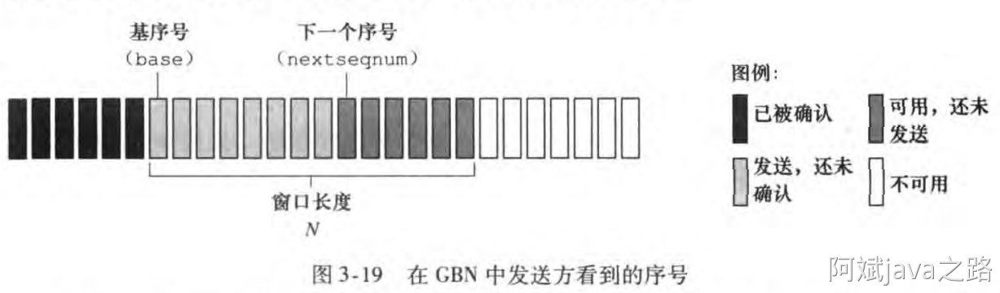
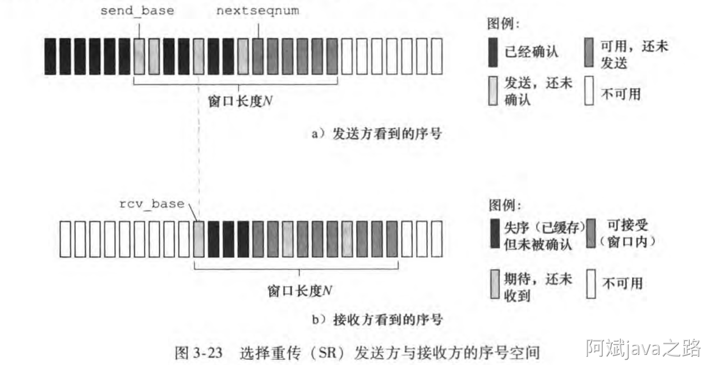
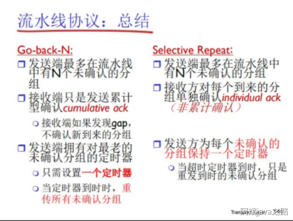
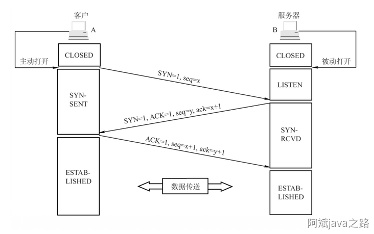
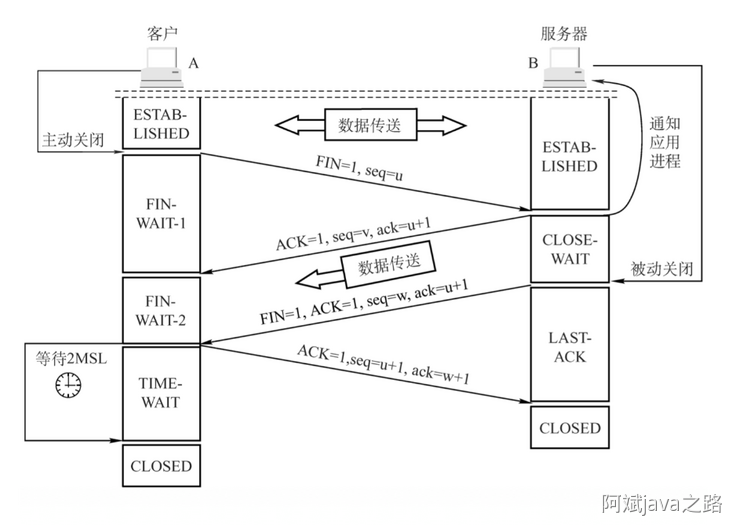
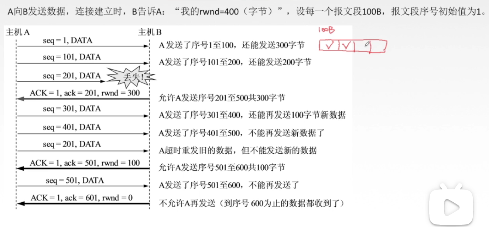
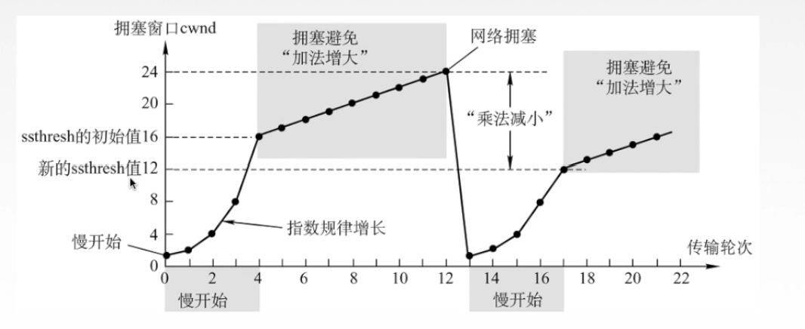

# 第5章 传输层

传输层的协议有 UDP 和 TCP，基本可以解决所有问题，所以就两个协议；


## 5.0 可靠传输的演变

数据的可靠传输是计算机网络中的通过概念，也是 UDP 和 TCP 的基石；

计算机五层模型中，上层需要借助下层提供的服务来完成数据的传输，如果下层不可靠，我们该如何保证数据的可靠传输？接下来会一步步假设，一步步暴露问题，来看看可靠传输 RDT 是如何演进的？

### RDT 1.0

- **对应场景**：下次的信道完全可靠：没有比特错误，没有分组丢失；

- RDT 1.0 需要做的就是封装与解封装；

### RDT 2.0

- **对应场景**：下层信道可能出现差错：将分组的比特翻转，0 -> 1，1 -> 0；

- **对应手段**：

    - **校验和**：用校验和的方式进行差错检测；

    - **确认ACK**：接收方显示告诉发送方分组已经被接收；

    - **否定确认NCK**：接收方显式告诉发送方分组出现了差错（发送发收到NAK后会重传分组）；

- **过程描述**：

    发送方发送packet到下层信道，接收方接收，通过校验和发现数据有错，返回 NAK，发送方再次发送原 packet；无差错返回 ACK，发送方发送新的 packet；

    RDT 2.0 的新机制就是采用了差错控制编码进程差错检测；

- **存在问题**：

    发送的 packet 可能出错，但返回的 ACK 与 NAK 也可能出错；此时发送方应该怎么做；

    这个问题引出 RDT 2.1

### RDT 2.1

- **对应场景**：2.0 中接收方返回的 ACK 与 NAK 可能出错，比如 ACK 出错成为了 NAK，发送方重复发送；
- **对应手段**：
    - **加序号**：给每个 pcaket 加上序号，哪怕客户端接收到重复数据，也可以判断重复；
    - **停止等待**：发送方只发应该分组，然后等待接收方的应带的方式成为停止等待协议；

### RDT 2.1（无NAK）

- **对应场景**：发送方需要识别 ACK 与 NAK 两个状态信息，过于负载；
- **应对手段**：
    - **取消NCK**：取消了 NACK ，那么接收方怎么告诉发送方数据出错？可以通过返回ACK + 上一个 packet 的序号的方式；
    - **重复ACK**：当发送方收到重复的 ACK 时，说明下一个 packet 发送失败，发送方会重发；
- **存在问题**：返回的 ACK 可能丢失，发送方只能一直等待；

### RDT 3.0

- **对应场景**：发送方会一直等待 ACK，但 ACK 可能会丢失；
- **应对手段**：
    - **定时器**：增加一个定时器，对应时间内没有收到 ACK 就会直接触发超时重传机制；
- **存在问题**：RDT3.0以及之前，一直采用停等协议，也就是包没收到响应就不会发送下一个，信道利用率太低。由此引入流水线协议；

### 停止等待协议

先明白一个概念 **WS(window size)** 代表可发送，或者可接收的窗口的长度。在停止等待协议中，发送方只能发送一个分组，等待确认后，再次发送一个，所以：

- 发送方窗口 = 1；
- 接收方窗口 = 1；

### 流水线协议

为了提高信道利用率，我们需要能够批量发送分组。当接收方窗口 > 1，称之为流水线协议；

以下为几种流水线协议：

#### GBN(Go - Back -N)



接收方窗口 = 1，发送方窗口 = N；

- **重传定时器**：发送方只为最早的未经确认的分组维护一个定时器，如果产生超时，将重新发送该分组后的所有分组，也就是顾名思义的回退 N 步；
- **丢弃乱序**：接收窗口只有 1，如果接收到比较大的序号分组，都会现在丢弃；

#### SR(Selective Repeat)



接收方窗口 = N，发送方窗口 = N；

- **重传定时器**：发送方为每个分组都设置了重传定时器，如果触发重传，只需要重传某个分组即可；
- **乱序接收**：接收方可以乱序接收分组，当最头部分组整体接收完毕，滑动窗口可以整体后移，并将头部接收到的多个分组整体提交给上层；




## 5.1 传输层概述

### （一）传输层

​	传输层只有主机才有的层次；

​	为应用层（上层）提供通信服务，使用网络层（下层）的服务；

​	传输层的**功能**：

- 提供进程与进程的**逻辑通信**（网络层提供主机之间的逻辑通信）；为什么都将逻辑呢，是因为这只是看起来在主机与主机、进程与进程之间的通信，实际上，信息需要一层一层得封装到下层，再解封装回到上层；
- 复用与分用；
- 传输层对收到的报文进行差错检测；


### （二）传输层的两个协议

​	传输层有两个协议：TCP 与 UDP

- **TCP**：面向连接的传输控制协议 TCP

    传输数据之前必须建立连接，数据传送后必须释放来连接。不提供广播域多播服务，不可避免得增加开销；

    **可靠、面向连接、时延大、使用大文件；**

- **UDP**：无连接的用户数据报协议 UDP

    传输不需要建立连接，收到 UPD 报文后不需确认；

    **不可靠、无连接、时延小、使用于小文件；**


### （三）传输层的寻址与端口

​	复用：应用层所有的应用进程都可以通过传输层再传输到网络层；

​	分用：传输层从网络层收到数据后交付指明的应用进程；

​	端口：是传输层的SAP，标识主机中的应用进程；

​				是逻辑端口/软件端口；

​				端口号来标识端口，只在本机内部有意义，由操作系统在进程运行时分配；

​				长度为 16bit，表示 65536 个端口号；

​	端口号分为：

- **服务端使用**的端口号：
    - 熟知端口号 0-1023：给 TCP/IP 中很重要的应用程序使用，全世界统一；
    - 登记端口号 1024-48151
- **客户端使用**的端口号：在客户端程序运行时**动态选择**：49152-65536

​	一些重要的应用程序与其端口号

| 应用程序   | FTP  | TELNET | SMTP | DNS  | TFTP | HTTP | SNMP |
| ---------- | ---- | ------ | ---- | ---- | ---- | ---- | ---- |
| 熟知端口号 | 21   | 23     | 25   | 53   | 69   | 80   | 161  |

​	在网络中采用发送发和接收方的套接字组合来识别端点，套接字唯一标识了网络中的一个主机和它上面的一个进程；

​	套接字 Socket = 主机IP地址 + 端口号


## 5.2 UDP协议

### （一）用户数据报协议UDP概述

​	UDP只是在 IP 数据报服务上增加了很少功能：复用、分用和差错检测功能；

​	UDP的特点：

- UDP是**无连接**的，减少开销和发送数据之前的时延；
- UDP使用**最大努力交付**，即**不保证可靠交付**；
- UDP是**面向报文**的，适合一次传输少量数据的网络应用（对网络层交付的报文不会分割也不会合并，一次发送完整的报文）；
- UDP无拥塞控制，适合很多实时应用；
- UDP首部开销小，8字节，TCP为20字节


### （二）UDP首部格式

​	

​	首部每个部分都是2byte，总共8byte；

- 16位源端口号：**可有可无**，如果希望得到对方的回复就填上，不需要可以写全0；
- 16位目的端口号：**必须**有；
- 16位UDP长度：UDP用户数据报的**整个**长度；
- 16位UDP检验和：检测**整个**UDP数据报是都有错，错就丢弃；

​	分用时，找不到对应的目的端口号，就丢弃报文，并给发送方发送ICMP“端口不可达”差错报告报文；


### （三）UDP校验


​	在计算校验和时对UDP数据报增加一个伪首部；不会向下传送，也不会向上递交；

​	伪首部中，开始是个4字节的源IP地址与目的IP地址

​						下一个字节为0；

​						再下一个表示了封装报文的是什么协议，这里的17表示这是一个UDP报文；

​						最后是2比特的UDP长度：UDP首部8字节 + 数据部分长度（不包括伪首部）

​						总共是12比特；


### （四）UDP校验

​	

​	首先对发送方，此时UDP首部的16bit（2字节）的校验位还没计算，先赋值为全0；

​	1、此时将封装上**伪首部**的UDP数据报，按照 2 字节一行排列（如图右侧所示，每行有16bits），这里还要注意一个UDP报文的大小应该是4字节对齐，如果不足需要补齐（如左图所示）；

​	2、现在将数据排列成右侧的一组 16bits 比特流；

​	3、把这些 2 字节数据全部**相加**，最后超出 16 bit 的不计；

​	4、最后把得到的经过按位**取反**，最终得到校验和；

​	5、然后把得到的数据放入到UDP数据报首部的校验和处，**去掉伪首部**，交给网络层传输；

​	然后对接收方，其得到一个UDP数据报，需要对其校验，方法与发送方类似：

​	1、也是添加上伪首部，然后把数据按 2 字节排列，注意此时的UDP检验和已经是填上了发送端计算得到的数值；

​	2、将数值全部相加，有超出16位的舍去；

​	3、如果得到全部为1的则无差错，否则丢弃数据报/交给应用层附上出错的警告；


## 5.3.1 TCP协议特点和TCP报文段

### （一）TCP协议的特点

- TCP是面向连接（虚连接）的传输层协议；
- 每一条TCP连接只能有两个端点，每一条TCP连接只能是点对点的；
- TCP提供可靠交付的服务，无差错、不丢失、不重复、按序到达；
- TCP提供全双工通信；
    - 发送缓存：准备发送的数据&已经发送但还没有收到确认数据的数据；
    - 接收缓存：按序列到达但尚未被接收应用程序读取的数据&不按序列到达的数据；
- TCP面向字节流：TCP把应用程序交下来的数据看成仅仅是一串的无结构的字节流；


### （二）TCP报文段首部格式


- **源端口**（2字节）
- **目的端口**（2字节）
- **序号**（4字节）：在一个TCP连接中传送的字节流中的每一个字节都按顺序编号，这个字段表示本报文段所发送数据的第一个字节的序号；
- **确认号**（4字节）：期望收到对方下一个报文段的第一个数据字节的序号。若确认号为N，则证明到序号N-1为止的所有数据都已经正确收到（接收方发送回给发送方的）；
- **数据偏移**（4比特）：TCP报文段的数据起始处距离TCP报文段的起始处有多远，以4字节为单位，即一个数值表示4字节，也就是首部的长度；
- **六个控制位**（每个控制位为1比特）：
    - **紧急位URG**：URG = 1时，标明此报文段中有**紧急数据**，是高优先级的数据，应该尽快传送，不用在缓存里排队，配合紧急指针字段使用；
    - **确认位ACK**：ACK = 1时确认号有效，在连接建立后所有传送的报文段都必须把 ACK 设置为 1；
    - **推送位PSH**：PSH = 1时，接收方尽快交付接收应用进程，不再等缓存填满再向上交付，与紧急位对应；
    - **复位RST**：RST = 1时，表面TCP连接中出现严重差错，必须释放连接，然后重新建立传输链接；
    - **同步位SYN**：SYN = 1时，表面这是一个连接请求/连接接受报文（发送方先发送连接请求报文，接收方确认后返回一个连接接受报文）；
    - **终止位FIN**：FIN = 1时，表面此报文段发送方数据已经发完，要求释放连接；
- **窗口**（2字节）：指的是发送本报文段的一方的接受窗口，即现在允许对方发送的数据量；
- **校验和**（2字节）：检验首部+数据，检验时要加上12B伪首部，伪首部的第四个字段为协议字段，写6表示此为TCP报文段；
- **紧急指针**（2字节）：URG = 1时才有意义，指出本报文段中紧急数据的字节数（从第一个字节开始）；
- **选项**（长度可变化）：最大报文段长度 MSS，窗口扩大、时间戳……
- **填充**：保证TCP首部总大小为4字节的整数倍；

​	c语言结构体：

````c
typedef struct
{
    union
    {
        uint64_t _fixedPart: 160;
        struct 
        {
            // 源端口号
    		uint16_t _srcPortNum: 16;
            // 目的端口号
    		uint16_t _dstPortNum: 16;
            // 序号
    		uint32_t _index: 32;
    		// 确认号
    		uint32_t _confirmationNum: 32;
            // 数据偏移
    		uint64_t _offset: 4;
            // 保留
            uint64_t _reserve: 6;
            
            // six control bits
    		union 
    		{
        		uint64_t _controlBits: 6;
        		struct 
        		{
                    // 紧急位 URG
                    uint64_t _URG: 1;
                    // 确认位 ACK
                    uint64_t _ACK: 1;
                    // 推送位 PSH
                    uint64_t _PSH: 1;
                    // 复位 RST
                    uint64_t _RST: 1;
                    // 同步位 SYN
                    uint64_t _SYN: 1;
                    // 终止位 FIN
                    uint64_t _FIN: 1;
				};
			}
            
            // 窗口
            uint16_t _window: 16;
            // 校验和
            uint16_t _checkSum: 16;
            // 紧急指针
            uint16_t _urgentPointer: 16;
		};
	};
    
    // 选项
    uint8_t* _option;
    // 填充
    uint8_t* _padding;
    
}TCP_header_t;
````


## 5.3.2 TCP连接管理

### （一）TCP连接管理

​	TCP连接传输的三个阶段

- 连接建立；
- 数据传送；
- 连接释放；

​	TCP连接的建立采用**客户端服务器方式**，主动发起连接建立的应用进程叫做客户，被动等待连接建立的应用进程加服务器；


### （二）TCP连接建立——三次握手

#### 1）三次握手的过程

​	假设运行在一台主机上的一个客户进程想与另一台主机的服务器进程建立连接，客户端应用进程首先通知客户TCP，想要建立一个与服务器上某个进程之间的连接，客户端TCP会与服务端中的TCP建立一条TCP连接：



其中：

- **SYN**：连接请求/接收 报文段；
- **seq**：发送的第一个字节的序号；
- **ACK**：发送报文段；
- **ack**：确认号。希望收到的下一个数据的第一个字节的序号；

下面是三次握手的具体动作：

- **第一次握手**：

    客户端发送**连接请求报文段**，无应用层数据；

    - 其中 **SYN = 1**（表示为连接请求）
    - 序号字段 **seq = x** （一个随机数），指定初始化序列号为 x；

    此时客户端处于 **SYN_SEND** 状态，标识发送请求后等待匹配的连接请求；

- **第二次握手**：

    服务器端收到 SYN 报文后，为该TCP连接**分配缓存和变量**，并向客户端返回**确认报文段**，允许连接，无应用层数据；

    - 其中 **SYN = 1**（表示为连接请求接受），**ACK = 1**（表示连接已经建立），
    - 序号字段还是随机 **seq = y**，但确认号字段不是随机，其有意义，应该有 **ack = x + 1**（因为之前收到的发送方的报文序号为x，应该希望收到 x + 1的）

    此时服务器处于 **SYN_REVD** 的状态，表示在收到和发送一个连接请求后等待对连接请求的确认；

- **第三次握手**：
    客服端为该TCP连接**分配缓存与变量**，并向服务器返回确认的确认，此时报文可以携带应用层数据；

    - **SYN = 0**（表示此报文不是连接请求或连接确认），ACK = 1（表示连接已经建立）
    - **seq = x + 1**（因为受到了服务器发送的报文，其期待发送序号为 x + 1 的数据），
    - **ack = y + 1**（因为服务器的上一个 **seq** 是 **y** 所以返回 **y + 1**）

    此时客户端处于 **Establised** 状态；

    服务器收到 **ACK** 报文后，也处于 **Establised** 状态，至此，双方建立器了 TCP 连接；

    **Establised** ： 表示一个打开的连接，数据可以传递给用户；

#### 2）为什么需要三次握手

三次握手的本质：双方都要发出连接请求，交换字节的序列 **seq**，并确认对方能够正常接收做出应答。本来是两个往返需要四次，服务器将应答与请求合并，所以需要三次；

还有一点：防止旧的重复连接引起连接混乱问题；

比如在网络环境比较复杂的情况，客户端可能会连续发送多次请求。如果只设计成两次握手的情况，服务端只能一直接收请求，然后返回请求信息，也不知道客户端是否请求成功。这些过期请求的话就会造成网络连接的混乱。

所以设计成三次握手的情况，客户端在接收到服务端SEQ+1的返回消息之后，就会知道这个连接是历史连接，所以会发送报文给服务端，告诉服务端。

所以TCP设计成三次握手的目的就是为了避免重复连接

#### 3）两次握手行不行

两次握手相当于省略了第三次应答，服务器没有确认对方收到了自己的序列号。本来服务器在接收对方第一次请求时半开状态，还没建立连接。两次握手意味着接收到对方请求后，服务器就直接进入了连接状态，能直接发送数据。这时候对方还没接收到第二次的应答，没有协商号 seq 序号就发送消息，产生错乱；

#### 4）第三次握手丢失会如何？

服务器在发出第二次握手后，进入半开 **SYN_REVD** 的状态。等待第三次握手，如果第三次握手没有达到，会触发超时重传。例如间隔时间为 1s，2s，4s，8s...


#### 5）SYN洪泛攻击

SYN 攻击就时客户端在段时间内伪装大量不存在的 IP 地址，并向服务器不断发送 SYN 包，服务器则回复确认包，并等待客户端确认，由于源地址不存在，因此服务器需要不断重发直到超时，这些伪装的 SYN 包将长时间占用半连接队列


### （三）TCP连接释放——四次挥手

​	参与每一条TCP连接的两个进程的任何一个都可以终止连接，连接结束后，主机的资源被释放



其中：

- **FIN**：连接终止位；
- **seq**：发送的第一个字节的序号；
- **ACK**：确认报文段；
- **ack**：确认号。希望收到的下一个数据的第一个字节的序号；

刚开始双方都处于 **ESTABLISHED** 状态，假是客户端先发起请求关闭，四次挥手过程如下：

- **第一次挥手**：

    客户端发送**连接释放报文段**，停止发送数据，主动关闭TCP连接；

    FIN = 1（表示释放连接报文），seq = u；

    此时客户端处于 **FIN_WAIT1** 状态，等待服务器的确认；

    - **FIN_WAIT_1**： 表示等待远程 TCP 的连接中断请求，或先前的连接中断请求的确认；

- **第二次挥手：**

    服务器端返回一个**确认报文段**，ACK = 1, seq = v，ack = u + 1；

    客户端到服务端这个方向的连接被释放，此时TCP 处于半关闭状态此时；

    服务器处于 **CLOSE_WAIT** 状态；

    客户端处于 **FIN_WAIT2** 终止等待2状态，等待服务器端发出的连接释放报文；

    - **CLOSE_WAIT**：表示等待从本地用户发来的连接中断请求；
    - **FIN_WAIT2**：表示从远程 TCP 等待连接中断请求；

- **第三次挥手：**

    服务器发送完确认报文后，就发出连接释放报文段，主动关闭TCP连接

    FIN = 1，ACK = 1, seq = w, ack = u + 1；

    此时服务器处于 **LAST_ACK** 的状态，等待客户端确认；

    - **LAST_ACK**：等待原来法向远程  TCP 的连接中断请求的确认；

- **第四次挥手：**

    客户端发送一个确认报文段：

    ACK = 1, seq = u + 1, ack = w + 1；

    此过程客户端处于 **TIME_WAIT** （时间等待）状态；

    -  **TIME_WAIT** ：等待足够的时间以确保远程 TCP 接收到连接中端请求的确认；

    现在客户端到服务器的 TCP 连接没有释放，需要再等到时间等待计时器设置为2MSL（最长报文段寿命）后，连接彻底断开，进入 **CLOSED** 状态；


## 5.3.3 TCP可靠传输

​	网络层提供最大努力交付，不可靠传输；

​	而TCP可以实现**可靠传输**，即：保证接收方进程从缓冲区中读取的字节流与发送方发出的字节流完全相同；

​	TCP实现可靠传输的机制有四种：

​	**1、校验（与UDP的一样），2、序号，3、确认，4、重传**


### （一）序号

TCP是面向字节流的，每个字节都有一个序号，按序号进入到发送缓存；

在发送数据时，会把几个字节打包成一个报文段，而TCP首部中的序号字段就表示这个报文段中第一个字节的序号；


### （二）确认

当发送方发出了一个报文段，但是其不会马上把这些数据从发送缓存中清除；

直到接收方正确完整得接收到这些数据；

当接收方得到一份数据，其会在适当的时间返回给发送方一个确认报文段，其中首部的**确认字段**的值为接收方已经收到按序字节序号的下一个序号；这个确认报文段可以带有需要发送的数据（捎带确认），或者不带数据；

发送方收到确认报文段后才将这些数据从缓存中删去；

当数据在传输过程中丢失，比如此时接收方已经收到了1，2，3号字节，并给出确认；

那么发送方删去1，2，3号字节，发送4，5，6；但是其丢失，接收方没有收到4，5，6；

然后发送方继续发送7，8号字节，这次没有发送丢失，接收方得到了7，8号字节，但是其不会返回一个确认字段为7的确认报文段，而是继续还是发送一个确认字段为4的确认报文段，表示其还没有收到4号；

这就是**累计确认**；

那么发送方得到这个确认字段为4的确认报文段，其会把4，5，6号再发送一次；

接收方得到了4，5，6；然后其发现7，8也有了，就发送回一个确认字段为9的确认报文段；


### （三）重传

TCP的发送方在**规定时间**内没有收到确认就要重新传输已经发送的报文段，此为**超时重传**；

TCP采用自适应算法，动态改变重传时间 **RTTs**（加权平均往返时间）

**冗余ACK（冗余确认）**

每当比期望序号大的失序报文段到达时，发送一个冗余ACK，指明下一个期待字节的序号；

发送发依次发送1，2，3，4，5报文段；

接收方收到1，返回给1的确认（确认号为第2个报文段的第一个字节序号）

接收方收到3，由于没有收到2报文段，还是返回给1的确认（确认号为2的第一个字节）

接收方收到4，由于没有收到2报文段，还是返回给1的确认（确认号为2的第一个字节）

接收方收到5，由于没有收到2报文段，还是返回给1的确认（确认号为2的第一个字节）

发送发收到**3个对于报文段1的冗余ACK**，就认为2号报文段丢失，再次发送，不需要等到超时后重传2；


## 5.3.4 TCP流量控制

流量控制：让发送方发送慢点，要让接收方来得及接收；

TCP利用滑动窗口机制实现流量控制；

在通信过程中，接收方根据自己接收缓存的大小，动态地调整发送发的发送窗口大小，即接收窗口rwnd（接收方设置确认报文段的窗口字段来将rwnd通知给发送方），发送方的发送窗口取接收窗口rwnd和拥塞窗口cwnd的最小值；



TCP为每个连接设有一个持续计时器，只要TCP连接的一方收到对方的零窗口通知，就启动持续计时器；

若持续计时器设置的时间到期，就发送一个零窗口探测报文段，接收方收到探测报文段时给出现在的窗口值；

若窗口仍是0，那么发送方就重新设置持续计时器；


## 5.3.5 TCP拥塞控制

出现拥塞的条新：	

对资源需求的总和 > 可以资源；

网络中有很多资源同时呈现供应不足 ---> 网络性能变坏 --> 网络吞吐量将随输入负荷增大而下降；

拥塞控制：防止过多的数据注入网络中。（全局性）

​		

### （一）拥塞控制的四种算法

​	慢开始&拥塞避免      快重传&快恢复

​	设定：

​	1、数据单方向传送，而另一个方向只发送确认；

​	2、接收方有足够大的缓存空间，因而发送窗口大小取决拥塞程度；

​	发送窗口 = min{接收窗口rwnd，拥塞窗口cwnd}；

​	接收窗口：接收方根据缓存设置的值，并告知发送方，反映接收方容量；

​	拥塞窗口：发送方根据自己估算的网络拥塞程度而设置的窗口值，反映网络当前容量；


### （二）慢开始和拥塞避免

​	


​	


