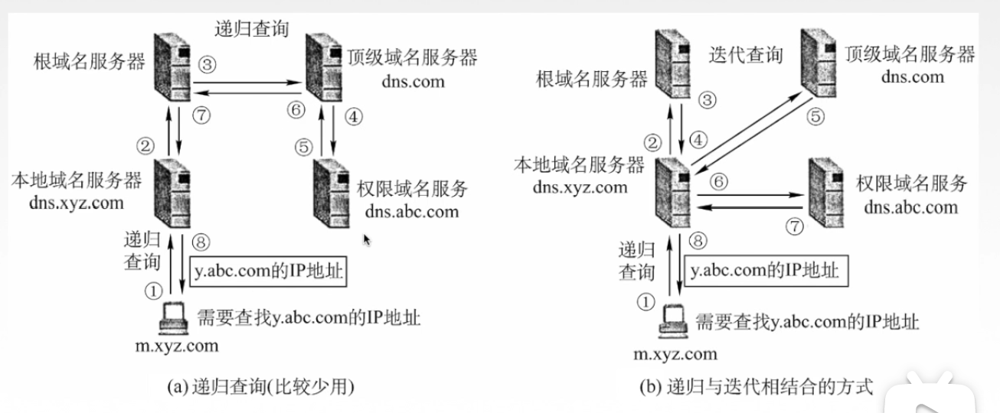
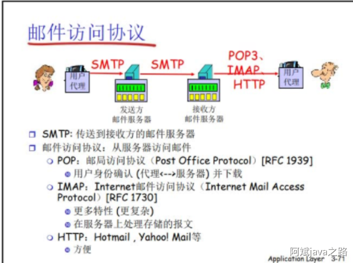
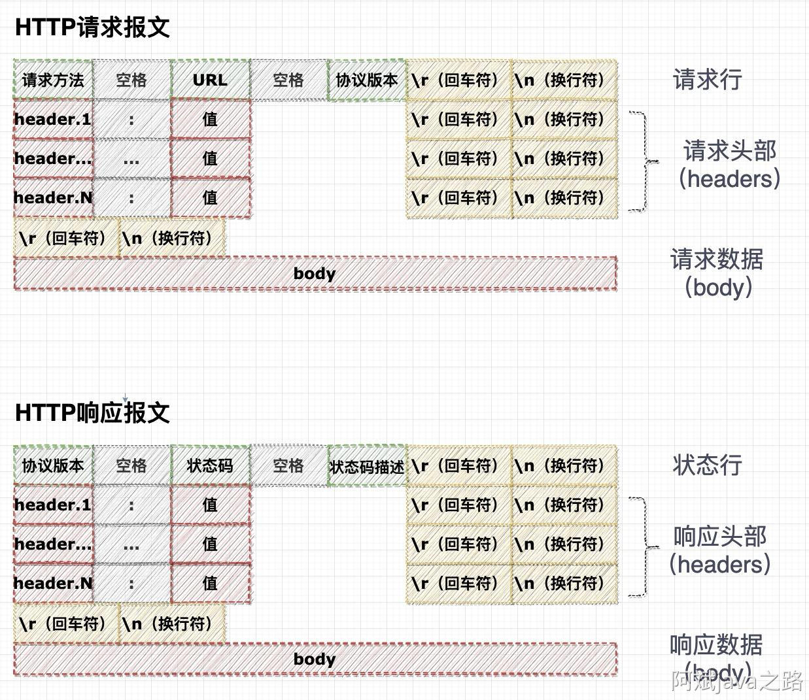
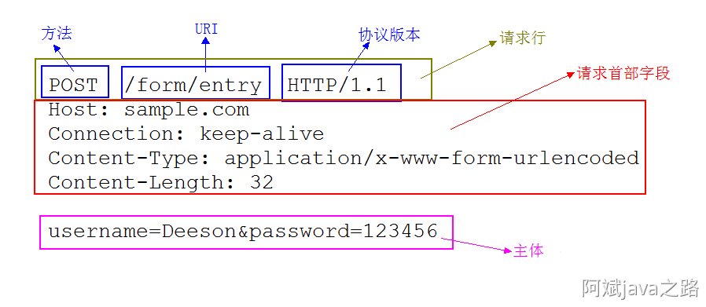
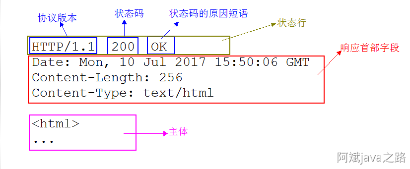

# 第6章 应用层

## 6.1 应用层概述

应用层对应用程序的通信提高服务；

​	**应用层协议定义：**

- 应用进程交换的报文类型，请求还是相应？
- 各种报文类型的语法，如报文中的各个字段及其详细描述；
- 字段的语义，即包含在字段中的信息的含义；
- 进程何时、如何发送报文，以及对报文进行响应的规则；

​	**应用层的功能：**

- 文件传输、访问和管理；
- 电子邮件；
- 虚拟终端；
- 查询服务和远程作业登录；

​	**应用层的重要协议**

​	FTP、SMTP、PO3、HTTP、DNS

### （一）网络应用模型

- 客户/服务器模型（Client、Server）；
- P2P模型（Peer-to-peer）；

### （二）客户/服务器（c/s）模型

​	**服务器**：**提供计算服务**的设备；

- 永久提供服务；
- 永久性访问地址/域名；

​	**客户机**：**请求计算服务**的主机；

- 与服务器通信，使用服务器提供的服务；
- 间隔性接入网络；
- 可能使用动态IP地址；
- 不与其他客户机直接通信；

​	**应用**：Web、文件传输FTP、远程登陆、电子邮件；

### （三）P2P模型

​	不存在永远在线的服务器；

​	每个主机既可以提供服务，也可以请求服务；

​	任意端系统/节点之间可以直接通讯；

​	节点间隙性接入网络；

​	节点可能改变IP地址；

​	可拓展性好；

​	网络健壮性强；

## 6.2 DNS系统

​	**DNS服务器** 实现 **域名** 到 **IP地址** 的转换；	

### （一）域名

​	www.bilibili.com

​	由英文字母，数字，'.'（'-'也可以）组成；

​	由 '.' 隔开的一个部分称为标号，长度不能超过63个字符（大小写不区分）；

​	标号有级别，从左向右越来越高，最高的标号为顶级域名，下一个是二级域名，之后依次类推；

​	比如这里 com 为顶级域名；

​	bilibili 为二级域名；

​	www 为三级域名；

​	在顶级域名上还要还要一个.

​	www.bilibili.com. 一般不写，表示上面还有根域名；

​	**顶级域名**分为：

- 国家顶级域名：cn   us   uk（中国，美国，英国）
- 通用顶级域名：com（工商金融） net（提供信息 ）org（非盈利） gov（政府）  int（国际）   
- 基础结构域名/反向域名 arpa

​	二级域名：

- 类别域名：ac（科研机构）com（工商金融）edu（教育）gov（政府）mil net org；

    这里有一些与顶级域名重复了，是因为可以用比如 com 作顶级域名，也可以用国际域名为顶级，再把 com 作为二级域名： XXXXX.com.cn；

- 行政区域域名：用于我国各省、自治区；

- 自己可以注册的域名，比如 bilibili；

​	三级域名：

​	有了高级域名就可以向下申请别的第级别的域名，比如厦大申请了三级域名 xmu.edu.cn

​	其就可以加上四级域名：www.xmu.edu.cn 表示访问主页；

​											  mail.xmu.edu.cn 表示访问厦大邮箱；

​	......

​	

### （二）域名服务器

​	不可能只有一台DNS服务器，而是有各种各样很多的服务器：

​	**域名服务器**：

- **根域名服务器**：

    - 当本地域名服务器找不到域名所对应的 IP地址 时，去请求根域名服务器；
    - 根域名服务器知道每一个顶级域名服务器与其对应的IP地址；所以根域名服务器会去看域名

    ​		的顶级域，然后去这个顶级域名服务器去查找；

    - 纽特网总共有13个根域名服务器：a.rootservices.net  --> m.rootservices.net；

- **顶级域名服务器**：

    - 顶级域名服务器负责管理该顶级域名服务器注册的所有二级域名，知道所有这些二级域名所对应的权限域名服务器；

- **权限域名服务器**：

    - 负责一个区的域名服务器；

- **本地域名服务器**（不属于域名系统的层次结构）：

    - 当一个主机发送出DNS查询请求时，这个查询请求报文就发送**本地域名服务器**（距离一个域名很久，甚至一个学院都有一台）；
    - 内部有高速缓存，保持最近查找过的域名-IP的映射，类似与cache高速缓存；部分主机也有高速缓存；

### （三）域名解析过程

​	**递归查询：**

​	主机先去查找本地域名服务器 --> 如果本地域名服务器无法解析这个域名去找根域名服务器 --> 

​	根域名服务器找到其对应的顶级域名服务器 --> 这个顶级域名服务器去找权限域名服务器 --> 

​	最后找到此域名对应的 IP，之后一级一级返回给主机；

​	**迭代查询：**

​	主机先去查找本地域名服务器 -->如果本地域名服务器无法解析这个域名去找根域名服务器 --> 

​	根域名服务器找到其对应的顶级域名服务器IP，返回给本地域名服务器 -->

​	本地域名服务器去找这个顶级域名服务器 --> 顶级域名服务器返回给其权限域名服务器的 IP -->

​	本地域名服务器去找这个权限域名服务器 --> 权限域名服务器最后找到 IP 返回给 本地；

​	

## 6.3 文件传送协议FTP

- **文件传送协议FTP（File Transfer Protocol）:**

​	提供不同类型主机系统（硬、软件系统等都可以不同）之间的文件传输能力；

- 简单文件传送协议TFTP（Trivial File Transfer Protocol）；

### （一）FTP服务器和用户端

​	FTP是基于**客户/服务器（C/S）的协议；**

​	用户通过一个客户机呈现连接至远程计算机上运行的服务程序；

​	依照FTP协议提供服务，进行文件传送的计算机就是**FTP服务器**；

​	连接FTP服务器，遵循FTP协议与服务器传送文件的电脑就是**FTP客户端**；

### （二）FTP工作原理

​	FTP使用TCP实现可靠传输；

​	登录：ftp地址 用户名&密码 （or 匿名登录）；

​	FTP服务器进程：

- 1个主进程；
- n个从属进程；

​	控制连接始终保持；

​	数据连接保持一会；

​	是否使用TCP 20端口建立数据连接与传输模式有关；

​	主动方式使用TCP 20端口；

​	被动方式由服务器和客户端自行协商决定（端口>1024）

## 6.4 电子邮件 EMAIL 

### （一）EMAL 的组成

电子邮件有三个组要组成部分

- 客户端代理（阅读器）；

- 邮件服务器；

- 简单邮件传输协议 **SMTP**；

    

假设用户 A 和用户 B 属于不同的邮件系统 qq 邮箱和火狐邮箱，他们的交互流程：

1. A 将邮件通过 **SMTP** 协议传输至 QQ 邮箱服务器；
2. QQ 邮箱将邮件通过 **SMTP** 协议传输至火狐邮箱服务器；
3. B 上线后可以通过 http 请求，拉取到最新的未读邮件；

## 6.5 超文本传输协议 http

http 默认工作在 80 端口上，http 底层是使用 tcp 进行数据传输；

### （一）工作方式

1. 首先服务器运转在某个固定 IP 的 80 端口上，等待浏览器的 TCP 连接建立请求；
2. 服务器接收浏览器的 TCP 连接；
    1. 浏览器请求建立连接后，服务器才会统一连接建立请求。之后 web 服务器就有了 sokect 指向他们会话关系；
3. 浏览器向服务器发送数据报文，服务器处理完请求，返回响应报文，浏览器解析报文；
4. 浏览器主动关闭 TCP 连接（http1.1不会及时关闭）；

### （二）响应时间 RTT

RTT(round-trip time) 是数据流往返的网络耗时，一般的 http 请求与服务端的交互时间

- 一个 RTT 用于建立 tcp 连接；
- 一个 RTT 用于发送 http 请求与等待 http 响应；
- 传输时间（文件从本地吐出到网络中的时间）

2 个 RTT + 传输时间。传输时间比较小，如果能公用已经建立的 TCP 连接，那么一般情况下，一次 http 请求只要一次 RTT 时间；

### （三）持久非持久

http 有持久与非持久连接，分别对应 HTTP 1.0 和 1.1 两个版本；

#### HTTP 1.0：非持久连接

HTTP 协议的初始版本 1.0 中，每进行一次 HTTP 通信就要断开一次 TCP 连接。也就是说，最多只有一个对象在 TCP 连接上发送，下载多个对象需要多个 TCP 连接。每次 TCP 连接都对应着三次握手与四次挥手，增加通信开销；

#### HTTP/1.1：持久连接

多个对象可以在一个客户端和服务器之间的 TCP 连接上传输。只要两端都没有提出断开连接，则持久保持 TCP 连接状态，其他请求可以复用这个连接通道；

而持久连接又分为**流水线 pipeline ** 与 **非流水线 non pipeline**：

##### 非流水线

多个请求能复用同一个连接，但是多个请求得排队，等一个往返后没有再发送另一个请求；

##### 流水线

一次又是个对象要请求，第一个对象请求发出去，还没回来时，就连续发出第二个、第三个。这种方式称为流水线方式；

使用 http 1.1，默认为流水线模式；

### （四）报文

HTTP 请求报文与响应报文格式为：

请求报文举例：

响应报文举例：

请求报文和响应报文的首部内容以下数据组成：

- 请求行：包含用于请求的方法，请求 URI 和 HTTP 版本；
- 状态行：包含表明响应结果的状态码，原因短语和 HTTP 版本；
- 首部字段：包含表示请求和响应的各种条件和属性的各类首部；

### （五）方法类型

- HTTP 1.0

    - GET：获取资源；

    - POST：传输实体主体；

    - HEAD：获取报文首部，不返回报文主体；

- HTTP 1.1 增加

    - PUT：传输文件；

    - DELETE：删除文件；

    - OPTIONS：用于询问请求 URI 资源支持的方法；

### （六）状态码

- ==1**==（服务器收到请求，需要请求者继续执行操作）；
    - 1** 信息，服务器收到请求，需要请求者继续执行操作；
- ==2**==
    - 205 No Content。请求处理成功，但没有资源可以返回；
    - 206 Partial Content。该状态码表示客户端进行了范围请求，而服务器成功执行了这部分的 GET 请求。响应报文中包含由Content-Range 指定范围的实体内容；
- ==3**==（重定向，重新进一步的操作以完成请求）
    - 301 Moved Permanently 永久性重定向。该状态码请示的资源已被分配了新的 URL，以后应使用资源现在指向的 URL；
    - 302 Found 临时性重定向；
    - 304 Not Modified 未修改。所请求的资源未修改，服务器返回此状态码时，不会返回任何资源。客户端通常会缓存访问的资源，通过提供应该头信息指出客户端希望只返回在指定日期之后修改的资源；
- ==4**==（客户端错误）
    - 4**，请求包含语法错误或无法完成请求；
    - 400 Bad Request 客户端请求的语法错误，服务器无法理解，比如 url 输入错误；
    - 401 Unauthorized 请求要求用户的身份认证；
    - 403 Forbidden 服务器理解请求客户端的请求，但拒绝指向此请求，权限限制；
    - 404 Not Found 服务器无法根据客户端的请求找到资源（网页）。通过此代码，网站设计人员可以设置”您所请求的资源无法找到“的个性页面；
    - 405 Method Not Allowed 客户端请求中的方法被禁止；
- ==5**==（服务器错误）
    - 500，服务器在处理请求的过程中发送了错误；
    - 502 Bas Geteway 作为网关或者代理工作的服务器尝试执行请求时，从远程服务器接收到了一个无效的响应；
    - 504 Gateway Time-out 充当网关或代理的服务器，未及时从远端服务器获取请求；

### （七）cookie

http 请求是无状态的，所以需要借助 cookie 标识出与服务器交互过程中的每一个用户；

#### cookie 技术有 4 个组件

- 在 HTTP 响应报文中的一个 cookie 首部行；
- 在 HTTP 请求报文中的一个 cookie 首部行；
- 在用户端系统中保留有一个 cookie 文件，并由用户的浏览器进程管理；
- 位于 Web 站点的一个后端服务器；

#### cookie 交互过程：

- 请求报文到达服务器，Web 站点产生了唯一标识码，并以此作为索引在他的后端服务器中产生一个表项；
- 服务器用一个包含 Set-cookie：首部的 HTTP 响应报文堆客户的浏览器进行响应；
- 浏览器受到 HTTP 响应报文，会看到 Set-cookie：首部并在它管理的特定 cookie 文件中添加一行，该行包括服务器的主机名称和在 Set-cookie：首部中的识别码；
- 之后发网该服务器的每个 HTTP 请求都包括 cookie：首部；
- 服务器可以通过 cookie 在数据库中检索信息；

### （八）web 缓存

互联网的内容存在 二八原则，80% 的人访问 20% 的资源；

那么只要安排很小的缓存，就可以命中很多用户的访问请求，从而减少服务器、网络的负担；

所以，缓存对客户端来说就是服务器；对原始服务器而言是客户端。

通常缓存由 ISP 安装，比如大学、公司、居民区的 ISP，然后修改浏览器配置，都指向 web 缓存服务器；

所以 web 缓存也是工作在网络边缘的一个服务器，实际上，大量工作在应用层的核心支撑应用，都是工作中网络边缘；

**浏览器与 web 缓存的交互**：

1. 浏览器访问 web 服务器；
2. web 缓存没有，服务器主动请求目标主机，获取数据；
3. web 缓存存下数据，并返回给浏览器；

### （九）SSL

http 是明文传输，我们可以采用 ssl 加密，ssl 工作在 443 端口，http + ssl = https；

​	